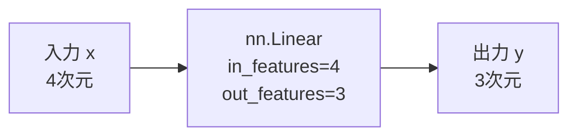
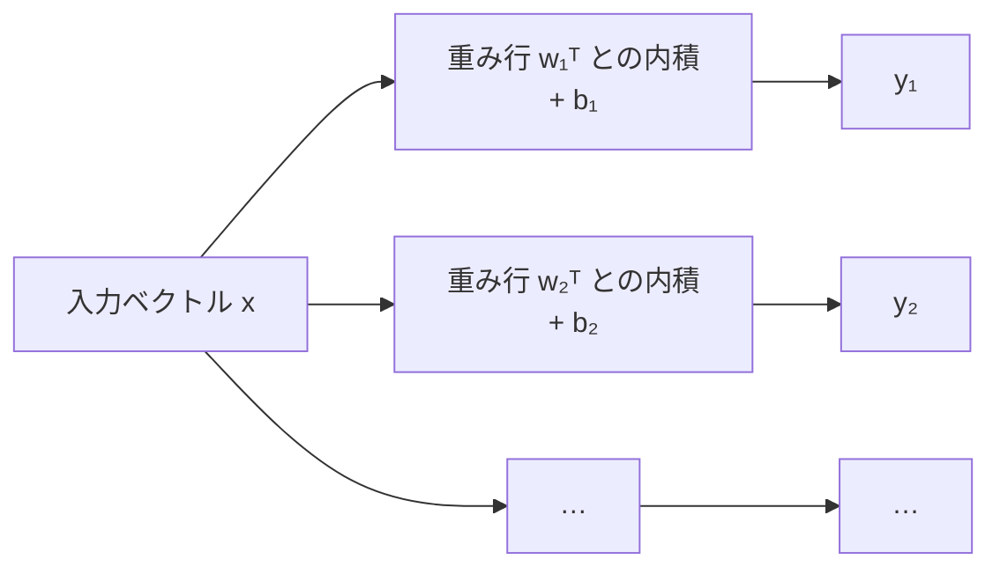
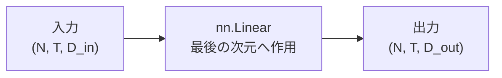
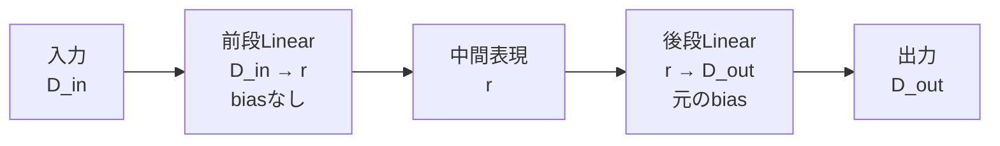

# nn.Linearとは

## サマリー

`torch.nn.Linear` は、入力の最後の次元に対して、重み行列による変換とbiasの加算を行うPyTorchの層である。

列ベクトルで表すと、1サンプルに対する計算は次式になる。

$$
y = Wx + b
$$

ここで、

$$
x \in \mathbb{R}^{D_{\mathrm{in}}}
$$

$$
W \in \mathbb{R}^{D_{\mathrm{out}} \times D_{\mathrm{in}}}
$$

$$
b \in \mathbb{R}^{D_{\mathrm{out}}}
$$

$$
y \in \mathbb{R}^{D_{\mathrm{out}}}
$$

である。

PyTorchでは、複数サンプルを行方向に並べたバッチを扱うため、実装上は次の形で理解すると分かりやすい。

$$
Y = XW^{\mathsf{T}} + b
$$

`nn.Linear` の学習対象の中心は重み行列 $W$ である。  
SVDによるニューラルネットワーク圧縮では、この $W$ を低ランク近似し、1つの大きなLinear層を2つの小さなLinear層へ置き換える。

この章では、SVDを適用する前提として、次の点を整理する。

- `in_features` と `out_features`
- 重みとbiasの形状
- 1サンプルとバッチ入力の違い
- PyTorchが転置された重みを使うように見える理由
- Linear層のパラメータ数と計算量
- Linearと活性化関数の違い
- MNISTでの入力形状
- SVD圧縮で何を分解するのか

---

## 1. `nn.Linear` の基本

PyTorchでは、Linear層を次のように作る。

```python
from torch import nn

layer = nn.Linear(
    in_features=4,
    out_features=3,
)
```

この層は、4次元の入力を3次元の出力へ変換する。

```text
入力：4次元
   ↓
Linear(4, 3)
   ↓
出力：3次元
```

### Mermaid図



`in_features` は入力ベクトルの要素数、`out_features` は出力ベクトルの要素数である。

一般には、

```python
layer = nn.Linear(
    in_features=D_in,
    out_features=D_out,
)
```

と書く。

---

## 2. 数学的には何を計算しているか

1サンプルの入力を列ベクトルとして表す。

$$
x =
\begin{bmatrix}
x_1 \\
x_2 \\
\vdots \\
x_{D_{\mathrm{in}}}
\end{bmatrix}
\in
\mathbb{R}^{D_{\mathrm{in}}}
$$

重み行列を

$$
W
\in
\mathbb{R}^{D_{\mathrm{out}} \times D_{\mathrm{in}}}
$$

biasを

$$
b
\in
\mathbb{R}^{D_{\mathrm{out}}}
$$

とすると、Linear層の出力は

$$
y = Wx+b
$$

となる。

出力の形状は、

$$
y
\in
\mathbb{R}^{D_{\mathrm{out}}}
$$

である。

### 行列積の形状確認

$$
W
\in
\mathbb{R}^{D_{\mathrm{out}} \times D_{\mathrm{in}}}
$$

$$
x
\in
\mathbb{R}^{D_{\mathrm{in}}}
$$

なので、

$$
Wx
\in
\mathbb{R}^{D_{\mathrm{out}}}
$$

となる。

形状だけを並べると、

$$
(D_{\mathrm{out}} \times D_{\mathrm{in}})
(D_{\mathrm{in}} \times 1)
=
(D_{\mathrm{out}} \times 1)
$$

である。

内側の次元 $D_{\mathrm{in}}$ が一致するため、行列積を計算できる。

---

## 3. `Linear` という名前だが、bias込みではアフィン変換

数学でいう線形写像 $f$ は、次の性質を満たす。

$$
f(x_1+x_2)
=
f(x_1)+f(x_2)
$$

$$
f(cx)
=
cf(x)
$$

また、線形写像では必ず

$$
f(0)=0
$$

となる。

biasを持つLinear層は、

$$
f(x)=Wx+b
$$

なので、

$$
f(0)=b
$$

である。

$b \neq 0$ なら原点を原点へ写さないため、数学的には厳密な線形写像ではなく**アフィン変換**である。

ただし、ニューラルネットワークの文脈では慣習的にLinear層と呼ばれている。

### biasがない場合

```python
layer = nn.Linear(
    in_features=4,
    out_features=3,
    bias=False,
)
```

この場合は、

$$
y=Wx
$$

となり、数学的にも線形写像である。

### biasがある場合

```python
layer = nn.Linear(
    in_features=4,
    out_features=3,
    bias=True,
)
```

この場合は、

$$
y=Wx+b
$$

となり、アフィン変換である。

---

## 4. 重み行列の形状

PyTorchの `nn.Linear` が保持する重みの形状は、

$$
D_{\mathrm{out}} \times D_{\mathrm{in}}
$$

である。

コードでは次のように確認できる。

```python
from torch import nn

layer = nn.Linear(
    in_features=4,
    out_features=3,
)

print(layer.weight.shape)
print(layer.bias.shape)
```

出力は次の形になる。

```text
torch.Size([3, 4])
torch.Size([3])
```

したがって、

$$
W
\in
\mathbb{R}^{3 \times 4}
$$

$$
b
\in
\mathbb{R}^{3}
$$

である。

### よくある取り違え

`nn.Linear(4, 3)` の重みは、

$$
4 \times 3
$$

ではなく、

$$
3 \times 4
$$

である。

つまり、PyTorchでは

```text
[out_features, in_features]
```

の順で保存される。

---

## 5. 各出力ユニットの計算

重み行列を成分で書く。

$$
W =
\begin{bmatrix}
w_{11} & w_{12} & \cdots & w_{1D_{\mathrm{in}}} \\
w_{21} & w_{22} & \cdots & w_{2D_{\mathrm{in}}} \\
\vdots & \vdots & \ddots & \vdots \\
w_{D_{\mathrm{out}}1} &
w_{D_{\mathrm{out}}2} &
\cdots &
w_{D_{\mathrm{out}}D_{\mathrm{in}}}
\end{bmatrix}
$$

出力の第 $j$ 成分は、

$$
y_j
=
\sum_{i=1}^{D_{\mathrm{in}}}
w_{ji}x_i
+
b_j
$$

である。

つまり、重み行列の第 $j$ 行が、出力ユニット $j$ の重みベクトルに対応する。

$$
w_j^{\mathsf{T}}
=
\begin{bmatrix}
w_{j1} &
w_{j2} &
\cdots &
w_{jD_{\mathrm{in}}}
\end{bmatrix}
$$

したがって、

$$
y_j
=
w_j^{\mathsf{T}}x+b_j
$$

と書ける。

### ASCII図

```text
x₁ ── w₁₁ ─┐
x₂ ── w₁₂ ─┤
x₃ ── w₁₃ ─┼─ 加算 ─ + b₁ ─→ y₁
...         │
xDin ───────┘
```

出力ユニットが複数ある場合、この計算を各行について行う。

```text
入力 x
 ├─ 重み行1との内積 + b₁ ─→ y₁
 ├─ 重み行2との内積 + b₂ ─→ y₂
 ├─ 重み行3との内積 + b₃ ─→ y₃
 └─ ...                    ─→ ...
```

### Mermaid図



---

## 6. PyTorchでバッチを扱う場合

実際の学習では、1サンプルだけでなく、複数サンプルをまとめて処理する。

バッチサイズを $N$ とすると、入力は

$$
X
\in
\mathbb{R}^{N \times D_{\mathrm{in}}}
$$

となる。

各行が1サンプルである。

$$
X =
\begin{bmatrix}
x_1^{\mathsf{T}} \\
x_2^{\mathsf{T}} \\
\vdots \\
x_N^{\mathsf{T}}
\end{bmatrix}
$$

PyTorchでの計算は、

$$
Y
=
XW^{\mathsf{T}}+b
$$

である。

ここで、

$$
W^{\mathsf{T}}
\in
\mathbb{R}^{D_{\mathrm{in}} \times D_{\mathrm{out}}}
$$

なので、

$$
(N \times D_{\mathrm{in}})
(D_{\mathrm{in}} \times D_{\mathrm{out}})
=
(N \times D_{\mathrm{out}})
$$

となる。

出力形状は、

$$
Y
\in
\mathbb{R}^{N \times D_{\mathrm{out}}}
$$

である。

### なぜ $W^{\mathsf{T}}$ が現れるのか

列ベクトル表記では、

$$
y=Wx+b
$$

であった。

一方、PyTorchのバッチ入力では各サンプルを行ベクトルとして並べる。

1サンプルを行ベクトル $x^{\mathsf{T}}$ で表すと、

$$
y^{\mathsf{T}}
=
x^{\mathsf{T}}W^{\mathsf{T}}
+
b^{\mathsf{T}}
$$

となる。

これを複数サンプルへまとめたものが、

$$
Y=XW^{\mathsf{T}}+b
$$

である。

列ベクトル表記とPyTorchの実装で、別の変換をしているわけではない。  
データを縦に持つか横に持つかの違いである。

---

## 7. 1サンプルとバッチ入力のコード

### 1サンプル

```python
import torch
from torch import nn

torch.manual_seed(0)

layer = nn.Linear(
    in_features=4,
    out_features=3,
)

x = torch.randn(4)
y = layer(x)

print("x shape:", tuple(x.shape))
print("y shape:", tuple(y.shape))
```

形状は次のようになる。

```text
x shape: (4,)
y shape: (3,)
```

### バッチ入力

```python
x_batch = torch.randn(8, 4)
y_batch = layer(x_batch)

print("x_batch shape:", tuple(x_batch.shape))
print("y_batch shape:", tuple(y_batch.shape))
```

形状は次のようになる。

```text
x_batch shape: (8, 4)
y_batch shape: (8, 3)
```

8個の4次元入力が、8個の3次元出力へ変換されている。

---

## 8. 3次元以上の入力

`nn.Linear` は、入力テンソルの**最後の次元**に対して作用する。

たとえば、

$$
X
\in
\mathbb{R}^{N \times T \times D_{\mathrm{in}}}
$$

という入力を考える。

- $N$：バッチサイズ
- $T$：系列長や位置数
- $D_{\mathrm{in}}$：各位置の特徴次元

`nn.Linear(D_in, D_out)` を適用すると、

$$
Y
\in
\mathbb{R}^{N \times T \times D_{\mathrm{out}}}
$$

となる。

前方の次元 $N$ と $T$ は保持され、最後の次元だけが変換される。

```python
import torch
from torch import nn

layer = nn.Linear(
    in_features=4,
    out_features=3,
)

x = torch.randn(2, 5, 4)
y = layer(x)

print(tuple(x.shape))
print(tuple(y.shape))
```

出力：

```text
(2, 5, 4)
(2, 5, 3)
```

### Mermaid図



これはTransformerなどの系列モデルでも重要だが、現在のMNIST MLP実験では、まず2次元のバッチ入力を理解できればよい。

---

## 9. biasのブロードキャスト

バッチ入力では、

$$
XW^{\mathsf{T}}
\in
\mathbb{R}^{N \times D_{\mathrm{out}}}
$$

である。

一方、biasは

$$
b
\in
\mathbb{R}^{D_{\mathrm{out}}}
$$

である。

PyTorchは、同じbiasを各サンプルへ加える。

$$
Y_{nj}
=
(XW^{\mathsf{T}})_{nj}
+
b_j
$$

行列としてイメージすると、次のようになる。

$$
\begin{bmatrix}
\cdots \\
\cdots \\
\cdots
\end{bmatrix}
+
\begin{bmatrix}
b_1 & b_2 & \cdots & b_{D_{\mathrm{out}}}
\end{bmatrix}
$$

biasの行が、バッチ方向へ自動的に拡張される。

```text
サンプル1の出力 + 同じbias
サンプル2の出力 + 同じbias
サンプル3の出力 + 同じbias
...
```

biasはサンプルごとに別々に持つのではない。

---

## 10. 手計算とPyTorchの出力を一致させる

`nn.Linear` の出力が、

$$
Y=XW^{\mathsf{T}}+b
$$

になっていることを確認する。

```python
import torch
from torch import nn

layer = nn.Linear(
    in_features=2,
    out_features=3,
)

with torch.no_grad():
    layer.weight.copy_(
        torch.tensor(
            [
                [1.0, 2.0],
                [3.0, 4.0],
                [-1.0, 0.5],
            ]
        )
    )

    layer.bias.copy_(
        torch.tensor(
            [0.5, -1.0, 2.0]
        )
    )

x = torch.tensor(
    [
        [1.0, 2.0],
        [-1.0, 3.0],
    ]
)

y_layer = layer(x)

y_manual = (
    x @ layer.weight.T
    + layer.bias
)

print(y_layer)
print(y_manual)

print(
    torch.allclose(
        y_layer,
        y_manual,
    )
)
```

`torch.allclose` が `True` なら、手計算とLinear層の出力が一致している。

### 1サンプル目の計算

1サンプル目は、

$$
x_1 =
\begin{bmatrix}
1 & 2
\end{bmatrix}
$$

である。

第1出力は、

$$
y_{11}
=
1 \times 1
+
2 \times 2
+
0.5
=
5.5
$$

第2出力は、

$$
y_{12}
=
1 \times 3
+
2 \times 4
-
1
=
10
$$

第3出力は、

$$
y_{13}
=
1 \times (-1)
+
2 \times 0.5
+
2
=
2
$$

となる。

---

## 11. `torch.nn.functional.linear` との関係

`nn.Linear` の内部計算は、概念的には `torch.nn.functional.linear` と同じである。

```python
import torch.nn.functional as F

y_functional = F.linear(
    input=x,
    weight=layer.weight,
    bias=layer.bias,
)
```

数式は、

$$
Y=XW^{\mathsf{T}}+b
$$

である。

`nn.Linear` は、重みとbiasを `nn.Parameter` として層の内部に保持する。  
`F.linear` は、渡されたテンソルを使って計算だけを行う。

### 使い分けの基本

- 通常のモデル定義：`nn.Linear`
- 重みを外部から明示的に渡したい処理：`F.linear`
- SVD後の行列で出力だけ確認したい実験：`F.linear` も便利
- 学習可能な層として登録したい：`nn.Linear`

現在のSVD圧縮実験では、最終的に2つの `nn.Linear` へ置き換える。

---

## 12. 重みとbiasは学習可能パラメータ

`nn.Linear` の重みとbiasは `nn.Parameter` である。

```python
from torch import nn

layer = nn.Linear(
    in_features=4,
    out_features=3,
)

print(type(layer.weight))
print(type(layer.bias))

print(layer.weight.requires_grad)
print(layer.bias.requires_grad)
```

通常は、

```text
True
True
```

となる。

これは、誤差逆伝播によって勾配が計算され、optimizerによって更新されることを意味する。

### パラメータ一覧

```python
for name, parameter in layer.named_parameters():
    print(
        name,
        tuple(parameter.shape),
        parameter.requires_grad,
    )
```

出力の例：

```text
weight (3, 4) True
bias (3,) True
```

---

## 13. パラメータ数

重み行列の要素数は、

$$
D_{\mathrm{out}}D_{\mathrm{in}}
$$

である。

biasを使う場合、biasの要素数は、

$$
D_{\mathrm{out}}
$$

である。

したがって、Linear層全体のパラメータ数は、

$$
P_{\mathrm{Linear}}
=
D_{\mathrm{out}}D_{\mathrm{in}}
+
D_{\mathrm{out}}
$$

となる。

biasを使わない場合は、

$$
P_{\mathrm{Linear}}
=
D_{\mathrm{out}}D_{\mathrm{in}}
$$

である。

### 例：`Linear(784, 512)`

重みのパラメータ数は、

$$
512 \times 784
=
401{,}408
$$

biasのパラメータ数は、

$$
512
$$

合計は、

$$
401{,}408+512
=
401{,}920
$$

である。

```python
from torch import nn

layer = nn.Linear(
    in_features=784,
    out_features=512,
)

parameter_count = sum(
    parameter.numel()
    for parameter in layer.parameters()
)

print(parameter_count)
```

出力：

```text
401920
```

このように、大きなLinear層では重み行列がパラメータの大部分を占める。  
そのため、重み行列を低ランク化すると、モデルサイズを大きく削減できる可能性がある。

---

## 14. 計算量の目安

1サンプルに対する主な計算は、行列とベクトルの積である。

$$
y=Wx+b
$$

各出力について $D_{\mathrm{in}}$ 個の入力との積和を計算し、それを $D_{\mathrm{out}}$ 個の出力について行う。

したがって、乗算加算の規模は概ね、

$$
O
\left(
D_{\mathrm{in}}D_{\mathrm{out}}
\right)
$$

である。

バッチサイズを $N$ とすると、

$$
O
\left(
ND_{\mathrm{in}}D_{\mathrm{out}}
\right)
$$

となる。

bias加算は、

$$
O
\left(
ND_{\mathrm{out}}
\right)
$$

なので、通常は行列積より小さい。

SVD圧縮後の計算量との比較は、[[00_基礎理論/05_圧縮率とRank]] で扱う。

---

## 15. Linear層の幾何学的意味

biasを無視した

$$
y=Wx
$$

は、入力空間から出力空間への線形写像である。

この変換は、

- 回転
- 鏡映
- 拡大
- 縮小
- せん断
- 次元の増加
- 次元の削減

などを組み合わせたものとして理解できる。

SVDを使うと、この複雑な線形変換を、

1. 入力側の直交座標変換
2. 軸方向の拡大・縮小
3. 出力側の直交座標変換

へ分けられる。

$$
W=U\Sigma V^{\mathsf{T}}
$$

これは [[00_基礎理論/01_SVDとは]] で整理した内容である。

### biasの幾何学的意味

biasは、線形変換後の出力を平行移動する。

```text
biasなし
原点 ──W──→ 原点

biasあり
原点 ──W──→ 原点 ──+b──→ b
```

### Mermaid図


---

## 16. 出力ユニットと超平面

1つの出力ユニットを考える。

$$
y_j=w_j^{\mathsf{T}}x+b_j
$$

この値が0になる入力の集合は、

$$
w_j^{\mathsf{T}}x+b_j=0
$$

である。

これは入力空間における超平面を表す。

- $w_j$：超平面に垂直な方向
- $b_j$：超平面の位置
- $y_j$ の符号：超平面のどちら側にいるか
- $|y_j|$：重みの尺度を考慮した超平面からの相対的な離れ方

分類モデルでは、Linear層の出力がクラスごとのスコアとして使われることがある。

ただし、Linear層だけでは複雑な非線形境界を作れない。  
そのため、隠れ層では通常、Linear層の後にReLUなどの活性化関数を置く。

---

## 17. Linear層と活性化関数は別の処理

典型的なMLPでは、次のようにLinear層と活性化関数を組み合わせる。

```python
from torch import nn

block = nn.Sequential(
    nn.Linear(784, 512),
    nn.ReLU(),
)
```

数式では、

$$
z=Wx+b
$$

$$
h=\operatorname{ReLU}(z)
$$

である。

Linear層がアフィン変換を行い、ReLUが非線形性を加える。

### Mermaid図


`nn.Linear` 自体の内部にReLUは含まれない。

---

## 18. Linear層を重ねるだけでは表現力は増えない

biasを無視して2つのLinear層を重ねる。

$$
h=W_1x
$$

$$
y=W_2h
$$

すると、

$$
y=W_2W_1x
$$

となる。

ここで、

$$
W_{\mathrm{new}}=W_2W_1
$$

と置けば、

$$
y=W_{\mathrm{new}}x
$$

である。

つまり、間に非線形関数がなければ、2つのLinear層は1つのLinear層へまとめられる。

biasを含めても、

$$
h=W_1x+b_1
$$

$$
y=W_2h+b_2
$$

より、

$$
y
=
W_2W_1x
+
W_2b_1
+
b_2
$$

となる。

新しいbiasを

$$
b_{\mathrm{new}}
=
W_2b_1+b_2
$$

と置けば、

$$
y
=
W_{\mathrm{new}}x
+
b_{\mathrm{new}}
$$

である。

### では、SVD圧縮で2層にする意味は何か

SVD圧縮では、表現力を増やすために2層へするのではない。

中間次元を小さいランク $r$ に制限することで、

- 保存するパラメータ数を減らす
- 行列積の計算量を減らす
- 元の重みを低ランク近似する

ことが目的である。

この点は [[00_基礎理論/04_Linear層を2層へ置き換える]] で詳しく扱う。

---

## 19. `nn.Linear` の初期化

Linear層を作成すると、重みとbiasには初期値が入る。

```python
from torch import nn

layer = nn.Linear(
    in_features=4,
    out_features=3,
)

print(layer.weight)
print(layer.bias)
```

この値は学習前の初期値であり、学習によって更新される。

現在のSVD圧縮実験で重要なのは、**ランダム初期化直後の重みではなく、学習済みの重みへSVDを適用すること**である。

ランダム行列の特異値を切り捨てても、学習済みモデルの冗長性を調べたことにはならない。

実験の基本的な順序は次のとおりである。


---

## 20. 学習済み重みを取り出す

Linear層の重みは `weight` から取得できる。

```python
from torch import nn

layer = nn.Linear(
    in_features=4,
    out_features=3,
)

weight = layer.weight
bias = layer.bias

print(tuple(weight.shape))
print(tuple(bias.shape))
```

SVDを分析目的で行う場合は、学習グラフから切り離して扱うことが多い。

```python
weight_for_svd = (
    layer.weight
    .detach()
    .clone()
)
```

### `detach()` の意味

`detach()` は、テンソルを現在の自動微分グラフから切り離す。

圧縮前の学習済み重みを分析・コピーするだけなら、元のモデルに対する勾配計算は不要である。

### `clone()` の意味

`clone()` は、データを複製する。

参照関係を避け、分析用の独立したテンソルとして保持したい場合に使える。

ただし、SVDを行うだけなら、

```python
weight = layer.weight.detach()
```

でもよい。

---

## 21. SVDを適用する対象

SVD圧縮で分解する中心は、

$$
W
\in
\mathbb{R}^{D_{\mathrm{out}} \times D_{\mathrm{in}}}
$$

である。

bias $b$ はベクトルなので、通常はSVD分解しない。

重みをランク $r$ で近似すると、

$$
W
\approx
W_r
=
U_r\Sigma_rV_r^{\mathsf{T}}
$$

となる。

その後、

$$
A
=
\Sigma_rV_r^{\mathsf{T}}
$$

$$
B
=
U_r
$$

と置けば、

$$
W_r=BA
$$

である。

元の層

$$
y=Wx+b
$$

を、

$$
h=Ax
$$

$$
y=Bh+b
$$

へ置き換える。

### 形状

$$
A
\in
\mathbb{R}^{r \times D_{\mathrm{in}}}
$$

$$
B
\in
\mathbb{R}^{D_{\mathrm{out}} \times r}
$$

である。

PyTorchでは次の2層に対応する。

```python
first = nn.Linear(
    in_features=D_in,
    out_features=r,
    bias=False,
)

second = nn.Linear(
    in_features=r,
    out_features=D_out,
    bias=True,
)
```

### Mermaid図



---

## 22. なぜbiasは後段へ置くのか

元のLinear層は、

$$
y=Wx+b
$$

である。

低ランク近似後は、

$$
W\approx BA
$$

なので、

$$
y\approx BAx+b
$$

としたい。

前段を

$$
h=Ax
$$

後段を

$$
y=Bh+b
$$

とすれば、

$$
y=BAx+b
$$

となり、元のbiasをそのまま再現できる。

したがって、基本的なSVD置換では、

- 前段：`bias=False`
- 後段：元のbiasをコピー

とする。

前段にも任意のbias $a$ を入れると、

$$
h=Ax+a
$$

$$
y=Bh+b'
$$

より、

$$
y=BAx+Ba+b'
$$

となる。

元のbiasを再現するには、

$$
Ba+b'=b
$$

を満たす必要がある。

わざわざ前段biasを導入する利点がないため、初期置換では前段biasを使わない。

---

## 23. MNISTでのLinear層

MNIST画像は、

$$
28 \times 28
$$

画素である。

MLPへ入力する場合、通常は画像を1次元へ平坦化する。

$$
28 \times 28
=
784
$$

したがって、1枚の画像は

$$
x
\in
\mathbb{R}^{784}
$$

として扱える。

バッチサイズを $N$ とすると、

$$
X
\in
\mathbb{R}^{N \times 784}
$$

である。

### モデル例

```python
from torch import nn


class MnistMLP(nn.Module):
    def __init__(self) -> None:
        super().__init__()

        self.network = nn.Sequential(
            nn.Flatten(),
            nn.Linear(784, 512),
            nn.ReLU(),
            nn.Linear(512, 10),
        )

    def forward(self, x):
        return self.network(x)
```

形状の流れは次のとおりである。

```text
入力画像
(N, 1, 28, 28)
      ↓
Flatten
(N, 784)
      ↓
Linear(784, 512)
(N, 512)
      ↓
ReLU
(N, 512)
      ↓
Linear(512, 10)
(N, 10)
```

### Mermaid図


SVD圧縮の最初の実験では、パラメータ数の大きい

```python
nn.Linear(784, 512)
```

を対象にすると、圧縮率の変化を確認しやすい。

---

## 24. 出力層の10次元は何を表すか

MNISTではクラス数が10なので、最後のLinear層を

```python
nn.Linear(512, 10)
```

とする。

出力は、

$$
z
\in
\mathbb{R}^{10}
$$

である。

各成分は、数字0から9に対応する未正規化スコアとして扱われる。

```text
z₀：数字0のスコア
z₁：数字1のスコア
...
z₉：数字9のスコア
```

この出力は一般にlogitsと呼ばれる。

学習で `CrossEntropyLoss` を使う場合、モデルの最後に明示的なSoftmaxを置かず、logitsをそのまま損失関数へ渡す構成が一般的である。

この章の主題はLinear層なので、損失関数の詳細はMNIST実験ノートで扱う。

---

## 25. 形状を確認するためのモデル

SVD実験では、各層の入出力形状を把握しておくことが重要である。

```python
import torch
from torch import nn


class ShapeCheckingMLP(nn.Module):
    def __init__(self) -> None:
        super().__init__()

        self.flatten = nn.Flatten()
        self.fc1 = nn.Linear(784, 512)
        self.relu = nn.ReLU()
        self.fc2 = nn.Linear(512, 10)

    def forward(
        self,
        x: torch.Tensor,
    ) -> torch.Tensor:
        x = self.flatten(x)
        print("after flatten:", tuple(x.shape))

        x = self.fc1(x)
        print("after fc1:", tuple(x.shape))

        x = self.relu(x)
        print("after relu:", tuple(x.shape))

        x = self.fc2(x)
        print("after fc2:", tuple(x.shape))

        return x


model = ShapeCheckingMLP()
dummy_input = torch.randn(32, 1, 28, 28)

output = model(dummy_input)

print("output:", tuple(output.shape))
```

期待される形状：

```text
after flatten: (32, 784)
after fc1: (32, 512)
after relu: (32, 512)
after fc2: (32, 10)
output: (32, 10)
```

---

## 26. Linear層の情報を調べる関数

```python
from __future__ import annotations

from dataclasses import dataclass

import torch
from torch import nn


@dataclass(frozen=True)
class LinearInfo:
    in_features: int
    out_features: int
    has_bias: bool
    weight_shape: tuple[int, int]
    parameter_count: int
    maximum_rank: int


def inspect_linear(
    layer: nn.Linear,
) -> LinearInfo:
    weight_shape = tuple(layer.weight.shape)

    parameter_count = sum(
        parameter.numel()
        for parameter in layer.parameters()
    )

    maximum_rank = min(
        layer.in_features,
        layer.out_features,
    )

    return LinearInfo(
        in_features=layer.in_features,
        out_features=layer.out_features,
        has_bias=layer.bias is not None,
        weight_shape=weight_shape,
        parameter_count=parameter_count,
        maximum_rank=maximum_rank,
    )


layer = nn.Linear(
    in_features=784,
    out_features=512,
)

info = inspect_linear(layer)

print(info)
```

最大ランクは、

$$
\min
\left(
D_{\mathrm{in}},
D_{\mathrm{out}}
\right)
$$

である。

`Linear(784, 512)` の重みでは、

$$
\operatorname{rank}(W)
\leq 512
$$

となる。

---

## 27. 実際のランクと最大ランク

重み行列の形状が

$$
D_{\mathrm{out}} \times D_{\mathrm{in}}
$$

なら、ランクの最大値は、

$$
r_{\max}
=
\min
\left(
D_{\mathrm{out}},
D_{\mathrm{in}}
\right)
$$

である。

ただし、形状から分かるのは最大ランクだけである。

実際のランクは、学習済み重みの特異値によって決まる。

$$
\operatorname{rank}(W)
=
\#\left\{
i
\mid
\sigma_i>0
\right\}
$$

浮動小数点計算では、厳密なゼロではなく許容誤差を使う。

```python
import torch

rank = torch.linalg.matrix_rank(
    layer.weight.detach()
)

print(int(rank))
```

学習済みの重みが数学的にフルランクであっても、特異値が急速に減衰していれば、低ランク近似が有効な場合がある。

したがって、

- 厳密なランク
- 数値ランク
- 圧縮で採用するランク

は区別して考える必要がある。

---

## 28. 重みのランクと層の中間表現

biasを無視して、

$$
y=Wx
$$

とする。

もし、

$$
\operatorname{rank}(W)=r
$$

なら、出力は実質的に高々 $r$ 次元の線形情報を通して作られる。

SVDでは、

$$
W=U_r\Sigma_rV_r^{\mathsf{T}}
$$

と書ける。

処理の流れは、

$$
x
\rightarrow
V_r^{\mathsf{T}}x
\rightarrow
\Sigma_rV_r^{\mathsf{T}}x
\rightarrow
U_r\Sigma_rV_r^{\mathsf{T}}x
$$

である。

中間の

$$
V_r^{\mathsf{T}}x
\in
\mathbb{R}^{r}
$$

は、入力を重要な $r$ 方向へ射影した座標と考えられる。

### Mermaid図


この中間次元 $r$ が、SVD圧縮後の2層Linearのボトルネック次元になる。

---

## 29. よくあるエラー：入力次元が合わない

次の層を考える。

```python
layer = nn.Linear(
    in_features=4,
    out_features=3,
)
```

この層には、最後の次元が4のテンソルを入力する必要がある。

正しい例：

```python
x = torch.randn(8, 4)
y = layer(x)
```

誤った例：

```python
x = torch.randn(8, 5)
y = layer(x)
```

最後の次元が5なので、重みとの行列積を計算できない。

数式では、

$$
X
\in
\mathbb{R}^{8 \times 5}
$$

$$
W^{\mathsf{T}}
\in
\mathbb{R}^{4 \times 3}
$$

となり、

$$
(8 \times 5)(4 \times 3)
$$

では内側の次元5と4が一致しない。

エラーが出た場合は、まず

```python
print(x.shape)
print(layer.weight.shape)
```

で形状を確認する。

---

## 30. よくあるエラー：画像をFlattenしていない

MNIST画像の入力形状は通常、

```text
(N, 1, 28, 28)
```

である。

これをそのまま

```python
nn.Linear(784, 512)
```

へ渡すと、最後の次元は28なので一致しない。

Linear層へ入れる前に、

```python
nn.Flatten()
```

で

```text
(N, 784)
```

へ変形する。

```python
model = nn.Sequential(
    nn.Flatten(),
    nn.Linear(784, 512),
    nn.ReLU(),
    nn.Linear(512, 10),
)
```

`Flatten` は画素値を学習可能に変換する処理ではなく、テンソルの並び方を変える処理である。

---

## 31. よくあるエラー：重みの転置を忘れる

PyTorchの重み形状は、

```text
(out_features, in_features)
```

である。

バッチ入力 $X$ へ手動で行列積を行う場合は、

```python
X @ layer.weight.T
```

とする。

誤って、

```python
X @ layer.weight
```

とすると、多くの場合は形状が一致しない。

正しい式は、

$$
Y=XW^{\mathsf{T}}+b
$$

である。

一方、1サンプルを列ベクトルで考える数学表記では、

$$
y=Wx+b
$$

である。

両者を混同しない。

---

## 32. よくあるエラー：`weight.data` を常用する

古いコードでは、次のような記述を見ることがある。

```python
weight = layer.weight.data
```

分析やコピーでは、通常は次のように明示する方が意図が分かりやすい。

```python
weight = layer.weight.detach()
```

パラメータを書き換える場合は、勾配追跡を無効にした範囲でコピーする。

```python
with torch.no_grad():
    layer.weight.copy_(new_weight)
```

SVD圧縮層を作る際も、`torch.no_grad()` と `copy_()` を使って重みを設定する。

---

## 33. よくある誤解

### `nn.Linear(4, 3)` の重みは $4 \times 3$

誤りである。

PyTorchの重みは、

$$
3 \times 4
$$

である。

順序は、

```text
[out_features, in_features]
```

である。

### Linear層の内部にReLUが含まれる

含まれない。

`nn.Linear` は、

$$
y=Wx+b
$$

だけを計算する。

ReLUは別の層である。

### 2つのLinear層を置けば、必ず1層より高性能になる

間に非線形関数がなければ、2層は1つのアフィン変換へまとめられる。

SVD圧縮で2層にする目的は、表現力の追加ではなく低ランク構造の実装である。

### biasもSVDする

通常は重み行列 $W$ をSVDする。

biasは後段のLinearへそのまま移す。

### 学習前のランダム重みをSVDすれば圧縮実験になる

今回の目的では不十分である。

まずモデルを学習し、その学習済み重みに対してSVDを適用する。

### パラメータ数が減れば必ず推論が速くなる

必ずしもそうではない。

2つの小さな行列積へ分けることで理論演算量が減っても、ハードウェアや実装のオーバーヘッドによって実測時間が改善しない場合がある。

---

## 34. SVD実験前に確認する項目

学習済みモデルのLinear層について、次を確認する。

```python
def print_linear_summary(
    name: str,
    layer: nn.Linear,
) -> None:
    parameter_count = sum(
        parameter.numel()
        for parameter in layer.parameters()
    )

    print(f"name: {name}")
    print(f"in_features: {layer.in_features}")
    print(f"out_features: {layer.out_features}")
    print(f"weight shape: {tuple(layer.weight.shape)}")
    print(
        "bias shape:",
        None
        if layer.bias is None
        else tuple(layer.bias.shape),
    )
    print(f"parameters: {parameter_count}")
    print(
        "maximum rank:",
        min(
            layer.in_features,
            layer.out_features,
        ),
    )
```

確認する内容は次のとおりである。

- 入力次元
- 出力次元
- 重み形状
- biasの有無
- 元のパラメータ数
- 最大ランク
- その層の前後にある活性化関数
- どの層を圧縮対象にするか

---

## 35. MNIST実験での見方

MNIST MLPの例を考える。

```python
model = nn.Sequential(
    nn.Flatten(),
    nn.Linear(784, 512),
    nn.ReLU(),
    nn.Linear(512, 10),
)
```

### 第1Linear層

$$
W_1
\in
\mathbb{R}^{512 \times 784}
$$

最大ランクは、

$$
\min(512,784)=512
$$

である。

重みパラメータ数は、

$$
512 \times 784
=
401{,}408
$$

である。

### 第2Linear層

$$
W_2
\in
\mathbb{R}^{10 \times 512}
$$

最大ランクは、

$$
\min(10,512)=10
$$

である。

重みパラメータ数は、

$$
10 \times 512
=
5{,}120
$$

である。

第1Linear層の方がパラメータ数が非常に多い。  
したがって、最初のSVD圧縮対象として第1Linear層を選ぶのが分かりやすい。

ただし、最終的には各層を個別に圧縮し、精度への影響を比較する。

---

## 36. 研究・実験でどう使うか

この章の内容は、SVD圧縮実験の前提確認に使う。

特に重要なのは、次の対応関係である。

| PyTorch | 数学 |
|---|---|
| `layer.in_features` | $D_{\mathrm{in}}$ |
| `layer.out_features` | $D_{\mathrm{out}}$ |
| `layer.weight` | $W$ |
| `layer.bias` | $b$ |
| `layer.weight.shape` | $(D_{\mathrm{out}},D_{\mathrm{in}})$ |
| バッチ入力 `X` | $X \in \mathbb{R}^{N \times D_{\mathrm{in}}}$ |
| `layer(X)` | $XW^{\mathsf{T}}+b$ |

この対応が曖昧なままだと、

- SVD後の行列を誤った向きで設定する
- 前段と後段のLinearを逆にする
- biasを誤った層へ入れる
- `Vh` と $V$ を取り違える
- 入出力形状が一致しない

といった問題が起きる。

---

## 37. 論文・実装ではどう扱われるか

ニューラルネットワーク圧縮では、Linear層は大きな重み行列を持つ代表的な圧縮対象として扱われる。

単純なSVD低ランク近似では、

$$
W
\approx
BA
$$

と分解し、元のLinear層を2つのLinear層へ置き換える。

実験では通常、

- パラメータ数
- 圧縮率
- 精度低下
- fine-tuning後の回復
- 理論演算量
- 実測推論時間

を比較する。

現在の段階では、まずPyTorchの形状と数式の対応を正確に理解し、MNISTの学習済みMLPで再現できることを優先する。

---

## 38. このノートで押さえるポイント

- `nn.Linear` は入力の最後の次元へ作用する。
- 1サンプルの列ベクトル表記では $y=Wx+b$ である。
- PyTorchのバッチ表記では $Y=XW^{\mathsf{T}}+b$ である。
- 重み形状は $(D_{\mathrm{out}},D_{\mathrm{in}})$ である。
- bias形状は $(D_{\mathrm{out}},)$ である。
- 各出力は、重み行列の1行と入力との内積にbiasを加えたものになる。
- bias込みのLinear層は、数学的にはアフィン変換である。
- Linear層自体にReLUは含まれない。
- Linear層を非線形関数なしで重ねても、全体は1つのアフィン変換である。
- SVD圧縮では、学習済み重み行列 $W$ を分解する。
- biasは通常SVDせず、圧縮後の後段Linearへコピーする。
- MNIST画像はFlatten後に784次元入力として扱う。
- 最初の実験では、パラメータ数の大きいLinear層が圧縮対象として分かりやすい。

---

## 39. 次に読むノート

次は、学習済み重み行列を上位の特異値だけで表す方法を整理する。

- [[00_基礎理論/01_SVDとは]]
- [[00_基礎理論/03_SVDによる低ランク近似]]
- [[00_基礎理論/04_Linear層を2層へ置き換える]]
- [[00_基礎理論/05_圧縮率とRank]]
- [[00_基礎理論/06_誤差評価]]
- [[00_基礎理論/07_PyTorch実装]]
- [[10_MNIST_MLP_SVD/01_MNIST実験]]
