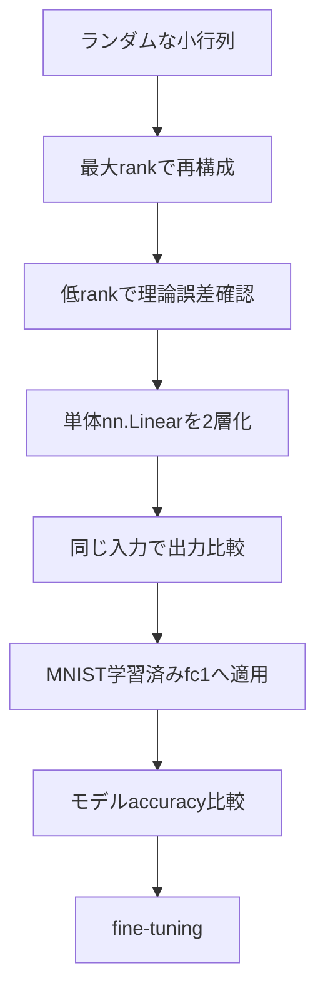

# PyTorch実装

## サマリー

この章では、これまで整理した内容を、再利用可能なPyTorchコードへまとめる。

実装する中心機能は次のとおりである。

1. Linear層の重みを `torch.linalg.svd` で分解する
2. 上位rank成分を取り出す
3. 低ランク2層 `LowRankLinear` を作る
4. 元のbias、device、dtype、学習モードを引き継ぐ
5. モデル内の指定したLinear層を置き換える
6. パラメータ数と圧縮率を計算する
7. 重み誤差と出力誤差を評価する
8. CPU・GPUで推論時間を測定する
9. 最大rankで実装の正しさをテストする

基本の変換は次のとおりである。

$$
W
=
U\Sigma V^{\mathsf{T}}
$$

rank $r$ で切り詰め、

$$
W_r
=
U_r\Sigma_rV_r^{\mathsf{T}}
$$

とする。

この重みを、

$$
W_r=BA
$$

と2因子へ分ける。

特異値を後段へ吸収する場合、

$$
A=V_r^{\mathsf{T}}
$$

$$
B=U_r\Sigma_r
$$

である。

PyTorchでは、

```text
first.weight  = Vh_r
second.weight = U_r * S_r
```

として設定する。


---

## 1. 実装の前提

対象は学習済みの、

```python
nn.Linear(
    in_features=D_in,
    out_features=D_out,
)
```

である。

重み形状は、

$$
D_{\mathrm{out}}
\times
D_{\mathrm{in}}
$$

である。

SVDは、

```python
U, S, Vh = torch.linalg.svd(
    weight,
    full_matrices=False,
)
```

で行う。

このとき、

- `U`：左特異ベクトル
- `S`：特異値の1次元テンソル
- `Vh`：$V^{\mathsf{T}}$。複素数の場合は共役転置

である。

旧APIの `torch.svd` ではなく、`torch.linalg.svd` を使う。

---

## 2. 最初に確認する形状

```python
from torch import nn

layer = nn.Linear(
    in_features=784,
    out_features=512,
)

print(
    tuple(
        layer.weight.shape
    )
)

print(
    tuple(
        layer.bias.shape
    )
)
```

出力：

```text
(512, 784)
(512,)
```

SVD後のReduced SVDでは、

```text
U  : (512, 512)
S  : (512,)
Vh : (512, 784)
```

となる。

rank 64なら、

```text
U_r  : (512, 64)
S_r  : (64,)
Vh_r : (64, 784)
```

である。

---

## 3. 実装全体

以下のコードは、この章で使う機能を1つのモジュールとしてまとめたものである。

たとえば、

```text
svd_compression.py
```

という名前で保存できる。

```python
from __future__ import annotations

from dataclasses import dataclass
from typing import Literal
import copy
import math
import statistics
import time

import torch
from torch import nn


SingularValuePlacement = Literal[
    "first",
    "second",
    "balanced",
]


@dataclass(frozen=True)
class CompressionStats:
    in_features: int
    out_features: int
    rank: int
    original_weight_parameters: int
    compressed_weight_parameters: int
    original_total_parameters: int
    compressed_total_parameters: int
    weight_keep_ratio: float
    weight_reduction_ratio: float
    weight_compression_factor: float
    total_keep_ratio: float
    total_reduction_ratio: float
    total_compression_factor: float
    break_even_rank: float
    maximum_compressing_rank: int
    is_weight_compression: bool


@dataclass(frozen=True)
class TensorErrorMetrics:
    element_count: int
    mean_error: float
    mae: float
    mse: float
    rmse: float
    maximum_absolute_error: float
    reference_rms: float
    relative_rmse: float | None


@dataclass(frozen=True)
class WeightErrorMetrics:
    frobenius_error: float
    relative_frobenius_error: float | None
    spectral_error: float
    mse: float
    rmse: float
    maximum_absolute_error: float


@dataclass(frozen=True)
class BenchmarkResult:
    warmup_iterations: int
    measured_iterations: int
    repeats: int
    median_milliseconds: float
    minimum_milliseconds: float
    maximum_milliseconds: float


def validate_rank(
    in_features: int,
    out_features: int,
    rank: int,
) -> None:
    if in_features <= 0:
        raise ValueError(
            "in_features must be positive."
        )

    if out_features <= 0:
        raise ValueError(
            "out_features must be positive."
        )

    maximum_rank = min(
        in_features,
        out_features,
    )

    if not 1 <= rank <= maximum_rank:
        raise ValueError(
            "rank must satisfy "
            f"1 <= rank <= {maximum_rank}, "
            f"but got {rank}."
        )


def compression_stats(
    in_features: int,
    out_features: int,
    rank: int,
    bias: bool = True,
) -> CompressionStats:
    validate_rank(
        in_features=in_features,
        out_features=out_features,
        rank=rank,
    )

    original_weight = (
        in_features
        * out_features
    )

    compressed_weight = (
        rank
        * (
            in_features
            +
            out_features
        )
    )

    bias_parameters = (
        out_features
        if bias
        else 0
    )

    original_total = (
        original_weight
        +
        bias_parameters
    )

    compressed_total = (
        compressed_weight
        +
        bias_parameters
    )

    weight_keep_ratio = (
        compressed_weight
        /
        original_weight
    )

    total_keep_ratio = (
        compressed_total
        /
        original_total
    )

    break_even_rank = (
        original_weight
        /
        (
            in_features
            +
            out_features
        )
    )

    maximum_compressing_rank = max(
        0,
        math.ceil(
            break_even_rank
        )
        -
        1,
    )

    return CompressionStats(
        in_features=in_features,
        out_features=out_features,
        rank=rank,
        original_weight_parameters=(
            original_weight
        ),
        compressed_weight_parameters=(
            compressed_weight
        ),
        original_total_parameters=(
            original_total
        ),
        compressed_total_parameters=(
            compressed_total
        ),
        weight_keep_ratio=(
            weight_keep_ratio
        ),
        weight_reduction_ratio=(
            1.0
            -
            weight_keep_ratio
        ),
        weight_compression_factor=(
            original_weight
            /
            compressed_weight
        ),
        total_keep_ratio=(
            total_keep_ratio
        ),
        total_reduction_ratio=(
            1.0
            -
            total_keep_ratio
        ),
        total_compression_factor=(
            original_total
            /
            compressed_total
        ),
        break_even_rank=(
            break_even_rank
        ),
        maximum_compressing_rank=(
            maximum_compressing_rank
        ),
        is_weight_compression=(
            compressed_weight
            <
            original_weight
        ),
    )


def retained_energy(
    singular_values: torch.Tensor,
    rank: int,
) -> float:
    if singular_values.ndim != 1:
        raise ValueError(
            "singular_values must be 1D."
        )

    if singular_values.numel() == 0:
        raise ValueError(
            "singular_values must not be empty."
        )

    if not 1 <= rank <= singular_values.numel():
        raise ValueError(
            "rank is out of range."
        )

    squared = singular_values.square()
    total = squared.sum()

    if total.item() == 0.0:
        return 1.0

    return float(
        (
            squared[:rank].sum()
            /
            total
        ).item()
    )


def rank_for_energy(
    singular_values: torch.Tensor,
    target_energy: float,
) -> int:
    if singular_values.ndim != 1:
        raise ValueError(
            "singular_values must be 1D."
        )

    if singular_values.numel() == 0:
        raise ValueError(
            "singular_values must not be empty."
        )

    if not 0.0 < target_energy <= 1.0:
        raise ValueError(
            "target_energy must satisfy "
            "0 < target_energy <= 1."
        )

    squared = singular_values.square()
    total = squared.sum()

    if total.item() == 0.0:
        return 1

    cumulative = torch.cumsum(
        squared,
        dim=0,
    ) / total

    target = torch.tensor(
        target_energy,
        device=cumulative.device,
        dtype=cumulative.dtype,
    )

    index = torch.searchsorted(
        cumulative,
        target,
    )

    return min(
        int(index.item()) + 1,
        singular_values.numel(),
    )


def truncated_svd(
    weight: torch.Tensor,
    rank: int,
) -> tuple[
    torch.Tensor,
    torch.Tensor,
    torch.Tensor,
]:
    if weight.ndim != 2:
        raise ValueError(
            "weight must be a 2D tensor."
        )

    validate_rank(
        in_features=weight.shape[1],
        out_features=weight.shape[0],
        rank=rank,
    )

    U, S, Vh = torch.linalg.svd(
        weight,
        full_matrices=False,
    )

    return (
        U[:, :rank],
        S[:rank],
        Vh[:rank, :],
    )


def factor_weights(
    weight: torch.Tensor,
    rank: int,
    placement: SingularValuePlacement = "second",
) -> tuple[
    torch.Tensor,
    torch.Tensor,
    torch.Tensor,
]:
    U_r, S_r, Vh_r = truncated_svd(
        weight=weight,
        rank=rank,
    )

    if placement == "first":
        first_weight = (
            S_r.unsqueeze(1)
            *
            Vh_r
        )

        second_weight = U_r

    elif placement == "second":
        first_weight = Vh_r

        second_weight = (
            U_r
            *
            S_r.unsqueeze(0)
        )

    elif placement == "balanced":
        sqrt_s = torch.sqrt(
            S_r
        )

        first_weight = (
            sqrt_s.unsqueeze(1)
            *
            Vh_r
        )

        second_weight = (
            U_r
            *
            sqrt_s.unsqueeze(0)
        )

    else:
        raise ValueError(
            "placement must be "
            "'first', 'second', or 'balanced'."
        )

    return (
        first_weight,
        second_weight,
        S_r,
    )


class LowRankLinear(nn.Module):
    def __init__(
        self,
        in_features: int,
        out_features: int,
        rank: int,
        bias: bool = True,
        device=None,
        dtype=None,
    ) -> None:
        super().__init__()

        validate_rank(
            in_features=in_features,
            out_features=out_features,
            rank=rank,
        )

        self.in_features = in_features
        self.out_features = out_features
        self.rank = rank

        self.first = nn.Linear(
            in_features=in_features,
            out_features=rank,
            bias=False,
            device=device,
            dtype=dtype,
        )

        self.second = nn.Linear(
            in_features=rank,
            out_features=out_features,
            bias=bias,
            device=device,
            dtype=dtype,
        )

    def forward(
        self,
        x: torch.Tensor,
    ) -> torch.Tensor:
        return self.second(
            self.first(x)
        )

    @property
    def reconstructed_weight(
        self,
    ) -> torch.Tensor:
        return (
            self.second.weight
            @
            self.first.weight
        )

    def compression_stats(
        self,
    ) -> CompressionStats:
        return compression_stats(
            in_features=self.in_features,
            out_features=self.out_features,
            rank=self.rank,
            bias=self.second.bias is not None,
        )

    @classmethod
    def from_linear(
        cls,
        layer: nn.Linear,
        rank: int,
        placement: SingularValuePlacement = "second",
    ) -> "LowRankLinear":
        if not isinstance(
            layer,
            nn.Linear,
        ):
            raise TypeError(
                "layer must be nn.Linear."
            )

        weight = (
            layer.weight
            .detach()
        )

        first_weight, second_weight, _ = (
            factor_weights(
                weight=weight,
                rank=rank,
                placement=placement,
            )
        )

        module = cls(
            in_features=layer.in_features,
            out_features=layer.out_features,
            rank=rank,
            bias=layer.bias is not None,
            device=weight.device,
            dtype=weight.dtype,
        )

        with torch.no_grad():
            module.first.weight.copy_(
                first_weight
            )

            module.second.weight.copy_(
                second_weight
            )

            if layer.bias is not None:
                module.second.bias.copy_(
                    layer.bias.detach()
                )

        module.train(
            layer.training
        )

        return module

    def extra_repr(
        self,
    ) -> str:
        return (
            f"in_features={self.in_features}, "
            f"out_features={self.out_features}, "
            f"rank={self.rank}, "
            f"bias={self.second.bias is not None}"
        )


def _get_child_module(
    parent: nn.Module,
    name: str,
) -> nn.Module:
    if isinstance(
        parent,
        (
            nn.Sequential,
            nn.ModuleList,
        ),
    ) and name.isdigit():
        return parent[
            int(name)
        ]

    return getattr(
        parent,
        name,
    )


def _set_child_module(
    parent: nn.Module,
    name: str,
    child: nn.Module,
) -> None:
    if isinstance(
        parent,
        (
            nn.Sequential,
            nn.ModuleList,
        ),
    ) and name.isdigit():
        parent[
            int(name)
        ] = child
        return

    setattr(
        parent,
        name,
        child,
    )


def get_module_by_path(
    model: nn.Module,
    module_path: str,
) -> nn.Module:
    if not module_path:
        raise ValueError(
            "module_path must not be empty."
        )

    current = model

    for part in module_path.split("."):
        current = _get_child_module(
            current,
            part,
        )

    return current


def replace_module_by_path(
    model: nn.Module,
    module_path: str,
    new_module: nn.Module,
) -> None:
    parts = module_path.split(".")

    if not parts or any(
        part == ""
        for part in parts
    ):
        raise ValueError(
            "invalid module_path."
        )

    parent = model

    for part in parts[:-1]:
        parent = _get_child_module(
            parent,
            part,
        )

    _set_child_module(
        parent=parent,
        name=parts[-1],
        child=new_module,
    )


def compress_linear_by_path(
    model: nn.Module,
    module_path: str,
    rank: int,
    placement: SingularValuePlacement = "second",
    inplace: bool = False,
) -> nn.Module:
    target_model = (
        model
        if inplace
        else copy.deepcopy(
            model
        )
    )

    target_layer = get_module_by_path(
        target_model,
        module_path,
    )

    if not isinstance(
        target_layer,
        nn.Linear,
    ):
        raise TypeError(
            f"{module_path!r} is not nn.Linear."
        )

    compressed_layer = (
        LowRankLinear.from_linear(
            layer=target_layer,
            rank=rank,
            placement=placement,
        )
    )

    replace_module_by_path(
        model=target_model,
        module_path=module_path,
        new_module=compressed_layer,
    )

    return target_model


def compare_tensors(
    reference: torch.Tensor,
    approximation: torch.Tensor,
) -> TensorErrorMetrics:
    if reference.shape != approximation.shape:
        raise ValueError(
            "tensor shapes must match."
        )

    if reference.numel() == 0:
        raise ValueError(
            "tensors must not be empty."
        )

    reference_64 = (
        reference
        .detach()
        .to(
            dtype=torch.float64
        )
    )

    approximation_64 = (
        approximation
        .detach()
        .to(
            dtype=torch.float64
        )
    )

    difference = (
        reference_64
        -
        approximation_64
    )

    mse_tensor = (
        difference
        .square()
        .mean()
    )

    rmse_tensor = torch.sqrt(
        mse_tensor
    )

    reference_rms_tensor = torch.sqrt(
        reference_64
        .square()
        .mean()
    )

    if reference_rms_tensor.item() == 0.0:
        relative_rmse = None
    else:
        relative_rmse = float(
            (
                rmse_tensor
                /
                reference_rms_tensor
            ).item()
        )

    return TensorErrorMetrics(
        element_count=reference.numel(),
        mean_error=float(
            difference.mean().item()
        ),
        mae=float(
            difference.abs().mean().item()
        ),
        mse=float(
            mse_tensor.item()
        ),
        rmse=float(
            rmse_tensor.item()
        ),
        maximum_absolute_error=float(
            difference.abs().max().item()
        ),
        reference_rms=float(
            reference_rms_tensor.item()
        ),
        relative_rmse=relative_rmse,
    )


def compare_weight_matrices(
    original: torch.Tensor,
    approximation: torch.Tensor,
) -> WeightErrorMetrics:
    if original.ndim != 2:
        raise ValueError(
            "original must be a matrix."
        )

    if original.shape != approximation.shape:
        raise ValueError(
            "matrix shapes must match."
        )

    original_64 = (
        original
        .detach()
        .to(
            dtype=torch.float64
        )
    )

    approximation_64 = (
        approximation
        .detach()
        .to(
            dtype=torch.float64
        )
    )

    difference = (
        original_64
        -
        approximation_64
    )

    frobenius_error_tensor = (
        torch.linalg.matrix_norm(
            difference,
            ord="fro",
        )
    )

    original_norm_tensor = (
        torch.linalg.matrix_norm(
            original_64,
            ord="fro",
        )
    )

    if original_norm_tensor.item() == 0.0:
        relative_frobenius_error = None
    else:
        relative_frobenius_error = float(
            (
                frobenius_error_tensor
                /
                original_norm_tensor
            ).item()
        )

    mse_tensor = (
        difference
        .square()
        .mean()
    )

    return WeightErrorMetrics(
        frobenius_error=float(
            frobenius_error_tensor.item()
        ),
        relative_frobenius_error=(
            relative_frobenius_error
        ),
        spectral_error=float(
            torch.linalg.matrix_norm(
                difference,
                ord=2,
            ).item()
        ),
        mse=float(
            mse_tensor.item()
        ),
        rmse=float(
            torch.sqrt(
                mse_tensor
            ).item()
        ),
        maximum_absolute_error=float(
            difference.abs().max().item()
        ),
    )


def benchmark_module(
    module: nn.Module,
    example_input: torch.Tensor,
    warmup_iterations: int = 20,
    measured_iterations: int = 100,
    repeats: int = 5,
) -> BenchmarkResult:
    if warmup_iterations < 0:
        raise ValueError(
            "warmup_iterations must be non-negative."
        )

    if measured_iterations <= 0:
        raise ValueError(
            "measured_iterations must be positive."
        )

    if repeats <= 0:
        raise ValueError(
            "repeats must be positive."
        )

    module.eval()

    device = example_input.device

    def synchronize() -> None:
        if device.type == "cuda":
            torch.cuda.synchronize(
                device
            )

    with torch.inference_mode():
        for _ in range(
            warmup_iterations
        ):
            module(
                example_input
            )

        synchronize()

        milliseconds: list[float] = []

        for _ in range(
            repeats
        ):
            synchronize()

            start = time.perf_counter()

            for _ in range(
                measured_iterations
            ):
                module(
                    example_input
                )

            synchronize()

            elapsed = (
                time.perf_counter()
                -
                start
            )

            milliseconds.append(
                1000.0
                *
                elapsed
                /
                measured_iterations
            )

    return BenchmarkResult(
        warmup_iterations=warmup_iterations,
        measured_iterations=measured_iterations,
        repeats=repeats,
        median_milliseconds=(
            statistics.median(
                milliseconds
            )
        ),
        minimum_milliseconds=min(
            milliseconds
        ),
        maximum_milliseconds=max(
            milliseconds
        ),
    )

```

---

## 4. コード全体の構成

実装は次の部分に分かれている。

```text
CompressionStats
├─ 圧縮前後のパラメータ数
├─ 保持率・削減率
└─ 損益分岐rank

TensorErrorMetrics
└─ 出力テンソルのMAE・MSE・RMSE

WeightErrorMetrics
└─ 重み行列のノルム誤差

truncated_svd
└─ 上位rankのU・S・Vhを取得

factor_weights
└─ 特異値を前段・後段・両方へ分配

LowRankLinear
├─ 2つのLinear層
├─ 学習済みLinearから生成
└─ 再構成重みを取得

compress_linear_by_path
└─ モデル内部の指定層を置換

benchmark_module
└─ CPU・GPU推論時間を測定
```

---

## 5. `validate_rank`

rankは、

$$
1
\leq
r
\leq
\min
\left(
D_{\mathrm{in}},
D_{\mathrm{out}}
\right)
$$

を満たす必要がある。

```python
validate_rank(
    in_features=784,
    out_features=512,
    rank=64,
)
```

不正なrankなら `ValueError` を発生させる。

```python
validate_rank(
    in_features=784,
    out_features=512,
    rank=600,
)
```

最大rankを超えるためエラーになる。

### なぜ早い段階で検証するのか

rankの不正を後の行列積エラーとして受け取るより、

```text
rank must satisfy 1 <= rank <= 512
```

と明確に示した方が原因を特定しやすい。

---

## 6. `compression_stats`

```python
stats = compression_stats(
    in_features=784,
    out_features=512,
    rank=64,
    bias=True,
)
```

主な値を確認する。

```python
print(
    stats.original_weight_parameters
)

print(
    stats.compressed_weight_parameters
)

print(
    stats.weight_keep_ratio
)

print(
    stats.weight_reduction_ratio
)

print(
    stats.weight_compression_factor
)

print(
    stats.maximum_compressing_rank
)

print(
    stats.is_weight_compression
)
```

`Linear(784, 512)`、rank 64では、重み数は、

$$
401{,}408
\rightarrow
82{,}944
$$

となる。

---

## 7. `truncated_svd`

```python
U_r, S_r, Vh_r = truncated_svd(
    weight=layer.weight.detach(),
    rank=64,
)
```

形状を確認する。

```python
print(
    tuple(
        U_r.shape
    )
)

print(
    tuple(
        S_r.shape
    )
)

print(
    tuple(
        Vh_r.shape
    )
)
```

出力：

```text
(512, 64)
(64,)
(64, 784)
```

### `full_matrices=False`

圧縮ではReduced SVDを使う。

完全SVDの余分な基底は、上位rank成分を作るために必要ない。

---

## 8. `factor_weights`

```python
first_weight, second_weight, S_r = (
    factor_weights(
        weight=layer.weight.detach(),
        rank=64,
        placement="second",
    )
)
```

形状は、

```python
print(
    tuple(
        first_weight.shape
    )
)

print(
    tuple(
        second_weight.shape
    )
)
```

```text
(64, 784)
(512, 64)
```

となる。

再構成は、

```python
reconstructed = (
    second_weight
    @
    first_weight
)
```

である。

$$
W_r=BA
$$

に対応する。

---

## 9. 特異値の配置方法

### `placement="first"`

$$
A
=
\Sigma_r
V_r^{\mathsf{T}}
$$

$$
B=U_r
$$

### `placement="second"`

$$
A
=
V_r^{\mathsf{T}}
$$

$$
B
=
U_r\Sigma_r
$$

### `placement="balanced"`

$$
A
=
\Sigma_r^{1/2}
V_r^{\mathsf{T}}
$$

$$
B
=
U_r
\Sigma_r^{1/2}
$$

初期状態では、どの方法でも、

$$
BA=W_r
$$

である。

```python
for placement in [
    "first",
    "second",
    "balanced",
]:
    first_weight, second_weight, _ = (
        factor_weights(
            weight=layer.weight.detach(),
            rank=64,
            placement=placement,
        )
    )

    reconstructed = (
        second_weight
        @
        first_weight
    )

    print(
        placement,
        tuple(
            reconstructed.shape
        ),
    )
```

---

## 10. `LowRankLinear`

`LowRankLinear` は、2つのLinear層を1つのモジュールとして扱うクラスである。

```python
low_rank_layer = LowRankLinear(
    in_features=784,
    out_features=512,
    rank=64,
    bias=True,
)
```

構造は、

```text
LowRankLinear(
  (first): Linear(784, 64, bias=False)
  (second): Linear(64, 512, bias=True)
)
```

である。

forwardは、

```python
return self.second(
    self.first(x)
)
```

だけである。

2層の間にReLUは入らない。

---

## 11. 学習済みLinearから作る

```python
compressed_layer = (
    LowRankLinear.from_linear(
        layer=layer,
        rank=64,
        placement="second",
    )
)
```

この処理で、

- SVD
- rank切り詰め
- 2層作成
- 重みコピー
- biasコピー
- device引き継ぎ
- dtype引き継ぎ
- `training` 状態引き継ぎ

を行う。

---

## 12. biasの確認

```python
if layer.bias is not None:
    print(
        torch.allclose(
            layer.bias,
            compressed_layer.second.bias,
        )
    )
```

`True` になれば、元biasが後段へコピーされている。

前段は、

```python
compressed_layer.first.bias
```

が `None` である。

---

## 13. 再構成重み

```python
reconstructed_weight = (
    compressed_layer
    .reconstructed_weight
)
```

形状は元の重みと同じである。

```python
print(
    tuple(
        reconstructed_weight.shape
    )
)
```

```text
(512, 784)
```

ただし、再構成重みを密行列として保存してもパラメータ圧縮にはならない。

推論時は2つの因子をそのまま使う。

---

## 14. 最大rankで実装を確認する

最大rankを、

```python
maximum_rank = min(
    layer.in_features,
    layer.out_features,
)
```

とする。

```python
full_rank_layer = (
    LowRankLinear.from_linear(
        layer=layer,
        rank=maximum_rank,
    )
)
```

同じ入力で比較する。

```python
x = torch.randn(
    32,
    layer.in_features,
    device=layer.weight.device,
    dtype=layer.weight.dtype,
)

layer.eval()
full_rank_layer.eval()

with torch.inference_mode():
    y_original = layer(
        x
    )

    y_full_rank = (
        full_rank_layer(
            x
        )
    )

print(
    torch.allclose(
        y_original,
        y_full_rank,
        rtol=1e-4,
        atol=1e-5,
    )
)
```

最大rankで大きな差が出る場合は、実装ミスを疑う。

---

## 15. rankを下げた出力誤差

```python
rank_64_layer = (
    LowRankLinear.from_linear(
        layer=layer,
        rank=64,
    )
)

with torch.inference_mode():
    y_original = layer(
        x
    )

    y_rank_64 = (
        rank_64_layer(
            x
        )
    )

metrics = compare_tensors(
    reference=y_original,
    approximation=y_rank_64,
)

print(metrics)
```

`TensorErrorMetrics` には、

- MAE
- MSE
- RMSE
- 最大絶対誤差
- 相対RMSE

が入る。

---

## 16. 重み誤差

```python
weight_metrics = (
    compare_weight_matrices(
        original=layer.weight,
        approximation=(
            compressed_layer
            .reconstructed_weight
        ),
    )
)

print(weight_metrics)
```

評価される内容：

- フロベニウス誤差
- 相対フロベニウス誤差
- スペクトル誤差
- 重みMSE
- 重みRMSE
- 最大絶対誤差

---

## 17. 特異値エネルギー

全特異値だけ必要なら、

```python
singular_values = (
    torch.linalg.svdvals(
        layer.weight.detach()
    )
)
```

を使える。

rank 64の保持率：

```python
energy = retained_energy(
    singular_values=singular_values,
    rank=64,
)

print(energy)
```

目標エネルギーからrankを求める。

```python
rank_99 = rank_for_energy(
    singular_values=singular_values,
    target_energy=0.99,
)

print(rank_99)
```

### 注意

エネルギー99%はaccuracy99%保持を意味しない。

rank候補を作るための指標として使う。

---

## 18. モデル内の層を名前で取得する

次のモデルを考える。

```python
class MnistMLP(nn.Module):
    def __init__(
        self,
    ) -> None:
        super().__init__()

        self.flatten = nn.Flatten()
        self.fc1 = nn.Linear(
            784,
            512,
        )
        self.relu = nn.ReLU()
        self.fc2 = nn.Linear(
            512,
            10,
        )

    def forward(
        self,
        x: torch.Tensor,
    ) -> torch.Tensor:
        x = self.flatten(
            x
        )

        x = self.fc1(
            x
        )

        x = self.relu(
            x
        )

        return self.fc2(
            x
        )
```

`fc1` を取得する。

```python
target_layer = get_module_by_path(
    model,
    "fc1",
)

print(target_layer)
```

ネストした `nn.Sequential` も、

```text
network.1
```

のようなパスで指定できる。

---

## 19. モデル内の層を置き換える

```python
compressed_model = (
    compress_linear_by_path(
        model=model,
        module_path="fc1",
        rank=64,
        placement="second",
        inplace=False,
    )
)
```

`inplace=False` では `deepcopy` を作るため、元モデルは変更されない。

```python
print(
    model.fc1
)

print(
    compressed_model.fc1
)
```

元：

```text
Linear(784, 512)
```

圧縮後：

```text
LowRankLinear(784, 512, rank=64)
```

---

## 20. `inplace=True`

```python
compress_linear_by_path(
    model=model,
    module_path="fc1",
    rank=64,
    inplace=True,
)
```

元のモデルを直接変更する。

比較実験では、未圧縮モデルを残すため、

```python
inplace=False
```

を推奨する。

---

## 21. `nn.Sequential` 内の層

```python
model = nn.Sequential(
    nn.Flatten(),
    nn.Linear(
        784,
        512,
    ),
    nn.ReLU(),
    nn.Linear(
        512,
        10,
    ),
)
```

第1Linear層のパスは、

```text
1
```

である。

```python
compressed_model = (
    compress_linear_by_path(
        model=model,
        module_path="1",
        rank=64,
    )
)
```

ネストしている場合は、

```text
features.3
network.1
block.linear
```

のようにピリオドで区切る。

---

## 22. 置換後のoptimizer

層を置き換えると、新しい `nn.Parameter` が作られる。

古いoptimizerは置換前のパラメータを参照している可能性がある。

### 正しい順序

```python
compressed_model = (
    compress_linear_by_path(
        model=trained_model,
        module_path="fc1",
        rank=64,
    )
)

optimizer = torch.optim.Adam(
    compressed_model.parameters(),
    lr=1e-4,
)
```

fine-tuning用optimizerは、置換後に作り直す。

---

## 23. deviceの扱い

元の重みがGPU上なら、新しい2層も同じGPU上に作られる。

```python
print(
    layer.weight.device
)

print(
    compressed_layer
    .first
    .weight
    .device
)
```

`from_linear` 内で、

```python
device=weight.device
```

を指定しているためである。

---

## 24. dtypeの扱い

```python
print(
    layer.weight.dtype
)

print(
    compressed_layer
    .first
    .weight
    .dtype
)
```

元のdtypeを引き継ぐ。

SVDはdtypeによって数値誤差が変わる。

実装確認では `float64` を使い、実験ではモデル本来のdtypeで評価する方法が分かりやすい。

---

## 25. 学習モードの引き継ぎ

元のLinear層が、

```python
layer.eval()
```

の状態なら、圧縮層も評価モードにする。

```python
module.train(
    layer.training
)
```

によって状態を引き継いでいる。

Linear層自体はtrainとevalで計算が変わらないが、モジュール状態を一貫させるために保持する。

---

## 26. `detach()` と `torch.no_grad()`

SVDへ渡す重みは、

```python
weight = (
    layer.weight
    .detach()
)
```

として自動微分グラフから切り離す。

新しい層へコピーするときは、

```python
with torch.no_grad():
    module.first.weight.copy_(
        first_weight
    )
```

とする。

初期化操作を勾配履歴へ記録する必要はない。

---

## 27. `torch.inference_mode()`

評価では、

```python
with torch.inference_mode():
    output = model(
        inputs
    )
```

を使う。

- 勾配を計算しない
- 評価時のオーバーヘッドを減らしやすい
- 純粋な推論処理に適する

fine-tuningでは使わない。

---

## 28. 推論時間の測定

```python
example_input = torch.randn(
    256,
    784,
    device=layer.weight.device,
    dtype=layer.weight.dtype,
)

original_result = benchmark_module(
    module=layer,
    example_input=example_input,
)

compressed_result = benchmark_module(
    module=compressed_layer,
    example_input=example_input,
)

print(
    original_result
)

print(
    compressed_result
)
```

GPUでは、処理が非同期であるため、

```python
torch.cuda.synchronize()
```

を計測前後に実行している。

---

## 29. ベンチマークの注意

実測時間は次の条件で変わる。

- CPUかGPUか
- バッチサイズ
- dtype
- rank
- 入出力次元
- ウォームアップ回数
- PyTorchとバックエンド
- 同時に動く他プロセス
- 電源設定
- GPUクロック

パラメータ数が減っても、2つの行列積によるオーバーヘッドで遅くなることがある。

結果には測定条件を残す。

---

## 30. 保存

圧縮モデルの `state_dict` を保存する。

```python
torch.save(
    compressed_model.state_dict(),
    "mnist_mlp_rank64.pt",
)
```

圧縮前と圧縮後ではモジュール構造とキーが異なる。

読み込み時には、同じ圧縮構造を先に作る必要がある。

---

## 31. 圧縮モデル用クラスを作る

実験用には、rankを引数として構造を定義すると読み込みやすい。

```python
class CompressedMnistMLP(
    nn.Module
):
    def __init__(
        self,
        rank: int,
    ) -> None:
        super().__init__()

        self.flatten = nn.Flatten()

        self.fc1 = LowRankLinear(
            in_features=784,
            out_features=512,
            rank=rank,
            bias=True,
        )

        self.relu = nn.ReLU()

        self.fc2 = nn.Linear(
            512,
            10,
        )

    def forward(
        self,
        x: torch.Tensor,
    ) -> torch.Tensor:
        x = self.flatten(
            x
        )

        x = self.fc1(
            x
        )

        x = self.relu(
            x
        )

        return self.fc2(
            x
        )
```

保存したrankも設定ファイルやファイル名へ残す。

---

## 32. 読み込み

```python
rank = 64

model = CompressedMnistMLP(
    rank=rank,
)

state_dict = torch.load(
    "mnist_mlp_rank64.pt",
    map_location="cpu",
)

model.load_state_dict(
    state_dict
)
```

圧縮前の `MnistMLP` へ圧縮後の `state_dict` を直接読み込むことはできない。

---

## 33. rankごとのモデルを作る

```python
ranks = [
    8,
    16,
    32,
    64,
    128,
    256,
]

compressed_models = {}

for rank in ranks:
    compressed_models[rank] = (
        compress_linear_by_path(
            model=trained_model,
            module_path="fc1",
            rank=rank,
            inplace=False,
        )
    )
```

メモリ消費が大きくなるため、実際の実験では1rankずつ、

1. 作成
2. 評価
3. 結果保存
4. モデル破棄

と進めてもよい。

---

## 34. rankごとの統計

```python
rows = []

for rank in ranks:
    stats = compression_stats(
        in_features=784,
        out_features=512,
        rank=rank,
        bias=True,
    )

    rows.append(
        {
            "rank": rank,
            "parameters": (
                stats
                .compressed_total_parameters
            ),
            "keep_ratio": (
                stats
                .total_keep_ratio
            ),
            "reduction_ratio": (
                stats
                .total_reduction_ratio
            ),
            "compression_factor": (
                stats
                .total_compression_factor
            ),
        }
    )
```

この結果へ、accuracyやRMSEを追加する。

---

## 35. rankごとの重み評価

```python
original_layer = (
    trained_model.fc1
)

for rank in ranks:
    compressed_layer = (
        LowRankLinear.from_linear(
            original_layer,
            rank=rank,
        )
    )

    metrics = (
        compare_weight_matrices(
            original=(
                original_layer
                .weight
            ),
            approximation=(
                compressed_layer
                .reconstructed_weight
            ),
        )
    )

    print(
        rank,
        metrics.relative_frobenius_error,
        metrics.spectral_error,
    )
```

---

## 36. rankごとの層出力評価

```python
images, _ = next(
    iter(
        test_loader
    )
)

inputs = images.flatten(
    start_dim=1
)

original_layer = (
    trained_model.fc1
)

for rank in ranks:
    compressed_layer = (
        LowRankLinear.from_linear(
            original_layer,
            rank=rank,
        )
    )

    original_layer.eval()
    compressed_layer.eval()

    with torch.inference_mode():
        original_output = (
            original_layer(
                inputs
            )
        )

        compressed_output = (
            compressed_layer(
                inputs
            )
        )

    metrics = compare_tensors(
        reference=original_output,
        approximation=compressed_output,
    )

    print(
        rank,
        metrics.rmse,
        metrics.relative_rmse,
    )
```

最終結果には1バッチだけでなく、テストデータ全体を使う。

---

## 37. 特異値スペクトル

```python
import matplotlib.pyplot as plt

singular_values = (
    torch.linalg.svdvals(
        trained_model
        .fc1
        .weight
        .detach()
    )
)

values = (
    singular_values
    .cpu()
    .numpy()
)

plt.figure()
plt.plot(
    range(
        1,
        len(values) + 1,
    ),
    values,
)
plt.xlabel(
    "Singular value index"
)
plt.ylabel(
    "Singular value"
)
plt.title(
    "Singular Value Spectrum"
)
plt.grid(
    True
)
plt.show()
```

小さい特異値まで見る場合は対数軸も使う。

```python
plt.figure()
plt.semilogy(
    range(
        1,
        len(values) + 1,
    ),
    values,
)
plt.xlabel(
    "Singular value index"
)
plt.ylabel(
    "Singular value"
)
plt.title(
    "Singular Value Spectrum"
)
plt.grid(
    True
)
plt.show()
```

---

## 38. 累積エネルギー

```python
squared = (
    singular_values
    .square()
)

cumulative_energy = (
    torch.cumsum(
        squared,
        dim=0,
    )
    /
    squared.sum()
)

energy_values = (
    cumulative_energy
    .cpu()
    .numpy()
)

plt.figure()
plt.plot(
    range(
        1,
        len(
            energy_values
        ) + 1,
    ),
    energy_values,
)
plt.xlabel(
    "Rank"
)
plt.ylabel(
    "Retained energy"
)
plt.title(
    "Cumulative Singular Value Energy"
)
plt.ylim(
    0.0,
    1.01,
)
plt.grid(
    True
)
plt.show()
```

---

## 39. 最低限の単体テスト

### 最大rankで重みを再構成

```python
def test_full_rank_weight_reconstruction() -> None:
    torch.manual_seed(
        0
    )

    layer = nn.Linear(
        12,
        7,
        dtype=torch.float64,
    )

    compressed = (
        LowRankLinear.from_linear(
            layer,
            rank=7,
        )
    )

    assert torch.allclose(
        layer.weight,
        compressed.reconstructed_weight,
        rtol=1e-10,
        atol=1e-10,
    )
```

### 最大rankで出力を再構成

```python
def test_full_rank_output_reconstruction() -> None:
    torch.manual_seed(
        0
    )

    layer = nn.Linear(
        12,
        7,
        dtype=torch.float64,
    )

    compressed = (
        LowRankLinear.from_linear(
            layer,
            rank=7,
        )
    )

    x = torch.randn(
        16,
        12,
        dtype=torch.float64,
    )

    with torch.inference_mode():
        original_output = layer(
            x
        )

        compressed_output = compressed(
            x
        )

    assert torch.allclose(
        original_output,
        compressed_output,
        rtol=1e-10,
        atol=1e-10,
    )
```

---

## 40. biasテスト

```python
def test_bias_is_copied_to_second_layer() -> None:
    layer = nn.Linear(
        12,
        7,
        bias=True,
    )

    compressed = (
        LowRankLinear.from_linear(
            layer,
            rank=3,
        )
    )

    assert (
        compressed.first.bias
        is None
    )

    assert torch.equal(
        layer.bias,
        compressed.second.bias,
    )
```

biasなしも確認する。

```python
def test_bias_false_is_preserved() -> None:
    layer = nn.Linear(
        12,
        7,
        bias=False,
    )

    compressed = (
        LowRankLinear.from_linear(
            layer,
            rank=3,
        )
    )

    assert (
        compressed.first.bias
        is None
    )

    assert (
        compressed.second.bias
        is None
    )
```

---

## 41. 形状テスト

```python
def test_low_rank_shapes() -> None:
    layer = nn.Linear(
        12,
        7,
    )

    compressed = (
        LowRankLinear.from_linear(
            layer,
            rank=3,
        )
    )

    assert (
        compressed
        .first
        .weight
        .shape
        ==
        (3, 12)
    )

    assert (
        compressed
        .second
        .weight
        .shape
        ==
        (7, 3)
    )

    assert (
        compressed
        .reconstructed_weight
        .shape
        ==
        (7, 12)
    )
```

---

## 42. パラメータ数テスト

```python
def test_parameter_count() -> None:
    stats = compression_stats(
        in_features=784,
        out_features=512,
        rank=64,
        bias=True,
    )

    assert (
        stats
        .original_weight_parameters
        ==
        401_408
    )

    assert (
        stats
        .compressed_weight_parameters
        ==
        82_944
    )

    assert (
        stats
        .maximum_compressing_rank
        ==
        309
    )

    assert (
        stats
        .is_weight_compression
    )
```

---

## 43. 配置方法の一致テスト

```python
def test_all_placements_match() -> None:
    torch.manual_seed(
        0
    )

    weight = torch.randn(
        7,
        12,
        dtype=torch.float64,
    )

    reconstructed = []

    for placement in [
        "first",
        "second",
        "balanced",
    ]:
        first, second, _ = (
            factor_weights(
                weight=weight,
                rank=3,
                placement=placement,
            )
        )

        reconstructed.append(
            second
            @
            first
        )

    assert torch.allclose(
        reconstructed[0],
        reconstructed[1],
        rtol=1e-10,
        atol=1e-10,
    )

    assert torch.allclose(
        reconstructed[1],
        reconstructed[2],
        rtol=1e-10,
        atol=1e-10,
    )
```

---

## 44. モデル置換テスト

```python
def test_model_replacement() -> None:
    model = nn.Sequential(
        nn.Linear(
            12,
            7,
        ),
        nn.ReLU(),
        nn.Linear(
            7,
            2,
        ),
    )

    compressed_model = (
        compress_linear_by_path(
            model=model,
            module_path="0",
            rank=3,
            inplace=False,
        )
    )

    assert isinstance(
        model[0],
        nn.Linear,
    )

    assert isinstance(
        compressed_model[0],
        LowRankLinear,
    )

    x = torch.randn(
        5,
        12,
    )

    output = compressed_model(
        x
    )

    assert output.shape == (
        5,
        2,
    )
```

---

## 45. テスト実行

単純に実行するなら、

```python
test_full_rank_weight_reconstruction()
test_full_rank_output_reconstruction()
test_bias_is_copied_to_second_layer()
test_bias_false_is_preserved()
test_low_rank_shapes()
test_parameter_count()
test_all_placements_match()
test_model_replacement()

print(
    "All tests passed."
)
```

pytestを使う場合は、各関数を `test_` で始めたファイルへ保存する。

---

## 46. 最初の推奨ファイル構成

実験が大きくなったら、次のように分ける。

```text
nn-svd-experiment/
├── models.py
├── svd_compression.py
├── metrics.py
├── train.py
├── evaluate.py
├── experiment.py
├── tests/
│   └── test_svd_compression.py
└── results/
```

### `models.py`

- 未圧縮MNISTモデル
- `LowRankLinear`
- 圧縮済みモデル構造

### `svd_compression.py`

- `truncated_svd`
- `factor_weights`
- `compression_stats`
- 層置換関数

### `metrics.py`

- テンソル誤差
- 重み誤差
- accuracy
- 推論時間

### `experiment.py`

- rankループ
- 結果表
- CSV保存
- グラフ作成

最初の学習段階では1つのNotebookでもよいが、処理が安定したら関数を `.py` へ分離する。

---

## 47. Notebookでのセル構成

```text
Cell 1：importとseed
Cell 2：モデル定義
Cell 3：学習
Cell 4：未圧縮モデル評価
Cell 5：SVDユーティリティ
Cell 6：特異値スペクトル
Cell 7：rank候補
Cell 8：層置換
Cell 9：重み・出力誤差
Cell 10：accuracy
Cell 11：fine-tuning
Cell 12：結果表とグラフ
```

実装関数と実験コードを同じセルへ詰め込まない方が、エラーの原因を追いやすい。

---

## 48. 実装時のチェックリスト

### SVD前

- 学習済みモデルか
- 対象層は `nn.Linear` か
- `weight.shape` を確認したか
- 最大rankを確認したか
- 未圧縮accuracyを保存したか
- 元モデルのコピーを残したか

### 分解時

- `torch.linalg.svd` を使っているか
- `full_matrices=False` か
- `Vh` を $V^{\mathsf{T}}$ として扱っているか
- rankの範囲を検証したか

### 2層化

- 前段形状は `(rank, in_features)` か
- 後段形状は `(out_features, rank)` か
- 2層の間にReLUを入れていないか
- 元biasを後段へコピーしたか
- deviceとdtypeを引き継いだか

### 評価

- `eval()` を使ったか
- 同じ入力で比較したか
- 最大rankで再構成を確認したか
- 重み誤差と出力誤差を分けたか
- 圧縮直後とfine-tuning後を分けたか
- optimizerを置換後に作り直したか

---

## 49. よくある実装ミス

### `torch.svd` を使う

旧APIではなく、

```python
torch.linalg.svd
```

を使う。

### `Vh.T` を前段へ設定する

前段Linearの重みは、

```text
(rank, in_features)
```

なので、`Vh_r` をそのまま使う。

### 特異値の掛ける方向を間違える

後段へ吸収するなら、

```python
U_r * S_r.unsqueeze(0)
```

であり、$U_r$ の列へ特異値を掛ける。

### biasを前段と後段の両方へ入れる

基本構成では前段biasなし、後段へ元biasをコピーする。

### 2層の間にReLUを入れる

元の低ランクLinearとは異なる非線形モデルになる。

### 元から後ろにあったReLUを削除する

SVDで分けた2層の後ろに、元のReLUを残す。

### 元モデルを直接変更して比較対象を失う

`inplace=False` または `copy.deepcopy` を使う。

### optimizerを使い回す

新しいパラメータを参照するoptimizerを作り直す。

### 最大rankでも誤差が大きい

形状、特異値の掛け方、bias、`Vh` の向きを確認する。

### 圧縮後の密行列を保存する

圧縮表現として2つの小行列を保存する。

---

## 50. 実装の段階的な進め方

最初からMNISTモデル全体へ適用せず、次の順で確認する。



この順序なら、数学・層実装・モデル評価のどこで問題が起きたかを分離しやすい。

---

## 51. 完成した実装でできること

この章のコードで、次を実行できる。

- 任意の `nn.Linear` をrank指定で圧縮
- 特異値を3通りに分配
- 圧縮率を計算
- 目標エネルギーからrankを決定
- 重み誤差を計算
- 層出力誤差を計算
- モデル内の層をパス指定で置換
- 元モデルを保持したまま圧縮モデルを作成
- CPU・GPU推論時間を測定
- 最大rankによる単体テスト

次の章では、この実装をMNISTの学習済みMLPへ適用し、rankごとの精度と圧縮率を比較する。

---

## 52. このノートで押さえるポイント

- SVDには `torch.linalg.svd(..., full_matrices=False)` を使う。
- PyTorchが返す `Vh` は $V^{\mathsf{T}}$ に対応する。
- 前段重み形状は `(rank, in_features)` である。
- 後段重み形状は `(out_features, rank)` である。
- 特異値は前段、後段、対称の3通りで分配できる。
- 初期状態で $BA=W_r$ なら、3方式は同じ低ランク重みを表す。
- `LowRankLinear` の2層の間にReLUを入れない。
- 元biasは後段へコピーする。
- 元のdevice、dtype、学習モードを引き継ぐ。
- `detach()` で重みを学習グラフから切り離す。
- `torch.no_grad()` 内で新しいパラメータへコピーする。
- モデル比較では元モデルを残す。
- 層置換後はoptimizerを作り直す。
- 最大rankで重みと出力を再構成できるかテストする。
- パラメータ数と推論時間は別々に測る。
- GPU時間測定では同期が必要である。
- 圧縮モデルを読み込むには同じモジュール構造が必要である。
- rankごとの結果は、圧縮率・誤差・accuracyを同じ表へまとめる。

---

## 53. 次に読むノート

次は、このコードをMNISTの学習・圧縮・fine-tuning実験へつなげる。

- [[00_基礎理論/01_SVDとは]]
- [[00_基礎理論/02_nn.Linearとは]]
- [[00_基礎理論/03_SVDによる低ランク近似]]
- [[00_基礎理論/04_Linear層を2層へ置き換える]]
- [[00_基礎理論/05_圧縮率とRank]]
- [[00_基礎理論/06_誤差評価]]
- [[10_MNIST_MLP_SVD/01_MNIST実験]]

---

## 54. 実装詳細ノートへの分割

このノートは、再利用可能なPyTorch実装の全体設計を扱う。関数ごとの疑問、shape、テスト、実測手順は次へ分離した。

- [[README_実装編]]
- [[00_基礎理論/08_Linear層のSVD実装]]
- [[00_基礎理論/09_Linear層の2層置換_実装]]
- [[00_基礎理論/10_SVD圧縮モデルの評価設計]]
- [[00_基礎理論/11_理論計算量とベンチマーク]]

特に、`detach()` と `torch.no_grad()` の使い分け、`model.fc1` をSequentialへ置換したときのModule登録、optimizerの再生成は実装詳細編で扱う。

コード本体はMarkdownと分け、`code/` 以下へ保存する。
