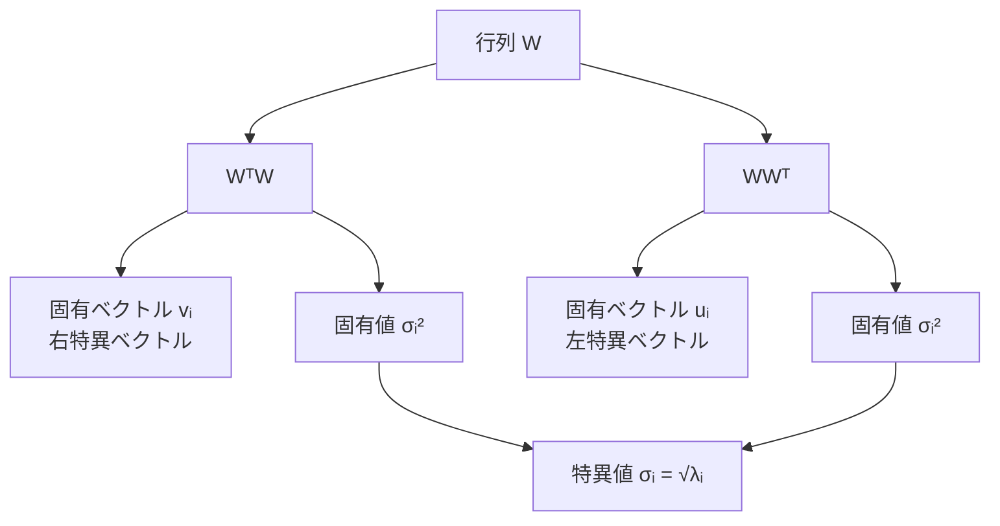
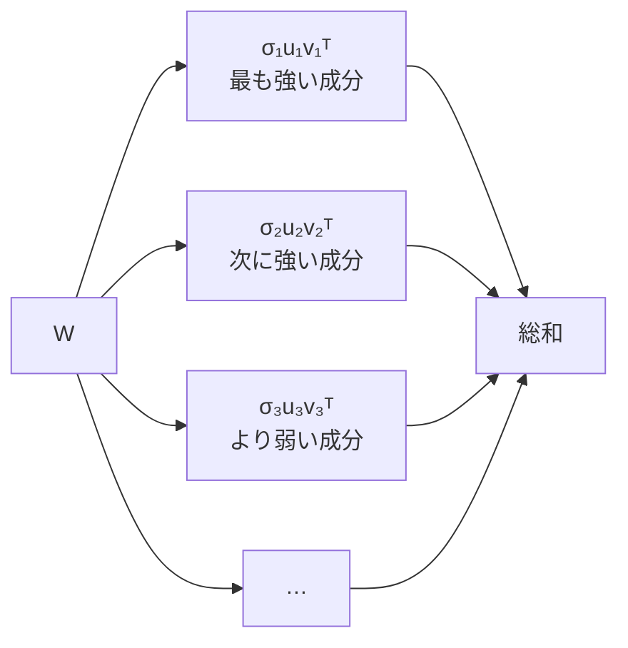
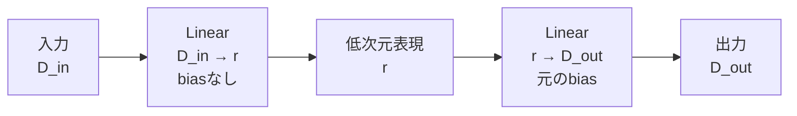

# SVDとは

## サマリー

SVD（Singular Value Decomposition、特異値分解）は、**任意の実行列を、直交する方向ごとの単純な変換へ分解する方法**である。

行列 $W$ が表す線形変換を、次の3段階に分けて理解できる。

1. 入力空間の座標系を変える
2. 各軸を特異値の大きさだけ拡大・縮小する
3. 出力空間の座標系へ移す

数式では、行列 $W$ を次のように分解する。

$$
W = U \Sigma V^{\mathsf{T}}
$$

特異値が大きい方向ほど、行列の作用を強く表す。  
一方、小さい特異値に対応する方向を捨てると、元の行列を少ない情報で近似できる。

この**低ランク近似**が、学習済みニューラルネットワークの重み行列を圧縮する基本原理になる。

---

## 1. SVDが扱う対象

実数成分を持つ行列を考える。

$$
W \in \mathbb{R}^{m \times n}
$$

ここで、

- $n$：入力空間の次元
- $m$：出力空間の次元
- $W$：入力ベクトルを出力ベクトルへ写す線形変換

である。

入力ベクトルを

$$
x \in \mathbb{R}^{n}
$$

とすると、出力は

$$
y = Wx
$$

で与えられる。

このとき、

$$
y \in \mathbb{R}^{m}
$$

となる。

SVDは正方行列だけでなく、$m \neq n$ の長方形行列にも適用できる。  
`nn.Linear` の重みは一般に長方形行列なので、この性質がニューラルネットワーク圧縮で重要になる。

---

## 2. SVDの定義

任意の行列

$$
W \in \mathbb{R}^{m \times n}
$$

は、次の形へ分解できる。

$$
W = U \Sigma V^{\mathsf{T}}
$$

各行列の役割は次のとおりである。

$$
U \in \mathbb{R}^{m \times m}
$$

$$
\Sigma \in \mathbb{R}^{m \times n}
$$

$$
V \in \mathbb{R}^{n \times n}
$$

### $U$：左特異ベクトル

$U$ の列ベクトルを $u_i$ と書く。

$$
U =
\begin{bmatrix}
u_1 & u_2 & \cdots & u_m
\end{bmatrix}
$$

各 $u_i$ は、出力空間における直交方向を表す。

$U$ は直交行列なので、

$$
U^{\mathsf{T}}U = UU^{\mathsf{T}} = I_m
$$

が成り立つ。

### $V$：右特異ベクトル

$V$ の列ベクトルを $v_i$ と書く。

$$
V =
\begin{bmatrix}
v_1 & v_2 & \cdots & v_n
\end{bmatrix}
$$

各 $v_i$ は、入力空間における直交方向を表す。

$V$ も直交行列なので、

$$
V^{\mathsf{T}}V = VV^{\mathsf{T}} = I_n
$$

が成り立つ。

### $\Sigma$：特異値を並べた行列

$\Sigma$ は、対角部分に特異値を持つ。

$$
\Sigma =
\begin{bmatrix}
\sigma_1 & 0 & \cdots & 0 \\
0 & \sigma_2 & \cdots & 0 \\
\vdots & \vdots & \ddots & \vdots \\
0 & 0 & \cdots & \sigma_k
\end{bmatrix}
$$

ここで、

$$
k = \min(m,n)
$$

であり、特異値は通常、大きい順に並べる。

$$
\sigma_1 \geq \sigma_2 \geq \cdots \geq \sigma_k \geq 0
$$

特異値は必ず非負である。

---

## 3. 行列の形状

### 完全SVD

完全SVDでは、各行列の形状は次のようになる。

| 行列 | 形状 |
|---|---:|
| $W$ | $m \times n$ |
| $U$ | $m \times m$ |
| $\Sigma$ | $m \times n$ |
| $V^{\mathsf{T}}$ | $n \times n$ |

したがって、行列積の形状は

$$
(m \times m)(m \times n)(n \times n)
=
m \times n
$$

となり、元の $W$ と一致する。

### Reduced SVD

数値計算やニューラルネットワーク圧縮では、余分な部分を省いたReduced SVDを使うことが多い。

$$
W = U_k \Sigma_k V_k^{\mathsf{T}}
$$

ここで、

$$
k = \min(m,n)
$$

である。

| 行列 | 形状 |
|---|---:|
| $U_k$ | $m \times k$ |
| $\Sigma_k$ | $k \times k$ |
| $V_k^{\mathsf{T}}$ | $k \times n$ |

行列積の形状は

$$
(m \times k)(k \times k)(k \times n)
=
m \times n
$$

となる。

PyTorchの

```python
torch.linalg.svd(W, full_matrices=False)
```

は、このReduced SVDに対応する形状を返す。

---

## 4. 特異値と特異ベクトルの意味

右特異ベクトル $v_i$ に行列 $W$ を作用させると、

$$
Wv_i = \sigma_i u_i
$$

となる。

この式は、次の意味を持つ。

- $v_i$：入力空間における特別な方向
- $u_i$：その方向が移される出力空間の方向
- $\sigma_i$：その方向の拡大率

つまり、入力方向 $v_i$ は、$W$ によって出力方向 $u_i$ へ移され、長さが $\sigma_i$ 倍になる。
その空間を張る、入力方向 $v_i$と出力方向 $u_i$は基底ベクトルになる。


$\sigma_i = 0$ の場合、その入力方向の情報は完全に失われる。

$$
Wv_i = 0
$$

$\sigma_i$ が小さい場合、その方向の情報は出力へ弱くしか伝わらない。

---

## 5. 幾何学的イメージ

SVDによる変換

$$
y = Wx = U\Sigma V^{\mathsf{T}}x
$$

は、右側から順に作用する。

### ASCII図

```text
入力 x
  │
  ▼
Vᵀ：入力を右特異ベクトル基底へ座標変換
  │
  ▼
Σ ：各軸を σ₁, σ₂, ... 倍に拡大・縮小
  │
  ▼
U ：出力を左特異ベクトル基底へ座標変換
  │
  ▼
出力 y
```

### Mermaid図


### 単位円が楕円へ移る

2次元では、単位円上の点を行列 $W$ で変換すると、一般に楕円になる。

```text
入力空間                         出力空間

        y                               y
        ↑                               ↑
     ○○○                            ／￣￣￣＼
   ○     ○                        ／           ＼
  ○   ●   ○       W             |      ●        |
   ○     ○         ───▶          ＼           ／
     ○○○                            ＼＿＿＿／
────────────→ x                 ────────────→ x
```

- 楕円の主軸方向：左特異ベクトル $u_i$
- 主軸の長さ：特異値 $\sigma_i$
- 主軸へ対応する元の入力方向：右特異ベクトル $v_i$

なお、$U$ と $V^{\mathsf{T}}$ は長さを変えない直交変換である。  
長さを実際に拡大・縮小するのは $\Sigma$ である。

---

## 6. なぜ直交変換は長さを保つのか

直交行列 $Q$ に対して、

$$
Q^{\mathsf{T}}Q = I
$$

が成り立つ。

ベクトル $x$ を $Q$ で変換したとき、その長さの二乗は

$$
\lVert Qx \rVert_2^2
=
(Qx)^{\mathsf{T}}(Qx)
$$

である。

これを変形すると、

$$
\lVert Qx \rVert_2^2
=
x^{\mathsf{T}}Q^{\mathsf{T}}Qx
=
x^{\mathsf{T}}x
=
\lVert x \rVert_2^2
$$

となる。

したがって、

$$
\lVert Qx \rVert_2 = \lVert x \rVert_2
$$

であり、直交変換はベクトルの長さを保つ。

このため、SVDにおける $U$ と $V^{\mathsf{T}}$ は、回転や鏡映のような座標変換として理解できる。

---

## 7. 固有値分解との関係

SVDは、対称行列 $W^{\mathsf{T}}W$ と $WW^{\mathsf{T}}$ の固有値分解と関係する。

まず、

$$
Wv_i = \sigma_i u_i
$$

の両辺へ左から $W^{\mathsf{T}}$ を作用させる。

$$
W^{\mathsf{T}}Wv_i
=
\sigma_i W^{\mathsf{T}}u_i
$$

また、
$$
W^{\mathsf{T}}u_i=VΣU^{\mathsf{T}}u_i
$$
$$
W^{\mathsf{T}}u_i = \sigma_i v_i
$$

なので、

$$
W^{\mathsf{T}}Wv_i
=
\sigma_i^2 v_i
$$

となる。

したがって、

- $v_i$ は $W^{\mathsf{T}}W$ の固有ベクトル
- $\sigma_i^2$ は対応する固有値あ

である。

同様に、

$$
WW^{\mathsf{T}}u_i
=
\sigma_i^2 u_i
$$

が成り立つので、

- $u_i$ は $WW^{\mathsf{T}}$ の固有ベクトル
- $\sigma_i^2$ は対応する固有値

である。

### 関係の図



### 固有値分解との違い

| 項目 | 固有値分解 | SVD |
|---|---|---|
| 対象 | 主に正方行列 | 任意の長方形行列 |
| 分解 | $A=P\Lambda P^{-1}$ など | $W=U\Sigma V^{\mathsf{T}}$ |
| 値 | 固有値は負や複素数の場合がある | 特異値は常に非負 |
| ベクトル | 行列自身の固有ベクトル | 入力側と出力側の2種類 |
| NN圧縮 | 一般には直接使いにくい | 重み行列へ直接適用できる |

SVDを実際に求める数値計算では、単純に $W^{\mathsf{T}}W$ を作って固有値分解するとは限らない。  
$W^{\mathsf{T}}W$ を明示的に作ると数値誤差が悪化することがあるため、通常はライブラリのSVD関数を使う。

---

## 8. ランクと特異値

行列のランクは、線形独立な列または行の最大数である。

SVDでは、ランクはゼロでない特異値の個数に等しい。

$$
\operatorname{rank}(W)
=
\#\left\{i \mid \sigma_i > 0\right\}
$$

たとえば、特異値が

$$
\sigma_1 = 8,\quad
\sigma_2 = 3,\quad
\sigma_3 = 0,\quad
\sigma_4 = 0
$$

なら、

$$
\operatorname{rank}(W)=2
$$

である。

実際の浮動小数点計算では、特異値が厳密にゼロにならないことがある。  
そのため、数値ランクを求める際には許容誤差を使う。

$$
\operatorname{rank}_{\mathrm{num}}(W)
=
\#\left\{i \mid \sigma_i > \varepsilon\right\}
$$

ここで $\varepsilon$ は、行列の大きさやデータ型に応じて決める。

---

## 9. ランク1行列の和として見る

SVDは、行列をランク1行列の和としても表せる。

$$
W
=
\sum_{i=1}^{k}
\sigma_i u_i v_i^{\mathsf{T}}
$$

各項

$$
\sigma_i u_i v_i^{\mathsf{T}}
$$

はランク1以下の行列である。

したがって、SVDは元の行列を

- 最も重要なランク1成分
- 次に重要なランク1成分
- さらに小さいランク1成分

へ順番に分解したものと解釈できる。

### Mermaid図



---

## 10. 低ランク近似

特異値を大きい順に並べ、上位 $r$ 個だけを残す。

$$
W_r
=
\sum_{i=1}^{r}
\sigma_i u_i v_i^{\mathsf{T}}
$$

行列形式では、

$$
W_r
=
U_r \Sigma_r V_r^{\mathsf{T}}
$$

である。

各行列の形状は次のとおりである。

$$
U_r \in \mathbb{R}^{m \times r}
$$

$$
\Sigma_r \in \mathbb{R}^{r \times r}
$$

$$
V_r^{\mathsf{T}} \in \mathbb{R}^{r \times n}
$$

したがって、

$$
(m \times r)(r \times r)(r \times n)
=
m \times n
$$

となる。

ただし、$W_r$ のランクは高々 $r$ である。

### 近似の流れ


---

## 11. Eckart–Young–Mirskyの定理

ランクが $r$ 以下の任意の行列を $B$ とする。

$$
\operatorname{rank}(B) \leq r
$$

このとき、SVDの上位 $r$ 成分から作った $W_r$ は、フロベニウスノルムにおいて最良の近似になる。

$$
W_r
=
\underset{\operatorname{rank}(B)\leq r}{\operatorname{argmin}}
\;
\lVert W-B\rVert_F
$$

さらに、スペクトルノルムにおいても最良の近似になる。

$$
W_r
=
\underset{\operatorname{rank}(B)\leq r}{\operatorname{argmin}}
\;
\lVert W-B\rVert_2
$$

この定理の重要な点は、単に「SVDで近似できる」というだけではない。

> 同じランク $r$ という制約のもとでは、切り詰めSVDより行列誤差を小さくできる別の行列は存在しない。

ただし、この最適性は**重み行列そのものの近似誤差**に対するものである。  
ニューラルネットワーク全体の分類精度が最適になることまでは保証しない。

---

## 12. フロベニウスノルムと近似誤差

行列 $A$ のフロベニウスノルムは、全要素の二乗和の平方根である。

$$
\lVert A\rVert_F
=
\sqrt{
\sum_{i=1}^{m}
\sum_{j=1}^{n}
|a_{ij}|^2
}
$$

SVDを使うと、

$$
\lVert W\rVert_F^2
=
\sum_{i=1}^{k}
\sigma_i^2
$$

となる。

ランク $r$ 近似の誤差は、

$$
\lVert W-W_r\rVert_F^2
=
\sum_{i=r+1}^{k}
\sigma_i^2
$$

で与えられる。

つまり、**捨てた特異値の二乗和が、そのまま行列近似誤差の二乗になる。**

### スペクトルノルムでの誤差

スペクトルノルムでは、

$$
\lVert W-W_r\rVert_2
=
\sigma_{r+1}
$$

となる。

これは、捨てた中で最も大きい特異値が、最悪方向の誤差を決めることを意味する。

---

## 13. 特異値エネルギー

上位 $r$ 個の特異値が全体のどれだけを保持しているかを、次の比率で評価できる。

$$
E(r)
=
\frac{
\sum_{i=1}^{r}\sigma_i^2
}{
\sum_{i=1}^{k}\sigma_i^2
}
$$

たとえば、

$$
E(r) \geq 0.99
$$

を満たす最小の $r$ を選べば、フロベニウスノルムの二乗に対して99%以上を保持する。

しかし、

$$
E(r)=0.99
$$

であっても、分類精度を99%保持できるとは限らない。

理由は、ニューラルネットワークの精度が

- 入力データの分布
- 後続層
- 活性化関数
- 分類境界
- 小さいが重要な重み成分

にも依存するためである。

したがって、エネルギー保持率はランク選択の目安にはなるが、最終判断にはモデル評価が必要である。

---

## 14. 数値例

次の特異値を考える。

$$
\sigma_1=10,\quad
\sigma_2=4,\quad
\sigma_3=1,\quad
\sigma_4=0.5
$$

全エネルギーは、

$$
10^2+4^2+1^2+0.5^2
=
117.25
$$

である。

ランク2近似の保持率は、

$$
E(2)
=
\frac{10^2+4^2}{117.25}
=
\frac{116}{117.25}
\approx 0.9893
$$

となる。

つまり、上位2成分だけで約98.93%のエネルギーを保持する。

一方、フロベニウスノルムによる二乗誤差は、

$$
\lVert W-W_2\rVert_F^2
=
1^2+0.5^2
=
1.25
$$

である。

誤差そのものは、

$$
\lVert W-W_2\rVert_F
=
\sqrt{1.25}
\approx 1.118
$$

となる。

---

## 15. NumPyによるSVD

```python
import numpy as np

rng = np.random.default_rng(seed=0)
W = rng.standard_normal((5, 3))

U, S, Vh = np.linalg.svd(
    W,
    full_matrices=False,
)

print("W :", W.shape)   # (5, 3)
print("U :", U.shape)   # (5, 3)
print("S :", S.shape)   # (3,)
print("Vh:", Vh.shape)  # (3, 3)

Sigma = np.diag(S)
W_restored = U @ Sigma @ Vh

print(
    np.allclose(
        W,
        W_restored,
        rtol=1e-10,
        atol=1e-10,
    )
)
```

NumPyでは、$V^{\mathsf{T}}$ が `Vh` として返る。

`S` は対角行列ではなく、特異値を並べた1次元配列である。  
元の行列を復元するときは、`np.diag(S)` で対角行列へ変換する。

---

## 16. PyTorchによるSVD

```python
import torch

torch.manual_seed(0)
W = torch.randn(5, 3, dtype=torch.float64)

U, S, Vh = torch.linalg.svd(
    W,
    full_matrices=False,
)

print("W :", tuple(W.shape))   # (5, 3)
print("U :", tuple(U.shape))   # (5, 3)
print("S :", tuple(S.shape))   # (3,)
print("Vh:", tuple(Vh.shape))  # (3, 3)

W_restored = U @ torch.diag(S) @ Vh

is_restored = torch.allclose(
    W,
    W_restored,
    rtol=1e-10,
    atol=1e-10,
)

print(is_restored)
```

### ランク $r$ 近似

```python
import torch


def truncated_svd(
    weight: torch.Tensor,
    rank: int,
) -> torch.Tensor:
    # 行列を切り詰めSVDでランクrankへ近似する。
    if weight.ndim != 2:
        raise ValueError("weight must be a 2D tensor.")

    max_rank = min(weight.shape)

    if not 1 <= rank <= max_rank:
        raise ValueError(
            f"rank must satisfy 1 <= rank <= {max_rank}."
        )

    U, S, Vh = torch.linalg.svd(
        weight,
        full_matrices=False,
    )

    U_r = U[:, :rank]
    S_r = S[:rank]
    Vh_r = Vh[:rank, :]

    return (U_r * S_r) @ Vh_r


torch.manual_seed(0)
W = torch.randn(8, 5)

W_rank_2 = truncated_svd(
    weight=W,
    rank=2,
)

error = torch.linalg.matrix_norm(
    W - W_rank_2,
    ord="fro",
)

print(W_rank_2.shape)
print(error.item())
```

`U_r * S_r` では、PyTorchのブロードキャストによって $U_r$ の各列へ対応する特異値が掛けられる。

数式では、

$$
U_r \Sigma_r
$$

に相当する。

---

## 17. 特異値を可視化する

特異値の減衰が速いほど、少数の成分で行列を近似しやすい。

```python
import matplotlib.pyplot as plt
import torch

torch.manual_seed(0)
W = torch.randn(100, 60)

_, S, _ = torch.linalg.svd(
    W,
    full_matrices=False,
)

singular_values = S.detach().cpu().numpy()

plt.figure()
plt.plot(
    range(1, len(singular_values) + 1),
    singular_values,
    marker="o",
)
plt.xlabel("Singular value index")
plt.ylabel("Singular value")
plt.title("Singular Value Spectrum")
plt.grid(True)
plt.show()
```

特異値スペクトルを見ると、

- どの程度まで特異値が急減しているか
- どのランク付近から寄与が小さくなるか
- 低ランク近似が有効そうか

を視覚的に確認できる。

ただし、特異値がなだらかに減少する行列では、強い圧縮による誤差が大きくなりやすい。

---

## 18. SVDとニューラルネットワーク圧縮の接点

`nn.Linear` の重みを

$$
W \in \mathbb{R}^{D_{\mathrm{out}} \times D_{\mathrm{in}}}
$$

とする。

この重みをランク $r$ で近似すると、

$$
W
\approx
W_r
=
U_r\Sigma_rV_r^{\mathsf{T}}
$$

となる。

さらに、

$$
A = \Sigma_rV_r^{\mathsf{T}}
$$

$$
B = U_r
$$

と置けば、

$$
W_r = BA
$$

となる。

したがって、元の線形変換

$$
y = Wx+b
$$

を、

$$
h = Ax
$$

$$
y = Bh+b
$$

という2段階の線形変換で近似できる。

ここで中間次元は $r$ である。



この2層化の詳しい意味、biasの扱い、間にReLUを入れない理由は、[[00_基礎理論/03_モデル圧縮理論/04_Linear層を2層へ置き換える]] で扱う。

---

## 19. よくある誤解

### SVDは正方行列にしか使えない

誤りである。

SVDは長方形行列にも適用できる。  
これは `nn.Linear` の重み行列へ使う上で重要な性質である。

### 特異値は固有値と同じである

同じではない。

特異値は常に非負であり、長方形行列にも定義される。

$$
\sigma_i = \sqrt{\lambda_i}
$$

ここで $\lambda_i$ は、$W^{\mathsf{T}}W$ または $WW^{\mathsf{T}}$ の固有値である。

### 小さい特異値は必ず不要である

必ずしも不要とは限らない。

行列全体への寄与が小さくても、分類境界にとって重要な方向を含む可能性がある。  
そのため、圧縮後は必ずモデル精度を評価する。

### 特異値の単純和を99%残せばよい

一般的なエネルギー保持率では、特異値の二乗和を使う。

$$
\sum_i \sigma_i^2
$$

これはフロベニウスノルムの二乗に対応するためである。

### `torch.linalg.svd` の `Vh` は $V$ である

誤りである。

`Vh` は

$$
V^{\mathsf{T}}
$$

に対応する。複素行列の場合は共役転置 $V^{\mathsf{H}}$ に対応する。

### SVDでランクを下げれば必ず推論が速くなる

必ずしも速くならない。

理論上の積和演算数やパラメータ数が減っても、

- 行列が小さすぎる
- GPUの並列性を活かしにくい
- Linear層が1層から2層へ増える
- メモリアクセスやカーネル起動の負担が増える

といった理由で、実測時間が改善しないことがある。

速度は実機で測定する必要がある。

---

## 20. 研究・面接で説明するなら

### 30秒程度の説明

> SVDは、任意の行列を入力側の直交基底、方向ごとの拡大率、出力側の直交基底へ分解する方法です。特異値は各方向の重要度を表し、小さい特異値を切り捨てると、フロベニウスノルムの意味で最適な低ランク近似が得られます。ニューラルネットワークでは、Linear層の重みを低ランク化し、2つの小さなLinear層へ置き換えることでパラメータ数を削減できます。

### 研究でどう使うか

最初の実験では、学習済みLinear層について次を調べる。

1. 特異値スペクトル
2. ランクごとのエネルギー保持率
3. 重み行列の近似誤差
4. 層出力の誤差
5. モデル全体の精度
6. パラメータ削減率
7. 推論時間

SVDの行列近似誤差が小さくても、モデル精度低下が小さいとは限らない。  
この差を実験で確認することが、NN圧縮の最初の重要な考察になる。

### 論文ではどう扱われるか

SVDによる低ランク近似は、ニューラルネットワーク圧縮における基本的なベースラインとして扱われることが多い。

より複雑な分解法やテンソルネットワーク型圧縮を検討する場合でも、まず単純なSVDと比較することで、

- 追加手法が本当に必要か
- 精度と圧縮率がどれだけ改善したか
- 実装の複雑さに見合う効果があるか

を判断しやすくなる。

---

## 21. このノートで押さえるポイント

- SVDは任意の行列を $U\Sigma V^{\mathsf{T}}$ へ分解する。
- $v_i$ は入力側の方向、$u_i$ は出力側の方向、$\sigma_i$ は拡大率を表す。
- 特異値の二乗は $W^{\mathsf{T}}W$ または $WW^{\mathsf{T}}$ の固有値に対応する。
- 行列のランクは、ゼロでない特異値の個数に等しい。
- 上位 $r$ 個を残した $W_r$ は、ランク $r$ 以下で最良の行列近似になる。
- 捨てた特異値の二乗和が、フロベニウスノルムによる近似誤差の二乗になる。
- エネルギー保持率とニューラルネットワークの精度保持率は同じではない。
- NN圧縮では、低ランク近似した重みを2つの小さなLinear層へ分解する。

---

## 22. 次に読むノート

次は、SVDを適用する対象であるPyTorchのLinear層を整理する。

- [[00_基礎理論/02_ニューラルネットワーク基礎/02_nn.Linearとは]]
- [[00_基礎理論/01_数学基礎/01_線形代数/03_SVDによる低ランク近似]]
- [[00_基礎理論/03_モデル圧縮理論/04_Linear層を2層へ置き換える]]
- [[00_基礎理論/01_数学基礎/01_線形代数/06_誤差評価]]
- [[50_DMRG/01_SVDからDMRGへのつながり]]
