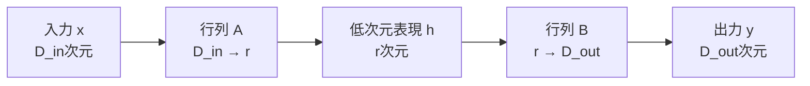
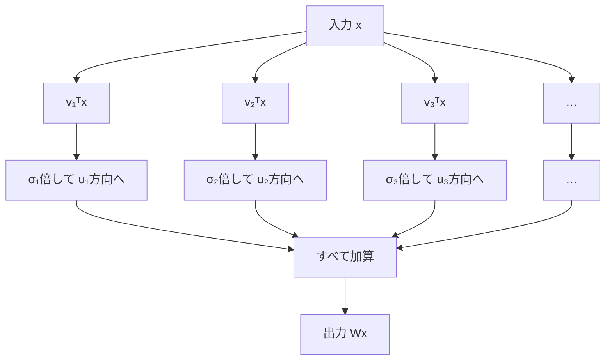
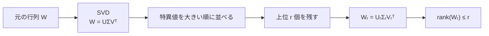
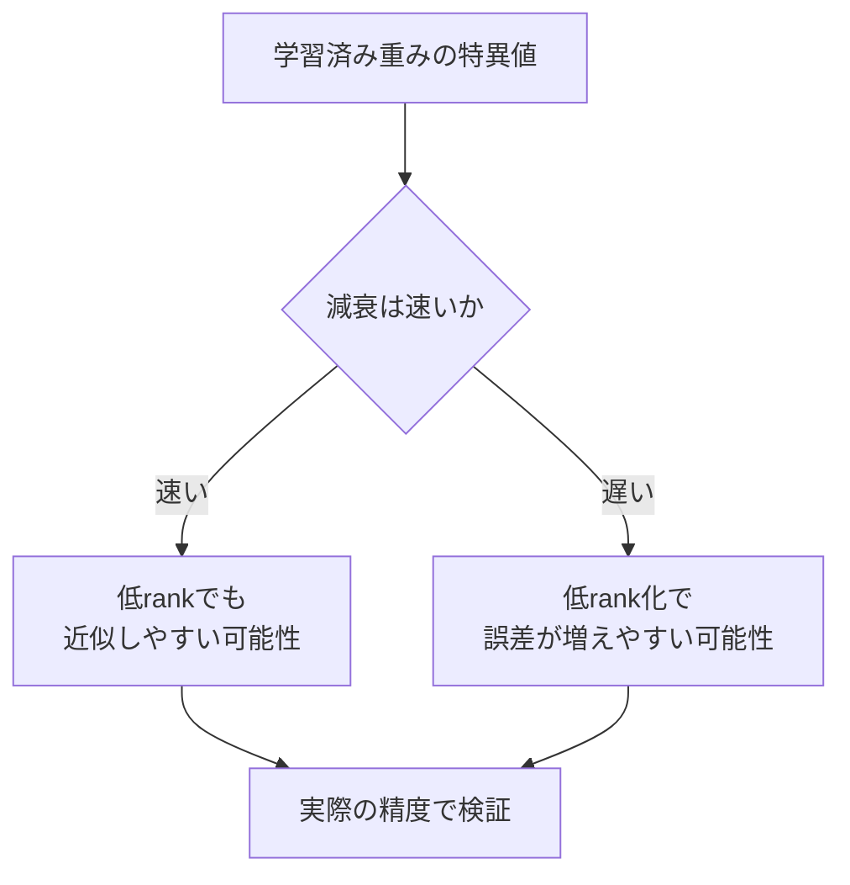
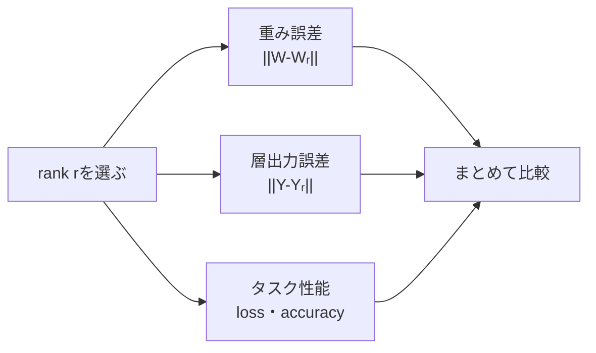
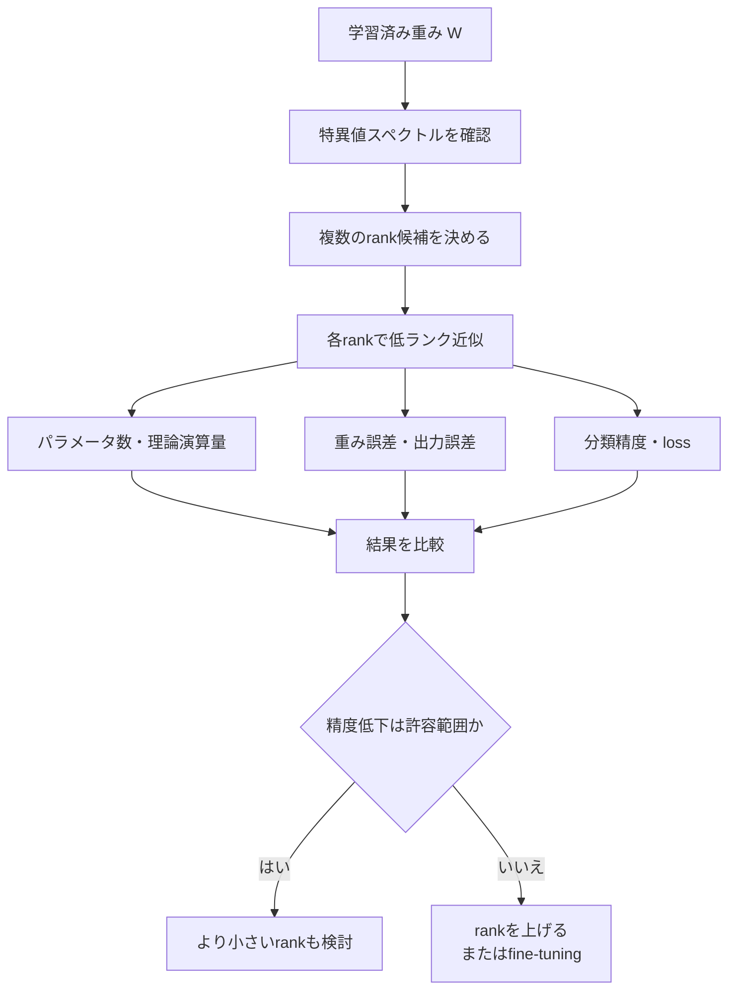
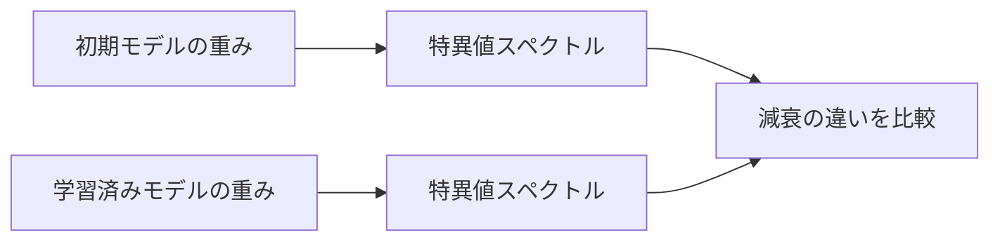

# SVDによる低ランク近似

## サマリー

SVDによる低ランク近似とは、行列の特異値を大きい順に並べ、上位 $r$ 個に対応する成分だけを残して、元の行列をランク $r$ 以下の行列で近似する方法である。

元の重み行列を

$$
W
\in
\mathbb{R}^{D_{\mathrm{out}} \times D_{\mathrm{in}}}
$$

とする。

SVDによって、

$$
W
=
U\Sigma V^{\mathsf{T}}
$$

と分解できる。

上位 $r$ 個の特異値と特異ベクトルだけを残すと、

$$
W_r
=
U_r\Sigma_rV_r^{\mathsf{T}}
$$

という低ランク近似を得る。

ここで、

$$
\operatorname{rank}(W_r)
\leq r
$$

である。

SVD圧縮では、元の重み行列 $W$ を直接保存する代わりに、より小さい2つの行列へ分けて保存する。

$$
A
=
\Sigma_rV_r^{\mathsf{T}}
$$

$$
B
=
U_r
$$

と置けば、

$$
W_r=BA
$$

となる。

そのため、元のLinear層

$$
y=Wx+b
$$

を、

$$
h=Ax
$$

$$
y=Bh+b
$$

という2段階のLinear層で近似できる。

この章では、次の点を整理する。

- 低ランクとは何か
- 切り詰めSVDの作り方
- なぜ上位特異値を残すのか
- 近似誤差をどう測るか
- 重み誤差と出力誤差の違い
- rankをどう選ぶか
- どの条件で本当に圧縮になるか
- 学習済み重みで何を観察するか

---

## 1. 低ランクとは何か

行列のランクは、その行列が持つ独立な方向の数を表す。

行列

$$
W
\in
\mathbb{R}^{m \times n}
$$

のランクは、

$$
\operatorname{rank}(W)
\leq
\min(m,n)
$$

を満たす。

### フルランク

最大可能ランクを持つ行列をフルランクと呼ぶ。

$$
\operatorname{rank}(W)
=
\min(m,n)
$$

### 低ランク

最大可能ランクより小さいランクを持つ行列を低ランク行列と呼ぶ。

$$
\operatorname{rank}(W)
<
\min(m,n)
$$

たとえば、

$$
W
\in
\mathbb{R}^{512 \times 784}
$$

なら、最大ランクは

$$
\min(512,784)=512
$$

である。

この行列をrank 64で近似すれば、

$$
\operatorname{rank}(W_{64})
\leq64
$$

となる。

元の入出力次元は変えずに、内部で使う独立な方向の数だけを512以下から64以下へ制限している。

---

## 2. ランクが小さい行列は2つの小さい行列へ分けられる

ランク $r$ 以下の行列は、

$$
W_r=BA
$$

と表せる。

ここで、

$$
A
\in
\mathbb{R}^{r \times D_{\mathrm{in}}}
$$

$$
B
\in
\mathbb{R}^{D_{\mathrm{out}} \times r}
$$

である。

行列積の形状は、

$$
(D_{\mathrm{out}} \times r)
(r \times D_{\mathrm{in}})
=
D_{\mathrm{out}} \times D_{\mathrm{in}}
$$

となる。

### 処理の意味

入力 $x$ は、まず $A$ によって $r$ 次元へ変換される。

$$
h=Ax
$$

次に、$B$ によって出力空間へ変換される。

$$
y=Bh
$$

したがって、

$$
y=BAx=W_rx
$$

である。

### ASCII図

```text
入力 x
D_in 次元
   │
   ▼
A：D_in → r
   │
   ▼
中間表現 h
r 次元
   │
   ▼
B：r → D_out
   │
   ▼
出力 y
D_out 次元
```

### Mermaid図



中間次元 $r$ が小さいほど、保存するパラメータ数と理論上の演算量を減らしやすい。

---

## 3. SVDをランク1行列の和として見る

行列 $W$ のReduced SVDを、

$$
W
=
U\Sigma V^{\mathsf{T}}
$$

とする。

特異値を

$$
\sigma_1
\geq
\sigma_2
\geq
\cdots
\geq
\sigma_k
\geq0
$$

と並べる。

ここで、

$$
k=\min(m,n)
$$

である。

SVDは、次のランク1行列の和として書ける。

$$
W
=
\sum_{i=1}^{k}
\sigma_i u_i v_i^{\mathsf{T}}
$$

各項

$$
\sigma_i u_i v_i^{\mathsf{T}}
$$

は、1つの入力方向 $v_i$ を1つの出力方向 $u_i$ へ写す成分である。

### 各項の作用

任意の入力 $x$ に対して、

$$
Wx
=
\sum_{i=1}^{k}
\sigma_i u_i
\left(
v_i^{\mathsf{T}}x
\right)
$$

となる。

ここで、

$$
v_i^{\mathsf{T}}x
$$

は、入力 $x$ が右特異ベクトル $v_i$ 方向にどれだけ成分を持つかを表す。

その成分を $\sigma_i$ 倍し、出力方向 $u_i$ へ送っている。

### Mermaid図



---

## 4. 切り詰めSVD

上位 $r$ 個の特異値に対応する成分だけを残す。

$$
W_r
=
\sum_{i=1}^{r}
\sigma_i u_i v_i^{\mathsf{T}}
$$

これがrank $r$ の切り詰めSVDである。

行列形式では、

$$
W_r
=
U_r\Sigma_rV_r^{\mathsf{T}}
$$

と書く。

各行列の形状は次のとおりである。

$$
U_r
\in
\mathbb{R}^{m \times r}
$$

$$
\Sigma_r
\in
\mathbb{R}^{r \times r}
$$

$$
V_r^{\mathsf{T}}
\in
\mathbb{R}^{r \times n}
$$

したがって、

$$
(m \times r)
(r \times r)
(r \times n)
=
m \times n
$$

となる。

### 元のSVDから切り出す部分

```text
U = [u₁ u₂ ... uᵣ | uᵣ₊₁ ...]
         残す        捨てる

Σ = diag(σ₁, σ₂, ..., σᵣ | σᵣ₊₁, ...)
                残す       捨てる

V = [v₁ v₂ ... vᵣ | vᵣ₊₁ ...]
         残す        捨てる
```

### Mermaid図



---

## 5. なぜ大きい特異値を残すのか

特異値 $\sigma_i$ は、対応する方向の拡大率を表す。

$$
Wv_i=\sigma_i u_i
$$

$\sigma_i$ が大きい方向は、入力成分を強く出力へ伝える。

$\sigma_i$ が小さい方向は、入力成分を弱くしか出力へ伝えない。

そのため、大きい特異値に対応する方向から残すことで、元の線形変換の主要な作用を保持しやすい。

### 重要な注意

「小さい特異値だから、その方向は必ず不要」という意味ではない。

小さい特異値に対応する方向でも、

- 分類境界の微妙な調整
- 特定クラスの識別
- まれな入力パターン
- 後続層との組み合わせ

に重要な可能性がある。

SVDが保証するのは、行列近似誤差に対する最適性である。  
ニューラルネットワークの分類精度に対する最適性ではない。

---

## 6. Eckart–Young–Mirskyの定理

ランクが $r$ 以下の行列全体から、元の行列 $W$ に最も近い行列を探す。

$$
\operatorname{rank}(B)\leq r
$$

という制約の下で、

$$
\lVert W-B\rVert_F
$$

を最小にする行列は、切り詰めSVDによる $W_r$ である。

$$
W_r
=
\underset{
\operatorname{rank}(B)\leq r
}{
\operatorname{argmin}
}
\;
\lVert W-B\rVert_F
$$

スペクトルノルムについても同様に、

$$
W_r
=
\underset{
\operatorname{rank}(B)\leq r
}{
\operatorname{argmin}
}
\;
\lVert W-B\rVert_2
$$

となる。

### この定理が意味すること

同じrank $r$ という制約の下では、切り詰めSVDよりも重み行列を小さい誤差で近似する別の行列は存在しない。

ただし、最適化している対象は、

$$
\lVert W-B\rVert
$$

である。

ニューラルネットワークで本当に知りたい、

- 層出力の誤差
- 損失関数の増加
- 分類精度の低下

を直接最小化しているわけではない。

---

## 7. フロベニウスノルムによる誤差

行列 $A$ のフロベニウスノルムは、

$$
\lVert A\rVert_F
=
\sqrt{
\sum_i
\sum_j
|a_{ij}|^2
}
$$

である。

SVDでは、

$$
\lVert W\rVert_F^2
=
\sum_{i=1}^{k}
\sigma_i^2
$$

が成り立つ。

rank $r$ 近似の誤差は、

$$
\lVert W-W_r\rVert_F^2
=
\sum_{i=r+1}^{k}
\sigma_i^2
$$

である。

したがって、

> 捨てた特異値の二乗和が、重み行列の近似誤差の二乗になる。

### 相対誤差

行列の大きさに対する相対的な誤差は、

$$
\varepsilon_F(r)
=
\frac{
\lVert W-W_r\rVert_F
}{
\lVert W\rVert_F
}
$$

で評価できる。

特異値を使えば、

$$
\varepsilon_F(r)
=
\sqrt{
\frac{
\sum_{i=r+1}^{k}\sigma_i^2
}{
\sum_{i=1}^{k}\sigma_i^2
}
}
$$

となる。

---

## 8. スペクトルノルムによる誤差

行列 $A$ のスペクトルノルムは、

$$
\lVert A\rVert_2
=
\max_{\lVert x\rVert_2=1}
\lVert Ax\rVert_2
$$

である。

切り詰めSVDでは、

$$
\lVert W-W_r\rVert_2
=
\sigma_{r+1}
$$

となる。

つまり、捨てた特異値の中で最大のものが、単位長さの入力に対する最悪方向の誤差を決める。

任意の入力 $x$ に対して、

$$
\lVert
(W-W_r)x
\rVert_2
\leq
\lVert W-W_r\rVert_2
\lVert x\rVert_2
$$

なので、

$$
\lVert
(W-W_r)x
\rVert_2
\leq
\sigma_{r+1}
\lVert x\rVert_2
$$

が成り立つ。

この式は、重み行列のスペクトル誤差から、層出力誤差の上限を評価できることを示す。

---

## 9. 特異値エネルギーと保持率

上位 $r$ 個の特異値が、行列全体のフロベニウスノルムの二乗をどれだけ保持しているかを、

$$
E(r)
=
\frac{
\sum_{i=1}^{r}
\sigma_i^2
}{
\sum_{i=1}^{k}
\sigma_i^2
}
$$

で表す。

これを特異値エネルギー保持率と呼ぶことがある。

### 誤差との関係

相対二乗誤差は、

$$
\frac{
\lVert W-W_r\rVert_F^2
}{
\lVert W\rVert_F^2
}
=
1-E(r)
$$

である。

相対フロベニウス誤差は、

$$
\varepsilon_F(r)
=
\sqrt{1-E(r)}
$$

となる。

たとえば、

$$
E(r)=0.99
$$

なら、

$$
\varepsilon_F(r)
=
\sqrt{0.01}
=
0.1
$$

である。

つまり、エネルギー99%保持は、相対フロベニウス誤差10%に対応する。

### よくある勘違い

エネルギー保持率99%は、

- 重みの各要素を99%正確に再現する
- 出力を99%正確に再現する
- 分類精度を99%保持する

という意味ではない。

---

## 10. 数値例

特異値が次のように並んでいるとする。

$$
\sigma_1=10
$$

$$
\sigma_2=4
$$

$$
\sigma_3=1
$$

$$
\sigma_4=0.5
$$

全エネルギーは、

$$
10^2+4^2+1^2+0.5^2
=
117.25
$$

である。

rank 2近似では、

$$
E(2)
=
\frac{
10^2+4^2
}{
117.25
}
\approx
0.9893
$$

となる。

約98.93%のエネルギーを保持している。

捨てた特異値による二乗誤差は、

$$
\lVert W-W_2\rVert_F^2
=
1^2+0.5^2
=
1.25
$$

である。

フロベニウス誤差は、

$$
\lVert W-W_2\rVert_F
=
\sqrt{1.25}
\approx1.118
$$

である。

スペクトルノルム誤差は、

$$
\lVert W-W_2\rVert_2
=
\sigma_3
=
1
$$

である。

---

## 11. 特異値スペクトル

特異値をインデックス順に並べたものを、特異値スペクトルとして可視化する。

```text
特異値
  │
  │ ●
  │  ●
  │   ●
  │    ●
  │      ●
  │         ● ● ● ●
  └────────────────→ インデックス
          ↑
       rank候補
```

特異値が急速に小さくなる場合、少ないrankで主要成分を保持しやすい。

特異値がなだらかに減少する場合、強い低ランク化による誤差が大きくなりやすい。

### Mermaid図



特異値スペクトルだけで圧縮可能性を断定せず、必ず出力誤差とモデル精度を確認する。

---

## 12. 厳密な低ランクと近似的な低ランク

### 厳密な低ランク

ある点以降の特異値が厳密に0なら、

$$
\sigma_{r+1}
=
\sigma_{r+2}
=
\cdots
=
0
$$

である。

この場合、

$$
W=W_r
$$

なので、rank $r$ で情報損失なく表現できる。

### 近似的な低ランク

実際の学習済み重みでは、特異値が厳密に0でなくても、後半が非常に小さいことがある。

$$
\sigma_1
\geq
\cdots
\geq
\sigma_r
\gg
\sigma_{r+1}
\geq
\cdots
$$

この場合、行列は数学的にはフルランクでも、実用上は低ランク近似できる可能性がある。

したがって、

> フルランクだから圧縮できない

とは限らない。

---

## 13. 重み誤差と出力誤差は異なる

SVDが最小化するのは、

$$
\lVert W-W_r\rVert_F
$$

である。

しかし、Linear層へ入力 $x$ を与えたときの出力誤差は、

$$
e(x)
=
(W-W_r)x
$$

である。

その大きさは、

$$
\lVert e(x)\rVert_2
=
\lVert
(W-W_r)x
\rVert_2
$$

となる。

入力 $x$ が、捨てた右特異ベクトル方向をほとんど含まない場合、重み誤差があっても出力誤差は小さくなる。

一方、入力が捨てた方向へ強く分布していれば、出力誤差が大きくなる可能性がある。

### SVD基底で見る

入力を右特異ベクトルで展開する。

$$
x
=
\sum_{i=1}^{k}
\alpha_i v_i
+
x_{\perp}
$$

ここで、

$$
\alpha_i=v_i^{\mathsf{T}}x
$$

である。

元の出力は、

$$
Wx
=
\sum_{i=1}^{k}
\sigma_i\alpha_i u_i
$$

rank $r$ 近似の出力は、

$$
W_rx
=
\sum_{i=1}^{r}
\sigma_i\alpha_i u_i
$$

したがって、出力誤差は、

$$
(W-W_r)x
=
\sum_{i=r+1}^{k}
\sigma_i\alpha_i u_i
$$

となる。

誤差は特異値だけでなく、入力が各方向に持つ成分 $\alpha_i$ にも依存する。

---

## 14. バッチ入力に対する出力誤差

PyTorchのバッチ入力を、

$$
X
\in
\mathbb{R}^{N \times D_{\mathrm{in}}}
$$

とする。

元の出力は、

$$
Y=XW^{\mathsf{T}}+b
$$

近似後の出力は、

$$
Y_r=XW_r^{\mathsf{T}}+b
$$

である。

biasを同じまま使う場合、差は、

$$
Y-Y_r
=
X
\left(
W-W_r
\right)^{\mathsf{T}}
$$

となる。

バッチ出力誤差は、たとえば、

$$
\lVert Y-Y_r\rVert_F
$$

で評価できる。

さらに、1要素当たりのMSEは、

$$
\operatorname{MSE}
=
\frac{1}{
ND_{\mathrm{out}}
}
\lVert Y-Y_r\rVert_F^2
$$

となる。

RMSEは、

$$
\operatorname{RMSE}
=
\sqrt{
\operatorname{MSE}
}
$$

である。

MSEとRMSEの詳細は [[00_基礎理論/01_数学基礎/01_線形代数/06_誤差評価]] で扱う。

---

## 15. 入力分布を考慮した誤差

同じ重み近似 $W_r$ でも、入力データの分布によって実際の出力誤差は変わる。

入力の二次モーメントを、

$$
C_x
=
\mathbb{E}
\left[
xx^{\mathsf{T}}
\right]
$$

とする。

biasを無視した期待二乗出力誤差は、

$$
\mathbb{E}
\left[
\lVert
(W-W_r)x
\rVert_2^2
\right]
$$

である。

これは、

$$
\operatorname{tr}
\left[
(W-W_r)
C_x
(W-W_r)^{\mathsf{T}}
\right]
$$

と書ける。

通常のSVDは $C_x$ を直接使わず、重み行列だけを近似する。

そのため、通常の切り詰めSVDは、

- 重み行列の近似として最適
- 実データ分布に対する出力誤差として常に最適とは限らない

という性質を持つ。

現在のMNIST実験では、まず通常のSVDを基準線として使い、実データによる出力誤差と分類精度を測定する。

---

## 16. 重み誤差、出力誤差、タスク誤差

SVD圧縮では、少なくとも3種類の誤差を区別する。

### 1. 重み誤差

$$
\lVert W-W_r\rVert_F
$$

重み行列そのものがどれだけ変化したかを表す。

### 2. 層出力誤差

$$
\lVert
Wx-W_rx
\rVert_2
$$

またはバッチに対する、

$$
\lVert
Y-Y_r
\rVert_F
$$

を測る。

### 3. タスク誤差

MNISTなら、

- 損失関数
- 分類精度
- 誤分類数
- クラスごとの精度

などで評価する。

### Mermaid図



重み誤差が小さくても、タスク性能低下が小さいとは限らない。  
逆に、重み誤差がある程度大きくても、分類精度がほとんど低下しない場合もある。

---

## 17. NNへSVDを適用する意味

ニューラルネットワークへSVDを適用するとは、通常、学習済みLinear層の重み行列を分解し、主要な変換方向だけを残すことを意味する。

$$
W
=
U\Sigma V^{\mathsf{T}}
$$

### 右特異ベクトル

$V$ の列 $v_i$ は、入力特徴空間の方向である。

### 特異値

$\sigma_i$ は、その入力方向が層を通してどれほど強く伝わるかを表す。

$$
Wv_i=\sigma_i u_i
$$

### 左特異ベクトル

$U$ の列 $u_i$ は、対応する出力特徴空間の方向である。

SVDによって、Linear層が学習した写像を、互いに直交する変換モードへ分けて観察できる。

### 幾何学的な流れ

```text
入力 x
  │
  ▼
Vᵀ
入力を右特異ベクトル基底へ変換
  │
  ▼
Σ
各方向を特異値に応じて拡大・縮小
  │
  ▼
U
出力空間の方向へ変換
  │
  ▼
出力 Wx
```

---

## 18. 物理におけるSVDとの違い

SVDという数学操作は共通でも、分解する対象によって意味が異なる。

| 対象 | 分解するもの | 得られるもの | 主な意味 |
|---|---|---|---|
| NN | 重み行列 $W$ | 特異値・左右特異ベクトル | 線形変換モード |
| DMRG | 波動関数係数行列など | シュミット係数・基底 | 部分系間の相関 |
| 固有値問題 | ハミルトニアン $H$ など | 固有値・固有ベクトル | エネルギー・固有状態 |

ニューラルネットワークの重み行列は、通常ハミルトニアンではない。

したがって、

- 特異値をエネルギー準位と呼ぶ
- 左右特異ベクトルを量子状態と断定する
- 重みSVDだけで基底状態を求められると考える

のは誤りである。

DMRGとの接続は [[50_DMRG/01_SVDからDMRGへのつながり]] で軽く扱う。

---

## 19. なぜ学習済みNNで低ランク構造を期待するのか

学習済み重みが必ず低ランクになるわけではない。

ただし、次の理由によって冗長性が生じる可能性がある。

- 複数の隠れユニットが似た特徴を学習する
- 入力データが高次元空間の一部に集中する
- モデルが必要以上に大きい
- 複数の出力が共通する特徴を利用する
- 最適化によって一部の方向へ作用が集中する
- 正則化によって重み構造が単純になる
- 学習データに現れない方向が十分利用されない

この冗長性が特異値の急速な減衰として現れる場合、低ランク近似が有効になる。

### 注意

低ランク構造はモデルや層ごとに異なる。

ある層ではrank 32で十分でも、別の層ではrank 128以上が必要な場合がある。

したがって、すべての層に同じrankを機械的に使うのではなく、層ごとに特異値と精度を調べる必要がある。

---

## 20. 元のパラメータ数

biasを除いた元の重みパラメータ数は、

$$
P_{\mathrm{original}}
=
D_{\mathrm{out}}
D_{\mathrm{in}}
$$

である。

biasを含めると、

$$
P_{\mathrm{original,bias}}
=
D_{\mathrm{out}}
D_{\mathrm{in}}
+
D_{\mathrm{out}}
$$

となる。

---

## 21. 低ランク分解後のパラメータ数

2つの行列

$$
A
\in
\mathbb{R}^{r \times D_{\mathrm{in}}}
$$

$$
B
\in
\mathbb{R}^{D_{\mathrm{out}} \times r}
$$

として保存する。

重みパラメータ数は、

$$
P_{\mathrm{lowrank}}
=
rD_{\mathrm{in}}
+
D_{\mathrm{out}}r
$$

である。

整理すると、

$$
P_{\mathrm{lowrank}}
=
r
\left(
D_{\mathrm{in}}
+
D_{\mathrm{out}}
\right)
$$

となる。

元のbiasを後段へそのまま持たせる場合、

$$
P_{\mathrm{lowrank,bias}}
=
r
\left(
D_{\mathrm{in}}
+
D_{\mathrm{out}}
\right)
+
D_{\mathrm{out}}
$$

である。

biasは元の層でも圧縮後でも同じ数だけ残るため、圧縮成立条件を考える際には両辺から相殺される。

---

## 22. 本当にパラメータ圧縮になる条件

圧縮後の重みパラメータ数が元より少ない条件は、

$$
r
\left(
D_{\mathrm{in}}
+
D_{\mathrm{out}}
\right)
<
D_{\mathrm{in}}
D_{\mathrm{out}}
$$

である。

したがって、

$$
r
<
\frac{
D_{\mathrm{in}}
D_{\mathrm{out}}
}{
D_{\mathrm{in}}
+
D_{\mathrm{out}}
}
$$

を満たす必要がある。

この上限を圧縮の損益分岐rankとして考えられる。

### 注意

最大rank

$$
\min
\left(
D_{\mathrm{in}},
D_{\mathrm{out}}
\right)
$$

より小さければ必ず圧縮になるわけではない。

2つの行列へ分けるため、rankが大きすぎると元の行列よりパラメータ数が増える。

---

## 23. `Linear(784, 512)` の例

MNIST MLPの第1層を考える。

$$
D_{\mathrm{in}}=784
$$

$$
D_{\mathrm{out}}=512
$$

元の重みパラメータ数は、

$$
P_{\mathrm{original}}
=
784 \times 512
=
401{,}408
$$

である。

圧縮が成立する条件は、

$$
r
<
\frac{
784 \times 512
}{
784+512
}
$$

$$
r
<
309.73\ldots
$$

である。

整数rankでは、重み数が確実に元より少ない最大値は309である。

rank 310では、

$$
310(784+512)
=
401{,}760
$$

となり、元の401,408を超える。

### rankごとの重みパラメータ数

| rank $r$ | 分解後の重み数 | 元に対する割合 | 理論上の圧縮倍率 |
|---:|---:|---:|---:|
| 8 | 10,368 | 2.58% | 38.72倍 |
| 16 | 20,736 | 5.17% | 19.36倍 |
| 32 | 41,472 | 10.33% | 9.68倍 |
| 64 | 82,944 | 20.66% | 4.84倍 |
| 128 | 165,888 | 41.33% | 2.42倍 |
| 256 | 331,776 | 82.65% | 1.21倍 |
| 309 | 400,464 | 99.76% | 1.00倍 |
| 310 | 401,760 | 100.09% | 圧縮にならない |

圧縮率だけを考えればrankは小さいほどよい。  
しかしrankを下げるほど近似誤差が増えやすいため、精度とのトレードオフを評価する必要がある。

---

## 24. 理論演算量

元のLinear層では、1サンプル当たりの主な乗算量は、

$$
D_{\mathrm{in}}
D_{\mathrm{out}}
$$

に比例する。

低ランク分解後は、

$$
rD_{\mathrm{in}}
+
D_{\mathrm{out}}r
$$

に比例する。

したがって、パラメータ数と同じ不等式、

$$
r
\left(
D_{\mathrm{in}}
+
D_{\mathrm{out}}
\right)
<
D_{\mathrm{in}}
D_{\mathrm{out}}
$$

を満たせば、理論上の主な乗算量も減る。

### ただし実測速度は別

理論演算量が減っても、実際の推論時間は必ず短くなるとは限らない。

理由には、

- Linear層が1層から2層へ増える
- GPUカーネル起動回数が増える
- 行列が小さくなりすぎて並列性を活かしにくい
- メモリアクセスの割合が増える
- バッチサイズによって効率が変わる
- 使用するデバイスやライブラリ実装が異なる

などがある。

そのため、最終的には実測する。

---

## 25. rankを選ぶ方法

rankの選び方は1つではない。

### 方法1：固定rank

あらかじめ、

$$
r
\in
\{8,16,32,64,128,256\}
$$

などを試す。

最初のMNIST実験では、結果を比較しやすい方法である。

### 方法2：エネルギー保持率

次を満たす最小のrankを選ぶ。

$$
E(r)
\geq
\tau
$$

たとえば、

$$
\tau
\in
\{0.90,0.95,0.99,0.999\}
$$

を試す。

### 方法3：特異値スペクトルの折れ曲がり

特異値が急減した後、なだらかになる位置をrank候補にする。

これは直感的だが、折れ曲がり位置が明確でない場合も多い。

### 方法4：圧縮率から選ぶ

目標パラメータ数を決め、その条件を満たすrankを選ぶ。

### 方法5：検証データの精度から選ぶ

複数rankを試し、許容できる精度低下の中で最も小さいrankを選ぶ。

### 方法6：fine-tuning後の性能から選ぶ

圧縮直後だけでなく、少量の再学習後にどこまで精度が戻るかも比較する。

---

## 26. rank選択の基本的な流れ



最初から1つのrankに決め打ちせず、複数rankを横並びで評価する方がよい。

---

## 27. PyTorchで低ランク近似を作る

```python
from __future__ import annotations

import torch


def low_rank_approximation(
    weight: torch.Tensor,
    rank: int,
) -> torch.Tensor:
    # 2次元重み行列を切り詰めSVDで近似する。
    if weight.ndim != 2:
        raise ValueError(
            "weight must be a 2D tensor."
        )

    maximum_rank = min(weight.shape)

    if not 1 <= rank <= maximum_rank:
        raise ValueError(
            "rank must satisfy "
            f"1 <= rank <= {maximum_rank}."
        )

    U, S, Vh = torch.linalg.svd(
        weight,
        full_matrices=False,
    )

    U_r = U[:, :rank]
    S_r = S[:rank]
    Vh_r = Vh[:rank, :]

    return (
        U_r
        * S_r.unsqueeze(0)
    ) @ Vh_r
```

### `U_r * S_r.unsqueeze(0)` の意味

$$
U_r\Sigma_r
$$

を計算している。

$U_r$ の各列 $u_i$ に、対応する特異値 $\sigma_i$ を掛ける。

---

## 28. 分解行列を返す関数

Linear層を2層へ置き換える場合は、再構成した $W_r$ ではなく、2つの因子を直接使う。

```python
from __future__ import annotations

from dataclasses import dataclass

import torch


@dataclass(frozen=True)
class LowRankFactors:
    first_weight: torch.Tensor
    second_weight: torch.Tensor
    singular_values: torch.Tensor


def factorize_weight(
    weight: torch.Tensor,
    rank: int,
) -> LowRankFactors:
    if weight.ndim != 2:
        raise ValueError(
            "weight must be a 2D tensor."
        )

    maximum_rank = min(weight.shape)

    if not 1 <= rank <= maximum_rank:
        raise ValueError(
            "rank must satisfy "
            f"1 <= rank <= {maximum_rank}."
        )

    U, S, Vh = torch.linalg.svd(
        weight,
        full_matrices=False,
    )

    U_r = U[:, :rank]
    S_r = S[:rank]
    Vh_r = Vh[:rank, :]

    first_weight = (
        S_r.unsqueeze(1)
        * Vh_r
    )

    second_weight = U_r

    return LowRankFactors(
        first_weight=first_weight,
        second_weight=second_weight,
        singular_values=S,
    )
```

形状は、

```text
first_weight  : (rank, in_features)
second_weight : (out_features, rank)
```

となる。

数式では、

$$
A=\Sigma_rV_r^{\mathsf{T}}
$$

$$
B=U_r
$$

に対応する。

---

## 29. 分解が正しいか確認する

```python
import torch

torch.manual_seed(0)

W = torch.randn(
    6,
    4,
    dtype=torch.float64,
)

factors = factorize_weight(
    weight=W,
    rank=3,
)

W_rank_3 = (
    factors.second_weight
    @ factors.first_weight
)

print("W shape:", tuple(W.shape))
print(
    "first:",
    tuple(factors.first_weight.shape),
)
print(
    "second:",
    tuple(factors.second_weight.shape),
)
print(
    "W_rank_3:",
    tuple(W_rank_3.shape),
)
```

形状は次のようになる。

```text
W shape: (6, 4)
first: (3, 4)
second: (6, 3)
W_rank_3: (6, 4)
```

元の重みと同じ形状へ再構成できる。

---

## 30. rankを最大にすると元の行列へ戻る

Reduced SVDの最大rankを、

$$
k=\min(m,n)
$$

とする。

全特異値を残せば、

$$
W_k=W
$$

である。

数値計算では丸め誤差があるため、完全一致ではなく `torch.allclose` で確認する。

```python
import torch

torch.manual_seed(0)

W = torch.randn(
    6,
    4,
    dtype=torch.float64,
)

maximum_rank = min(W.shape)

W_restored = low_rank_approximation(
    weight=W,
    rank=maximum_rank,
)

print(
    torch.allclose(
        W,
        W_restored,
        rtol=1e-10,
        atol=1e-10,
    )
)
```

`True` になれば、SVDによる再構成が数値誤差の範囲で一致している。

---

## 31. 理論誤差と実測誤差を比較する

切り詰めSVDでは、

$$
\lVert W-W_r\rVert_F
=
\sqrt{
\sum_{i=r+1}^{k}
\sigma_i^2
}
$$

である。

コードで確認できる。

```python
import torch

torch.manual_seed(0)

W = torch.randn(
    8,
    5,
    dtype=torch.float64,
)

rank = 2

U, S, Vh = torch.linalg.svd(
    W,
    full_matrices=False,
)

W_rank = (
    U[:, :rank]
    * S[:rank].unsqueeze(0)
) @ Vh[:rank, :]

measured_error = torch.linalg.matrix_norm(
    W - W_rank,
    ord="fro",
)

theoretical_error = torch.sqrt(
    torch.sum(
        S[rank:] ** 2
    )
)

print(measured_error.item())
print(theoretical_error.item())

print(
    torch.allclose(
        measured_error,
        theoretical_error,
        rtol=1e-10,
        atol=1e-10,
    )
)
```

---

## 32. エネルギー保持率を計算する

```python
from __future__ import annotations

import torch


def retained_energy(
    singular_values: torch.Tensor,
    rank: int,
) -> float:
    if singular_values.ndim != 1:
        raise ValueError(
            "singular_values must be 1D."
        )

    if not 1 <= rank <= singular_values.numel():
        raise ValueError(
            "rank is out of range."
        )

    squared = singular_values.square()

    retained = squared[:rank].sum()
    total = squared.sum()

    if total == 0:
        return 1.0

    return float(
        (retained / total).item()
    )
```

### 使用例

```python
import torch

S = torch.tensor(
    [10.0, 4.0, 1.0, 0.5]
)

energy = retained_energy(
    singular_values=S,
    rank=2,
)

print(energy)
```

約0.9893となる。

---

## 33. 目標保持率からrankを選ぶ

```python
from __future__ import annotations

import torch


def rank_for_energy(
    singular_values: torch.Tensor,
    target: float,
) -> int:
    if singular_values.ndim != 1:
        raise ValueError(
            "singular_values must be 1D."
        )

    if not 0.0 < target <= 1.0:
        raise ValueError(
            "target must satisfy "
            "0 < target <= 1."
        )

    squared = singular_values.square()
    total = squared.sum()

    if total == 0:
        return 1

    cumulative = torch.cumsum(
        squared,
        dim=0,
    ) / total

    index = torch.searchsorted(
        cumulative,
        torch.tensor(
            target,
            device=cumulative.device,
            dtype=cumulative.dtype,
        ),
    )

    return int(index.item()) + 1
```

### 使用例

```python
S = torch.tensor(
    [10.0, 4.0, 1.0, 0.5]
)

rank = rank_for_energy(
    singular_values=S,
    target=0.98,
)

print(rank)
```

ただし、このrankは重みエネルギー基準で選ばれたものであり、分類精度を保証しない。

---

## 34. rankごとの評価表を作る

```python
from __future__ import annotations

import torch


def evaluate_weight_ranks(
    weight: torch.Tensor,
    ranks: list[int],
) -> list[dict[str, float | int]]:
    if weight.ndim != 2:
        raise ValueError(
            "weight must be a 2D tensor."
        )

    U, S, Vh = torch.linalg.svd(
        weight,
        full_matrices=False,
    )

    weight_norm = torch.linalg.matrix_norm(
        weight,
        ord="fro",
    )

    total_energy = S.square().sum()

    results: list[dict[str, float | int]] = []

    for rank in ranks:
        if not 1 <= rank <= S.numel():
            raise ValueError(
                f"invalid rank: {rank}"
            )

        W_rank = (
            U[:, :rank]
            * S[:rank].unsqueeze(0)
        ) @ Vh[:rank, :]

        error = torch.linalg.matrix_norm(
            weight - W_rank,
            ord="fro",
        )

        relative_error = error / weight_norm

        energy = (
            S[:rank]
            .square()
            .sum()
            / total_energy
        )

        results.append(
            {
                "rank": rank,
                "frobenius_error": float(
                    error.item()
                ),
                "relative_error": float(
                    relative_error.item()
                ),
                "retained_energy": float(
                    energy.item()
                ),
            }
        )

    return results
```

この関数は重み行列の評価だけを行う。  
モデル精度や出力誤差は別に測定する。

---

## 35. 特異値スペクトルを描く

```python
import matplotlib.pyplot as plt
import torch

weight = model.fc1.weight.detach()

_, singular_values, _ = torch.linalg.svd(
    weight,
    full_matrices=False,
)

values = (
    singular_values
    .cpu()
    .numpy()
)

plt.figure()
plt.plot(
    range(1, len(values) + 1),
    values,
    marker="o",
)
plt.xlabel("Singular value index")
plt.ylabel("Singular value")
plt.title("Singular Value Spectrum")
plt.grid(True)
plt.show()
```

特異値の絶対値だけでなく、対数軸も有用である。

```python
plt.figure()
plt.semilogy(
    range(1, len(values) + 1),
    values,
    marker="o",
)
plt.xlabel("Singular value index")
plt.ylabel("Singular value (log scale)")
plt.title("Singular Value Spectrum")
plt.grid(True)
plt.show()
```

対数軸では、小さい特異値の減衰も確認しやすい。

---

## 36. 累積エネルギーを描く

```python
import matplotlib.pyplot as plt
import torch

squared = singular_values.square()

cumulative_energy = (
    torch.cumsum(
        squared,
        dim=0,
    )
    / squared.sum()
)

energy_values = (
    cumulative_energy
    .cpu()
    .numpy()
)

plt.figure()
plt.plot(
    range(1, len(energy_values) + 1),
    energy_values,
)
plt.xlabel("Rank")
plt.ylabel("Retained energy")
plt.title("Cumulative Singular Value Energy")
plt.ylim(0.0, 1.01)
plt.grid(True)
plt.show()
```

このグラフから、

- 90%保持rank
- 95%保持rank
- 99%保持rank

などを読み取れる。

---

## 37. 学習前と学習後を比較する

低ランク構造が学習によってどのように変化したかを調べるため、初期重みと学習済み重みの特異値スペクトルを比較できる。



ただし、初期値と学習後の単純比較だけで、

- 学習によって低ランクになった
- 低ランクだから汎化した
- 小さい特異値が不要である

と断定することはできない。

MNIST実験では補助的な観察として使う。

---

## 38. fine-tuningの意味

低ランク近似直後は、

$$
W
\rightarrow
W_r
$$

という重み変更によって精度が低下する可能性がある。

その後、圧縮した2層を再学習すると、低ランク制約の中で損失を減らすように重みを調整できる。


fine-tuningによって、SVDの単純な行列近似では考慮されなかった、

- 入力データ分布
- 後続層
- 損失関数
- 分類境界

に合わせて重みを修正できる。

---

## 39. 低ランク近似の限界

### 非線形部分は直接圧縮しない

SVDが直接対象にするのは行列である。

ReLUなどの活性化関数そのものをSVDするわけではない。

### 層ごとの最適rankは異なる

特異値分布やタスクへの重要度が層ごとに異なる。

### 重み誤差最小は精度低下最小ではない

SVDは行列ノルムを基準にしている。

### 強すぎる圧縮は情報を失う

rankを下げるほど、捨てる特異方向が増える。

### パラメータ削減と速度向上は同じではない

モデルサイズは減っても、実測速度が改善しない場合がある。

### 小さい層では効果が小さい

もともとパラメータ数が少ない層は、2層化の利点が小さいことがある。

---

## 40. よくある誤解

### rankを1つ下げれば、少しだけ圧縮になる

必ずしもそうではない。

元の行列を2つへ分けるため、rankが損益分岐点より大きいとパラメータ数は増える。

### フルランクの重みは圧縮できない

数学的にフルランクでも、後半の特異値が小さければ近似的な低ランク構造を持つ可能性がある。

### エネルギー99%なら精度も99%残る

保証されない。

エネルギー保持率は重み行列のフロベニウスノルムに関する量である。

### 小さい特異値はノイズである

小さいからといって必ずノイズとは限らない。

### SVD後の $W_r$ を保存すれば圧縮できる

$W_r$ を元と同じ密行列として保存すると、要素数は元と同じである。

圧縮するには、

$$
A
\in
\mathbb{R}^{r \times D_{\mathrm{in}}}
$$

と

$$
B
\in
\mathbb{R}^{D_{\mathrm{out}} \times r}
$$

として因子を保存する必要がある。

### $\Sigma_r$ を独立した3つ目の層にする必要がある

必要はない。

$\Sigma_r$ は前段または後段の重みに吸収できる。

$$
A=\Sigma_rV_r^{\mathsf{T}}
$$

とすれば、2つのLinear層で実装できる。

### 2層の間へReLUを入れても同じ近似になる

同じではない。

$$
BAx
$$

と

$$
B\operatorname{ReLU}(Ax)
$$

は一般に異なる。

ReLUを入れると、元の線形写像の低ランク近似ではなく、新しい非線形モデルになる。

---

## 41. 最初のMNIST実験で測るもの

各rankについて、少なくとも次を記録する。

### 重み行列

- rank
- 特異値エネルギー保持率
- フロベニウス誤差
- 相対フロベニウス誤差
- スペクトル誤差

### 圧縮量

- 元のパラメータ数
- 圧縮後のパラメータ数
- 元に対する割合
- 圧縮倍率
- 理論乗算量

### 層出力

- MSE
- RMSE
- 最大絶対誤差
- 相対誤差

### モデル全体

- テストloss
- テストaccuracy
- 圧縮前との差
- fine-tuning後のaccuracy
- 実測推論時間

---

## 42. 実験表の例

| rank | エネルギー保持率 | 相対重み誤差 | 出力RMSE | パラメータ割合 | 圧縮直後accuracy | fine-tuning後accuracy |
|---:|---:|---:|---:|---:|---:|---:|
| 8 |  |  |  |  |  |  |
| 16 |  |  |  |  |  |  |
| 32 |  |  |  |  |  |  |
| 64 |  |  |  |  |  |  |
| 128 |  |  |  |  |  |  |
| 256 |  |  |  |  |  |  |

この表によって、

- rankを下げたとき誤差がどう増えるか
- 重み誤差と精度低下が対応するか
- fine-tuningでどこまで戻るか
- 圧縮率と精度の妥協点はどこか

を考察できる。

---

## 43. 研究・面接で説明するなら

### 30秒程度の説明

> SVDによる低ランク近似では、学習済み重み行列を特異値の大きい順に分解し、上位rank成分だけを残します。切り詰めSVDは、同じrank制約の下でフロベニウスノルムとスペクトルノルムの意味で最良の行列近似です。ニューラルネットワークでは、近似した重みを2つの小さいLinear層として実装し、パラメータ数を減らします。ただし、最適なのは重み行列の近似であり、分類精度を直接最適化しているわけではないため、出力誤差とタスク精度を別に評価します。

### 研究でどう使うか

最初の基準実験では、各Linear層の特異値スペクトルを確認し、複数rankで、

- 圧縮率
- 重み誤差
- 層出力誤差
- 分類精度
- fine-tuning後の回復

を比較する。

この結果を、将来のMPOやDMRG-like圧縮と比較するためのベースラインにできる。

### 論文ではどう扱われるか

SVD低ランク近似は、単純で再現しやすい圧縮ベースラインとして使われる。

より複雑な手法を提案する場合でも、単純SVDに対して、

- 同じパラメータ数で精度が高いか
- 同じ精度で圧縮率が高いか
- fine-tuningコストに見合うか

を比較する意味がある。

---

## 44. このノートで押さえるポイント

- 低ランク近似は、元の入出力次元を変えずに、内部で使う独立方向の数をrank $r$ へ制限する。
- SVDは行列をランク1成分の和へ分解する。
- 上位 $r$ 成分を残した行列が $W_r$ である。
- $W_r=U_r\Sigma_rV_r^{\mathsf{T}}$ である。
- 切り詰めSVDは、同じrank制約の下で最良の行列近似になる。
- フロベニウス誤差の二乗は、捨てた特異値の二乗和である。
- スペクトル誤差は $\sigma_{r+1}$ である。
- エネルギー保持率と分類精度保持率は同じではない。
- 重み誤差、層出力誤差、タスク性能を分けて評価する。
- 圧縮するには、再構成した密行列 $W_r$ ではなく、2つの小さい因子を保存する。
- rankが大きすぎると、2層化によって元よりパラメータ数が増える。
- `Linear(784, 512)` では、重み数を減らすためにrank 309以下が必要である。
- rankは、特異値だけでなく検証精度やfine-tuning後の性能を見て決める。
- NNの特異値はエネルギー準位ではなく、重み行列の変換方向の強さを表す。

---

## 45. 次に読むノート

次は、低ランク因子を実際の2つのLinear層へ設定する方法を整理する。

- [[00_基礎理論/01_数学基礎/01_線形代数/01_SVDとは]]
- [[00_基礎理論/02_ニューラルネットワーク基礎/02_nn.Linearとは]]
- [[00_基礎理論/03_モデル圧縮理論/04_Linear層を2層へ置き換える]]
- [[00_基礎理論/01_数学基礎/01_線形代数/05_圧縮率とRank]]
- [[00_基礎理論/01_数学基礎/01_線形代数/06_誤差評価]]
- [[00_基礎理論/05_PyTorch実装/07_PyTorch実装]]
- [[10_MNIST_MLP_SVD/01_MNIST実験]]
- [[50_DMRG/01_SVDからDMRGへのつながり]]
