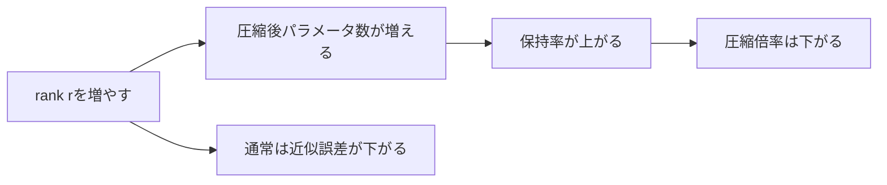
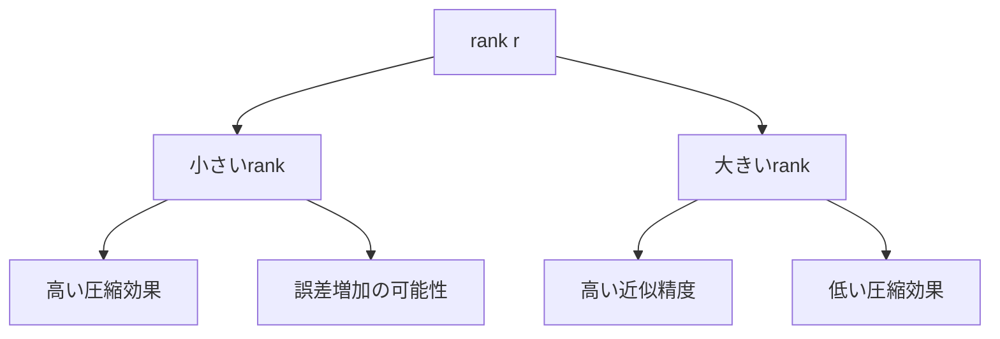
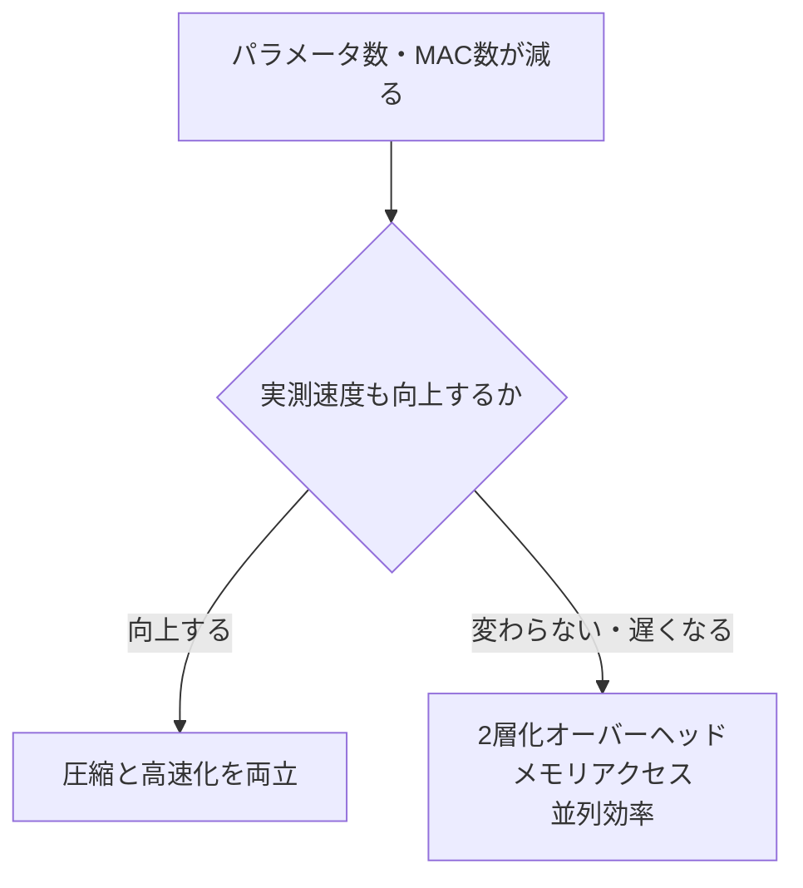
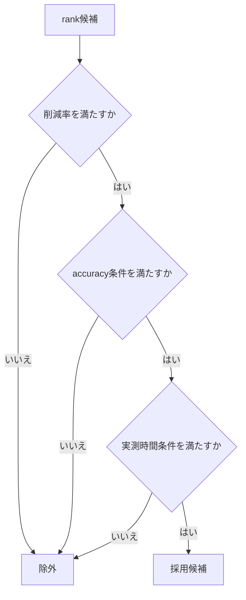
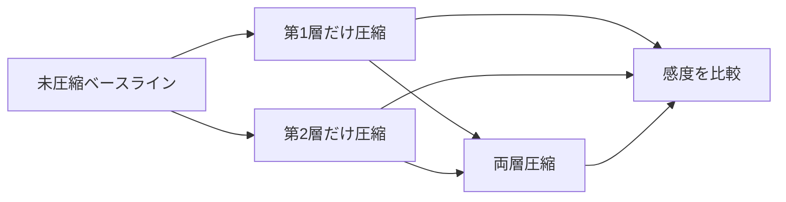

# 圧縮率とRank

## サマリー

SVDによるLinear層の圧縮では、rank $r$ が次の両方を決める。

- どれだけパラメータ数を減らせるか
- 元の重み行列をどれだけ正確に近似できるか

元のLinear層の重みを、

$$
W
\in
\mathbb{R}^{
D_{\mathrm{out}}
\times
D_{\mathrm{in}}
}
$$

とする。

元の重みパラメータ数は、

$$
P_{\mathrm{original}}
=
D_{\mathrm{in}}
D_{\mathrm{out}}
$$

である。

rank $r$ の2層Linearへ置き換えると、重みパラメータ数は、

$$
P_{\mathrm{lowrank}}
=
rD_{\mathrm{in}}
+
D_{\mathrm{out}}r
$$

となる。

整理すると、

$$
P_{\mathrm{lowrank}}
=
r
\left(
D_{\mathrm{in}}
+
D_{\mathrm{out}}
\right)
$$

である。

パラメータ数を本当に減らすためには、

$$
r
\left(
D_{\mathrm{in}}
+
D_{\mathrm{out}}
\right)
<
D_{\mathrm{in}}
D_{\mathrm{out}}
$$

を満たす必要がある。

したがって、圧縮が成立するrankの条件は、

$$
r
<
\frac{
D_{\mathrm{in}}
D_{\mathrm{out}}
}{
D_{\mathrm{in}}
+
D_{\mathrm{out}}
}
$$

である。

rankを小さくすると圧縮率は高くなるが、捨てる特異値が増え、重み誤差や精度低下が大きくなる可能性がある。

したがって、rankは圧縮率だけで決めず、

- 特異値エネルギー
- 重み近似誤差
- 層出力誤差
- モデル精度
- fine-tuning後の回復
- 実測推論時間

を比較して選ぶ。

---

## 1. rankとは何か

SVDによるrank $r$ 近似は、

$$
W_r
=
U_r
\Sigma_r
V_r^{\mathsf{T}}
$$

で表される。

各行列の形状は、

$$
U_r
\in
\mathbb{R}^{
D_{\mathrm{out}}
\times r
}
$$

$$
\Sigma_r
\in
\mathbb{R}^{r\times r}
$$

$$
V_r^{\mathsf{T}}
\in
\mathbb{R}^{
r\times D_{\mathrm{in}}
}
$$

である。

rank $r$ は、低ランク化後に保持する特異方向の数である。

また、2層Linearへ置き換えたときの中間次元でもある。

```text
入力 D_in 次元
       │
       ▼
Linear(D_in, r)
       │
       ▼
中間 r 次元
       │
       ▼
Linear(r, D_out)
       │
       ▼
出力 D_out 次元
```

### Mermaid図


rankを小さくすると、中間表現が通過できる独立方向の数が少なくなる。

---

## 2. rankの取り得る範囲

重み行列

$$
W
\in
\mathbb{R}^{
D_{\mathrm{out}}
\times
D_{\mathrm{in}}
}
$$

の最大rankは、

$$
r_{\max}
=
\min
\left(
D_{\mathrm{in}},
D_{\mathrm{out}}
\right)
$$

である。

したがって、切り詰めSVDで選べるrankは、

$$
1
\leq
r
\leq
\min
\left(
D_{\mathrm{in}},
D_{\mathrm{out}}
\right)
$$

である。

### 最大rank

$$
r
=
\min
\left(
D_{\mathrm{in}},
D_{\mathrm{out}}
\right)
$$

なら、数値誤差を除いて元の行列を再構成できる。

$$
W_r=W
$$

ただし、最大rankで2層化すると、パラメータ数は元より増える場合が多い。

### rank 1

$$
r=1
$$

なら、

$$
W_1
=
\sigma_1
u_1
v_1^{\mathsf{T}}
$$

であり、最も強い1方向だけを残す。

圧縮率は非常に高いが、情報損失も大きくなりやすい。

---

## 3. 元のLinear層のパラメータ数

元のLinear層を、

PyTorchの確認コード：[[05_SVD基礎実装検証/05_rank指標のPython集計と可視化#PyTorch確認-001]]

とする。

### 重み

重み形状は、

$$
D_{\mathrm{out}}
\times
D_{\mathrm{in}}
$$

である。

重みパラメータ数は、

$$
P_W
=
D_{\mathrm{out}}
D_{\mathrm{in}}
$$

である。

### bias

bias形状は、

$$
D_{\mathrm{out}}
$$

である。

biasパラメータ数は、

$$
P_b
=
D_{\mathrm{out}}
$$

である。

### 合計

biasありの場合、

$$
P_{\mathrm{original,total}}
=
D_{\mathrm{out}}
D_{\mathrm{in}}
+
D_{\mathrm{out}}
$$

となる。

biasなしの場合、

$$
P_{\mathrm{original,total}}
=
D_{\mathrm{out}}
D_{\mathrm{in}}
$$

である。

---

## 4. 低ランク2層のパラメータ数

圧縮後を次の2層とする。

PyTorchの確認コード：[[05_SVD基礎実装検証/05_rank指標のPython集計と可視化#PyTorch確認-002]]

PyTorchの確認コード：[[05_SVD基礎実装検証/05_rank指標のPython集計と可視化#PyTorch確認-003]]

### 前段重み

形状は、

$$
r
\times
D_{\mathrm{in}}
$$

である。

パラメータ数は、

$$
P_A
=
rD_{\mathrm{in}}
$$

である。

### 後段重み

形状は、

$$
D_{\mathrm{out}}
\times
r
$$

である。

パラメータ数は、

$$
P_B
=
D_{\mathrm{out}}r
$$

である。

### 後段bias

元のbiasを引き継ぐため、

$$
P_b
=
D_{\mathrm{out}}
$$

である。

### 合計

$$
P_{\mathrm{lowrank,total}}
=
rD_{\mathrm{in}}
+
D_{\mathrm{out}}r
+
D_{\mathrm{out}}
$$

整理すると、

$$
P_{\mathrm{lowrank,total}}
=
r
\left(
D_{\mathrm{in}}
+
D_{\mathrm{out}}
\right)
+
D_{\mathrm{out}}
$$

である。

---

## 5. biasは圧縮成立条件に影響するか

元の層と圧縮後の層で、bias数はどちらも

$$
D_{\mathrm{out}}
$$

である。

圧縮条件は、

$$
P_{\mathrm{lowrank,total}}
<
P_{\mathrm{original,total}}
$$

である。

各式を代入すると、

$$
r
\left(
D_{\mathrm{in}}
+
D_{\mathrm{out}}
\right)
+
D_{\mathrm{out}}
<
D_{\mathrm{in}}
D_{\mathrm{out}}
+
D_{\mathrm{out}}
$$

両辺から

$$
D_{\mathrm{out}}
$$

を引くと、

$$
r
\left(
D_{\mathrm{in}}
+
D_{\mathrm{out}}
\right)
<
D_{\mathrm{in}}
D_{\mathrm{out}}
$$

となる。

したがって、元biasを後段へそのまま引き継ぐ基本構成では、圧縮成立条件は重みだけで考えた場合と同じである。

---

## 6. 圧縮が成立するrank条件

圧縮後の重み数が元より少ない条件は、

$$
r
\left(
D_{\mathrm{in}}
+
D_{\mathrm{out}}
\right)
<
D_{\mathrm{in}}
D_{\mathrm{out}}
$$

である。

両辺を

$$
D_{\mathrm{in}}
+
D_{\mathrm{out}}
$$

で割ると、

$$
r
<
\frac{
D_{\mathrm{in}}
D_{\mathrm{out}}
}{
D_{\mathrm{in}}
+
D_{\mathrm{out}}
}
$$

となる。

右辺を、圧縮の損益分岐rankと考える。

$$
r_{\mathrm{break}}
=
\frac{
D_{\mathrm{in}}
D_{\mathrm{out}}
}{
D_{\mathrm{in}}
+
D_{\mathrm{out}}
}
$$

ただし、rankは整数であり、不等号は厳密な

$$
<
$$

である。

---

## 7. 最大の圧縮rankを整数で求める

次の条件を満たす最大整数rankを求めたい。

$$
r<r_{\mathrm{break}}
$$

### 損益分岐rankが整数でない場合

たとえば、

$$
r_{\mathrm{break}}
=
309.73
$$

なら、

$$
r_{\max,\mathrm{compress}}
=
309
$$

である。

### 損益分岐rankが整数の場合

たとえば、

$$
r_{\mathrm{break}}
=
128
$$

なら、条件は、

$$
r<128
$$

なので、最大rankは127である。

### 一般式

$$
r_{\max,\mathrm{compress}}
=
\left\lceil
r_{\mathrm{break}}
\right\rceil
-1
$$

つまり、

$$
r_{\max,\mathrm{compress}}
=
\left\lceil
\frac{
D_{\mathrm{in}}
D_{\mathrm{out}}
}{
D_{\mathrm{in}}
+
D_{\mathrm{out}}
}
\right\rceil
-1
$$

である。

単純に床関数を使うと、損益分岐rankが整数の場合に1大きくなるため注意する。

---

## 8. 圧縮指標の用語を区別する

「圧縮率」という言葉は、資料によって意味が異なる。

混乱を避けるため、このノートでは次の3指標を区別する。

### 1. パラメータ保持率

圧縮後に何割残ったかを表す。

$$
R_{\mathrm{keep}}
=
\frac{
P_{\mathrm{lowrank}}
}{
P_{\mathrm{original}}
}
$$

小さいほど強く圧縮されている。

### 2. パラメータ削減率

何割削減できたかを表す。

$$
R_{\mathrm{reduce}}
=
1
-
\frac{
P_{\mathrm{lowrank}}
}{
P_{\mathrm{original}}
}
$$

大きいほど強く圧縮されている。

百分率では、

$$
100R_{\mathrm{reduce}}
\%
$$

と表す。

### 3. 圧縮倍率

元が圧縮後の何倍の大きさかを表す。

$$
C_{\mathrm{factor}}
=
\frac{
P_{\mathrm{original}}
}{
P_{\mathrm{lowrank}}
}
$$

大きいほど強く圧縮されている。

### 関係

$$
C_{\mathrm{factor}}
=
\frac{1}{
R_{\mathrm{keep}}
}
$$

$$
R_{\mathrm{reduce}}
=
1-R_{\mathrm{keep}}
$$

---

## 9. 指標の読み方

たとえば、圧縮後のパラメータ数が元の25%なら、

$$
R_{\mathrm{keep}}=0.25
$$

である。

削減率は、

$$
R_{\mathrm{reduce}}
=
1-0.25
=
0.75
$$

つまり75%削減である。

圧縮倍率は、

$$
C_{\mathrm{factor}}
=
\frac{1}{0.25}
=
4
$$

つまり4倍圧縮である。

```text
保持率 25%
削減率 75%
圧縮倍率 4倍
```

これらは同じ状況を異なる表現で示している。

---

## 10. 重みだけを対象にした指標

元の重み数は、

$$
P_{\mathrm{original}}
=
D_{\mathrm{in}}
D_{\mathrm{out}}
$$

圧縮後の重み数は、

$$
P_{\mathrm{lowrank}}
=
r
\left(
D_{\mathrm{in}}
+
D_{\mathrm{out}}
\right)
$$

である。

### 保持率

$$
R_{\mathrm{keep}}
=
\frac{
r
\left(
D_{\mathrm{in}}
+
D_{\mathrm{out}}
\right)
}{
D_{\mathrm{in}}
D_{\mathrm{out}}
}
$$

### 削減率

$$
R_{\mathrm{reduce}}
=
1
-
\frac{
r
\left(
D_{\mathrm{in}}
+
D_{\mathrm{out}}
\right)
}{
D_{\mathrm{in}}
D_{\mathrm{out}}
}
$$

### 圧縮倍率

$$
C_{\mathrm{factor}}
=
\frac{
D_{\mathrm{in}}
D_{\mathrm{out}}
}{
r
\left(
D_{\mathrm{in}}
+
D_{\mathrm{out}}
\right)
}
$$

---

## 11. rankと保持率は比例する

$D_{\mathrm{in}}$ と $D_{\mathrm{out}}$ を固定すると、

$$
R_{\mathrm{keep}}
=
r
\frac{
D_{\mathrm{in}}
+
D_{\mathrm{out}}
}{
D_{\mathrm{in}}
D_{\mathrm{out}}
}
$$

である。

したがって、パラメータ保持率はrank $r$ に比例する。

rankを2倍にすると、低ランク因子の重み数も2倍になる。

### Mermaid図



rankと圧縮率の関係は単純だが、rankと分類精度の関係はモデル・層・データに依存する。

---

## 12. 近似誤差はrank増加に対して単調非増加

### 一つ多く残したときの差を明示する

$0\le r<k$ とすると、二つの残差二乗の差は

$$
\begin{aligned}
\|W-W_r\|_F^2-\|W-W_{r+1}\|_F^2
&=\sum_{i=r+1}^{k}\sigma_i^2-\sum_{i=r+2}^{k}\sigma_i^2\\
&=\sigma_{r+1}^2+\sum_{i=r+2}^{k}\sigma_i^2
-\sum_{i=r+2}^{k}\sigma_i^2\\
&=\sigma_{r+1}^2\ge0.
\end{aligned}
$$

両辺のノルムは非負なので、平方根を取っても大小関係は保たれる。
捨てる特異値が0なら誤差は同じであり、「常に厳密に減る」ではない。

切り詰めSVDのフロベニウス誤差は、

$$
\lVert
W-W_r
\rVert_F^2
=
\sum_{i=r+1}^{k}
\sigma_i^2
$$

である。

rankを1増やすと、誤差から

$$
\sigma_{r+1}^2
$$

が取り除かれる。

したがって、

$$
\lVert
W-W_{r+1}
\rVert_F
\leq
\lVert
W-W_r
\rVert_F
$$

である。

重み近似誤差はrankを増やすほど増えることはない。

ただし、有限データで測る分類精度は、数値誤差や評価ばらつきによって完全に単調になるとは限らない。

---

## 13. rankのトレードオフ

rankを小さくする場合：

- パラメータ数が減る
- モデルファイルを小さくしやすい
- 理論演算量が減る
- 中間テンソルが小さくなる
- 捨てる特異方向が増える
- 重み近似誤差が増える
- 出力誤差や精度低下が増える可能性がある

rankを大きくする場合：

- 元の重みを正確に近似しやすい
- 圧縮直後の精度を保ちやすい
- パラメータ削減効果が小さくなる
- 損益分岐rankを超えると圧縮にならない

### Mermaid図



---

## 14. `Linear(784, 512)` の元パラメータ数

MNIST MLPの第1層を考える。

PyTorchの確認コード：[[05_SVD基礎実装検証/05_rank指標のPython集計と可視化#PyTorch確認-004]]

重み形状は、

$$
512\times784
$$

である。

重み数は、

$$
P_{\mathrm{original}}
=
512\times784
$$

$$
P_{\mathrm{original}}
=
401{,}408
$$

である。

biasありなら、

$$
P_{\mathrm{original,total}}
=
401{,}408
+
512
$$

$$
P_{\mathrm{original,total}}
=
401{,}920
$$

である。

---

## 15. `Linear(784, 512)` の損益分岐rank

圧縮成立条件は、

$$
r
<
\frac{
784\times512
}{
784+512
}
$$

である。

分子は、

$$
784\times512
=
401{,}408
$$

分母は、

$$
784+512
=
1{,}296
$$

なので、

$$
r
<
\frac{
401{,}408
}{
1{,}296
}
$$

$$
r
<
309.728\ldots
$$

である。

したがって、重み数を減らせる最大整数rankは、

$$
r=309
$$

である。

rank 310では、元より重み数が増える。

---

## 16. `Linear(784, 512)` のrank別比較

圧縮後の重み数は、

$$
P_{\mathrm{lowrank}}
=
r(784+512)
$$

$$
P_{\mathrm{lowrank}}
=
1{,}296r
$$

である。

| rank $r$ | 圧縮後重み数 | 保持率 | 削減率 | 圧縮倍率 |
|---:|---:|---:|---:|---:|
| 8 | 10,368 | 2.58% | 97.42% | 38.72倍 |
| 16 | 20,736 | 5.17% | 94.83% | 19.36倍 |
| 32 | 41,472 | 10.33% | 89.67% | 9.68倍 |
| 64 | 82,944 | 20.66% | 79.34% | 4.84倍 |
| 96 | 124,416 | 30.99% | 69.01% | 3.23倍 |
| 128 | 165,888 | 41.33% | 58.67% | 2.42倍 |
| 192 | 248,832 | 61.99% | 38.01% | 1.61倍 |
| 256 | 331,776 | 82.65% | 17.35% | 1.21倍 |
| 309 | 400,464 | 99.76% | 0.24% | 1.00倍 |
| 310 | 401,760 | 100.09% | -0.09% | 1倍未満 |

rank 309は数式上は圧縮だが、削減量が小さすぎるため、実用上の意味はほとんどない。

---

## 17. rank 64の具体計算

rank 64では、前段重み数は、

$$
64\times784
=
50{,}176
$$

である。

後段重み数は、

$$
512\times64
=
32{,}768
$$

である。

合計は、

$$
50{,}176
+
32{,}768
=
82{,}944
$$

である。

保持率は、

$$
R_{\mathrm{keep}}
=
\frac{
82{,}944
}{
401{,}408
}
\approx0.2066
$$

である。

削減率は、

$$
R_{\mathrm{reduce}}
=
1-0.2066
\approx0.7934
$$

つまり約79.34%削減である。

圧縮倍率は、

$$
C_{\mathrm{factor}}
=
\frac{
401{,}408
}{
82{,}944
}
\approx4.84
$$

である。

---

## 18. 出力層 `Linear(512, 10)` の例

MNISTの出力層を考える。

PyTorchの確認コード：[[05_SVD基礎実装検証/05_rank指標のPython集計と可視化#PyTorch確認-005]]

元の重み数は、

$$
512\times10
=
5{,}120
$$

である。

圧縮成立条件は、

$$
r
<
\frac{
512\times10
}{
512+10
}
$$

$$
r
<
\frac{
5{,}120
}{
522
}
$$

$$
r
<
9.808\ldots
$$

したがって、重み数だけならrank 9以下で圧縮になる。

しかし、最大rankは10なので、rank 9でもほぼフルランクであり、削減効果は小さい。

rank 5なら、

$$
P_{\mathrm{lowrank}}
=
5(512+10)
=
2{,}610
$$

である。

保持率は、

$$
\frac{
2{,}610
}{
5{,}120
}
\approx0.5098
$$

であり、約49.02%削減になる。

ただし、出力層はクラス判定に直接関わるため、強い低ランク化で精度へ影響しやすい可能性がある。

---

## 19. 正方行列の場合

$$
D_{\mathrm{in}}
=
D_{\mathrm{out}}
=
D
$$

とする。

元の重み数は、

$$
D^2
$$

である。

低ランク重み数は、

$$
r(D+D)
=
2Dr
$$

である。

圧縮条件は、

$$
2Dr<D^2
$$

したがって、

$$
r<\frac{D}{2}
$$

である。

正方行列では、rankを元の次元の半分未満にしなければ、パラメータ圧縮にならない。

### 例：`Linear(512, 512)`

$$
r<256
$$

である。

rank 256では、

$$
2\times512\times256
=
512^2
$$

となり、重み数は元と同じである。

厳密な圧縮にはrank 255以下が必要である。

---

## 20. 入出力次元が大きく異なる場合

### $D_{\mathrm{in}}\gg D_{\mathrm{out}}$

たとえば、

$$
D_{\mathrm{in}}=4096
$$

$$
D_{\mathrm{out}}=128
$$

とする。

損益分岐rankは、

$$
\frac{
4096\times128
}{
4096+128
}
\approx124.12
$$

である。

最大rankは128なので、rankを少し下げるだけでも数式上は圧縮になる。

ただし、rank 124では削減効果は小さい。

### $D_{\mathrm{out}}\gg D_{\mathrm{in}}$

対称性により、同様の結果になる。

損益分岐rankは、

$$
\frac{
D_{\mathrm{in}}
D_{\mathrm{out}}
}{
D_{\mathrm{in}}
+
D_{\mathrm{out}}
}
$$

なので、入出力を入れ替えても変わらない。

---

## 21. 小さいLinear層は圧縮効果が限定的

たとえば、

PyTorchの確認コード：[[05_SVD基礎実装検証/05_rank指標のPython集計と可視化#PyTorch確認-006]]

の元重み数は、

$$
16\times8=128
$$

である。

損益分岐rankは、

$$
\frac{
16\times8
}{
16+8
}
=
\frac{128}{24}
\approx5.33
$$

である。

rank 4なら、

$$
4(16+8)=96
$$

であり、削減数は32だけである。

層を2つに増やすオーバーヘッドを考えると、小さい層を圧縮しても実用的な利点が少ない場合がある。

---

## 22. モデル全体の圧縮率

1つのLinear層を80%削減しても、モデル全体が80%小さくなるとは限らない。

モデル全体のパラメータ数を、

$$
P_{\mathrm{model}}
$$

圧縮対象層の元パラメータ数を、

$$
P_{\mathrm{target}}
$$

圧縮後の対象層パラメータ数を、

$$
P_{\mathrm{target,lowrank}}
$$

とする。

圧縮後モデル全体は、

$$
P_{\mathrm{model,compressed}}
=
P_{\mathrm{model}}
-
P_{\mathrm{target}}
+
P_{\mathrm{target,lowrank}}
$$

である。

モデル全体の削減率は、

$$
R_{\mathrm{model,reduce}}
=
1
-
\frac{
P_{\mathrm{model,compressed}}
}{
P_{\mathrm{model}}
}
$$

である。

---

## 23. 対象層がモデル全体に占める割合

### 層の削減率からモデル全体の削減率へ

対象外のparameter数を $P_{\mathrm{other}}$ と置き、
この節の $q,s$ と同じ数え方でbiasも含めるか除くかをそろえる。

$$
\begin{aligned}
P_{\mathrm{model}}&=P_{\mathrm{other}}+P_{\mathrm{target}},\\
P_{\mathrm{model,compressed}}
&=P_{\mathrm{other}}+P_{\mathrm{target,lowrank}}\\
&=P_{\mathrm{model}}-P_{\mathrm{target}}+P_{\mathrm{target,lowrank}}.
\end{aligned}
$$

従って

$$
\begin{aligned}
R_{\mathrm{model,reduce}}
&=1-\frac{P_{\mathrm{model}}-P_{\mathrm{target}}
+P_{\mathrm{target,lowrank}}}{P_{\mathrm{model}}}\\
&=\frac{P_{\mathrm{target}}-P_{\mathrm{target,lowrank}}}{P_{\mathrm{model}}}\\
&=\frac{P_{\mathrm{target}}}{P_{\mathrm{model}}}
\left(1-\frac{P_{\mathrm{target,lowrank}}}{P_{\mathrm{target}}}\right)\\
&=qs.
\end{aligned}
$$

対象層内の削減率だけをモデル全体の削減率として報告してはいけない理由が、この積に現れる。

対象層の割合を、

$$
q
=
\frac{
P_{\mathrm{target}}
}{
P_{\mathrm{model}}
}
$$

とする。

対象層内部の削減率を、

$$
s
=
1
-
\frac{
P_{\mathrm{target,lowrank}}
}{
P_{\mathrm{target}}
}
$$

とする。

このとき、モデル全体の削減率は、

$$
R_{\mathrm{model,reduce}}
=
qs
$$

である。

### 例

対象層がモデル全体の80%を占め、

$$
q=0.8
$$

その層を75%削減したなら、

$$
s=0.75
$$

モデル全体の削減率は、

$$
0.8\times0.75
=
0.60
$$

つまり60%である。

---

## 24. MNIST MLP全体の例

次のモデルを考える。

```text
Linear(784, 512)
ReLU
Linear(512, 10)
```

### 第1層

重みとbiasの合計は、

$$
784\times512+512
=
401{,}920
$$

である。

### 第2層

重みとbiasの合計は、

$$
512\times10+10
=
5{,}130
$$

である。

### モデル全体

$$
P_{\mathrm{model}}
=
401{,}920
+
5{,}130
$$

$$
P_{\mathrm{model}}
=
407{,}050
$$

である。

第1層は、全体の約98.74%を占める。

$$
\frac{
401{,}920
}{
407{,}050
}
\approx0.9874
$$

そのため、第1層の圧縮効果がモデル全体へほぼ直接反映される。

---

## 25. MNIST第1層をrank 64へしたモデル全体

rank 64の第1層は、bias込みで、

$$
82{,}944+512
=
83{,}456
$$

である。

第2層はそのままなので、

$$
5{,}130
$$

である。

圧縮後モデル全体は、

$$
P_{\mathrm{model,compressed}}
=
83{,}456
+
5{,}130
$$

$$
P_{\mathrm{model,compressed}}
=
88{,}586
$$

である。

モデル全体の保持率は、

$$
\frac{
88{,}586
}{
407{,}050
}
\approx0.2176
$$

である。

モデル全体の削減率は、

$$
1-0.2176
=
0.7824
$$

つまり約78.24%削減である。

モデル全体の圧縮倍率は、

$$
\frac{
407{,}050
}{
88{,}586
}
\approx4.59
$$

である。

---

## 26. パラメータ数と保存容量

パラメータ数が同じでも、データ型によって保存容量は異なる。

### 代表的な1要素の大きさ

| dtype | 1要素 |
|---|---:|
| `float64` | 8 byte |
| `float32` | 4 byte |
| `float16` | 2 byte |
| `bfloat16` | 2 byte |
| `int8` | 1 byte |

パラメータテンソルだけの理論容量は、

$$
M_{\mathrm{parameter}}
=
P
\times
B_{\mathrm{dtype}}
$$

である。

ここで、

- $P$：パラメータ数
- $B_{\mathrm{dtype}}$：1要素当たりのbyte数

である。

---

## 27. `Linear(784, 512)` の理論容量

元重み数は、

$$
401{,}408
$$

である。

`float32`なら、

$$
401{,}408\times4
=
1{,}605{,}632
\text{ byte}
$$

である。

MiBへ直すと、

$$
\frac{
1{,}605{,}632
}{
1{,}048{,}576
}
\approx1.53
\text{ MiB}
$$

である。

rank 64では重み数が82,944なので、

$$
82{,}944\times4
=
331{,}776
\text{ byte}
$$

$$
\frac{
331{,}776
}{
1{,}048{,}576
}
\approx0.316
\text{ MiB}
$$

である。

---

## 28. 実際のモデルファイル容量は完全には一致しない

実際に `torch.save` したファイルには、パラメータ以外の情報も含まれる可能性がある。

- テンソルのメタデータ
- キー名
- 保存形式のオーバーヘッド
- optimizer state
- 圧縮形式
- アライメント
- 追加バッファ

そのため、

$$
\text{ファイルサイズ}
=
\text{パラメータ数}
\times
\text{dtype byte}
$$

と完全には一致しない。

ただし、モデルが十分大きければ、パラメータ数は容量の主要因になる。

---

## 29. optimizer stateはさらに大きい

Adamでは、各学習パラメータに対して、一般に一次モーメントと二次モーメントを保持する。

概略として、

- パラメータ本体
- 勾配
- 一次モーメント
- 二次モーメント

が必要になる。

そのため、学習時メモリは推論用パラメータ容量より大きい。

低ランク化によって学習可能パラメータ数が減れば、fine-tuning時のoptimizer stateも減る可能性がある。

ただし、混合精度学習ではmaster weightなどが追加される場合がある。

---

## 30. 理論上のMAC数

Linear層の行列積では、積和演算を行う。

1サンプルに対する元のLinear層のMAC数は、概ね、

$$
\operatorname{MAC}_{\mathrm{original}}
=
D_{\mathrm{in}}
D_{\mathrm{out}}
$$

である。

低ランク2層では、

$$
\operatorname{MAC}_{\mathrm{lowrank}}
=
rD_{\mathrm{in}}
+
D_{\mathrm{out}}r
$$

である。

したがって、MAC保持率はパラメータ保持率と同じ形になる。

$$
R_{\mathrm{MAC}}
=
\frac{
r
\left(
D_{\mathrm{in}}
+
D_{\mathrm{out}}
\right)
}{
D_{\mathrm{in}}
D_{\mathrm{out}}
}
$$

---

## 31. FLOPsとMACsの違い

資料によって、

- 1回の乗算加算を1 MACと数える
- 1乗算と1加算を2 FLOPsと数える
- fused multiply-addを1演算と数える

など、定義が異なる。

このノートでは、Linear層の比較にはMAC数を使う。

FLOPsへ換算する場合、単純な慣例では、

$$
\operatorname{FLOPs}
\approx
2
\times
\operatorname{MACs}
$$

とすることがある。

比較表では、どの定義を使ったか明記する。

---

## 32. バッチサイズを含めたMAC数

バッチサイズを $N$ とする。

元のLinear層は、

$$
\operatorname{MAC}_{\mathrm{original,batch}}
=
N
D_{\mathrm{in}}
D_{\mathrm{out}}
$$

である。

低ランク2層は、

$$
\operatorname{MAC}_{\mathrm{lowrank,batch}}
=
N
r
\left(
D_{\mathrm{in}}
+
D_{\mathrm{out}}
\right)
$$

である。

バッチサイズ $N$ は両方に共通なので、理論上のMAC保持率には影響しない。

ただし、実測速度にはバッチサイズが大きく影響する。

---

## 33. bias加算の演算量

元の層では、1サンプルにつき、

$$
D_{\mathrm{out}}
$$

回程度のbias加算がある。

圧縮後でも後段biasだけなので、同じく、

$$
D_{\mathrm{out}}
$$

である。

基本構成ではbias加算量は変わらない。

大きなLinear層では、行列積のMAC数に比べてbias加算は小さい。

---

## 34. 中間テンソルのメモリ

低ランク2層では、中間テンソル

$$
H
\in
\mathbb{R}^{N\times r}
$$

が生じる。

このテンソルの要素数は、

$$
Nr
$$

である。

元の1層には、この追加の層間テンソルが明示的に存在しない。

推論時には短時間で解放される場合が多いが、実測速度やメモリアクセスに影響する可能性がある。

学習時には逆伝播のために中間活性を保持するため、rank $r$ に応じたactivation memoryが追加される。

---

## 35. 理論演算量が減っても速くならない理由

理論MAC数が減っても、実測推論時間が短くならない場合がある。

主な理由：

- 行列積が1回から2回へ増える
- GPUカーネル起動回数が増える
- 中間テンソルの書き込みと読み出しが増える
- 小さい行列積ではGPU利用率が下がる
- 行列形状がライブラリの得意形状と合わない
- CPUキャッシュやメモリ帯域の影響を受ける
- バッチサイズが小さい
- Python側のオーバーヘッドが相対的に大きい

### Mermaid図



---

## 36. 実測時間の比較条件

推論時間を比較するときは、条件を揃える。

- 同じdevice
- 同じdtype
- 同じバッチサイズ
- 同じ入力形状
- `model.eval()`
- `torch.no_grad()` または `torch.inference_mode()`
- 十分なウォームアップ
- 複数回測定
- GPUでは同期を入れる
- 平均だけでなく中央値も確認
- データ転送時間を含めるか明記

GPUでは非同期実行のため、計測前後に、

PyTorchの確認コード：[[05_SVD基礎実装検証/05_rank指標のPython集計と可視化#PyTorch確認-007]]

が必要になる。

---

## 37. 特異値エネルギーとrank

特異値を、

$$
\sigma_1
\geq
\sigma_2
\geq
\cdots
\geq
\sigma_k
$$

とする。

rank $r$ のエネルギー保持率は、

$$
E(r)
=
\frac{
\sum_{i=1}^{r}
\sigma_i^2
}{
\sum_{i=1}^{k}
\sigma_i^2
}
$$

である。

rankを増やすほど、

$$
E(r)
$$

は単調に増加する。

$$
E(r+1)
\geq
E(r)
$$

最大rankでは、

$$
E(k)=1
$$

である。

---

## 38. エネルギー保持率と相対誤差

### 分子を「全体から保持分を引いたもの」へ書き換える

$W\ne0$ とし、$S:=\sum_{i=1}^{k}\sigma_i^2>0$ と置く。

$$
\begin{aligned}
\frac{\|W-W_r\|_F^2}{\|W\|_F^2}
&=\frac{\sum_{i=r+1}^{k}\sigma_i^2}{S}\\
&=\frac{S-\sum_{i=1}^{r}\sigma_i^2}{S}\\
&=1-\frac{\sum_{i=1}^{r}\sigma_i^2}{S}\\
&=1-E(r).
\end{aligned}
$$

非負の平方根を取ると $\varepsilon_F(r)=\sqrt{1-E(r)}$ となる。
同じ分母を使って

$$
E(r+1)-E(r)
=\frac{\sum_{i=1}^{r+1}\sigma_i^2-\sum_{i=1}^{r}\sigma_i^2}{S}
=\frac{\sigma_{r+1}^2}{S}\ge0
$$

も確認できる。零行列では相対誤差・energy比の分母が0になるため、別途規約が必要である。

切り詰めSVDでは、

$$
\frac{
\lVert W-W_r\rVert_F^2
}{
\lVert W\rVert_F^2
}
=
1-E(r)
$$

である。

したがって、相対フロベニウス誤差は、

$$
\varepsilon_F(r)
=
\sqrt{
1-E(r)
}
$$

となる。

### 例

エネルギー保持率が95%なら、

$$
E(r)=0.95
$$

なので、

$$
\varepsilon_F(r)
=
\sqrt{0.05}
\approx0.2236
$$

である。

エネルギー保持率99%なら、

$$
\varepsilon_F(r)
=
\sqrt{0.01}
=
0.1
$$

である。

99.9%なら、

$$
\varepsilon_F(r)
=
\sqrt{0.001}
\approx0.0316
$$

である。

---

## 39. エネルギー保持率だけでrankを決めない

$$
E(r)=0.99
$$

であっても、分類精度を99%保持できるとは限らない。

理由：

- 小さい特異方向が分類境界に重要な場合がある
- 実データが捨てた方向へ分布している場合がある
- 後続のReLUで符号が変わる場合がある
- 後続層が誤差を増幅する場合がある
- 出力層では小さな差がクラス順位を変える場合がある

エネルギー保持率はrank候補を絞るための指標であり、最終判断にはタスク評価が必要である。

---

### 二乗特異値分布から定義する有効rank

NN重みの特異値の集中度を、有効rankで要約する。これはDMRGの更新アルゴリズムではなく、NN重みの補助指標である。
非零行列の特異値について

$$
p_i=\frac{\sigma_i^2}{\sum_j\sigma_j^2},\qquad
H=-\sum_{i:p_i>0}p_i\log p_i,\qquad
r_{\mathrm{eff},\sigma^2}=\exp(H)
$$

と定義する。$\log$ は自然対数であり、零成分は
$\lim_{p\to0^+}p\log p=0$ として扱う。
ここで使う定義は、**二乗特異値を正規化する一例**である。
「effective rank」という名称だけでは一意に決まらず、
$\sigma_i/\sum_j\sigma_j$ を使う定義などと数値が異なるので、
実験では使った $p_i$ の式を併記する。

検算用の数値例を一つ示す。

$$
W=\begin{pmatrix}\sqrt3&0\\0&1\end{pmatrix},\qquad
\sigma_1=\sqrt3,\quad\sigma_2=1.
$$

$$
\begin{aligned}
\sum_j\sigma_j^2&=(\sqrt3)^2+1^2=4,\\
p_1&=\frac34,\qquad p_2=\frac14,\\
H&=-\frac34\log\frac34-\frac14\log\frac14
\simeq0.562335,\\
r_{\mathrm{eff},\sigma^2}&=\exp(0.562335\ldots)\simeq1.754765.
\end{aligned}
$$

この行列のexact rankは2だが、集中度指標は約1.755であって整数ではない。
この値をそのまま圧縮rankに丸める規則や、accuracyの保証はない。
一般に非零特異値が $q$ 本なら

$$
0\le H\le\log q,\qquad
1\le r_{\mathrm{eff},\sigma^2}\le q.
$$

1本だけなら $p_1=1,\ H=0,\ r_{\mathrm{eff},\sigma^2}=1$、
$q$ 本が等しいなら

$$
H=-q\frac1q\log\frac1q=\log q,\qquad
r_{\mathrm{eff},\sigma^2}=\exp(\log q)=q
$$

となる。零行列では分母が0でこの定義は未定義であり、
exact rank 0と、有効rankの規約を区別する。
これはNN重みの特異値分布の集中度であり、
量子状態を定義していない重みへ物理的エンタングルメントを付与する説明ではない。

## 40. rankの選び方：固定候補

最初の実験では、比較しやすい固定rankを使う。

たとえば、

$$
r
\in
\{
8,
16,
32,
64,
128,
256
\}
$$

とする。

### 長所

- 結果表を作りやすい
- 圧縮率の変化が分かりやすい
- 他の層や手法と比較しやすい
- 実装が単純

### 短所

- 特異値分布を直接反映しない
- 層ごとに同じrankが適切とは限らない

MNIST第1層では、まず固定rankの比較が最も分かりやすい。

---

## 41. rankの選び方：rank比率

最大rankに対する割合で選ぶ。

$$
\rho_r
=
\frac{
r
}{
\min
\left(
D_{\mathrm{in}},
D_{\mathrm{out}}
\right)
}
$$

たとえば、

$$
\rho_r
\in
\{
0.125,
0.25,
0.5
\}
$$

を試す。

### 注意

同じrank比率でも、パラメータ保持率は入出力形状によって異なる。

rank比率50%が圧縮になるとは限らない。

正方行列ではrank比率50%で重み数が元と同じになる。

---

## 42. rankの選び方：エネルギー閾値

次を満たす最小rankを選ぶ。

$$
E(r)\geq\tau
$$

閾値の例：

$$
\tau
\in
\{
0.90,
0.95,
0.99,
0.999
\}
$$

### 長所

- 各層の特異値分布を反映できる
- 重み近似誤差と直接関係する
- 自動化しやすい

### 短所

- 分類精度を保証しない
- 層ごとに異なるrankとなる
- 高い閾値では圧縮効果が小さくなる場合がある

---

## 43. rankの選び方：目標保持率

この節の保持率は**保存するparameterの割合**であって、特異値energyの保持率ではない。
parameter数はshapeと選んだrankで決まるが、energyは学習済み重みの特異値の分布で決まる。
同じshape・同じrankならparameter数は同じでも、重みが違えば保持energyは違い得る。
さらにenergyが同じでも、入力や後続層が違えばaccuracyは同じとは限らない。

重みだけのparameter予算を $P_{\max}$ とし、上限を必ず守るなら

$$
r(D_{\mathrm{in}}+D_{\mathrm{out}})\le P_{\max}
\quad\Longleftrightarrow\quad
r\le\frac{P_{\max}}{D_{\mathrm{in}}+D_{\mathrm{out}}}
$$

なので、整数rankには右辺のfloorを使う。近い候補を探すための四捨五入と、予算の厳守では丸め方が違う。
その後で許容されるrank範囲・bias・他層のparameterを含めて再確認する。
一つの「保持率」の数で、保存量・重み近似・タスク性能の三つを同時に保証することはできない。

目標とするパラメータ保持率を、

$$
R_{\mathrm{keep,target}}
$$

とする。

重みだけを考えると、

$$
R_{\mathrm{keep,target}}
\approx
\frac{
r
\left(
D_{\mathrm{in}}
+
D_{\mathrm{out}}
\right)
}{
D_{\mathrm{in}}
D_{\mathrm{out}}
}
$$

なので、

$$
r
\approx
R_{\mathrm{keep,target}}
\frac{
D_{\mathrm{in}}
D_{\mathrm{out}}
}{
D_{\mathrm{in}}
+
D_{\mathrm{out}}
}
$$

となる。

整数rankへ丸めた後、実際の保持率を再計算する。

### 例

`Linear(784, 512)` を約25%保持したい。

$$
r
\approx
0.25
\times
\frac{
784\times512
}{
784+512
}
$$

$$
r
\approx
77.43
$$

rank 77または78を候補にできる。

---

## 44. rankの選び方：精度制約

許容する精度低下を決める。

たとえば、

$$
\Delta\operatorname{Accuracy}
\leq0.5
\text{ percentage point}
$$

を条件とする。

複数rankを評価し、この条件を満たす最小rankを選ぶ。

### 手順

1. rank候補を小さい順に並べる
2. 圧縮直後のaccuracyを測る
3. 必要ならfine-tuningする
4. 許容精度を満たす最小rankを選ぶ

この方法はタスクに直接基づくが、評価とfine-tuningの計算コストがかかる。

---

## 45. rankの選び方：複合条件

実用上は、複数条件を組み合わせる。

例：

- 削減率50%以上
- accuracy低下0.5ポイント以内
- fine-tuningは3epoch以内
- CPU推論時間が未圧縮以下

これを満たすrankの中から最小のものを選ぶ。

### Mermaid図



---

## 46. 層ごとにrankを変える

複数Linear層を圧縮する場合、同じrankを使う必要はない。

第 $\ell$ 層のrankを、

$$
r_\ell
$$

とする。

モデル全体の低ランク重み数は、

$$
P_{\mathrm{lowrank,total}}
=
\sum_{\ell}
r_\ell
\left(
D_{\mathrm{in},\ell}
+
D_{\mathrm{out},\ell}
\right)
$$

である。

層ごとに、

- 特異値減衰
- パラメータ数
- 精度感度
- 実測速度

が異なるため、rankも個別に選ぶ方が合理的である。

---

## 47. 大きい層から圧縮する

最初の圧縮対象は、モデル内でパラメータ数が大きい層から選ぶと効果を確認しやすい。

各Linear層の重み数は、

$$
D_{\mathrm{in}}
D_{\mathrm{out}}
$$

である。

対象層の優先度として、次を確認する。

1. パラメータ数が大きいか
2. 特異値が速く減衰しているか
3. 圧縮後も十分な削減率が得られるか
4. 精度への感度が低いか
5. 実測速度に占める割合が大きいか

MNIST MLPでは、第1層がモデルパラメータの大部分を占めるため、最初の対象として適している。

---

## 48. 全層を同時に圧縮すると原因分析が難しい

複数層を一度に圧縮すると、精度低下がどの層によるものか分かりにくい。

最初は、

1. 第1層だけ圧縮
2. 第2層だけ圧縮
3. 両方圧縮

の順で比較する。

### Mermaid図



---

## 49. rankとfine-tuning

圧縮直後の精度だけでなく、fine-tuning後の精度も重要である。

小さいrankでは圧縮直後の誤差が大きくても、fine-tuningで回復する場合がある。

ただし、rankが小さすぎると、モデルの表現能力自体が不足し、回復できない。

### 見るべき3段階

- 未圧縮モデル
- SVD置換直後
- fine-tuning後

rankごとにこの3段階を記録する。

---

## 50. 圧縮率と精度のPareto関係

あるrankが別のrankより、

- パラメータ数が少ない
- 精度が高い

なら、明らかに優れている。

一方、

- 小さいが精度が低い
- 大きいが精度が高い

という候補間では、用途に応じて選ぶ。

このようなトレードオフをPareto前線として考えられる。

```text
精度
 ↑
 │         ● 未圧縮
 │       ●
 │     ●
 │   ●
 │ ●
 └────────────────→ パラメータ数
```

左上に近いほど、少ないパラメータで高精度である。

---

---

## 50.1 Pareto支配を厳密に定義する

rank選択を「パラメータ数」と「validation loss」の2目的で行う場合、両方とも小さいほどよい。
候補 $A$ が候補 $B$ を支配する条件は、

$$
P_A \le P_B
$$

かつ

$$
L_A \le L_B
$$

であり、さらに少なくとも一方が厳密に小さいことである。

$$
P_A < P_B
\quad\text{or}\quad
L_A < L_B
$$

ここで、$P$ はパラメータ数、$L$ はvalidation lossである。
支配される候補は、「より小さく、かつ同等以上に性能のよい候補」が別に存在するため、最終候補から外せる。

Pandasで実装するときは、Series同士の論理積・論理和にPythonの `and` / `or` ではなく `&` / `|` を使い、条件を満たす行が1つでもあるかは `.any()` で判定する。
ループ中にDataFrameを `drop` せず、残すindexを集めて最後に一度だけ絞る方が安全である。

---

## 50.2 Pareto frontierを先に作る理由

knee pointは全rank候補へ直接適用するのではなく、まずPareto frontierへ絞ってから求める。
支配されている点を混ぜると、「そもそも選ぶ理由のない候補」が曲線形状へ影響するためである。

```text
全rank候補
↓
圧縮になっている候補を残す
↓
Pareto支配される候補を除く
↓
Pareto frontier
↓
knee point
```

パラメータ数がBaseline以上の低ランク表現は、「SVDをした」という意味では正しくても圧縮にはなっていない。
最終的な圧縮候補を探す場合は、まずBaselineより小さい候補へ絞るのが自然である。

---

## 50.3 knee計算前のMin-Max正規化

パラメータ数とvalidation lossは単位もスケールも異なる。
そのままユークリッド距離を計算すると、数値スケールが大きい軸へ距離が引っ張られる。

Pareto frontier上の各軸を、

$$
x' = \frac{x-x_{\min}}{x_{\max}-x_{\min}}
$$

で $[0,1]$ へ変換する。

`MinMaxScaler` を使う場合も意味は同じである。

重要なのは、Baseline比、

$$
\frac{x}{x_{\mathrm{baseline}}}
$$

とMin-Max正規化を区別することである。
Baseline比は「元モデルの何倍か」を表す指標であり、kneeの幾何計算で両軸を同じスケールへ揃える処理ではない。

---

## 50.4 knee point：端点を結ぶ直線からの最大距離

### 距離の分母が $\sqrt{a^2+1}$ になる理由

正規化後の端点を $(x_A,y_A),(x_B,y_B)$ とし、$x_B\ne x_A$ とする。

$$
a=\frac{y_B-y_A}{x_B-x_A},
\qquad
b=y_A-ax_A.
$$

直線 $ax-y+b=0$ の法線ベクトルは $(a,-1)$ であり、その単位ベクトルは

$$
n=\frac{(a,-1)}{\sqrt{a^2+1}}.
$$

点 $(x_i,y_i)$ と直線上の端点との差を法線へ射影すると

$$
\begin{aligned}
d_i
&=\left|\frac{a(x_i-x_A)-(y_i-y_A)}{\sqrt{a^2+1}}\right|\\
&=\frac{|ax_i-y_i+(y_A-ax_A)|}{\sqrt{a^2+1}}\\
&=\frac{|ax_i-y_i+b|}{\sqrt{a^2+1}}.
\end{aligned}
$$

垂直な直線も含めたい場合は、この傾きの式を使わず

$$
d_i=
\frac{|(x_B-x_A)(y_i-y_A)-(y_B-y_A)(x_i-x_A)|}
{\sqrt{(x_B-x_A)^2+(y_B-y_A)^2}}
$$

とする。二つの端点が一致する場合は分母が0なのでkneeを定義できない。

Pareto frontierをパラメータ数の昇順へ並べる。
正規化後の左端を $p_0=(x_0,y_0)$、右端を $p_1=(x_1,y_1)$ とする。

この2点を結ぶ直線を基準とし、各Pareto点からその直線までの垂直距離を求める。
最大距離の点をknee pointとする方法がある。

直線を

$$
y=ax+b
$$

と書けば、点 $(x_i,y_i)$ から直線までの距離は、

$$
d_i
=
\frac{
|ax_i-y_i+b|
}{
\sqrt{a^2+1}
}
$$

である。

$$
k^* = \arg\max_i d_i
$$

をkneeとする。

この方法の意味は、「両端を直線的に結んだ単純なトレードオフ」から最も大きく曲がった点を探すことである。

---

### 5候補を、正規化と距離まで数値で追う

説明用の候補を

$$
\begin{pmatrix}
r&L_{\mathrm{val}}\\
4&0.80\\
8&0.55\\
16&0.40\\
32&0.36\\
64&0.35
\end{pmatrix}.
$$

ここでは一つの層だけを変え、他のparameterが固定で、
$P(r)=P_0+Cr$、$C>0$ と仮定する。このときparameter数のMin-Max値はrankのMin-Max値と一致する。
多層rankの組合せならこの仮定は一般に成立せず、実際の全parameter数を横軸にする。

$$
x_r=\frac{r-4}{64-4}=\frac{r-4}{60},
\qquad
y_r=\frac{L_{\mathrm{val}}(r)-0.35}{0.80-0.35}
=\frac{L_{\mathrm{val}}(r)-0.35}{0.45}.
$$

全候補は

$$
\begin{pmatrix}
r&x_r&y_r\\
4&0&1\\
8&1/15&4/9\\
16&1/5&1/9\\
32&7/15&1/45\\
64&1&0
\end{pmatrix}.
$$

端点 $(0,1),(1,0)$ を結ぶ直線は $x+y-1=0$ なので

$$
\begin{aligned}
d_4&=|0+1-1|/\sqrt2=0,\\
d_8&=|1/15+4/9-1|/\sqrt2=22/(45\sqrt2)\approx0.34570,\\
d_{16}&=|1/5+1/9-1|/\sqrt2=31/(45\sqrt2)\approx0.48712,\\
d_{32}&=|7/15+1/45-1|/\sqrt2=23/(45\sqrt2)\approx0.36141,\\
d_{64}&=|1+0-1|/\sqrt2=0.
\end{aligned}
$$

最大距離のrank 16を、この定義のknee候補とする。
最良lossのrank 64、最小parameterのrank 4とは選ぶ目的が違う。
rank 16が最大距離になることは、この軸・正規化・端点の下で確認できる。
距離の実装とDataFrameの行取得は [[13_PandasとPython実装メモ]] に分けて扱う。

## 50.5 global kneeは唯一の最適解ではない

knee pointはヒューリスティックであり、唯一の数学的最適解ではない。
位置は次に依存する。

- rank候補の刻み方
- どの指標を横軸・縦軸へ使うか
- Min-Max正規化の対象範囲
- Pareto frontierの端点
- 極端に性能が崩れた低rank点を含むか

特に最小rankでlossが急激に悪化している場合、global kneeは「良い圧縮バランス」というより、「モデルが壊れる領域から使える領域へ移る境界」を拾うことがある。
したがって、kneeの数値だけで結論を出さず、Pareto曲線と候補点を可視化して意味を確認する。

---

## 50.6 Aggressive / Balanced / Conservativeの意味

kneeを中心に、Pareto frontierをパラメータ数の昇順へ並べたときの隣接点を候補にできる。

```text
parameters 小                                  parameters 大

Aggressive  ←  Balanced(knee)  →  Conservative
```

- **Aggressive**：kneeの1つ左。さらに圧縮を優先する候補
- **Balanced**：kneeそのもの
- **Conservative**：kneeの1つ右。より多くのパラメータを残す候補

「左右」はrank値そのものの大小ではなく、**Pareto frontier上をパラメータ数順に並べたときの前後**である。
このラベルはSVD直後の位置を表すだけであり、fine-tuning後もConservativeが必ず最高性能になるとは限らない。

---

## 50.7 1-SEルールを使える条件

### SDからSEへ移る前提と途中式

同じrankのseedごとのvalidation lossを確率変数 $L_1,\ldots,L_K$ とする。
固定したvalidation集合の下で、独立なseed runによるlossを同分散 $\sigma_L^2$ の標本とみなすと

$$
\begin{aligned}
\operatorname{Var}\left(\frac{1}{K}\sum_{k=1}^{K}L_k\right)
&=\frac{1}{K^2}\sum_{k=1}^{K}\sum_{\ell=1}^{K}
\operatorname{Cov}(L_k,L_\ell)\\
&=\frac{1}{K^2}\sum_{k=1}^{K}\sigma_L^2\\
&=\frac{\sigma_L^2}{K}.
\end{aligned}
$$

平均の標準偏差は $\sigma_L/\sqrt K$ なので、未知の $\sigma_L$ を標本SD $s_r$ で推定し

$$
\operatorname{SE}_r=\frac{s_r}{\sqrt K}
$$

とする。以下の1-SE閾値は、この**平均lossの不確かさ**を使う。
個々のrunのばらつき $s_r$ そのもの、異なるrank間のSD、
validation sampleの標本変動とは同じものではない。
run間の依存が強い場合は共分散の交差項を落とせず、この導出の前提を満たさない。

1-SE ruleは、複数回の学習・交差検証などから得た平均性能と、その平均の標準誤差を使って「最良と統計的に同程度の単純なモデル」を選ぶ考え方である。

rank $r$について、$K$回のvalidation lossを

$$
L_{\mathrm{val}}^{(r,1)},
\ldots,
L_{\mathrm{val}}^{(r,K)}
$$

とする。平均は

$$
\boxed{
\mu_r
:=
\frac{1}{K}
\sum_{k=1}^{K}
L_{\mathrm{val}}^{(r,k)}
}
$$

である。1回ごとのlossの散らばりを表す標本標準偏差は

$$
\boxed{
s_r
:=
\sqrt{
\frac{1}{K-1}
\sum_{k=1}^{K}
\left(
L_{\mathrm{val}}^{(r,k)}-\mu_r
\right)^2
}
}
$$

であり、平均$\mu_r$の推定の不確かさを表す標準誤差は

$$
\boxed{
\operatorname{SE}_r
:=
\frac{s_r}{\sqrt{K}}
}
$$

である。$s_r$と$\operatorname{SE}_r$は同じではない。

- $s_r$：1回ごとの学習結果の散らばり
- $\operatorname{SE}_r$：その平均値の推定誤差

最小の平均lossを与えるrankを

$$
r_{\min}
:=
\operatorname*{arg\,min}_r\mu_r
$$

とし、そのrankの標準誤差を使って許容境界を

$$
T
:=
\mu_{r_{\min}}
+
\operatorname{SE}_{r_{\min}}
$$

と置く。許容されるrank集合は

$$
\mathcal R_{\mathrm{allow}}
:=
\left\{
r\mid\mu_r\le T
\right\}
$$

であり、圧縮を優先するなら、その中で最も小さい

$$
\boxed{
r^*
:=
\min\mathcal R_{\mathrm{allow}}
}
$$

を選ぶ。

### 具体値で平均・標準偏差・標準誤差を計算する

例えば、あるrankを5回評価したvalidation lossが

$$
0.40,\qquad0.42,\qquad0.38,\qquad0.41,\qquad0.39
$$

だったとする。平均は

$$
\mu_r
=
\frac{0.40+0.42+0.38+0.41+0.39}{5}
=
0.40.
$$

平均からの偏差は

$$
0,\qquad0.02,\qquad-0.02,\qquad0.01,\qquad-0.01
$$

なので、偏差平方和は

$$
0^2+0.02^2+(-0.02)^2+0.01^2+(-0.01)^2
=
0.001.
$$

したがって、

$$
\begin{aligned}
s_r
&=
\sqrt{\frac{0.001}{5-1}}\\
&=
\sqrt{0.00025}\\
&\approx
0.0158,
\end{aligned}
$$

$$
\begin{aligned}
\operatorname{SE}_r
&=
\frac{0.0158}{\sqrt{5}}\\
&\approx
0.0071.
\end{aligned}
$$

$s_r$または全rankで最大の標準偏差を許容幅にする経験則も考えられる。これは候補選択規則の一つだが、**正式な1-SE ruleでは標準偏差そのものではなく、最良モデルの平均に対する標準誤差を使う**。両者を混同しない。

しかし、

```text
Baselineを1回だけ学習
↓
重みを固定
↓
rankだけ変えて決定論的にSVD
```

という実験では、各rankに対して通常1つのvalidation値しか得られない。
この条件で、学習手続きのばらつきを表す通常の1-SE ruleを中心手法にするのは適切ではない。

1-SEを本格的に使うなら、複数seedで、

```text
学習 → SVD → 評価
```

を繰り返し、rankごとの平均とSEを求める。
単一学習済みモデルに対するrank sweepでは、Pareto frontier、knee、validation loss、パラメータ数、特異値エネルギーを組み合わせる方が素直である。

---

### SD許容幅を、全候補の数値まで計算する

SDによる経験則とSEを使う1-SE ruleは、別の計算として扱う。途中のSD案を単に1-SEと呼び直してはいけない。以下は説明用の仮の値であり、このrepoの実測ではない。

まず固定許容幅にも絶対幅と相対幅がある。最良lossが0.40なら

$$
0.40+0.01=0.41
\quad\text{（絶対幅0.01）},
\qquad
0.40(1+0.01)=0.404
\quad\text{（相対幅1\%）}.
$$

同じ「0.01」でも候補集合は変わり得る。割合の分母と単位を明記する。

rank 16の3 runを $(0.41,0.39,0.40)$ とすると、全途中式は

$$
\begin{aligned}
\mu_{16}
&=\frac{0.41+0.39+0.40}{3}=\frac{1.20}{3}=0.40,\\
(L_1-\mu_{16},L_2-\mu_{16},L_3-\mu_{16})
&=(0.01,-0.01,0),\\
\sum_{k=1}^3(L_k-\mu_{16})^2
&=0.01^2+(-0.01)^2+0^2\\
&=0.0001+0.0001+0=0.0002,\\
s_{16}
&=\sqrt{\frac{0.0002}{3-1}}
=\sqrt{0.0001}=0.01,\\
\operatorname{SE}_{16}
&=\frac{0.01}{\sqrt3}\approx0.005774.
\end{aligned}
$$

次に、候補ごとの要約値を全体として並べる。rank 8・32の個別runは仮定せず、表示した要約値だけを使う。

$$
\begin{pmatrix}
r&\mu_r&s_r\\
8&0.42&0.015\\
16&0.40&0.010\\
32&0.39&0.009
\end{pmatrix},
\qquad
\mu_{\min}=0.39.
$$

候補自身のSDを幅にする案では、各候補の閾値が異なる。

$$
\begin{aligned}
T_8&=0.39+0.015=0.405,
&0.42&>0.405\quad\text{（不可）},\\
T_{16}&=0.39+0.010=0.400,
&0.40&\le0.400\quad\text{（可）},\\
T_{32}&=0.39+0.009=0.399,
&0.39&\le0.399\quad\text{（可）}.
\end{aligned}
$$

$$
\mathcal R_{\mathrm{allow}}^{\mathrm{candidate\text{-}SD}}
=\{16,32\},
\qquad
r^*=\min\{16,32\}=16.
$$

共通の最大SDを使う案では

$$
\varepsilon=\max(0.015,0.010,0.009)=0.015,
\qquad
T=0.39+0.015=0.405,
$$

$$
0.42>0.405,\qquad0.40\le0.405,\qquad0.39\le0.405,
\qquad
\mathcal R_{\mathrm{allow}}^{\mathrm{max\text{-}SD}}=\{16,32\}.
$$

この例ではどちらもrank 16を選ぶが、一般に同じ候補集合とは限らない。
候補自身のSDを幅にすると、ばらつきが大きい候補ほど許容条件が緩くなる。
最大SDを共通にすると、一つの不安定な候補が全候補の許容幅を広げる。
どちらも選択上の経験則であり、「差が有意でない」という検定結果ではない。

同じ要約値について各候補が独立な3 runを持つと**追加で仮定**し、
最良rank 32のSEを使えば

$$
T_{\mathrm{1\text{-}SE}}
=0.39+\frac{0.009}{\sqrt3}
\approx0.395196.
$$

$$
0.42>0.395196,\qquad
0.40>0.395196,\qquad
0.39\le0.395196,
\qquad
\mathcal R_{\mathrm{allow}}^{\mathrm{1\text{-}SE}}=\{32\}.
$$

SD案とは選ぶrankが異なる。倍率 $c$ を使うなら閾値は $\mu_{\min}+c\,\operatorname{SE}_{r_{\min}}$ であり、
$c=1$・2・0のどれも普遍的な正解ではない。
上の「統計的に同程度」は1-SEの選択上の呼び方であって、
正式な同等性検定や、全候補を探索した後の信頼区間を自動的に与えるものではない。
paired seedで圧縮候補の差を検討する場合も、各seed内では同じbaselineを共有して差を計算する。
単一baselineの異なるrank値を「独立run」としてSD/SEを計算しない。

PyTorchの確認コード：[[05_SVD基礎実装検証/05_rank指標のPython集計と可視化#PyTorch確認-008]]

しかし、

```text
Baselineを1回だけ学習
↓
重みを固定
↓
rankだけ変えて決定論的にSVD
```

という実験では、各rankに対して通常1つのvalidation値しか得られない。
この条件で、学習手続きのばらつきを表す通常の1-SE ruleを中心手法にするのは適切ではない。

1-SEを本格的に使うなら、複数seedで、

```text
学習 → SVD → 評価
```

を繰り返し、rankごとの平均とSEを求める。
単一学習済みモデルに対するrank sweepでは、Pareto frontier、knee、validation loss、パラメータ数、特異値エネルギーを組み合わせる方が素直である。

---

## 50.8 fine-tuning後はPareto関係を再評価できる

SVD直後に付けたAggressive / Balanced / Conservativeは、fine-tuning後に性能順位が変わりうる。

fine-tuning後の各候補について再び、

- parameters：小さいほど良い
- validation loss：小さいほど良い

でPareto支配を判定できる。
複数の非支配候補が残る場合は、最終選択ルールを実験前に定義する。

例：

1. Pareto非支配候補を残す
2. validation loss最小を優先
3. 同値ならparameters最小
4. さらに同値ならvalidation accuracy最大

この優先順位自体は数学的必然ではなく、研究目的に基づく選択規則である。

> [!note] Fashion-MNISTでの実適用は [[20_FashionMNIST/02_Fashion-MNISTのRank選択]] と [[20_FashionMNIST/03_Fashion-MNISTのFine-tuning]] を参照する。

## PyTorch・Python操作：51. 圧縮指標を計算するPython関数 〜 57. rankと保持率を可視化する

コードと操作手順は [[05_SVD基礎実装検証/05_rank指標のPython集計と可視化]] にまとめた。数式や評価の考え方は本ノートで続ける。

---

## 58. rank・精度・圧縮率を同じ表へまとめる

実験後は、次のような表を作る。

| rank | 重み保持率 | 重み削減率 | 圧縮倍率 | エネルギー保持率 | 出力RMSE | accuracy | fine-tuning後accuracy |
|---:|---:|---:|---:|---:|---:|---:|---:|
| 8 |  |  |  |  |  |  |  |
| 16 |  |  |  |  |  |  |  |
| 32 |  |  |  |  |  |  |  |
| 64 |  |  |  |  |  |  |  |
| 128 |  |  |  |  |  |  |  |
| 256 |  |  |  |  |  |  |  |

これにより、rankを1つの数値として見るのではなく、

- 圧縮量
- 行列近似
- 層出力
- タスク性能

の関係として分析できる。

---

## PyTorch・Python操作：59. rankと精度のグラフ 〜 60. パラメータ数と精度のグラフ

コードと操作手順は [[05_SVD基礎実装検証/05_rank指標のPython集計と可視化]] にまとめた。数式や評価の考え方は本ノートで続ける。

---

## 61. fine-tuningコストも評価する

低rankモデルがfine-tuningで精度を回復しても、回復に長い学習時間が必要なら、圧縮コストが高い。

記録候補：

- fine-tuning epoch数
- 学習時間
- 追加GPU時間
- 最終accuracy
- 最良accuracy
- 学習率
- optimizer
- early stopping条件

単純SVDは圧縮処理自体が軽いが、その後のfine-tuningコストを含めて評価すると実用性を判断しやすい。

---

## 62. 実験でのrank候補

MNIST第1層

PyTorchの確認コード：[[05_SVD基礎実装検証/05_rank指標のPython集計と可視化#PyTorch確認-009]]

なら、最初の候補として次を使いやすい。

$$
r
\in
\{
8,
16,
32,
64,
128,
256
\}
$$

理由：

- 2のべき乗で比較しやすい
- 圧縮率が大きく変化する
- rank 256まで圧縮条件を満たす
- 強い圧縮から弱い圧縮まで含む

必要に応じて、

$$
r
\in
\{
48,
96,
192
\}
$$

などを追加する。

---

## 63. 最初の実験で損益分岐付近は不要

rank 309や308は、数式上は圧縮だが削減率がほぼ0である。

最初の目的は、

> rankを下げると圧縮率と精度がどう変化するか

を確認することである。

そのため、損益分岐付近を細かく測るより、

- rank 32
- rank 64
- rank 128
- rank 256

のように、圧縮量の違いが明確な候補を優先する。

---

## 64. rank 0は使えない

rank 0なら、重み行列はゼロ行列として考えられるが、PyTorchの通常のLinear置換では中間次元0の層を作る実用的意味はない。

実験rankは、

$$
r\geq1
$$

とする。

完全に重みを消した場合はSVD圧縮ではなく、層除去やゼロ化として別に扱う。

---

## 65. rankが最大でも圧縮にならない

最大rankでは元の行列を再構成できる。

しかし、保存する因子数は、

$$
r
\left(
D_{\mathrm{in}}
+
D_{\mathrm{out}}
\right)
$$

である。

多くの場合、

$$
r
=
\min
\left(
D_{\mathrm{in}},
D_{\mathrm{out}}
\right)
$$

では、元の

$$
D_{\mathrm{in}}
D_{\mathrm{out}}
$$

より大きくなる。

完全再構成とパラメータ圧縮は別の条件である。

---

## 66. 再構成した密行列は圧縮表現ではない

低ランク因子から、

$$
W_r=BA
$$

を計算し、

$$
W_r
\in
\mathbb{R}^{
D_{\mathrm{out}}
\times
D_{\mathrm{in}}
}
$$

として保存すると、要素数は元の密行列と同じである。

圧縮するには、

- $A$
- $B$

を別々に保存し、推論時も2段階で計算する必要がある。

---

## 67. $\Sigma_r$ を3つ目のテンソルとして保存する場合

SVD因子をそのまま、

- $U_r$
- $\Sigma_r$
- $V_r^{\mathsf{T}}$

として保存することもできる。

保存要素数は、

$$
D_{\mathrm{out}}r
+
r
+
rD_{\mathrm{in}}
$$

である。

$\Sigma_r$ を対角行列として密に保存すると、

$$
r^2
$$

要素になり非効率である。

特異値は1次元ベクトルとして保存する。

Linear 2層へ実装する場合は、$\Sigma_r$ をどちらかの重みに吸収するため、追加の $r$ 要素も不要である。

---

## 68. 量子化と組み合わせた場合

SVDはパラメータ数を減らす。

量子化は1パラメータ当たりのbit数を減らす。

両方を組み合わせると、理論保存容量は、

$$
M
=
P_{\mathrm{lowrank}}
\times
B_{\mathrm{quantized}}
$$

となる。

ただし、現在の学習段階では、まずSVD単独で、

- パラメータ数
- 精度
- 推論時間

を評価する。

量子化を同時に入れると、精度低下の原因を分離しにくくなる。

---

## 69. pruningとの違い

pruningは重み要素を0にする。

SVD低ランク化は、重み行列を2つの密な小行列へ置き換える。

### SVD

- 構造化された低ランク表現
- 密行列積を使える
- rankが圧縮量を決める

### 非構造pruning

- 個々の重みを疎にする
- ゼロが多くても専用実装なしでは高速化しにくい
- sparsityが圧縮量を決める

このノートでは、SVDのrankと圧縮率だけを扱う。

---

## 70. よくある誤解

### rankを半分にすればパラメータ数も半分になる

一般には成り立たない。

圧縮後の重み数は、

$$
r
\left(
D_{\mathrm{in}}
+
D_{\mathrm{out}}
\right)
$$

である。

最大rankに対する比率だけでは、保持率は決まらない。

### 最大rankより小さければ圧縮になる

誤りである。

損益分岐rankより小さい必要がある。

### 圧縮率80%は、80%残るという意味

用語が曖昧である。

このノートでは、

- 保持率
- 削減率
- 圧縮倍率

を明示する。

### パラメータ数が4分の1ならファイルサイズも厳密に4分の1

保存形式のオーバーヘッドなどがあるため、完全には一致しない。

### MAC数が4分の1なら推論時間も4分の1

保証されない。

2層化やハードウェア効率の影響がある。

### エネルギー99%なら精度も99%残る

保証されない。

エネルギーは重み行列ノルムに関する指標である。

### 最も小さいrankが最良

圧縮量だけなら有利だが、精度が許容範囲を外れる可能性がある。

### すべての層に同じrankを使うべき

層ごとに形状、特異値分布、精度感度が異なる。

### biasもrankに応じて圧縮される

基本構成では元biasをそのまま後段へ移すため、bias数は変わらない。

---

## 71. 実験で記録する圧縮情報

各rankについて、次を記録する。

### 層情報

- `in_features`
- `out_features`
- 最大rank
- 損益分岐rank
- 元パラメータ数

### 圧縮情報

- rank
- 圧縮後パラメータ数
- 保持率
- 削減率
- 圧縮倍率
- 理論MAC数
- 理論MAC削減率
- 理論容量

### 近似情報

- エネルギー保持率
- 相対フロベニウス誤差
- スペクトル誤差
- 出力MSE
- 出力RMSE

### タスク情報

- 圧縮前accuracy
- 圧縮直後accuracy
- fine-tuning後accuracy
- loss
- 実測推論時間

---

## 72. 実験表のテンプレート

| rank | 重み数 | 保持率 | 削減率 | 圧縮倍率 | エネルギー保持率 | 相対重み誤差 | 出力RMSE | accuracy |
|---:|---:|---:|---:|---:|---:|---:|---:|---:|
| 8 |  |  |  |  |  |  |  |  |
| 16 |  |  |  |  |  |  |  |  |
| 32 |  |  |  |  |  |  |  |  |
| 64 |  |  |  |  |  |  |  |  |
| 128 |  |  |  |  |  |  |  |  |
| 256 |  |  |  |  |  |  |  |  |

fine-tuning後は別列を追加する。

---

## 73. 研究・面接で説明するなら

### 30秒程度の説明

> SVD圧縮では、元の $D_{\mathrm{out}}\times D_{\mathrm{in}}$ の重みを、$r\times D_{\mathrm{in}}$ と $D_{\mathrm{out}}\times r$ の2行列へ置き換えます。元の重み数は $D_{\mathrm{in}}D_{\mathrm{out}}$、圧縮後は $r(D_{\mathrm{in}}+D_{\mathrm{out}})$ です。そのため、圧縮が成立するのは $r < D_{\mathrm{in}}D_{\mathrm{out}}/(D_{\mathrm{in}}+D_{\mathrm{out}})$ のときです。rankを下げるほど圧縮率は高まりますが、近似誤差も増えるため、精度とのトレードオフを実験で評価します。

### 研究でどう使うか

MNIST実験では、rankごとに、

- パラメータ保持率
- 特異値エネルギー
- 重み誤差
- 出力誤差
- accuracy
- fine-tuning後accuracy
- 推論時間

を同じ表へまとめる。

この結果から、許容精度を満たしながら最も小さいrankを選ぶ。

### 論文ではどう扱われるか

低ランク圧縮では、単にrankだけを報告するより、

- 元の行列形状
- 圧縮後パラメータ数
- 圧縮倍率
- 精度
- fine-tuning条件

を併記する方が比較しやすい。

異なる形状の層では、同じrankでも圧縮量が異なるためである。

---

## 74. このノートで押さえるポイント

- rankは、保持する特異方向の数であり、2層Linearの中間次元でもある。
- 元の重み数は $D_{\mathrm{in}}D_{\mathrm{out}}$ である。
- 低ランク重み数は $r(D_{\mathrm{in}}+D_{\mathrm{out}})$ である。
- 圧縮条件は $r(D_{\mathrm{in}}+D_{\mathrm{out}})<D_{\mathrm{in}}D_{\mathrm{out}}$ である。
- 最大圧縮rankは、損益分岐rank未満の最大整数である。
- 「圧縮率」は曖昧なので、保持率・削減率・圧縮倍率を区別する。
- rankを小さくすると保持率は線形に下がる。
- 重み近似誤差はrankを増やすほど小さくなる。
- 特異値エネルギー保持率と分類精度保持率は同じではない。
- パラメータ数の削減とモデルファイル容量はほぼ対応するが、完全には一致しない。
- パラメータ数やMAC数が減っても、推論時間が同じ割合で短くなるとは限らない。
- モデル全体の圧縮率は、対象層がモデル全体に占める割合にも依存する。
- 層ごとに形状と特異値分布が異なるため、最適rankも異なる。
- 最初は大きい層を1層ずつ圧縮して影響を確認する。
- rankは、圧縮率だけでなく精度・誤差・fine-tuning・実測速度を合わせて選ぶ。
- MNIST第1層 `Linear(784, 512)` では、rank 309以下で重み数が減る。
- MNISTの最初の比較候補として、rank 8、16、32、64、128、256が使いやすい。

---

## 75. 次に読むノート

次は、圧縮前後の差を数値で評価する方法を整理する。

- rank sweepと集計表のPython・pandas操作：[[05_SVD基礎実装検証/13_PandasとPython実装メモ]]
- [[00_基礎理論/01_数学基礎/01_線形代数/01_SVDとは]]
- [[00_基礎理論/02_ニューラルネットワーク基礎/02_nn.Linearとは]]
- [[00_基礎理論/01_数学基礎/01_線形代数/03_SVDによる低ランク近似]]
- [[00_基礎理論/03_モデル圧縮理論/04_Linear層を2層へ置き換える]]
- [[00_基礎理論/01_数学基礎/01_線形代数/06_誤差評価]]
- [[05_SVD基礎実装検証/07_PyTorch実装]]
- [[10_MNIST_MLP_SVD/01_MNIST実験]]
