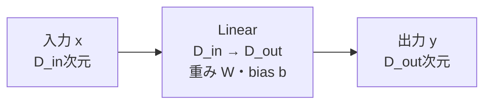
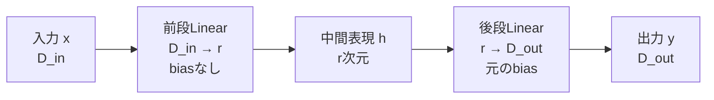
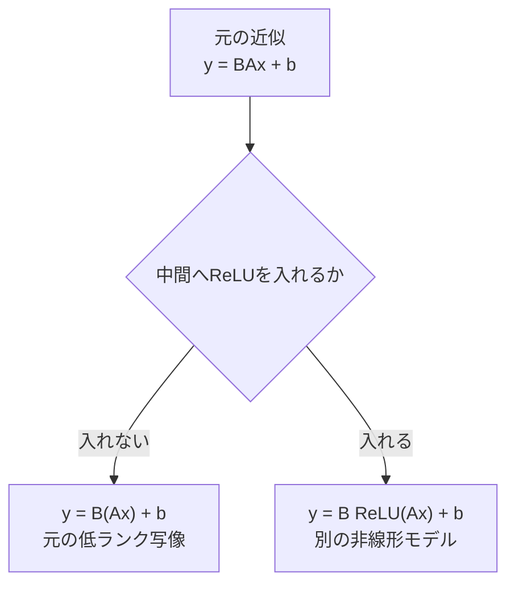
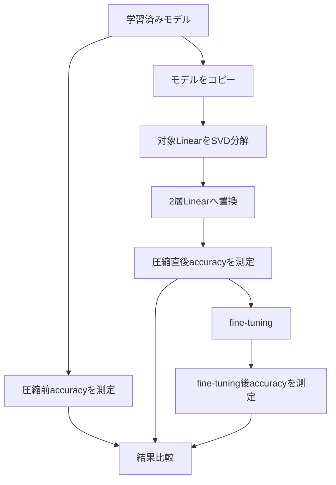

# Linear層を2層へ置き換える

## サマリー

SVDで低ランク近似した重み行列

$$
W_r
=
U_r\Sigma_rV_r^{\mathsf{T}}
$$

は、2つの小さい行列の積として表せる。

$$
W_r=BA
$$

そのため、元の1つのLinear層

$$
y=Wx+b
$$

を、rank $r$ を中間次元とする2つのLinear層へ置き換えられる。

$$
h=Ax
$$

$$
y=Bh+b
$$

したがって、

$$
y=BAx+b
=
W_rx+b
$$

となる。

PyTorchでは、次の構造に対応する。

PyTorchの確認コード：[[05_SVD基礎実装検証/04_Linear層置換のPyTorch手順#PyTorch確認-001]]

重要なのは、2層の間へReLUなどの非線形関数を挟まないことである。

```text
正しい低ランク置換

Linear(D_in, rank)
        ↓
Linear(rank, D_out)
```

```text
元のLinear層の近似ではない構造

Linear(D_in, rank)
        ↓
ReLU
        ↓
Linear(rank, D_out)
```

SVDによる2層化の目的は、表現力を増やすことではない。

- 元の重み行列を低ランク近似する
- パラメータ数を減らす
- 理論上の演算量を減らす
- 入出力形状を保つ

ことが目的である。

---

## 1. 元のLinear層

入力次元を $D_{\mathrm{in}}$、出力次元を $D_{\mathrm{out}}$ とする。

元の重み行列は、

$$
W
\in
\mathbb{R}^{
D_{\mathrm{out}}
\times
D_{\mathrm{in}}
}
$$

である。

biasは、

$$
b
\in
\mathbb{R}^{D_{\mathrm{out}}}
$$

である。

1サンプルを列ベクトルで表すと、

$$
x
\in
\mathbb{R}^{D_{\mathrm{in}}}
$$

$$
y
\in
\mathbb{R}^{D_{\mathrm{out}}}
$$

であり、Linear層は、

$$
y=Wx+b
$$

を計算する。

### ASCII図

```text
入力 x
D_in 次元
   │
   ▼
Linear(D_in, D_out)
重み W
bias b
   │
   ▼
出力 y
D_out 次元
```

### Mermaid図



---

## 2. SVDによる低ランク近似

学習済み重み行列 $W$ をSVDする。

$$
W
=
U\Sigma V^{\mathsf{T}}
$$

上位 $r$ 個の特異値だけを残す。

$$
W_r
=
U_r\Sigma_rV_r^{\mathsf{T}}
$$

各行列の形状は、

$$
U_r
\in
\mathbb{R}^{
D_{\mathrm{out}}
\times
r
}
$$

$$
\Sigma_r
\in
\mathbb{R}^{r\times r}
$$

$$
V_r^{\mathsf{T}}
\in
\mathbb{R}^{
r
\times
D_{\mathrm{in}}
}
$$

である。

行列積の形状は、

$$
(D_{\mathrm{out}}\times r)
(r\times r)
(r\times D_{\mathrm{in}})
=
D_{\mathrm{out}}
\times
D_{\mathrm{in}}
$$

となり、元の重み行列と同じ形状へ戻る。

ただし、

$$
\operatorname{rank}(W_r)
\leq r
$$

である。

---

## 3. $\Sigma_r$ を前段へ吸収する方法

次のように定義する。

$$
A
=
\Sigma_rV_r^{\mathsf{T}}
$$

$$
B
=
U_r
$$

すると、

$$
BA
=
U_r
\left(
\Sigma_rV_r^{\mathsf{T}}
\right)
$$

$$
BA
=
U_r\Sigma_rV_r^{\mathsf{T}}
$$

したがって、

$$
BA=W_r
$$

である。

形状は、

$$
A
\in
\mathbb{R}^{
r
\times
D_{\mathrm{in}}
}
$$

$$
B
\in
\mathbb{R}^{
D_{\mathrm{out}}
\times
r
}
$$

である。

### 2つのLinear層への対応

前段：

PyTorchの確認コード：[[05_SVD基礎実装検証/04_Linear層置換のPyTorch手順#PyTorch確認-002]]

後段：

PyTorchの確認コード：[[05_SVD基礎実装検証/04_Linear層置換のPyTorch手順#PyTorch確認-003]]

重みは、

```text
前段.weight = Σ_r V_rᵀ
後段.weight = U_r
```

となる。

---

## 4. $\Sigma_r$ を後段へ吸収する方法

次のように定義してもよい。

$$
A
=
V_r^{\mathsf{T}}
$$

$$
B
=
U_r\Sigma_r
$$

すると、

$$
BA
=
\left(
U_r\Sigma_r
\right)
V_r^{\mathsf{T}}
$$

$$
BA
=
U_r\Sigma_rV_r^{\mathsf{T}}
$$

したがって、

$$
BA=W_r
$$

である。

重みは、

```text
前段.weight = V_rᵀ
後段.weight = U_r Σ_r
```

となる。

### PyTorchで扱いやすい形

PyTorchでは、$U_r\Sigma_r$ を明示的な行列積で作らなくても、

PyTorchの確認コード：[[05_SVD基礎実装検証/04_Linear層置換のPyTorch手順#PyTorch確認-004]]

と書ける。

これは、$U_r$ の各列へ対応する特異値を掛ける処理である。

---

## 5. $\Sigma_r$ を対称に分配する方法

特異値を前段と後段へ半分ずつ分配することもできる。

$$
A
=
\Sigma_r^{1/2}
V_r^{\mathsf{T}}
$$

$$
B
=
U_r
\Sigma_r^{1/2}
$$

すると、

$$
BA
=
U_r
\Sigma_r^{1/2}
\Sigma_r^{1/2}
V_r^{\mathsf{T}}
$$

$$
BA
=
U_r
\Sigma_r
V_r^{\mathsf{T}}
$$

$$
BA=W_r
$$

となる。

### $\Sigma_r^{1/2}$

特異値は非負なので、

$$
\Sigma_r^{1/2}
=
\operatorname{diag}
\left(
\sqrt{\sigma_1},
\sqrt{\sigma_2},
\ldots,
\sqrt{\sigma_r}
\right)
$$

と定義できる。

### PyTorchでの形

PyTorchの確認コード：[[05_SVD基礎実装検証/04_Linear層置換のPyTorch手順#PyTorch確認-005]]

### どの方法が正しいか

次の3つは、初期化時点ではすべて同じ $W_r$ を表す。

1. 特異値を前段へ吸収
2. 特異値を後段へ吸収
3. 特異値を半分ずつ分配

$$
BA=W_r
$$

が成り立つ限り、初期の出力は同じである。

fine-tuningを行うと、各層の重みは独立に更新されるため、その後の因子はSVDの形を保つとは限らない。

---

## 6. 3つの因子分配方法の比較

| 方法 | 前段重み | 後段重み | 特徴 |
|---|---|---|---|
| 前段へ吸収 | $\Sigma_rV_r^{\mathsf{T}}$ | $U_r$ | 前段へ特異値をまとめる |
| 後段へ吸収 | $V_r^{\mathsf{T}}$ | $U_r\Sigma_r$ | 実装例が多く分かりやすい |
| 対称分配 | $\Sigma_r^{1/2}V_r^{\mathsf{T}}$ | $U_r\Sigma_r^{1/2}$ | 2層のスケールを分けやすい |

現在のMNIST実験では、どれか1つに統一すればよい。

最初は、

$$
A=V_r^{\mathsf{T}}
$$

$$
B=U_r\Sigma_r
$$

とする方法が、PyTorchコードと形状を確認しやすい。

---

## 7. 2層Linearへの置き換え

元の近似後のLinear層を、

$$
y=W_rx+b
$$

とする。

$$
W_r=BA
$$

なので、

$$
y=BAx+b
$$

である。

中間表現を、

$$
h=Ax
$$

と置けば、

$$
y=Bh+b
$$

となる。

したがって、処理は次の2段階へ分かれる。

### 前段

$$
h=Ax
$$

### 後段

$$
y=Bh+b
$$

### ASCII図

```text
元の層

x ∈ R^(D_in)
   │
   ▼
Linear(D_in, D_out)
   │
   ▼
y ∈ R^(D_out)
```

```text
低ランク化後

x ∈ R^(D_in)
   │
   ▼
Linear(D_in, r, bias=False)
   │
   ▼
h ∈ R^r
   │
   ▼
Linear(r, D_out, bias=True)
   │
   ▼
y ∈ R^(D_out)
```

### Mermaid図



---

## 8. なぜ2層にできるのか

行列積には結合則がある。

$$
W_rx
=
\left(
BA
\right)x
$$

$$
W_rx
=
B
\left(
Ax
\right)
$$

つまり、先に

$$
h=Ax
$$

を計算し、その後に

$$
y=Bh
$$

を計算すればよい。

### 形状確認

$$
x
\in
\mathbb{R}^{D_{\mathrm{in}}}
$$

$$
A
\in
\mathbb{R}^{r\times D_{\mathrm{in}}}
$$

なので、

$$
h=Ax
\in
\mathbb{R}^{r}
$$

である。

次に、

$$
B
\in
\mathbb{R}^{D_{\mathrm{out}}\times r}
$$

なので、

$$
y=Bh
\in
\mathbb{R}^{D_{\mathrm{out}}}
$$

となる。

入出力次元は元のLinear層と同じまま、中間だけがrank $r$ 次元になる。

### 小さい行列で2層の計算を全要素確認

具体的に、入力次元3、中間rank 2、出力次元2として、

$$
A
:=
\begin{pmatrix}
1&0&1\\
0&1&1
\end{pmatrix},
\qquad
B
:=
\begin{pmatrix}
2&1\\
1&3
\end{pmatrix}
$$

とする。これらは、特異値を前段または後段へ吸収した後の2因子に対応する。まず、合成weightを全要素で計算すると、

$$
\begin{aligned}
W_r
&=BA\\
&=
\begin{pmatrix}
2&1\\
1&3
\end{pmatrix}
\begin{pmatrix}
1&0&1\\
0&1&1
\end{pmatrix}\\
&=
\begin{pmatrix}
2\cdot1+1\cdot0&2\cdot0+1\cdot1&2\cdot1+1\cdot1\\
1\cdot1+3\cdot0&1\cdot0+3\cdot1&1\cdot1+3\cdot1
\end{pmatrix}\\
&=
\begin{pmatrix}
2&1&3\\
1&3&4
\end{pmatrix}.
\end{aligned}
$$

入力を

$$
x
:=
\begin{pmatrix}
1\\
2\\
3
\end{pmatrix}
$$

とすると、前段の出力は

$$
\begin{aligned}
h
&=Ax\\
&=
\begin{pmatrix}
1&0&1\\
0&1&1
\end{pmatrix}
\begin{pmatrix}
1\\
2\\
3
\end{pmatrix}\\
&=
\begin{pmatrix}
1\cdot1+0\cdot2+1\cdot3\\
0\cdot1+1\cdot2+1\cdot3
\end{pmatrix}\\
&=
\begin{pmatrix}
4\\
5
\end{pmatrix}.
\end{aligned}
$$

後段では、

$$
\begin{aligned}
y
&=Bh\\
&=
\begin{pmatrix}
2&1\\
1&3
\end{pmatrix}
\begin{pmatrix}
4\\
5
\end{pmatrix}\\
&=
\begin{pmatrix}
2\cdot4+1\cdot5\\
1\cdot4+3\cdot5
\end{pmatrix}\\
&=
\begin{pmatrix}
13\\
19
\end{pmatrix}.
\end{aligned}
$$

一方、合成weightを1回で作用させても、

$$
\begin{aligned}
W_rx
&=
\begin{pmatrix}
2&1&3\\
1&3&4
\end{pmatrix}
\begin{pmatrix}
1\\
2\\
3
\end{pmatrix}\\
&=
\begin{pmatrix}
2+2+9\\
1+6+12
\end{pmatrix}\\
&=
\begin{pmatrix}
13\\
19
\end{pmatrix}.
\end{aligned}
$$

よって、この具体例でも

$$
B(Ax)=(BA)x=W_rx
$$

が全要素で確認できる。

---

## 9. 2層Linearは全体として1つのLinearにまとめられる

biasを無視する。

前段を、

$$
f(x)=Ax
$$

後段を、

$$
g(h)=Bh
$$

とする。

合成すると、

$$
g
\left(
f(x)
\right)
=
B
\left(
Ax
\right)
$$

$$
g
\left(
f(x)
\right)
=
BAx
$$

となる。

ここで、

$$
W_{\mathrm{new}}=BA
$$

と置けば、

$$
g
\left(
f(x)
\right)
=
W_{\mathrm{new}}x
$$

である。

したがって、非線形関数を挟まない2つのLinear層は、全体として1つの線形変換である。

---

## 10. biasを含む2層も全体としてアフィン変換

前段と後段の両方にbiasがある一般形を考える。

$$
h=Ax+a
$$

$$
y=Bh+c
$$

代入すると、

$$
y
=
B
\left(
Ax+a
\right)
+c
$$

$$
y
=
BAx
+
Ba
+
c
$$

新しい重みを、

$$
W_{\mathrm{new}}=BA
$$

新しいbiasを、

$$
b_{\mathrm{new}}=Ba+c
$$

と置けば、

$$
y
=
W_{\mathrm{new}}x
+
b_{\mathrm{new}}
$$

となる。

したがって、非線形関数がなければ、biasを含む2層Linearも全体として1つのアフィン変換である。

---

## 11. なぜReLUを挟まないのか

SVDで行っているのは、1つの重み行列を行列積へ分解することである。

$$
W_r=BA
$$

したがって、元の低ランク近似を再現するには、

$$
W_rx
=
BAx
$$

を計算する必要がある。

途中へReLUを入れると、

$$
y
=
B
\operatorname{ReLU}
\left(
Ax
\right)
+b
$$

となる。

これは一般に、

$$
BAx+b
$$

とは等しくない。

### ReLUの定義

要素ごとに、

$$
\operatorname{ReLU}(z)
=
\max(0,z)
$$

を計算する。

負の値は0へ変わるため、線形変換の中間結果を変更してしまう。

### 正しい置換

```text
x
 ↓
Linear A
 ↓
Linear B
 ↓
y

全体：低ランク線形写像
```

### ReLUを入れた場合

```text
x
 ↓
Linear A
 ↓
ReLU
 ↓
Linear B
 ↓
y

全体：非線形写像
元のLinear層の低ランク近似ではない
```

### Mermaid図



---

## 12. ReLUを挟むと一致しない具体例

1次元で考える。

元の線形変換を、

$$
y=-2x
$$

とする。

これを2段階へ分ける。

$$
h=-x
$$

$$
y=2h
$$

このとき、

$$
y=2(-x)=-2x
$$

なので、元の変換を正確に再現する。

### ReLUなし

$x=1$ の場合、

$$
h=-1
$$

$$
y=2(-1)=-2
$$

となる。

### ReLUあり

途中にReLUを入れる。

$$
h=-x
$$

$$
y
=
2\operatorname{ReLU}(h)
$$

$x=1$ の場合、

$$
h=-1
$$

$$
\operatorname{ReLU}(-1)=0
$$

$$
y=0
$$

となる。

元の出力は、

$$
-2
$$

だったため、一致しない。

---

## 13. ReLUを挟んでも偶然一致する場合

特定の入力に対して、

$$
Ax
\geq0
$$

が全成分で成立するなら、

$$
\operatorname{ReLU}(Ax)=Ax
$$

なので、その入力については、

$$
B\operatorname{ReLU}(Ax)
=
BAx
$$

となる。

しかし、すべての入力に対してこの条件が成立するとは限らない。

SVD圧縮の目的は、ある特定入力だけでなく、元のLinear層の写像を近似することである。

そのため、一般にはReLUを挟まない。

---

## 14. 非線形関数を入れてよい場合

目的が変わるなら、ReLUなどを入れてもよい。

たとえば、

PyTorchの確認コード：[[05_SVD基礎実装検証/04_Linear層置換のPyTorch手順#PyTorch確認-006]]

は、低次元ボトルネックを持つ新しい2層ニューラルネットワークである。

この構造には、

- 新しい非線形表現能力
- 元のLinear層とは異なる関数
- 再学習を前提としたモデル設計

という意味がある。

ただし、この場合は、

> 元のLinear層をSVDで分解して同じ写像を近似した

とは言えない。

問題設定が、

```text
元モデルの圧縮
```

から、

```text
新しいアーキテクチャの設計
```

へ変わる。

---

## 15. biasの基本的な扱い

元の層が、

$$
y=Wx+b
$$

である。

低ランク近似後に、

$$
W\approx BA
$$

とする。

元の写像を近似するには、

$$
y\approx BAx+b
$$

としたい。

前段を、

$$
h=Ax
$$

後段を、

$$
y=Bh+b
$$

とすれば、

$$
y=BAx+b
$$

となる。

したがって、基本構成は、

- 前段：biasなし
- 後段：元のbiasをコピー

である。

```text
Linear(D_in, rank, bias=False)
                ↓
Linear(rank, D_out, bias=元と同じ)
```

---

## 16. 前段へbiasを入れた場合

前段biasを $a$ とする。

$$
h=Ax+a
$$

後段を、

$$
y=Bh+b'
$$

とする。

すると、

$$
y
=
B
\left(
Ax+a
\right)
+b'
$$

$$
y
=
BAx
+
Ba
+
b'
$$

元のbias $b$ を再現するには、

$$
Ba+b'=b
$$

を満たす必要がある。

前段biasを任意に入れた上で、後段へ元のbiasをそのままコピーすると、

$$
y=BAx+Ba+b
$$

となり、余分な $Ba$ が加わる。

そのため、初期置換では前段biasを使わない。

---

## 17. 元の層にbiasがない場合

元のLinear層が、

PyTorchの確認コード：[[05_SVD基礎実装検証/04_Linear層置換のPyTorch手順#PyTorch確認-007]]

なら、

$$
y=Wx
$$

である。

圧縮後も、

PyTorchの確認コード：[[05_SVD基礎実装検証/04_Linear層置換のPyTorch手順#PyTorch確認-008]]

とする。

後段だけ新しくbiasを持たせると、元の層にはなかった平行移動が追加されるため、初期出力が一致しない。

---

## 18. バッチ入力での式

バッチ入力を、

$$
X
\in
\mathbb{R}^{
N\times D_{\mathrm{in}}
}
$$

とする。

元のLinear層は、

$$
Y
=
XW^{\mathsf{T}}
+b
$$

を計算する。

低ランク分解で、

$$
W_r=BA
$$

とすると、

$$
W_r^{\mathsf{T}}
=
A^{\mathsf{T}}B^{\mathsf{T}}
$$

である。

圧縮後のバッチ計算は、

$$
H
=
XA^{\mathsf{T}}
$$

$$
Y_r
=
HB^{\mathsf{T}}
+b
$$

となる。

代入すると、

$$
Y_r
=
XA^{\mathsf{T}}B^{\mathsf{T}}
+b
$$

$$
Y_r
=
X
\left(
BA
\right)^{\mathsf{T}}
+b
$$

$$
Y_r
=
XW_r^{\mathsf{T}}
+b
$$

となる。

PyTorchの2層Linearが、列ベクトル表記の $BAx$ と同じ変換を実装していることが分かる。

---

## 19. PyTorchの重み形状

元のLinear層：

PyTorchの確認コード：[[05_SVD基礎実装検証/04_Linear層置換のPyTorch手順#PyTorch確認-009]]

重み形状は、

```text
(D_out, D_in)
```

である。

前段Linear：

PyTorchの確認コード：[[05_SVD基礎実装検証/04_Linear層置換のPyTorch手順#PyTorch確認-010]]

重み形状は、

```text
(rank, D_in)
```

である。

後段Linear：

PyTorchの確認コード：[[05_SVD基礎実装検証/04_Linear層置換のPyTorch手順#PyTorch確認-011]]

重み形状は、

```text
(D_out, rank)
```

である。

これは、

$$
A
\in
\mathbb{R}^{r\times D_{\mathrm{in}}}
$$

$$
B
\in
\mathbb{R}^{D_{\mathrm{out}}\times r}
$$

と一致する。

---

## 20. `Vh` と $V^{\mathsf{T}}$

PyTorchでは、

PyTorchの確認コード：[[05_SVD基礎実装検証/04_Linear層置換のPyTorch手順#PyTorch確認-012]]

と書く。

`Vh` は、実数行列の場合、

$$
V^{\mathsf{T}}
$$

に対応する。

したがって、

PyTorchの確認コード：[[05_SVD基礎実装検証/04_Linear層置換のPyTorch手順#PyTorch確認-013]]

の形状は、

```text
(rank, in_features)
```

である。

これは前段Linearの重み形状と一致する。

### よくある間違い

PyTorchの確認コード：[[05_SVD基礎実装検証/04_Linear層置換のPyTorch手順#PyTorch確認-014]]

とすると、形状は、

```text
(in_features, rank)
```

となり、前段Linearの重み形状と一致しない。

前段へ $V_r^{\mathsf{T}}$ を設定する場合は、

PyTorchの確認コード：[[05_SVD基礎実装検証/04_Linear層置換のPyTorch手順#PyTorch確認-015]]

である。

---

## PyTorch・Python操作：21. 基本的な実装 〜 29. biasを含めて手動で確認する

コードと操作手順は [[05_SVD基礎実装検証/04_Linear層置換のPyTorch手順]] にまとめた。数式や評価の考え方は本ノートで続ける。

---

## 30. パラメータ数の比較

元のLinear層の重み数は、

$$
D_{\mathrm{out}}
D_{\mathrm{in}}
$$

である。

圧縮後の2層の重み数は、

$$
rD_{\mathrm{in}}
+
D_{\mathrm{out}}r
$$

である。

元のbiasを後段へ移す場合、bias数は変わらない。

### コード

PyTorchの確認コード：[[05_SVD基礎実装検証/04_Linear層置換のPyTorch手順#PyTorch確認-016]]

### 圧縮条件

$$
r
\left(
D_{\mathrm{in}}
+
D_{\mathrm{out}}
\right)
<
D_{\mathrm{in}}
D_{\mathrm{out}}
$$

を満たす必要がある。

---

## 31. `Linear(784, 512)` をrank 64へ置き換える例

元の層：

PyTorchの確認コード：[[05_SVD基礎実装検証/04_Linear層置換のPyTorch手順#PyTorch確認-017]]

元の重み数は、

$$
784\times512
=
401{,}408
$$

である。

圧縮後：

PyTorchの確認コード：[[05_SVD基礎実装検証/04_Linear層置換のPyTorch手順#PyTorch確認-018]]

PyTorchの確認コード：[[05_SVD基礎実装検証/04_Linear層置換のPyTorch手順#PyTorch確認-019]]

重み数は、

$$
64\times784
+
512\times64
$$

$$
=
50{,}176
+
32{,}768
$$

$$
=
82{,}944
$$

である。

元に対する割合は、

$$
\frac{
82{,}944
}{
401{,}408
}
\approx
0.2066
$$

である。

重みパラメータは約20.66%になる。

圧縮倍率は、

$$
\frac{
401{,}408
}{
82{,}944
}
\approx
4.84
$$

である。

---

## 32. 2層化だけでは圧縮にならない

rankを最大値にすると、

$$
r
=
\min
\left(
D_{\mathrm{in}},
D_{\mathrm{out}}
\right)
$$

である。

この場合、元の重みをほぼ完全に再構成できる。

しかし、保存する重み数は、

$$
rD_{\mathrm{in}}
+
D_{\mathrm{out}}r
$$

であり、元より多くなる場合がある。

### 例

$$
D_{\mathrm{in}}=784
$$

$$
D_{\mathrm{out}}=512
$$

$$
r=512
$$

なら、

$$
512\times784
+
512\times512
$$

$$
=
401{,}408
+
262{,}144
$$

$$
=
663{,}552
$$

となる。

元の401,408より多い。

したがって、

> Linear層を2層へ分けたこと

自体が圧縮なのではない。

十分に小さいrankへ制限したことによって圧縮になる。

---

## 33. 理論演算量

元のLinear層の主な計算量は、

$$
O
\left(
D_{\mathrm{in}}
D_{\mathrm{out}}
\right)
$$

である。

低ランク2層では、

$$
O
\left(
rD_{\mathrm{in}}
+
D_{\mathrm{out}}r
\right)
$$

となる。

同じrank条件、

$$
r
\left(
D_{\mathrm{in}}
+
D_{\mathrm{out}}
\right)
<
D_{\mathrm{in}}
D_{\mathrm{out}}
$$

を満たせば、理論上の積和演算数も減る。

---

## 34. 実測推論時間が必ず短くならない理由

パラメータ数や理論演算量が減っても、実測速度は必ず改善するとは限らない。

理由には次がある。

- 行列積が1回から2回へ増える
- GPUカーネル起動回数が増える
- 小さい行列積ではGPU効率が低下する
- 中間テンソル $h$ の読み書きが増える
- バッチサイズによって効率が変わる
- CPUとGPUで最適rankが異なる
- PyTorchやBLAS実装の最適化状況が異なる

したがって、評価では、

- パラメータ数
- 理論演算量
- CPU推論時間
- GPU推論時間
- バッチサイズ別時間

を分けて測る。

---

## 35. 置換前後で入力と出力の形状は変えない

元の層：

```text
入力  (N, D_in)
出力  (N, D_out)
```

圧縮後：

```text
入力  (N, D_in)
中間  (N, rank)
出力  (N, D_out)
```

モデルの前後から見ると、

```text
(N, D_in) → (N, D_out)
```

というインターフェースは変わらない。

そのため、元のLinear層を同じ位置で置き換えやすい。

---

## PyTorch・Python操作：36. モデル内の層を置き換える

コードと操作手順は [[05_SVD基礎実装検証/04_Linear層置換のPyTorch手順]] にまとめた。数式や評価の考え方は本ノートで続ける。

---

## 37. 「間にReLUを入れない」と「元のReLUを消す」は別

元モデルが、

```text
Linear
  ↓
ReLU
```

だった場合、Linearだけを2つへ分ける。

```text
Linear A
  ↓
Linear B
  ↓
ReLU
```

とする。

次のようにはしない。

```text
Linear A
  ↓
ReLU
  ↓
Linear B
  ↓
ReLU
```

元のReLUの位置は、分解後の2層の後ろに保つ。

### 数式

元モデル：

$$
h
=
\operatorname{ReLU}
\left(
Wx+b
\right)
$$

圧縮後：

$$
h_r
=
\operatorname{ReLU}
\left(
BAx+b
\right)
$$

である。

途中へReLUを入れると、

$$
h_{\mathrm{wrong}}
=
\operatorname{ReLU}
\left[
B
\operatorname{ReLU}
\left(
Ax
\right)
+b
\right]
$$

となり、別のモデルになる。

---

## PyTorch・Python操作：38. `nn.Sequential` にしたときの名前 〜 43. fine-tuning時の学習可能性

コードと操作手順は [[05_SVD基礎実装検証/04_Linear層置換のPyTorch手順]] にまとめた。数式や評価の考え方は本ノートで続ける。

---

## 44. fine-tuning後もrank制約が保たれる理由

$$
A
\in
\mathbb{R}^{r\times D_{\mathrm{in}}}
$$

$$
B
\in
\mathbb{R}^{D_{\mathrm{out}}\times r}
$$

である。

任意の行列積について、

$$
\operatorname{rank}(BA)
\leq
\min
\left[
\operatorname{rank}(B),
\operatorname{rank}(A)
\right]
$$

である。

また、

$$
\operatorname{rank}(A)\leq r
$$

$$
\operatorname{rank}(B)\leq r
$$

なので、

$$
\operatorname{rank}(BA)\leq r
$$

となる。

fine-tuningで重みが変わっても、中間次元が $r$ のままなら、積のrankは $r$ 以下に制限される。

---

---

## 44.1 fine-tuningで「捨てたrank」が戻るわけではない

SVD後の2因子を、

$$
W_r = BA
$$

としてfine-tuningすると、$A$ と $B$ の値は更新される。
しかし中間次元 $r$ は固定されているため、

$$
\operatorname{rank}(BA) \le r
$$

という構造制約は残る。

したがってfine-tuningによる性能回復は、捨てた特異方向を元へ戻した結果ではない。
**残された低ランク自由度の中で、SVDの行列近似解を分類lossに適した配置へ再最適化した結果**と解釈する。

この区別により、

```text
SVD直後
→ 学習済みweightの冗長性をそのまま測る

SVD + fine-tuning
→ 低rank制約内でタスク性能をどこまで回復できるか測る
```

という2つの問いを分離できる。

## PyTorch・Python操作：45. optimizerを作り直す必要がある 〜 56. 層置換後のモデル構造を確認する

コードと操作手順は [[05_SVD基礎実装検証/04_Linear層置換のPyTorch手順]] にまとめた。数式や評価の考え方は本ノートで続ける。

---

## 57. 2層化前後の関数関係

元モデルの対象部分：

$$
z=Wx+b
$$

$$
h=\operatorname{ReLU}(z)
$$

圧縮後：

$$
z_r=BAx+b
$$

$$
h_r=\operatorname{ReLU}(z_r)
$$

差は、

$$
z-z_r
=
(W-BA)x
$$

である。

ReLU後の差は、

$$
\operatorname{ReLU}(z)
-
\operatorname{ReLU}(z_r)
$$

であり、単純に重み誤差だけでは決まらない。

入力がReLUの0境界付近にあると、小さな線形出力誤差でも活性・非活性が切り替わる可能性がある。

---

## 58. 低ランク化が後続ReLUへ与える影響

あるユニットについて、元のLinear出力を $z_j$、圧縮後を $z_{r,j}$ とする。

元では、

$$
z_j>0
$$

圧縮後では、

$$
z_{r,j}<0
$$

となると、ReLU後は、

$$
\operatorname{ReLU}(z_j)>0
$$

$$
\operatorname{ReLU}(z_{r,j})=0
$$

となる。

小さな符号変化が後続の表現へ影響する。

このため、SVDの重み誤差だけでなく、

- Linear出力誤差
- ReLU後の出力誤差
- モデル全体の精度

も評価する。

---

## 59. rankと中間表現

前段出力は、

$$
h=Ax
$$

である。

$$
h
\in
\mathbb{R}^{r}
$$

なので、rankは中間ボトルネックの次元でもある。

rankを小さくすると、

- パラメータ数が減る
- 理論演算量が減る
- 通過できる独立方向が減る
- 情報損失が増える可能性がある

というトレードオフがある。

---

## 60. 2層の間の表現は新しい隠れ層か

実装上は中間テンソル $h$ が存在する。

しかし、SVD圧縮直後の意味では、

$$
h=Ax
$$

は元のLinear層を計算するための内部表現である。

間に非線形関数がないため、通常のニューラルネットワーク設計でいう独立した非線形隠れ層とは異なる。

fine-tuning後も低ランク因子の中間表現ではあるが、全体は依然としてrank $r$ 以下のアフィン変換である。

---

## 61. 2つの因子は一意ではない

ある分解、

$$
W_r=BA
$$

があるとする。

任意の可逆行列

$$
Q
\in
\mathbb{R}^{r\times r}
$$

に対して、

$$
W_r
=
BQQ^{-1}A
$$

である。

したがって、

$$
B'
=
BQ
$$

$$
A'
=
Q^{-1}A
$$

と置けば、

$$
W_r=B'A'
$$

となる。

つまり、2つの因子 $A$ と $B$ は一意ではない。

SVDは、直交特異ベクトルと非負特異値による、解釈しやすい初期分解を与える。

---

## 62. 特異値の符号を考えなくてよい理由

特異値は、

$$
\sigma_i\geq0
$$

である。

そのため、

$$
\sqrt{\sigma_i}
$$

を使った対称分配も可能である。

特異値の符号は、左右特異ベクトルの向きへ吸収されていると考えられる。

---

## 63. 重み共有ではない

圧縮後の前段と後段は、別々の `nn.Parameter` を持つ。

PyTorchの確認コード：[[05_SVD基礎実装検証/04_Linear層置換のPyTorch手順#PyTorch確認-020]]

は独立したパラメータである。

fine-tuningでは別々に更新される。

重み共有や転置共有を自動的に行う構造ではない。

---

## 64. 途中へBatchNormを入れても同じではない

BatchNormを挟むと、

$$
y
=
B
\operatorname{BN}
\left(
Ax
\right)
+b
$$

となる。

一般に、

$$
B
\operatorname{BN}
\left(
Ax
\right)
\neq
BAx
$$

である。

評価モードで固定アフィン変換として振る舞う場合でも、元の $BA$ と同じになるよう厳密に設定しない限り、別の写像になる。

SVDによる直接置換では、2層の間に追加演算を入れない。

---

## 65. 途中へDropoutを入れても同じではない

Dropoutを挟むと、学習時には中間成分がランダムに0になる。

$$
y
=
B
\operatorname{Dropout}
\left(
Ax
\right)
+b
$$

これは元の線形写像を再現しない。

元モデルにDropoutがLinearの後ろにある場合は、その元の位置を維持する。

---

## 66. 途中へbiasを入れてはいけないのか

数学的には、前段biasを入れても、後段biasを調整すれば同じアフィン変換を表せる。

$$
Ba+b'=b
$$

を満たせばよい。

しかし、

- 不要なパラメータが増える
- 初期化が複雑になる
- 元biasの単純コピーができない
- 圧縮効果がわずかに下がる

ため、基本実装では前段biasを使わない。

---

## 67. SVD圧縮と低ランク層を最初から学習する方法の違い

### 学習後SVD

1. 通常の大きなLinear層を学習
2. 学習済み重みをSVD
3. rankを切り詰める
4. 2層へ置換
5. 必要に応じてfine-tuning

### 最初から低ランク層

1. 最初から `Linear(D_in, r)`
2. 続けて `Linear(r, D_out)`
3. 非線形なしで学習

後者もrank制約付きLinearを学習する方法である。

ただし、通常モデルを学習してから圧縮する実験とは、学習経路が異なる。

現在のロードマップでは、まず学習後SVDを行い、圧縮前後を比較する。

---

## 68. 置換前後の精度確認手順



最低限、

- 圧縮前
- 圧縮直後
- fine-tuning後

を分けて記録する。

---

## PyTorch・Python操作：69. 出力誤差の評価関数 〜 72. よくある実装ミス

コードと操作手順は [[05_SVD基礎実装検証/04_Linear層置換のPyTorch手順]] にまとめた。数式や評価の考え方は本ノートで続ける。

---

## 73. よくある誤解

### Linearの間には必ずReLUを入れる

通常のMLP設計ではよく使うが、SVDによる層分解では入れない。

### 2層にすると表現力が上がる

非線形関数がなければ、全体は1つのアフィン変換である。

ただし、中間次元 $r$ によって表現可能な重みrankが制限される。

### $\Sigma_r$ は独立した層にする必要がある

必要はない。

前段、後段、または両方へ吸収できる。

### 2つの因子はSVDの形で固定される

圧縮直後はSVD由来だが、fine-tuning後は独立に変化する。

### 前段biasを入れる方が高性能

初期置換の目的は元biasを正しく再現することなので、前段biasは不要である。

### 2層化すれば自動で速くなる

実測速度はハードウェアと行列サイズに依存する。

### rank最大なら元と完全に同じだから最良

精度再現には有利だが、圧縮目的には不適切な場合がある。

---

## 74. 研究・面接で説明するなら

### 30秒程度の説明

> SVDでLinear層を圧縮する場合、低ランク近似した重みを $W_r=BA$ と分解し、`Linear(D_in, r)` と `Linear(r, D_out)` の2層へ置き換えます。前段はbiasなし、後段へ元のbiasをコピーします。2層の間にReLUを入れないのは、元のLinear層と同じ種類の線形写像を近似することが目的だからです。ReLUを入れると $B\operatorname{ReLU}(Ax)$ となり、$BAx$ とは異なる非線形モデルになります。

### 研究でどう使うか

MNIST実験では、学習済みLinear層を複数rankで2層化し、

- 出力誤差
- 分類精度
- パラメータ数
- fine-tuning後の回復
- 実測推論時間

を比較する。

また、特異値を前段・後段・対称に分配した初期化が、fine-tuningへ与える影響を補助実験として比較できる。

### 論文ではどう扱われるか

低ランクLinearは、重み行列の行列因子分解として扱われる。

比較では、

- 元モデル
- 切り詰めSVD直後
- fine-tuning後
- 同程度のパラメータ数を持つ別手法

を並べると、圧縮効果を説明しやすい。

---

## 75. このノートで押さえるポイント

- $W_r=U_r\Sigma_rV_r^{\mathsf{T}}$ は、$W_r=BA$ と書ける。
- 前段重みは $(r,D_{\mathrm{in}})$、後段重みは $(D_{\mathrm{out}},r)$ である。
- 特異値は前段、後段、または対称に分配できる。
- どの分配方法でも、初期時点で $BA=W_r$ なら同じ近似を表す。
- 元の1層は、`Linear(D_in, r)` と `Linear(r, D_out)` へ置き換えられる。
- 2層の間にReLUを入れない。
- 元からLinearの後ろにあったReLUは、2層の後ろに残す。
- biasは通常、前段なし・後段へ元biasをコピーする。
- 元の層にbiasがなければ、圧縮後の後段にもbiasを持たせない。
- 最大rankでは元の重みを再現できるが、圧縮になるとは限らない。
- fine-tuning後も積 $BA$ のrankは高々 $r$ である。
- 層を置き換えた後はoptimizerを作り直す。
- 圧縮前モデルをコピーして比較対象として残す。
- `state_dict` のキーは置換後に変わる。
- パラメータ削減と実測速度向上は別に評価する。

---

## 76. 次に読むノート

次は、rankによる圧縮率・パラメータ数・理論演算量の変化を整理する。

- 2層置換のPyTorch手順：[[05_SVD基礎実装検証/09_Linear層の2層置換_実装]]
- [[00_基礎理論/01_数学基礎/01_線形代数/01_SVDとは]]
- [[00_基礎理論/02_ニューラルネットワーク基礎/02_nn.Linearとは]]
- [[00_基礎理論/01_数学基礎/01_線形代数/03_SVDによる低ランク近似]]
- [[00_基礎理論/01_数学基礎/01_線形代数/05_圧縮率とRank]]
- [[00_基礎理論/01_数学基礎/01_線形代数/06_誤差評価]]
- [[05_SVD基礎実装検証/07_PyTorch実装]]
- [[10_MNIST_MLP_SVD/01_MNIST実験]]
