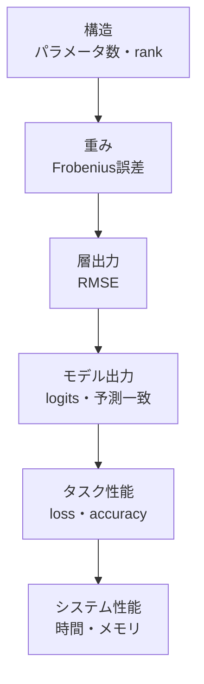

# SVD圧縮モデルの評価

## サマリー

SVD圧縮の評価を、パラメータ数とtest accuracyだけで終わらせない。

圧縮による変化は、次の5段階に分けて測る。



切り詰めSVDが直接最小化するのは重み行列の近似誤差であり、分類accuracyではない。

したがって、

```text
重み誤差が小さい
≠
accuracy低下が必ず小さい
```

である。

評価では、圧縮直後とfine-tuning後を分け、同じbaseline checkpointから各rankのモデルを作成する。

---

## 対応コード

現在の共通評価処理は、主に次へ分離している。

```text
src/nn_compression/metrics/model_comparison.py
src/nn_compression/metrics/macs.py
src/nn_compression/metrics/mlp_macs.py
src/nn_compression/metrics/cnn_macs.py
src/nn_compression/compression/svd.py
src/nn_compression/selection/pareto.py
src/nn_compression/selection/knee.py
```

主要な関数：

```text
count_parameters
parameters_reduction
accuracy_drop
agreement
logits_rmse
benchmark_inference
retained_energy
linear_macs
compressed_linear_macs
conv2d_macs
compressed_conv2d_macs
estimate_mlp_macs
estimate_cnn_linear_macs
estimate_cnn_conv2_macs
estimate_cnn_macs
```

Pareto / kneeの数式処理は `selection` へ置き、**どのrank候補を使うか、どの指標で最終選択するかという実験判断はNotebookへ残す**。

### 現在の実装状況

| 評価項目 | 現在 |
|---|---|
| validation / test loss・accuracy | 実装済み |
| parameter count / 削減率 | 実装済み |
| Linear / Conv2d MACs | 実装済み |
| prediction agreement | `agreement` として実装済み |
| logits RMSE | 実装済み |
| retained energy | Linear / Conv2d対応済み |
| inference latency | 実装済み |
| Pareto frontier | 実装済み |
| knee選択 | 実装済み |
| Validationのearly-stop用 / rank選択用分離 | Fashion-MNIST実験で実施済み |
| fine-tuning前後比較 | Fashion-MNIST実験で実施済み |
| CSV / model保存 | Fashion-MNIST実験で実施済み |
| 複数seed平均・標準偏差 | 今回は未実施 |

> [!note]
> confusion matrixは最終rank選択の必須指標にはしていない。rank選択ではValidation loss / accuracy、parameters、MACs、Pareto / kneeを中心に扱う。

## 1. 評価レベルを分ける理由

1つの指標だけでは、どこで差が生じたか分からない。

たとえばaccuracyが低下したとき、原因候補は次のように分かれる。

- 重み近似が粗すぎる
- 実データが捨てた特異方向を多く使っている
- ReLUの符号反転が増えた
- logitsのmarginが小さくなった
- 一部クラスだけ誤りが増えた
- 複数層を同時に圧縮して誤差が累積した

したがって、重みから最終accuracyまで段階的に測る。

---

## 2. 構造評価

最初に記録するのは、モデル構造そのものである。

### 記録項目

- 圧縮対象層
- 元の `in_features`
- 元の `out_features`
- 指定rank
- 最大rank
- パラメータ数
- 削減率
- 圧縮倍率
- 圧縮対象層数

### 学習可能パラメータ数

PyTorchの確認コード：[[05_SVD基礎実装検証/10_評価設計のPyTorchコード#PyTorch確認-001]]

### モデル全体と対象層を分ける

次を別々に記録する。

```text
対象層だけの削減率
モデル全体の削減率
```

小さい層だけを圧縮しても、モデル全体への効果は小さい。

---

## 3. 重み行列の誤差

元重みを $W$、再構成した低ランク重みを $W_r$ とする。

### Frobenius誤差

$$
E_F
=
\left\lVert
W-W_r
\right\rVert_F
$$

### 相対Frobenius誤差

$$
E_{\mathrm{rel}}
=
\frac{
\left\lVert
W-W_r
\right\rVert_F
}{
\left\lVert
W
\right\rVert_F
}
$$

相対値にすることで、shapeや重みスケールの異なる層を比較しやすい。

### 二乗誤差と特異値

切り詰めSVDでは、

$$
\left\lVert
W-W_r
\right\rVert_F^2
=
\sum_{i=r+1}^{k}
\sigma_i^2
$$

である。

実装で計算した誤差と、捨てた特異値二乗和が一致するかを検査できる。

---

## 4. 累積特異値エネルギー

rank $r$ までの保持率を、

$$
E(r)
=
\frac{
\sum_{i=1}^{r}
\sigma_i^2
}{
\sum_{i=1}^{k}
\sigma_i^2
}
$$

とする。

これは重みのFrobeniusノルムに対する保持率である。

### 注意

- 99%保持ならaccuracyも99%維持、という意味ではない
- NN重みの特異値はSchmidt係数ではない
- rank候補を絞る補助指標として使う

### 層ごとのenergyとモデル全体の評価を分ける

第$\ell$層の特異値を$\sigma_i^{(\ell)}$とすると、その層の保持率は

$$
E_{\ell}(r_{\ell})
:=
\frac{
\sum_{i=1}^{r_{\ell}}
\left(\sigma_i^{(\ell)}\right)^2
}{
\sum_i
\left(\sigma_i^{(\ell)}\right)^2
}.
$$

したがって、$E_1(r_1)$は第1層の特異値と$r_1$だけから計算され、第2層のrank $r_2$を変えても数値は変わらない。同様に$E_2(r_2)$も第2層だけの指標である。

一方、2層を同時に圧縮したモデルの

$$
L_{\mathrm{val}}(r_1,r_2),
\qquad
\operatorname{accuracy}(r_1,r_2)
$$

は、両方の近似を通った最終出力から計算するため、一般には$r_1$と$r_2$の両方に依存する。パラメータ数も各層の和

$$
P_{\mathrm{model}}(r_1,r_2)
=
P_1(r_1)+P_2(r_2)+P_{\mathrm{other}}
$$

で評価する。つまり、**層単独のenergyは独立に計算し、rank pairの良否はモデル全体で結合して評価する**。

---

## 5. 層出力誤差

同じ入力 $X$ を、元Linear層と圧縮Linear層へ与える。

バッチサイズを $N$、出力次元を $D$ として

$$
X\in\mathbb R^{N\times D_{\mathrm{in}}},
\qquad
Y,\hat Y\in\mathbb R^{N\times D}
$$

とする。

$$
Y
=
XW^{\mathsf{T}}+b
$$

$$
\hat{Y}
=
XW_r^{\mathsf{T}}+b
$$

差分を

$$
E=Y-\hat Y
$$

と置くと、層出力RMSEは**全サンプル・全出力要素**で平均して

$$
\boxed{
\operatorname{RMSE}
=
\sqrt{
\frac{1}{ND}
\sum_{n=1}^{N}
\sum_{j=1}^{D}
E_{nj}^2
}
}
$$

である。

Frobenius normを使えば、

$$
\begin{aligned}
\|E\|_F^2
&=
\sum_{n=1}^{N}
\sum_{j=1}^{D}
E_{nj}^2,
\end{aligned}
$$

なので、

$$
\boxed{
\operatorname{RMSE}
=
\frac{\|Y-\hat Y\|_F}{\sqrt{ND}}
}
$$

とも書ける。

重み誤差より、実際の入力分布に対する影響を直接反映する。

### ランダム入力と実データ入力

- ランダム入力：実装テスト向け
- MNIST実データ：実験評価向け

最終判断には実データを使う。

---

## 6. dataset全体のRMSEを正しく集計する

バッチ $b$ の差分Tensorの全要素数を $M_b$ とすると、
二乗誤差和と全体MSEは

$$
\begin{aligned}
S_b&=\sum_{n,j}(Y^{(b)}_{n,j}-(Y_r^{(b)})_{n,j})^2,\\
\operatorname{MSE}_{\mathrm{all}}
&=\frac{\sum_bS_b}{\sum_bM_b}
=\sum_b\frac{M_b}{\sum_\ell M_\ell}\operatorname{MSE}_b,\\
\operatorname{RMSE}_{\mathrm{all}}
&=\sqrt{\frac{\sum_bS_b}{\sum_bM_b}}.
\end{aligned}
$$

ここで固定出力次元 $D$ なら $M_b=N_bD$ であり、$N_b$ はbatchのsample数である。
sample数だけで割ると、全要素MSEではなくsample当たりの二乗L2誤差になる。
二乗誤差を集計してから平方根を取る順序を保つ。

バッチごとのRMSEを単純平均すると、最後の小さいバッチや要素数の差によって重み付けがずれる。

正しくは、全バッチの二乗誤差和と要素数を積算する。

```text
sum_squared_error += ((a - b) ** 2).sum()
num_elements      += a.numel()
```

最後に、

$$
\operatorname{RMSE}
=
\sqrt{
\frac{
\text{sum squared error}
}{
\text{number of elements}
}
}
$$

を計算する。

前節の行列出力なら

$$
\text{number of elements}=ND
$$

である。Conv feature mapのような高階Tensorでも、`num_elements`を実際の全要素数にすれば同じ定義を使える。

---

## 7. 中間層出力を取得する方法

### 対象層を直接呼ぶ

入力がすでに対象層の直前まで準備できているなら、元層と圧縮層を直接比較する。

### forward hookを使う

モデル全体を通常どおり実行し、特定Moduleの出力を記録する。

hookは、

- 元の `fc1`
- 圧縮後 `fc1`

へそれぞれ登録する。

### 注意

置換後の `fc1` がSequentialなら、

- Sequential全体の出力
- 前段出力
- 後段出力

のどれを測るか明示する。

元Linearと比較するのは、Sequential全体の出力である。

---

## 8. logits RMSE

モデル最終出力のlogitsを比較する。

元モデルを、

$$
f(x)
$$

圧縮モデルを、

$$
\hat{f}(x)
$$

とする。

クラス数を $C$ とすると、

$$
\boxed{
\operatorname{RMSE}_{\mathrm{logits}}
=
\sqrt{
\frac{1}{NC}
\sum_{n=1}^{N}
\sum_{c=1}^{C}
\left(
f(x_n)_c
-
\hat{f}(x_n)_c
\right)^2
}
}
$$

である。

MNIST / Fashion-MNIST / CIFAR-10では $C=10$。

accuracyが同じでもlogitsが大きく変わっている場合があるため、モデル挙動の差をより細かく見られる。

---

## 9. 予測一致率

元モデルと圧縮モデルの予測クラスが一致した割合を測る。

$$
A_{\mathrm{agree}}
=
\frac{1}{N}
\sum_{n=1}^{N}
\mathbf{1}
\left[
\arg\max_c f(x_n)_c
=
\arg\max_c \hat{f}(x_n)_c
\right]
$$

### accuracyとの違い

- test accuracy：正解ラベルとの一致
- prediction agreement：元モデルとの一致

圧縮モデルが元モデルと違う予測をしても、それが正解になる場合もある。そのため両方記録する。

---

## 10. cross-entropy loss

accuracyは、正解か不正解かだけを見る。

cross-entropy lossは、正解クラスへの確信度も反映する。

したがって、

- accuracyはほぼ同じ
- test lossは悪化

という結果もあり得る。

この場合、決定境界のmarginや確率校正が変化している可能性がある。

モデル出力はsoftmax前のlogitsのまま `CrossEntropyLoss` へ渡す。

---

## 11. test accuracy

MNISTでは、

PyTorchの確認コード：[[05_SVD基礎実装検証/10_評価設計のPyTorchコード#PyTorch確認-002]]

で予測クラスを得る。

正解数は、

PyTorchの確認コード：[[05_SVD基礎実装検証/10_評価設計のPyTorchコード#PyTorch確認-003]]

全サンプル数は、

PyTorchの確認コード：[[05_SVD基礎実装検証/10_評価設計のPyTorchコード#PyTorch確認-004]]

で積算する。

最後に、

$$
\operatorname{Accuracy}
=
\frac{\text{correct}}{\text{total}}
$$

とする。

### loss集計

`CrossEntropyLoss` がバッチ平均を返す場合、

PyTorchの確認コード：[[05_SVD基礎実装検証/10_評価設計のPyTorchコード#PyTorch確認-005]]

としてサンプル数を掛け、最後に全サンプル数で割る。

---

## 12. confusion matrix

accuracyだけでは、どの数字の誤りが増えたか分からない。

confusion matrixで、圧縮後に増えた混同を調べる。

### 比較方法

- baselineのconfusion matrix
- 圧縮直後
- fine-tuning後

を同じ表示範囲で並べる。

差分行列も保存すると、どのクラス対で誤りが増減したか見やすい。

---

## 13. 圧縮直後とfine-tuning後

必ず次の3状態を分ける。

```text
Baseline
SVD直後
SVD + fine-tuning
```

### SVD直後

学習済み重みを行列誤差の意味で近似しただけの状態。

### fine-tuning後

低rank構造を保ったまま、分類lossへ再適応した状態。

fine-tuningでaccuracyが回復しても、元のdense weightへ戻ったわけではない。2つの小さいLinear層のパラメータだけを更新する。

### fine-tuning前後は同じRank-Selection Validationで比較する

$$
\Delta\mathrm{Accuracy}
=
\mathrm{Acc}_{\mathrm{after}}
-
\mathrm{Acc}_{\mathrm{before}}
$$

$$
\Delta L
=
L_{\mathrm{after}}
-
L_{\mathrm{before}}
$$

accuracyは正なら改善、lossは負なら改善である。

Fine-tuningはrankを変えず、低ランク因子の値だけを更新するので、同じrankならparametersと理論MACsはBefore/Afterで変わらない。

---

### 回復量をpercentage pointで計算する

dense・SVD直後・FT後を、説明用の値で比較する。
同じ評価集合・同じ評価手順で得たaccuracyを $A_{\mathrm{dense}},A_{\mathrm{svd}},A_{\mathrm{ft}}$ とすると

$$
\begin{aligned}
D&=A_{\mathrm{dense}}-A_{\mathrm{svd}}
&&\text{（圧縮直後の低下）},\\
R&=A_{\mathrm{ft}}-A_{\mathrm{svd}}
&&\text{（FTによる回復）},\\
G&=A_{\mathrm{dense}}-A_{\mathrm{ft}}
&&\text{（FT後にも残る差）},\\
D&=R+G.
\end{aligned}
$$

$90\%\to84\%\to89.2\%$ なら

$$
\begin{aligned}
D&=90.0-84.0=6.0\ \text{percentage points},\\
R&=89.2-84.0=5.2\ \text{percentage points},\\
G&=90.0-89.2=0.8\ \text{percentage points},\\
R/D&=5.2/6.0\approx0.8667.
\end{aligned}
$$

「6.0%減」ではなく6.0ポイント減であり、相対低下率は $6.0/90.0\approx6.67\%$ になる。
同様に $95\%\to85\%\to93\%$ は低下10、回復8、残る差2ポイントである。
どちらも説明用の仮の値で、repoの新しい実測値として報告しない。
FT後がdenseより良ければ $G<0$ となり、FT後が圧縮直後より悪ければ $R<0$ もあり得る。
$D=0$ の場合に回復比 $R/D$ は定義しない。

### FTによる回復は、性能上限やrank不足の証明ではない

低ランク因子を更新しても、その内部次元として設定したrank上限とparameter数は同じである。
因子の列・行が従属すれば積のexact rankは設定rankより小さくなるので、
「rank固定」は常にexact rankがその値だという意味ではない。

FTで回復した結果は「この構造で、その学習手順により、その評価性能を実現できた」という証拠である。
その構造の到達可能な**性能上限**を測ったわけではない。
反対に回復しなかった結果だけでも、rank不足を証明できない。
optimizer・learning rate・学習予算・初期値・Early Stopping・汎化のばらつきなどが影響するからである。
上の $G=0.8$ ポイントを全て「rank不足による不可避な損失」と帰属させない。

SVDが最適化するweightのFrobenius誤差と、FTが最適化する分類lossは違う。
低ランクという制約が汎化へ良く働く可能性や、初期値・parameter化が学習経路を変える可能性はあるが、
「正則化が効いた」「冗長なparameterだけ除いた」と原因を断定するには追加比較が必要である。
同じlearning rateでもdense weightと因子の更新が一致しないことは
[[12_PyTorch学習と評価の基礎]] で途中式を確認する。

改善が大きい場合は、まず同じ評価data・前処理・評価件数・分母・
`eval()`/`no_grad()`・最良stateの復元・baselineの独立性を確認する。
FT前後をtestで何度も見てrankやepochを選び直さず、選択にはtrain/validationを使う。
全候補を固定した後の最終test比較と、途中のvalidationによる選択を分ける。

因子化自体の効果と「さらに学習した」効果を区別したいなら、
denseにも同程度の追加学習予算を与える対照実験が必要になる。
本節はその比較設計の説明であり、追加学習や再実験は実行していない。
複数seedでも各seed内では同じbaselineを共有する。
FTを省略して圧縮直後のrankをvalidationで選ぶ実験も有効だが、
「後からFTした場合の性能」とは分けて報告する。
保存したparameter比0.3は残存30%・削減70%であり、削減30%とは書かない。

## 14. optimizerと候補モデルを独立させる

圧縮層へ置換した後に、新しいoptimizerを作る。

```text
モデルをコピー
↓
層を置換
↓
圧縮直後を評価
↓
optimizerを新規作成
↓
fine-tuning
```

複数候補をfine-tuningするときは、候補ごとに次を独立にする。

- モデル本体
- optimizer
- best validation loss
- best model state
- patience counter
- history

モデル本体は、元候補を直接更新せず、

PyTorchの確認コード：[[05_SVD基礎実装検証/10_評価設計のPyTorchコード#PyTorch確認-006]]

のように独立コピーしてから学習する。

---

## 15. rank sweep

rank候補を複数試す。

各層に同じrankを与える必要はない。

```text
fc1 rank = 64
fc2 rank = 32
```

のような組合せも評価する。

### 同じbaselineから作る

rank 16のfine-tuning結果を、rank 32の初期値に使わない。

すべて同じbaseline checkpointから独立に作成する。

---

## 16. validationとtestの役割

### validation lossをrank候補の添字付きで書く

rank候補 $r$ のモデルを $f_r$、1 sampleのlossを $\ell$ とすると

$$
L_{\mathrm{val}}(r)
=\frac{1}{N_{\mathrm{val}}}
\sum_{i=1}^{N_{\mathrm{val}}}\ell(f_r(x_i),y_i),
$$

$$
A_{\mathrm{val}}(r)
=\frac{1}{N_{\mathrm{val}}}\sum_{i=1}^{N_{\mathrm{val}}}
\mathbf 1\left[\operatorname*{arg\,max}_c(f_r(x_i))_c=y_i\right].
$$

各batchでlossをsample平均した $L_b(r)$ を記録する場合、
sample数を $N_b$ として

$$
\begin{aligned}
L_{\mathrm{val}}(r)
&=\frac{\sum_b\sum_{i\in b}\ell(f_r(x_i),y_i)}{\sum_bN_b}\\
&=\frac{\sum_bN_bL_b(r)}{\sum_bN_b}.
\end{aligned}
$$

これはclass weightやignore対象がない、通常の1 sampleごとのloss平均の式である。
末尾の小さいbatchも同じ1票で平均する方式とは区別する。
候補選択ではvalidationを使い、test loss・accuracyを見てrankを選び直さない。

rankを選ぶためにtest setを使わない。

```text
train
└── baseline学習・fine-tuning

validation
└── rank、学習率、epoch数の選択

test
└── 最終的な1回の報告
```

### Early-Stopping用ValidationとRank選択用Validation

より厳密に分けるなら、学習用データを、

```text
Train
Early-Stopping Validation
Rank-Selection Validation
```

へ分割する。

Early Stoppingに使った値とRank-Selection Validationで測ったlossを直接比較しない。異なるデータ集合上の値だからである。

### Baselineも同じRank-Selection Validation上で評価する

$$
\Delta\mathrm{Acc}
=
\mathrm{Acc}_{\mathrm{baseline,rankval}}
-
\mathrm{Acc}_{\mathrm{compressed,rankval}}
$$

を使う。

Test結果を見てrankを変更するとtest leakageになる。

---

## 17. 複数seedと1-SE rule

1つのseedだけでは、学習初期値やDataLoader順序によるばらつきを評価できない。

研究結果としてまとめる段階では複数seedで平均・標準偏差等を記録する。

通常の1-SE ruleは、複数回の学習・交差検証から得た平均値の標準誤差を使う。

単一の学習済みbaselineを固定し、rankだけを決定論的に変える場合、学習手続きのばらつきを表すSEは得られない。その条件では1-SE ruleを主選択法にしない。

---

## 18. 結果レコードの設計

rankごとに1行の辞書またはCSVレコードを作る。

推奨列：

```text
experiment_id
profile
seed
target_layers
rank_fc1
rank_fc2
rank_fc3
params
param_reduction
compression_ratio
retained_energy_fc1
weight_rel_error_fc1
layer_rmse_fc1
logits_rmse
prediction_agreement
test_loss_before_ft
test_acc_before_ft
test_loss_after_ft
test_acc_after_ft
latency_ms
memory_bytes
```

実測していない項目は空欄にし、0を入れない。

---

## 19. 評価の優先順位

最初に追加するなら、次の順がよい。

1. rank–パラメータ数–test accuracy
2. 圧縮直後とfine-tuning後
3. 推論時間
4. 重み相対誤差
5. logits RMSE・予測一致率
6. confusion matrix
7. memory
8. 複数seed

---

## 20. 評価結果の読み方

### パラメータ数は大幅減、accuracyは維持

良好な圧縮候補である。次にlatencyを確認する。

### 重み誤差は大きいがaccuracyは維持

捨てた方向が分類へ強く寄与していない可能性がある。

### 重み誤差は小さいがaccuracyが低下

小さい変化がReLUや分類marginへ大きく影響した可能性がある。層出力とlogitsを確認する。

### accuracyは同じだがlossが悪化

正解は維持しているが、正解クラスのmarginが縮小している可能性がある。

### fine-tuningで大幅回復

低rank表現力は足りているが、単純SVD因子がtask lossに最適でなかった可能性がある。

### 理論MACsは減ったがlatencyは改善しない

小さい行列積を複数回実行するオーバーヘッドやハードウェア利用効率を確認する。

---

## 21. よくある間違い

### accuracyだけを見る

重み誤差、loss、prediction agreement、時間を分けて見る。

### rankごとに別のbaselineを学習する

学習差と圧縮差が混ざる。

### test setでrankを選ぶ

最終評価が楽観的になる。

### バッチRMSEを単純平均する

全要素の二乗誤差和から計算する。

### 圧縮後にoptimizerを作り直さない

新しい低ランク層が学習されない。

### fine-tuning後だけを報告する

SVD単体の効果が分からない。圧縮直後も残す。

### 未測定値を0として保存する

実際に0なのか、欠損なのか区別できない。

---

## 22. 最終モデル選択のルール

Pareto frontierは候補集合を与えるが、常に1モデルへ絞れるとは限らない。
最終的に1つへ決める場合は、優先順位をTestを見る前に明記する。

例：

```text
1. parameters + validation_lossでPareto frontier
2. 複数残ればvalidation_loss最小
3. 同値ならparameters最小
4. 同値ならvalidation_accuracy最大
```

---

## 23. このノートで押さえるポイント

- 評価を構造、重み、層出力、logits、タスク、システムへ分ける。
- SVDが直接最小化するのは重み行列誤差である。
- 層出力RMSEは全サンプル・全出力要素を分母にする。
- dataset全体では二乗誤差和と要素数を積算してから平方根を取る。
- logits RMSEとprediction agreementをaccuracyと分けて記録する。
- 圧縮直後とfine-tuning後を分ける。
- 各rankは同じbaseline checkpointから作る。
- rank選択はvalidationで行う。

---

> [!note] 実測・実行結果は [[10_MNIST_MLP_SVD/02_MNIST評価で使用した指標と実装]] へ分離した。

## 次に読むノート

- 学習・評価ループのPyTorch操作：[[05_SVD基礎実装検証/12_PyTorch学習と評価の基礎]]
- 集計表のPython・pandas操作：[[05_SVD基礎実装検証/13_PandasとPython実装メモ]]
- [[00_基礎理論/04_実験設計/11_理論計算量とベンチマーク]]
- [[00_基礎理論/01_数学基礎/01_線形代数/05_圧縮率とRank]]
- [[00_基礎理論/01_数学基礎/01_線形代数/06_誤差評価]]
