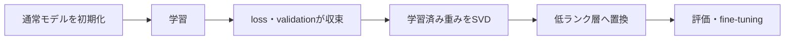

# Linear層のSVD実装

## サマリー

このノートでは、学習済み `nn.Linear` の重み行列を取り出し、`torch.linalg.svd` を使って上位rank成分を得る処理を整理する。

対象となる重みは、

$$
W
\in
\mathbb{R}^{
D_{\mathrm{out}}
\times
D_{\mathrm{in}}
}
$$

である。

PyTorchでは、

```python
U, S, Vh = torch.linalg.svd(
    weight,
    full_matrices=False,
)
```

によりReduced SVDを行う。

rank $r$ の切り詰めでは、

$$
U_r
=
U[:, :r]
$$

$$
S_r
=
S[:r]
$$

$$
V_r^{\mathsf{T}}
=
Vh[:r, :]
$$

を取り出す。

実装上の中心は、SVDそのものよりも次の点である。

- 重みのshapeを正しく読む
- rank上限を検査する
- `detach()` と `torch.no_grad()` を混同しない
- 最大rankで再構成できることをテストする
- deviceとdtypeを保つ
- `.data` による危険な更新を避ける

理論は [[00_基礎理論/01_数学基礎/01_線形代数/01_SVDとは]] と [[00_基礎理論/01_数学基礎/01_線形代数/03_SVDによる低ランク近似]] を参照する。このノートでは、PyTorch上のテンソル操作と実装判断に集中する。

---

## 対応コード

現在の共通実装では、SVDそのものとLinear固有処理を分離している。

```text
src/nn_compression/compression/svd.py
src/nn_compression/compression/linear_svd.py
```

主要な公開関数：

```python
from nn_compression.compression import (
    truncated_svd,
    rebuild_linear_from_svd,
    factorize_linear_layer,
    factorize_named_linear,
    retained_energy,
)
```

役割：

| 関数 | 役割 |
|---|---|
| `truncated_svd` | 2次元行列へReduced SVDを行い、上位rank因子を返す |
| `rebuild_linear_from_svd` | 低rank近似weightを元と同じ1層Linearへdense再構成する |
| `factorize_linear_layer` | Linearを `in → rank → out` の2層へ置換する |
| `factorize_named_linear` | 指定Linear属性だけを置換したmodelコピーを返す |
| `retained_energy` | Linear / Conv2dのweightに対する特異値エネルギー保持率 |

旧Notebookとの後方互換用aliasとして、

```text
SVD        → truncated_svd
RebuildSVD → rebuild_linear_from_svd
```

も残している。

現在の `factorize_linear_layer` は、元Linearが `bias=False` の場合もその状態を維持し、元weightのdevice / dtypeを新しい層へ引き継ぐ。

## 1. `nn.Linear` の重みshape

PyTorchの、

```python
nn.Linear(
    in_features=D_in,
    out_features=D_out,
)
```

が持つ重みは、

```text
(out_features, in_features)
```

である。

たとえば、

```python
nn.Linear(784, 512)
```

なら、

```text
weight.shape = (512, 784)
bias.shape   = (512,)
```

である。

バッチ入力、

$$
X
\in
\mathbb{R}^{N\times784}
$$

に対して、PyTorch内部の計算は、

$$
Y
=
XW^{\mathsf{T}}+b
$$

となる。

SVDする対象は `weight` 本体であり、shapeは `(512, 784)` のまま扱う。

### よくある混乱

NumPyで、

```python
x @ W
```

と書く例では、重みを `(in_features, out_features)` と置く場合がある。

PyTorchの `nn.Linear.weight` は逆向きの、

```text
(out_features, in_features)
```

で保存される。

そのため、実装中は常に、

```python
print(layer.weight.shape)
```

で確認する。

---

## 2. Reduced SVDを使う理由

重みを、

$$
W
\in
\mathbb{R}^{m\times n}
$$

とする。

$$
k
=
\min(m,n)
$$

とおく。

`full_matrices=False` のとき、

$$
U
\in
\mathbb{R}^{m\times k}
$$

$$
S
\in
\mathbb{R}^{k}
$$

$$
V^{\mathsf{T}}
\in
\mathbb{R}^{k\times n}
$$

となる。

低ランク近似で必要なのは最大でも $k$ 個の特異値である。完全な正方直交行列まで作る必要はないため、圧縮実装では、

```python
full_matrices=False
```

を標準とする。

### `fc1 = Linear(784, 512)` の例

```text
W  : (512, 784)
U  : (512, 512)
S  : (512,)
Vh : (512, 784)
```

rank 64では、

```text
U_r  : (512, 64)
S_r  : (64,)
Vh_r : (64, 784)
```

となる。

---

## 3. rankの上限

rank $r$ は、

$$
1
\leq
r
\leq
\min
\left(
D_{\mathrm{out}},
D_{\mathrm{in}}
\right)
$$

を満たす必要がある。

プロファイルBでは、

```text
fc1: Linear(784, 512)  → r <= 512
fc2: Linear(512, 256)  → r <= 256
fc3: Linear(256, 10)   → r <= 10
```

である。

### `fc3` でrank 64を指定できない理由

`fc3.weight` は、

```text
(10, 256)
```

である。

Reduced SVDの特異値数は、

$$
\min(10,256)
=
10
$$

である。

したがって、

```python
U[:, :64]
S[:64]
Vh[:64, :]
```

としても、実際には64成分を取り出せない。新しく作った `Linear(256, 64)` と因子shapeが一致しなくなる。

### rank検査

関数の冒頭で、少なくとも次を検査する。

```python
max_rank = min(weight.shape)

if not 1 <= rank <= max_rank:
    raise ValueError(...)
```

エラーメッセージには、

- 指定rank
- 最大rank
- 重みshape

を含める。

---

## 4. `layer.weight.detach()` を使う理由

学習済み重みは通常、

```python
layer.weight.requires_grad is True
```

である。

SVD因子を初期値として作る処理では、元の学習グラフへ勾配を戻す必要がない。そのため、

```python
weight = layer.weight.detach()
```

として、元パラメータと値を共有しながらautograd上の接続を切る。

### `detach()` が行うこと

- 新しいTensorビューを返す
- 値は元Tensorと共有する
- `requires_grad=False` になる
- 以後の計算は元パラメータへ逆伝播しない

### `clone()` も使う場合

SVD前の重みを独立したTensorとして保持したいなら、

```python
weight = layer.weight.detach().clone()
```

とする。

単に読み取って直ちにSVDするだけなら、`clone()` は必須ではない。

---

## 5. `detach()` と `torch.no_grad()` の違い

この点は、今回の実装で特に重要である。

### `detach()`

特定のTensorを計算グラフから切り離す。

```python
weight = layer.weight.detach()
U, S, Vh = torch.linalg.svd(weight, full_matrices=False)
```

### `torch.no_grad()`

ブロック内の計算全体について、勾配記録を一時的に無効にする。

```python
with torch.no_grad():
    new_layer.weight.copy_(factor)
```

### 今回の使い分け

```text
元重みをSVDの入力として読む
└── detach()

新しいnn.Parameterへ値をコピーする
└── torch.no_grad()
```

SVD計算は、

```python
U_r, S_r, Vh_r = truncated_svd(
    layer.weight.detach(),
    rank,
)
```

で十分である。

一方、

```python
first_layer.weight.copy_(Vh_r)
```

は学習可能な `nn.Parameter` へのin-place更新であるため、

```python
with torch.no_grad():
```

の中で行う。

### 判断基準

次の質問で判断する。

> この処理の後に、この処理自体へbackwardしたいか。

- 必要である → 勾配追跡を残す
- 不要である → `detach()` または `no_grad()` の候補

---

## 6. なぜSVD全体を `no_grad()` で囲まないのか

SVD因子を作るだけなら、次のどちらも可能である。

```python
U, S, Vh = torch.linalg.svd(
    layer.weight.detach(),
    full_matrices=False,
)
```

```python
with torch.no_grad():
    U, S, Vh = torch.linalg.svd(
        layer.weight,
        full_matrices=False,
    )
```

この実装では、前者を標準とする。

理由は、

- どのTensorを切り離すか明示できる
- 関数の外側まで勾配無効範囲を広げない
- `truncated_svd(weight, rank)` をTensor用の純粋な関数にしやすい
- SVDとパラメータコピーの責務を分けられる

ためである。

`no_grad()` が誤りなのではない。今回の関数分割では、SVD入力に `detach()`、パラメータ代入に `no_grad()` とする方が意図が明確である。

---

## 7. `.data` を標準にしない理由

古い例では、

```python
layer.weight.data
```

や、

```python
new_layer.weight.data = value
```

が使われることがある。

しかし `.data` はautogradの管理を迂回するため、意図しないin-place変更を検出できない場合がある。

この実装では、次を標準とする。

### 読み取り

```python
layer.weight.detach()
```

### 書き込み

```python
with torch.no_grad():
    new_layer.weight.copy_(value)
```

`copy_()` を使えば、既存の `nn.Parameter` オブジェクトを保ったまま値だけを変更できる。

---

## 8. 切り詰めSVDのshape

重みを、

$$
W
\in
\mathbb{R}^{m\times n}
$$

とする。

rank $r$ の因子は、

$$
U_r
\in
\mathbb{R}^{m\times r}
$$

$$
S_r
\in
\mathbb{R}^{r}
$$

$$
V_r^{\mathsf{T}}
\in
\mathbb{R}^{r\times n}
$$

である。

再構成は、

$$
W_r
=
U_r
\operatorname{diag}(S_r)
V_r^{\mathsf{T}}
$$

で行う。

shapeの流れ：

```text
(m, r) @ (r, r) @ (r, n)
             ↓
           (m, n)
```

---

## 9. `torch.diag(S_r)` とbroadcast

再構成確認では、

```python
W_r = U_r @ torch.diag(S_r) @ Vh_r
```

と書くと数式との対応が分かりやすい。

一方、Linear層の因子を作るときは、対角行列を明示せず、

```python
B = U_r * S_r.unsqueeze(0)
```

と列ごとに特異値を掛けられる。

このとき、

```text
U_r                 : (m, r)
S_r.unsqueeze(0)    : (1, r)
B                   : (m, r)
```

である。

大きな対角行列を作らないため、こちらの方が簡潔である。

---

## 10. 最大rankでの再構成テスト

実装の最初のテストは、最大rankで元重みが再構成できるかである。

$$
r_{
\max
}
=
\min(m,n)
$$

として、

$$
W_{
r_{\max}
}
\approx
W
$$

を確認する。

判定には、

```python
torch.testing.assert_close(...)
```

を使える。

### 何を検出できるか

- `Vh` の向きの間違い
- 特異値の掛ける軸の間違い
- slicingの間違い
- dtype差
- shapeの取り違え

### 浮動小数点誤差

完全にbit一致するとは限らないため、`rtol` と `atol` を指定する。

float32とfloat64では適切な許容誤差が異なる。

---

## 11. rankを下げたときのテスト

rankを下げた場合、元重みとの一致は期待しない。

確認するのは次である。

- 再構成shapeが元重みと同じ
- rankが指定値以下
- 相対Frobenius誤差が有限
- rankを増やすと誤差が非増加
- 捨てた特異値二乗和と誤差が整合する

理論上、

$$
\left\lVert
W-W_r
\right\rVert_F^2
=
\sum_{i=r+1}^{k}
\sigma_i^2
$$

である。

この関係を小さいランダム行列でテストすると、SVD実装と評価関数を同時に検証できる。

---

## 12. deviceの扱い

`torch.linalg.svd` は入力Tensorと同じdevice上で実行される。

```text
weightがCPU → SVDもCPU
weightがCUDA → SVDもCUDA
```

したがって、因子 `U_r`、`S_r`、`Vh_r` も元重みと同じdeviceにある。

新しい `nn.Linear` は何も指定しなければCPUに作られるため、2層置換時には元層と同じdeviceへ移す必要がある。この処理は [[00_基礎理論/05_PyTorch実装/09_Linear層の2層置換_実装]] で扱う。

---

## 13. dtypeの扱い

SVD結果は基本的に入力重みのdtypeを引き継ぐ。

ただし、SVDの数値安定性を確認したい小規模テストでは、float64を使うと誤差を見やすい。

実モデルを置き換える際は、元モデルのdtypeを保つ。

```text
元重み float32 → 新しい2層もfloat32
元重み float64 → 新しい2層もfloat64
```

mixed precision環境では、SVD可能なdtypeやdevice制約を別途確認する。

---

## 14. 学習前ではなく学習後にSVDする

通常のpost-training SVD圧縮では、次の順に進める。



重要なのは「5 epoch後」などの固定回数そのものではなく、重みが十分に学習されたかである。

- train lossがまだ急低下中 → 圧縮が早い可能性
- validation accuracyが横ばい → 圧縮候補
- checkpointを固定済み → rank比較が公平

学習途中でSVDを繰り返す方法は別の研究テーマとして扱う。

---

## 15. 返り値の設計

`truncated_svd` は、最初は次を返せばよい。

```text
U_r, S_r, Vh_r
```

発展版では、メタデータも返せる。

```text
rank
max_rank
retained_energy
relative_discarded_energy
original_shape
```

ただし、最初から複雑なクラスへせず、因子のshapeと正しさを確認してから拡張する。

---

## 16. 実装時の最小チェックリスト

- [ ] 入力は2次元Tensorである
- [ ] rankは整数である
- [ ] `1 <= rank <= min(weight.shape)` である
- [ ] `full_matrices=False` である
- [ ] 特異値は1次元Tensorとして扱う
- [ ] `Vh` を転置し直していない
- [ ] 元重みを読み取るときは `detach()` を使う
- [ ] 最大rankで再構成テストを行う
- [ ] deviceとdtypeを記録する

---

## 17. よくある間違い

### `Vh` を `V` だと思う

PyTorchの返り値は `Vh` である。実数行列なら $V^{\mathsf{T}}$ に相当する。

### `full_matrices=True` のままshapeを決め打ちする

長方形行列で不要な列を含むため、低ランク因子のshapeが分かりにくくなる。

### rank上限を層ごとに確認しない

`fc1`、`fc2`、`fc3` はそれぞれ最大rankが異なる。

### `.data` で直接代入する

autogradの管理を迂回する。`detach()` と `no_grad()` + `copy_()` に分ける。

### SVD計算とパラメータ代入を同じ責務にする

最初は、

```text
truncated_svd
replace_linear
```

を分けるとテストしやすい。

### SVDをかければ自動で圧縮されると思う

SVD因子を計算しただけではモデル構造は変わらない。2つの小さいLinearへ置き換えて初めてパラメータ数が減る。

---

## 18. このノートで押さえるポイント

- `nn.Linear.weight` は `(out_features, in_features)` である。
- `torch.linalg.svd(..., full_matrices=False)` を使う。
- rank上限は `min(out_features, in_features)` である。
- 元重みをSVDへ渡すときは `detach()` を使う。
- 新しいパラメータへ代入するときは `torch.no_grad()` を使う。
- `.data` を標準的な更新方法にしない。
- `Vh` はすでに右特異ベクトルの転置である。
- 最大rankで元重みを再構成できることを最初に確認する。
- SVD計算だけではモデルの保存パラメータ数は減らない。

---

> [!note] 実測・実行結果は [[05_SVD基礎実装検証/01_SVD実装の確認結果]] へ分離した。

## 次に読むノート

SVD因子を2つのLinear層へ設定し、元の層と置き換える。

- [[00_基礎理論/05_PyTorch実装/09_Linear層の2層置換_実装]]
- [[00_基礎理論/03_モデル圧縮理論/04_Linear層を2層へ置き換える]]
- [[00_基礎理論/05_PyTorch実装/07_PyTorch実装]]
