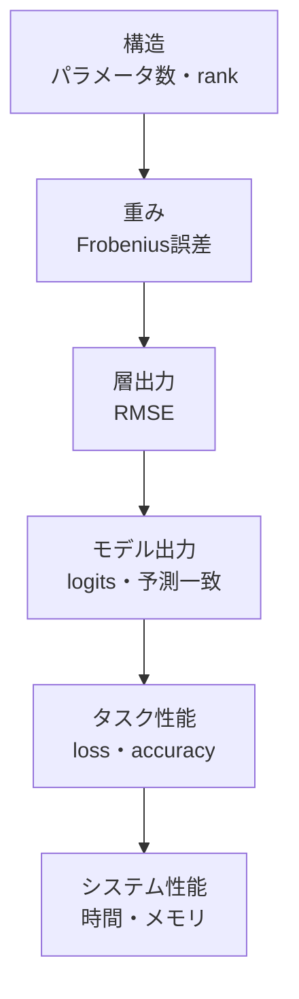

# SVD圧縮モデルの評価

## サマリー

SVD圧縮の評価を、パラメータ数とtest accuracyだけで終わらせない。

圧縮による変化は、次の5段階に分けて測る。



切り詰めSVDが直接最小化するのは重み行列の近似誤差であり、分類accuracyではない。

したがって、

```text
重み誤差が小さい
≠
accuracy低下が必ず小さい
```

である。

評価では、圧縮直後とfine-tuning後を分け、同じbaseline checkpointから各rankのモデルを作成する。

---

## 対応コード

実際の評価処理は、次のNotebook内に実装されている。

| Notebook | 実装されている評価 |
|---|---|
| `notebooks/10_mnist_mlp/01_svd_compression.ipynb` | test loss、accuracy、パラメータ数、削減率、MACs、推論時間 |
| `notebooks/10_mnist_mlp/02_rank_accuracy_tradeoff.ipynb` | rank sweep、test loss、accuracy、パラメータ数、MACs、予測一致率、logits RMSE、特異値エネルギー保持率、推論時間 |

実際の関数名：

```text
count_parameters
compare_parameters
accuracy_drop
linear_macs
compressed_linear_macs
MACs
benchmark_inference
agreement
logits_rmse
retained_energy
```

以前記載していた、

```text
以前の案にあった評価用Pythonモジュール
compare_weight_matrices
TensorErrorAccumulator
prediction_agreement
collect_confusion_matrix
summarize_compression_result
```

は現在の `code.zip` には存在しない。  
これらは汎用モジュールへ整理する場合の設計案である。

### 実装済みと未実装の区別

| 評価項目 | 現在 |
|---|---|
| test loss / accuracy | 実装済み |
| parameter count | 実装済み |
| MACs | 実装済み |
| prediction agreement | `agreement` として実装済み |
| logits RMSE | 実装済み |
| retained energy | 実装済み |
| inference latency | 実装済み |
| confusion matrix | 未実装 |
| validationによるrank選択 | 未実装 |
| fine-tuning前後比較 | 未実装 |
| 複数seed平均 | 未実装 |
| CSV保存 | 未実装 |

## 1. 評価レベルを分ける理由

1つの指標だけでは、どこで差が生じたか分からない。

たとえばaccuracyが低下したとき、原因候補は次のように分かれる。

- 重み近似が粗すぎる
- 実データが捨てた特異方向を多く使っている
- ReLUの符号反転が増えた
- logitsのmarginが小さくなった
- 一部クラスだけ誤りが増えた
- 複数層を同時に圧縮して誤差が累積した

したがって、重みから最終accuracyまで段階的に測る。

---

## 2. 構造評価

最初に記録するのは、モデル構造そのものである。

### 記録項目

- 圧縮対象層
- 元の `in_features`
- 元の `out_features`
- 指定rank
- 最大rank
- パラメータ数
- 削減率
- 圧縮倍率
- 圧縮対象層数

### 学習可能パラメータ数

```python
sum(
    p.numel()
    for p in model.parameters()
    if p.requires_grad
)
```

### モデル全体と対象層を分ける

次を別々に記録する。

```text
対象層だけの削減率
モデル全体の削減率
```

小さい層だけを圧縮しても、モデル全体への効果は小さい。

---

## 3. 重み行列の誤差

元重みを $W$、再構成した低ランク重みを $W_r$ とする。

### Frobenius誤差

$$
E_F
=
\left\lVert
W-W_r
\right\rVert_F
$$

### 相対Frobenius誤差

$$
E_{\mathrm{rel}}
=
\frac{
\left\lVert
W-W_r
\right\rVert_F
}{
\left\lVert
W
\right\rVert_F
}
$$

相対値にすることで、shapeや重みスケールの異なる層を比較しやすい。

### 二乗誤差と特異値

切り詰めSVDでは、

$$
\left\lVert
W-W_r
\right\rVert_F^2
=
\sum_{i=r+1}^{k}
\sigma_i^2
$$

である。

実装で計算した誤差と、捨てた特異値二乗和が一致するかを検査できる。

---

## 4. 累積特異値エネルギー

rank $r$ までの保持率を、

$$
E(r)
=
\frac{
\sum_{i=1}^{r}
\sigma_i^2
}{
\sum_{i=1}^{k}
\sigma_i^2
}
$$

とする。

これは重みのFrobeniusノルムに対する保持率である。

### 注意

- 99%保持ならaccuracyも99%維持、という意味ではない
- NN重みの特異値はSchmidt係数ではない
- rank候補を絞る補助指標として使う

---

## 5. 層出力誤差

同じ入力 $X$ を、元Linear層と圧縮Linear層へ与える。

$$
Y
=
XW^{\mathsf{T}}+b
$$

$$
\hat{Y}
=
XW_r^{\mathsf{T}}+b
$$

出力RMSEは、

$$
\operatorname{RMSE}
=
\sqrt{
\frac{1}{N}
\sum_j
\left(
Y_j-\hat{Y}_j
\right)^2
}
$$

である。

重み誤差より、実際の入力分布に対する影響を直接反映する。

### ランダム入力と実データ入力

- ランダム入力：実装テスト向け
- MNIST実データ：実験評価向け

最終判断には実データを使う。

---

## 6. dataset全体のRMSEを正しく集計する

バッチごとのRMSEを単純平均すると、最後の小さいバッチや要素数の差によって重み付けがずれる。

正しくは、全バッチの二乗誤差和と要素数を積算する。

```text
sum_squared_error += ((a - b) ** 2).sum()
num_elements      += a.numel()
```

最後に、

$$
\operatorname{RMSE}
=
\sqrt{
\frac{
\text{sum squared error}
}{
\text{number of elements}
}
}
$$

を計算する。

このための状態保持クラスを `TensorErrorAccumulator` として実装できる。

---

## 7. 中間層出力を取得する方法

### 対象層を直接呼ぶ

入力がすでに対象層の直前まで準備できているなら、元層と圧縮層を直接比較する。

### forward hookを使う

モデル全体を通常どおり実行し、特定Moduleの出力を記録する。

hookは、

- 元の `fc1`
- 圧縮後 `fc1`

へそれぞれ登録する。

### 注意

置換後の `fc1` がSequentialなら、

- Sequential全体の出力
- 前段出力
- 後段出力

のどれを測るか明示する。

元Linearと比較するのは、Sequential全体の出力である。

---

## 8. logits RMSE

モデル最終出力のlogitsを比較する。

元モデルを、

$$
f(x)
$$

圧縮モデルを、

$$
\hat{f}(x)
$$

とする。

$$
\operatorname{RMSE}_{\mathrm{logits}}
=
\sqrt{
\frac{1}{N C}
\sum_{n,c}
\left(
f(x_n)_c
-
\hat{f}(x_n)_c
\right)^2
}
$$

ここで $C=10$ である。

accuracyが同じでもlogitsが大きく変わっている場合があるため、モデル挙動の差をより細かく見られる。

---

## 9. 予測一致率

元モデルと圧縮モデルの予測クラスが一致した割合を測る。

$$
A_{\mathrm{agree}}
=
\frac{1}{N}
\sum_{n=1}^{N}
\mathbf{1}
\left[
\arg\max f(x_n)
=
\arg\max \hat{f}(x_n)
\right]
$$

### accuracyとの違い

- test accuracy：正解ラベルとの一致
- prediction agreement：元モデルとの一致

圧縮モデルが元モデルと違う予測をしても、それが正解になる場合もある。そのため両方記録する。

---

## 10. cross-entropy loss

accuracyは、正解か不正解かだけを見る。

cross-entropy lossは、正解クラスへの確信度も反映する。

したがって、

- accuracyはほぼ同じ
- test lossは悪化

という結果もあり得る。

この場合、決定境界のmarginや確率校正が変化している可能性がある。

モデル出力はsoftmax前のlogitsのまま `CrossEntropyLoss` へ渡す。

---

## 11. test accuracy

MNISTでは、

```python
predicted = torch.argmax(
    outputs,
    dim=1,
)
```

で予測クラスを得る。

正解数は、

```python
correct += (
    predicted == labels
).sum().item()
```

全サンプル数は、

```python
total += labels.size(0)
```

で積算する。

最後に、

$$
\operatorname{Accuracy}
=
\frac{\text{correct}}{\text{total}}
$$

とする。

### loss集計

`CrossEntropyLoss` がバッチ平均を返す場合、

```python
total_loss += loss.item() * images.size(0)
```

としてサンプル数を掛け、最後に全サンプル数で割る。

---

## 12. confusion matrix

accuracyだけでは、どの数字の誤りが増えたか分からない。

confusion matrixで、

- 3と5
- 4と9
- 7と9

など、圧縮後に増えた混同を調べる。

### 比較方法

- baselineのconfusion matrix
- 圧縮直後
- fine-tuning後

を同じ表示範囲で並べる。

差分行列も保存すると、どのクラス対で誤りが増減したか見やすい。

---

## 13. 圧縮直後とfine-tuning後

必ず次の3状態を分ける。

```text
Baseline
SVD直後
SVD + fine-tuning
```

### SVD直後

学習済み重みを行列誤差の意味で近似しただけの状態。

### fine-tuning後

低rank構造を保ったまま、分類lossへ再適応した状態。

fine-tuningでaccuracyが回復しても、元のdense weightへ戻ったわけではない。2つの小さいLinear層のパラメータだけを更新する。

---

---

## 13.1 fine-tuning前後は同じRank-Selection Validationで比較する

fine-tuningの効果を測るときは、BeforeとAfterを同じ評価データへ通す。

$$
\Delta\mathrm{Accuracy}
=
\mathrm{Acc}_{\mathrm{after}}
-
\mathrm{Acc}_{\mathrm{before}}
$$

$$
\Delta L
=
L_{\mathrm{after}}
-
L_{\mathrm{before}}
$$

accuracyは正なら改善、lossは負なら改善である。

Fine-tuningはrankを変えず、低ランク因子の値だけを更新するので、同じrankならparametersと理論MACsはBefore/Afterで変わらない。

---

## 14. optimizerはfine-tuning前に作る

圧縮層へ置換した後に、新しいoptimizerを作る。

```text
モデルをコピー
↓
層を置換
↓
圧縮直後を評価
↓
optimizerを新規作成
↓
fine-tuning
```

置換前のoptimizerを使うと、新しい層が正しく更新されない。

---

---

## 14.1 候補ごとにモデル・optimizer・Early-Stopping状態を独立させる

複数候補をfine-tuningするときは、候補ごとに次を独立にする。

- モデル本体
- optimizer
- best validation loss
- best model state
- patience counter
- history

モデル本体は、元候補を直接更新せず、

```python
pareto_model = copy.deepcopy(source_model)
```

のように独立コピーしてから学習する。

直接参照をfine-tuningすると、同じKernel内でセルを再実行したときに、すでにfine-tuning済みのモデルへさらにfine-tuningしてしまうことがある。
再現実験では `Restart Kernel -> Run All` とseed固定を組み合わせる。

また、optimizerはmodel parameterへの参照を保持するため、別候補へ使い回さず候補ごとに新規作成する。

---

## 15. rank sweep

rank候補を複数試す。

プロファイルAの `fc1` では、

$$
r
\in
\{8,16,32,64,128,256\}
$$

が扱いやすい。

プロファイルBで `fc1` と `fc2` を同じrankへする場合、`fc2` の最大rankが256なので、その範囲に制限される。

ただし、各層に同じrankを与える必要はない。

```text
fc1 rank = 64
fc2 rank = 32
```

のような組合せも評価する。

### 同じbaselineから作る

rank 16のfine-tuning結果を、rank 32の初期値に使わない。

すべて同じbaseline checkpointから独立に作成する。

---

## 16. validationとtestの役割

rankを選ぶためにtest setを使わない。

```text
train
└── baseline学習・fine-tuning

validation
└── rank、学習率、epoch数の選択

test
└── 最終的な1回の報告
```

MNISTの公式test setを何度も見ながらrankを決めると、testへ過適合する。

---

---

## 16.1 Early-Stopping用ValidationとRank選択用Validationを分ける

1つのvalidation setをEarly Stoppingとrank選択の両方へ使うことは一般的には可能である。
ただし、rank候補を多数比較し、Pareto / kneeなどで何度もモデル選択を行うと、そのvalidation setへの選択過適合が起こりうる。

より厳密に分けるなら、学習用データを、

```text
Train
Early-Stopping Validation
Rank-Selection Validation
```

へ分割する。

役割は次のとおり。

| データ | 用途 |
|---|---|
| Train | `backward()` / `optimizer.step()` による重み更新 |
| Early-Stopping Validation | epoch停止・best state決定 |
| Rank-Selection Validation | SVD rank、Pareto、knee、fine-tuning後候補の比較 |
| Test | 最終モデル確定後の最終評価 |

この分離では、Early Stoppingに使った `best_validation_loss` と、Rank-Selection Validationで測ったlossを直接比較しない。
異なるデータ集合上の値だからである。

---

---

## 16.2 BaselineもRank-Selection Validation上で評価する

圧縮前後の差を計算するときは、同じデータ集合上の値を使う。

```text
Baseline → Rank-Selection Validation
SVDモデル → Rank-Selection Validation
```

として、

$$
\Delta\mathrm{Acc}
=
\mathrm{Acc}_{\mathrm{baseline,rankval}}
-
\mathrm{Acc}_{\mathrm{compressed,rankval}}
$$

を計算する。
Early-Stopping ValidationのaccuracyをBaseline基準に混ぜない。

---

---

## 16.3 Test leakageを避ける

Testを途中のモデル選択へ使うと、Testが実質的にValidationへ変わる。
特に次は避ける。

```text
Test結果を見る
↓
別rankへ変える
↓
Testを再評価
```

参考コードとしてTest評価セルをNotebookへ残すこと自体は問題ではないが、**最終モデルを確定するまでその値を選択へ使わない**。

推論時間の計測はラベルを使わないため分類性能の選択とは性質が異なるが、評価設計を明確にするなら固定入力やvalidation入力を使い、Testは最終タスク評価として温存すると整理しやすい。

---

## 17. 複数seed

1つのseedだけでは、学習初期値やDataLoader順序によるばらつきを評価できない。

最初の動作確認は1 seedでよい。

研究結果としてまとめる段階では、複数seedで、

- 平均
- 標準偏差
- 最小・最大

を記録する。

特にaccuracy差が0.1ポイント程度なら、seedばらつきと区別する必要がある。

---

---

## 17.1 単一baseline + 決定論的rank sweepと1-SE rule

通常の1-SE ruleは、複数回の学習・交差検証から得た平均値の標準誤差を使う。

単一の学習済みbaselineを固定し、rankだけを決定論的に変える場合、学習手続きのばらつきを表すSEは得られない。
そのため、この条件では1-SE ruleを主選択法にしない。

複数seedで、

```text
baseline学習
→ SVD
→ rankごとの評価
```

を繰り返す追加実験を行うなら、mean ± SEと1-SE ruleを導入できる。

---

## 18. 結果レコードの設計

rankごとに1行の辞書またはCSVレコードを作る。

推奨列：

```text
experiment_id
profile
seed
target_layers
rank_fc1
rank_fc2
rank_fc3
params
param_reduction
compression_ratio
retained_energy_fc1
weight_rel_error_fc1
layer_rmse_fc1
logits_rmse
prediction_agreement
test_loss_before_ft
test_acc_before_ft
test_loss_after_ft
test_acc_after_ft
latency_ms
memory_bytes
```

実測していない項目は空欄にし、0を入れない。

---

## 19. 評価の優先順位

最初に追加するなら、次の順がよい。

1. rank–パラメータ数–test accuracy
2. 圧縮直後とfine-tuning後
3. 推論時間
4. 重み相対誤差
5. logits RMSE・予測一致率
6. confusion matrix
7. memory
8. 複数seed

一度に全部実装せず、段階的に増やす。

---

## 20. 評価結果の読み方

### パラメータ数は大幅減、accuracyは維持

良好な圧縮候補である。次にlatencyを確認する。

### 重み誤差は大きいがaccuracyは維持

捨てた方向がMNIST分類へ強く寄与していない可能性がある。

### 重み誤差は小さいがaccuracyが低下

小さい変化がReLUや分類marginへ大きく影響した可能性がある。層出力とlogitsを確認する。

### accuracyは同じだがlossが悪化

正解は維持しているが、正解クラスのmarginが縮小している可能性がある。

### fine-tuningで大幅回復

低rank表現力は足りているが、単純SVD因子がタスクlossに最適でなかった可能性がある。

### 理論MACsは減ったがlatencyは改善しない

小さい行列積を2回実行するオーバーヘッドやハードウェア利用効率を確認する。

---

## 21. よくある間違い

### accuracyだけを見る

重み誤差、loss、prediction agreement、時間を分けて見る。

### rankごとに別のbaselineを学習する

学習差と圧縮差が混ざる。

### test setでrankを選ぶ

最終評価が楽観的になる。

### バッチRMSEを単純平均する

全要素の二乗誤差和から計算する。

### 圧縮後にoptimizerを作り直さない

新しい低ランク層が学習されない。

### fine-tuning後だけを報告する

SVD単体の効果が分からない。圧縮直後も残す。

### 未測定値を0として保存する

実際に0なのか、欠損なのか区別できない。

---

## 22. このノートで押さえるポイント

- 評価を構造、重み、層出力、logits、タスク、システムへ分ける。
- SVDが直接最小化するのは重み行列誤差である。
- 相対Frobenius誤差で層間比較をしやすくする。
- 実データで層出力RMSEを測る。
- logits RMSEとprediction agreementをaccuracyと分けて記録する。
- test lossとaccuracyの両方を見る。
- confusion matrixでクラス別の劣化を見る。
- 圧縮直後とfine-tuning後を分ける。
- 各rankは同じbaseline checkpointから作る。
- rank選択はvalidationで行う。
- 結果は1 rank 1行のCSVへまとめる。

---

> [!note] 実測・実行結果は [[10_MNIST_MLP_SVD/02_MNIST評価で使用した指標と実装]] へ分離した。

---

## 22.1 最終モデル選択のルールを明示する

Pareto frontierは候補集合を与えるが、常に1モデルへ絞れるとは限らない。
最終的に1つへ決める場合は、優先順位を明記する。

例：

```text
1. parameters + validation_lossでPareto frontier
2. 複数残ればvalidation_loss最小
3. 同値ならparameters最小
4. 同値ならvalidation_accuracy最大
```

この規則をTest結果を見る前に固定する。
Testは選択済み1モデルを最後に評価する。

> [!note] Fashion-MNISTではこの規則により、fine-tuning後の最終モデルとして `fc1_rank=32, fc2_rank=16` が選ばれた。実測値は [[20_FASHION_MNIST_MLP_SVD/04_Fashion-MNISTでの実験結果]] を参照する。

## 次に読むノート

理論上の削減量と実際の実行時間を分けて評価する。

- [[00_基礎理論/11_理論計算量とベンチマーク]]
- [[00_基礎理論/05_圧縮率とRank]]
- [[00_基礎理論/06_誤差評価]]
