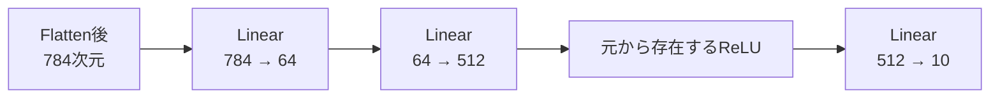
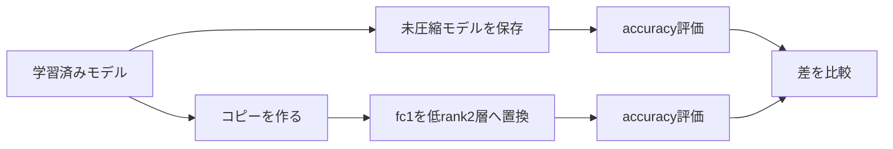

# Linear層置換のPyTorch手順

数式と考え方は [[00_基礎理論/03_モデル圧縮理論/04_Linear層を2層へ置き換える]] を参照する。このノートはPyTorch・Pythonの操作、コード例、実装上の注意を扱う。教材のコード例と現行の共通関数は区別し、公開APIの仕様は [[07_src設計/05_Core_API_v1]] を参照する。

---

## 21. 基本的な実装

特異値を後段へ吸収する実装を示す。

```python
from __future__ import annotations

import torch
from torch import nn


def factorize_linear(
    layer: nn.Linear,
    rank: int,
) -> nn.Sequential:
    if not isinstance(layer, nn.Linear):
        raise TypeError(
            "layer must be nn.Linear."
        )

    maximum_rank = min(
        layer.in_features,
        layer.out_features,
    )

    if not 1 <= rank <= maximum_rank:
        raise ValueError(
            "rank must satisfy "
            f"1 <= rank <= {maximum_rank}."
        )

    weight = layer.weight.detach()

    U, S, Vh = torch.linalg.svd(
        weight,
        full_matrices=False,
    )

    U_r = U[:, :rank]
    S_r = S[:rank]
    Vh_r = Vh[:rank, :]

    first = nn.Linear(
        in_features=layer.in_features,
        out_features=rank,
        bias=False,
        device=weight.device,
        dtype=weight.dtype,
    )

    second = nn.Linear(
        in_features=rank,
        out_features=layer.out_features,
        bias=layer.bias is not None,
        device=weight.device,
        dtype=weight.dtype,
    )

    with torch.no_grad():
        first.weight.copy_(Vh_r)

        second.weight.copy_(
            U_r
            * S_r.unsqueeze(0)
        )

        if layer.bias is not None:
            second.bias.copy_(
                layer.bias.detach()
            )

    return nn.Sequential(
        first,
        second,
    )
```

---

## 22. 実装の各行の意味

### 最大rank

```python
maximum_rank = min(
    layer.in_features,
    layer.out_features,
)
```

重み行列の最大rankは、

$$
\min
\left(
D_{\mathrm{in}},
D_{\mathrm{out}}
\right)
$$

である。

### Reduced SVD

```python
U, S, Vh = torch.linalg.svd(
    weight,
    full_matrices=False,
)
```

`full_matrices=False` によって、圧縮に必要なReduced SVDを得る。

### 上位rank成分

```python
U_r = U[:, :rank]
S_r = S[:rank]
Vh_r = Vh[:rank, :]
```

上位rank個の特異値と特異ベクトルを取り出す。

### 前段重み

```python
first.weight.copy_(Vh_r)
```

$$
A=V_r^{\mathsf{T}}
$$

を設定している。

### 後段重み

```python
second.weight.copy_(
    U_r
    * S_r.unsqueeze(0)
)
```

$$
B=U_r\Sigma_r
$$

を設定している。

### bias

```python
second.bias.copy_(
    layer.bias.detach()
)
```

元のbiasを後段へコピーしている。

---

## 23. 特異値を前段へ吸収する実装

次の分解を使う。

$$
A=\Sigma_rV_r^{\mathsf{T}}
$$

$$
B=U_r
$$

変更する部分は次のとおりである。

```python
with torch.no_grad():
    first.weight.copy_(
        S_r.unsqueeze(1)
        * Vh_r
    )

    second.weight.copy_(U_r)

    if layer.bias is not None:
        second.bias.copy_(
            layer.bias.detach()
        )
```

### 形状

```python
S_r.unsqueeze(1)
```

は、

```text
(rank, 1)
```

である。

`Vh_r` は、

```text
(rank, in_features)
```

なので、ブロードキャストにより各行へ対応する特異値が掛かる。

---

## 24. 特異値を対称分配する実装

```python
sqrt_s = torch.sqrt(S_r)

with torch.no_grad():
    first.weight.copy_(
        sqrt_s.unsqueeze(1)
        * Vh_r
    )

    second.weight.copy_(
        U_r
        * sqrt_s.unsqueeze(0)
    )

    if layer.bias is not None:
        second.bias.copy_(
            layer.bias.detach()
        )
```

この場合も、

$$
BA=W_r
$$

である。

---

## 25. 分解方式を選べる実装

```python
from __future__ import annotations

from typing import Literal

import torch
from torch import nn


SingularValuePlacement = Literal[
    "first",
    "second",
    "balanced",
]


def factorize_linear_with_mode(
    layer: nn.Linear,
    rank: int,
    singular_value_placement: SingularValuePlacement = "second",
) -> nn.Sequential:
    maximum_rank = min(
        layer.in_features,
        layer.out_features,
    )

    if not 1 <= rank <= maximum_rank:
        raise ValueError(
            "rank must satisfy "
            f"1 <= rank <= {maximum_rank}."
        )

    weight = layer.weight.detach()

    U, S, Vh = torch.linalg.svd(
        weight,
        full_matrices=False,
    )

    U_r = U[:, :rank]
    S_r = S[:rank]
    Vh_r = Vh[:rank, :]

    if singular_value_placement == "first":
        first_weight = (
            S_r.unsqueeze(1)
            * Vh_r
        )
        second_weight = U_r

    elif singular_value_placement == "second":
        first_weight = Vh_r
        second_weight = (
            U_r
            * S_r.unsqueeze(0)
        )

    elif singular_value_placement == "balanced":
        sqrt_s = torch.sqrt(S_r)

        first_weight = (
            sqrt_s.unsqueeze(1)
            * Vh_r
        )

        second_weight = (
            U_r
            * sqrt_s.unsqueeze(0)
        )

    else:
        raise ValueError(
            "singular_value_placement must be "
            "'first', 'second', or 'balanced'."
        )

    first = nn.Linear(
        layer.in_features,
        rank,
        bias=False,
        device=weight.device,
        dtype=weight.dtype,
    )

    second = nn.Linear(
        rank,
        layer.out_features,
        bias=layer.bias is not None,
        device=weight.device,
        dtype=weight.dtype,
    )

    with torch.no_grad():
        first.weight.copy_(first_weight)
        second.weight.copy_(second_weight)

        if layer.bias is not None:
            second.bias.copy_(
                layer.bias.detach()
            )

    return nn.Sequential(
        first,
        second,
    )
```

---

## 26. 出力を確認する

```python
import torch
from torch import nn

torch.manual_seed(0)

original = nn.Linear(
    in_features=100,
    out_features=50,
)

compressed = factorize_linear(
    layer=original,
    rank=20,
)

x = torch.randn(
    32,
    100,
)

with torch.no_grad():
    y_original = original(x)
    y_compressed = compressed(x)

difference = (
    y_original
    -
    y_compressed
)

mse = torch.mean(
    difference.square()
)

rmse = torch.sqrt(mse)

maximum_absolute_error = (
    difference
    .abs()
    .max()
)

print("MSE:", mse.item())
print("RMSE:", rmse.item())
print(
    "maximum absolute error:",
    maximum_absolute_error.item(),
)
```

rankが小さい場合は、低ランク近似誤差によって出力差が生じる。

---

## 27. 最大rankで元の出力を再現する

最大rankを使う。

```python
maximum_rank = min(
    original.in_features,
    original.out_features,
)

full_rank_model = factorize_linear(
    layer=original,
    rank=maximum_rank,
)
```

出力を比較する。

```python
with torch.no_grad():
    y_original = original(x)
    y_full_rank = full_rank_model(x)

print(
    torch.allclose(
        y_original,
        y_full_rank,
        rtol=1e-5,
        atol=1e-6,
    )
)
```

浮動小数点誤差の範囲で `True` になる。

### 重要

最大rankで元の出力を再現できても、パラメータ圧縮になるとは限らない。

完全再構成と圧縮は別の話である。

---

## 28. 再構成された重みを確認する

2層の重みを取得する。

```python
first = compressed[0]
second = compressed[1]
```

再構成重みは、

```python
reconstructed_weight = (
    second.weight
    @ first.weight
)
```

である。

数式では、

$$
W_{\mathrm{reconstructed}}
=
BA
$$

である。

元の重みとの差を測る。

```python
with torch.no_grad():
    weight_difference = (
        original.weight
        -
        reconstructed_weight
    )

    frobenius_error = (
        torch.linalg.matrix_norm(
            weight_difference,
            ord="fro",
        )
    )

print(frobenius_error.item())
```

---

## 29. biasを含めて手動で確認する

```python
with torch.no_grad():
    hidden = (
        x
        @ first.weight.T
    )

    manual_output = (
        hidden
        @ second.weight.T
    )

    if second.bias is not None:
        manual_output = (
            manual_output
            +
            second.bias
        )

    sequential_output = compressed(x)

print(
    torch.allclose(
        manual_output,
        sequential_output,
    )
)
```

これにより、2つのLinear層が、

$$
H=XA^{\mathsf{T}}
$$

$$
Y=HB^{\mathsf{T}}+b
$$

を計算していることを確認できる。

---

## 36. モデル内の層を置き換える

例として、次のMLPを考える。

```python
from torch import nn


class MnistMLP(nn.Module):
    def __init__(self) -> None:
        super().__init__()

        self.flatten = nn.Flatten()
        self.fc1 = nn.Linear(
            784,
            512,
        )
        self.relu = nn.ReLU()
        self.fc2 = nn.Linear(
            512,
            10,
        )

    def forward(self, x):
        x = self.flatten(x)
        x = self.fc1(x)
        x = self.relu(x)
        x = self.fc2(x)
        return x
```

`fc1` を置き換える。

```python
model.fc1 = factorize_linear(
    layer=model.fc1,
    rank=64,
)
```

置換後の構造は、

```text
Flatten
  ↓
Sequential(
  Linear(784, 64, bias=False),
  Linear(64, 512, bias=True)
)
  ↓
ReLU
  ↓
Linear(512, 10)
```

となる。

### 重要

元から `fc1` の後にあったReLUは残す。

削除する必要はない。

入れてはいけないのは、SVDで分解した2つのLinearの**間**のReLUである。

### Mermaid図



---

## 38. `nn.Sequential` にしたときの名前

```python
compressed = nn.Sequential(
    first,
    second,
)
```

とすると、各層の名前は通常、

```text
0
1
```

になる。

アクセスは、

```python
first_layer = compressed[0]
second_layer = compressed[1]
```

で行える。

より意味のある名前を付けることもできる。

```python
from collections import OrderedDict

compressed = nn.Sequential(
    OrderedDict(
        [
            ("projection", first),
            ("reconstruction", second),
        ]
    )
)
```

アクセスは、

```python
compressed.projection
compressed.reconstruction
```

で行える。

---

## 39. 名前付き構造で返す実装

```python
from __future__ import annotations

from collections import OrderedDict

import torch
from torch import nn


def factorize_linear_named(
    layer: nn.Linear,
    rank: int,
) -> nn.Sequential:
    maximum_rank = min(
        layer.in_features,
        layer.out_features,
    )

    if not 1 <= rank <= maximum_rank:
        raise ValueError(
            "rank must satisfy "
            f"1 <= rank <= {maximum_rank}."
        )

    weight = layer.weight.detach()

    U, S, Vh = torch.linalg.svd(
        weight,
        full_matrices=False,
    )

    U_r = U[:, :rank]
    S_r = S[:rank]
    Vh_r = Vh[:rank, :]

    projection = nn.Linear(
        layer.in_features,
        rank,
        bias=False,
        device=weight.device,
        dtype=weight.dtype,
    )

    reconstruction = nn.Linear(
        rank,
        layer.out_features,
        bias=layer.bias is not None,
        device=weight.device,
        dtype=weight.dtype,
    )

    with torch.no_grad():
        projection.weight.copy_(Vh_r)

        reconstruction.weight.copy_(
            U_r
            * S_r.unsqueeze(0)
        )

        if layer.bias is not None:
            reconstruction.bias.copy_(
                layer.bias.detach()
            )

    return nn.Sequential(
        OrderedDict(
            [
                (
                    "projection",
                    projection,
                ),
                (
                    "reconstruction",
                    reconstruction,
                ),
            ]
        )
    )
```

---

## 40. dtypeとdeviceを保つ

元の層がGPU上にある場合、

```python
layer.weight.device
```

はたとえば、

```text
cuda:0
```

である。

また、重みが `float64` や `float16` の可能性もある。

新しいLinear層を何も指定せず作ると、CPU上の既定dtypeになる場合がある。

そのため、

```python
device=weight.device
dtype=weight.dtype
```

を指定する。

これにより、

- 元層と新層のdevice不一致
- dtype不一致
- 余分な転送
- 実行時エラー

を避けやすい。

---

## 41. `train` と `eval` の状態

`nn.Linear` 自体は、学習モードと評価モードで動作が変わらない。

しかし、モデル全体にはDropoutやBatchNormが含まれる可能性がある。

圧縮前後の出力を比較する際は、

```python
model.eval()
```

を使い、同じ入力に対して決定的な比較を行う。

### 例

```python
model.eval()

with torch.no_grad():
    y_before = model(x)

model.fc1 = factorize_linear(
    model.fc1,
    rank=64,
)

model.eval()

with torch.no_grad():
    y_after = model(x)
```

MNISTの単純なMLPでは影響が小さい場合もあるが、比較手順として統一しておくとよい。

---

## 42. 勾配追跡を切って重みをコピーする理由

新しい層へ初期重みを設定するときは、

```python
with torch.no_grad():
    first.weight.copy_(...)
```

とする。

これは、初期化のための代入を自動微分グラフへ記録しないためである。

`copy_()` によって、`nn.Parameter` 自体を置き換えず、既存パラメータの中身を更新する。

---

## 43. fine-tuning時の学習可能性

圧縮後の2層は通常の `nn.Linear` なので、

```python
for parameter in compressed.parameters():
    print(parameter.requires_grad)
```

は通常 `True` になる。

したがって、fine-tuningでは、

- 前段重み
- 後段重み
- 後段bias

を学習できる。

圧縮直後は、

$$
BA=W_r
$$

である。

fine-tuning後は、$A$ と $B$ が独立に更新されるため、SVDで得た直交性や特異値分配を保つとは限らない。

しかし、積

$$
BA
$$

のrankは高々 $r$ のままである。

したがって、低ランク制約を保ちながらタスクへ再適応できる。

---

## 45. optimizerを作り直す必要がある

モデルの層を置き換えた後、古いoptimizerは新しいパラメータを参照していない可能性がある。

### 誤った順序

```python
optimizer = torch.optim.Adam(
    model.parameters()
)

model.fc1 = factorize_linear(
    model.fc1,
    rank=64,
)
```

この場合、optimizerは置換前の `fc1` パラメータを保持している。

### 正しい基本手順

```python
model.fc1 = factorize_linear(
    model.fc1,
    rank=64,
)

optimizer = torch.optim.Adam(
    model.parameters(),
    lr=1e-3,
)
```

層置換後にoptimizerを作り直す。

---

## 46. `state_dict` のキーが変わる

元の層が、

```text
fc1.weight
fc1.bias
```

というキーを持っていたとする。

`fc1` を `nn.Sequential` へ置き換えると、キーはたとえば、

```text
fc1.0.weight
fc1.1.weight
fc1.1.bias
```

へ変わる。

名前付きSequentialなら、

```text
fc1.projection.weight
fc1.reconstruction.weight
fc1.reconstruction.bias
```

となる。

そのため、圧縮前モデルと圧縮後モデルでは、同じ `state_dict` をそのまま読み込めない。

圧縮後モデルは別の構造として保存する。

---

## 47. 圧縮後モデルを保存する

```python
torch.save(
    model.state_dict(),
    "mnist_mlp_svd_rank64.pt",
)
```

読み込む際は、同じ圧縮構造を持つモデルを先に作成する必要がある。

```python
model = MnistMLP()

model.fc1 = factorize_linear(
    model.fc1,
    rank=64,
)

state_dict = torch.load(
    "mnist_mlp_svd_rank64.pt",
    map_location="cpu",
)

model.load_state_dict(
    state_dict
)
```

ただし、ここで `factorize_linear` をランダム初期化された `fc1` へ実行するのは、構造を作るためだけである。

より実用的には、rankを受け取って最初から圧縮構造を定義する専用クラスを作る。

---

## 48. 圧縮モデルを定義する専用クラス

数式との対応だけを抜き出すと、圧縮層の構造は次のようになる。

```python
from torch import nn


class ConceptualLowRankLinear(nn.Module):
    def __init__(
        self,
        in_features: int,
        out_features: int,
        rank: int,
        bias: bool = True,
    ) -> None:
        super().__init__()

        # A = V_r^Tに対応する前段。biasは置かない。
        self.first = nn.Linear(
            in_features,
            rank,
            bias=False,
        )

        # B = U_r Sigma_rに対応する後段。元のbiasはここへ置く。
        self.second = nn.Linear(
            rank,
            out_features,
            bias=bias,
        )

    def forward(self, x):
        return self.second(
            self.first(x)
        )
```

これは $x\mapsto B(Ax)+b$ という構造を確認するための最小例である。rank検証、device・dtype継承、SVD重みの設定を含む完成実装は [[05_SVD基礎実装検証/07_PyTorch実装#10. `LowRankLinear`]] を正本とする。

---

## 49. `LowRankLinear` を学習済み層から作る

学習済み `nn.Linear` から作る処理では、すでに導出した

$$
A=V_r^{\mathsf T},
\qquad
B=U_r\Sigma_r
$$

を `first.weight` と `second.weight` へ設定し、元のbiasを `second.bias` へコピーする。完成した `from_linear` の定義は [[05_SVD基礎実装検証/07_PyTorch実装#11. 学習済みLinearから作る]]、置換手順の詳細は [[05_SVD基礎実装検証/09_Linear層の2層置換_実装]] を参照する。

使用例：

```python
compressed_fc1 = LowRankLinear.from_linear(
    layer=model.fc1,
    rank=64,
)

model.fc1 = compressed_fc1
```

---

## 50. 入力形状を保持できるか確認する

```python
import torch
from torch import nn

original = nn.Linear(
    784,
    512,
)

compressed = LowRankLinear.from_linear(
    original,
    rank=64,
)

x = torch.randn(
    32,
    784,
)

with torch.no_grad():
    y_original = original(x)
    y_compressed = compressed(x)

print(
    tuple(y_original.shape)
)

print(
    tuple(y_compressed.shape)
)
```

どちらも、

```text
(32, 512)
```

になる。

---

## 51. 元のbiasをコピーできているか確認する

```python
if original.bias is not None:
    copied_correctly = torch.allclose(
        original.bias,
        compressed.second.bias,
    )

    print(copied_correctly)
```

`True` になれば、biasが後段へ正しくコピーされている。

---

## 52. rank最大時の厳密性を確認する関数

```python
from __future__ import annotations

import torch
from torch import nn


def verify_full_rank_reconstruction(
    layer: nn.Linear,
    batch_size: int = 16,
) -> bool:
    maximum_rank = min(
        layer.in_features,
        layer.out_features,
    )

    compressed = LowRankLinear.from_linear(
        layer,
        rank=maximum_rank,
    )

    x = torch.randn(
        batch_size,
        layer.in_features,
        device=layer.weight.device,
        dtype=layer.weight.dtype,
    )

    with torch.no_grad():
        y_original = layer(x)
        y_compressed = compressed(x)

    return bool(
        torch.allclose(
            y_original,
            y_compressed,
            rtol=1e-4,
            atol=1e-5,
        )
    )
```

データ型によって必要な許容誤差は異なる。

`float64` では厳しく、`float16` では緩めに設定する必要がある場合がある。

---

## 53. 圧縮直後の比較でDropoutに注意する

Linear層の周辺にDropoutがある場合、学習モードでは毎回出力が変わる。

圧縮前後を比較するときは、

```python
model.eval()
```

を使う。

また、

```python
with torch.no_grad():
```

で評価する。

これにより、SVD近似以外のランダム性を減らせる。

---

## 54. 元のモデルを壊さず比較する

同じモデルを直接書き換えると、圧縮前の状態を失う。

比較のためにコピーを作る。

```python
import copy

original_model = copy.deepcopy(
    model
)

compressed_model = copy.deepcopy(
    model
)

compressed_model.fc1 = (
    LowRankLinear.from_linear(
        compressed_model.fc1,
        rank=64,
    )
)
```

これにより、

- 未圧縮モデル
- 圧縮モデル

を同じ入力で比較できる。

---

## 55. MNISTモデルの置換例

```python
import copy

original_model = copy.deepcopy(
    trained_model
)

compressed_model = copy.deepcopy(
    trained_model
)

compressed_model.fc1 = (
    LowRankLinear.from_linear(
        compressed_model.fc1,
        rank=64,
    )
)
```

評価の流れ：



---

## 56. 層置換後のモデル構造を確認する

```python
print(compressed_model)
```

想定される構造：

```text
MnistMLP(
  (flatten): Flatten(...)
  (fc1): LowRankLinear(
    (first): Linear(
      in_features=784,
      out_features=64,
      bias=False
    )
    (second): Linear(
      in_features=64,
      out_features=512,
      bias=True
    )
  )
  (relu): ReLU()
  (fc2): Linear(
    in_features=512,
    out_features=10,
    bias=True
  )
)
```

元から存在するReLUは、低ランク2層の後ろに残っている。

---

## 69. 出力誤差の評価関数

圧縮前後の層出力は、同じ入力 $x$ に対して

$$
y_{\mathrm{original}}
=
W x+b,
\qquad
y_{\mathrm{compressed}}
=
B A x+b
$$

を計算して比較する。

```python
with torch.inference_mode():
    y_original = original(x)
    y_compressed = compressed(x)

output_metrics = compare_tensors(
    reference=y_original,
    approximation=y_compressed,
)
```

MSE、RMSE、最大絶対誤差、MAEの定義は [[00_基礎理論/01_数学基礎/01_線形代数/06_誤差評価]]、`compare_tensors` の完成実装は [[05_SVD基礎実装検証/07_PyTorch実装#15. rankを下げた出力誤差]] を正本とする。

---

## 70. 重み誤差の評価関数

前段と後段の積から再構成した重みを、元の重みと比較する。

```python
with torch.inference_mode():
    reconstructed_weight = (
        compressed.second.weight
        @ compressed.first.weight
    )

weight_metrics = compare_weight_matrices(
    original=original.weight,
    approximation=reconstructed_weight,
)
```

Frobenius誤差の定義は [[00_基礎理論/01_数学基礎/01_線形代数/06_誤差評価]]、`compare_weight_matrices` の完成実装は [[05_SVD基礎実装検証/07_PyTorch実装#16. 重み誤差]] を正本とする。

---

## 71. rankごとに2層化を比較する

```python
ranks = [
    8,
    16,
    32,
    64,
    128,
    256,
]

for rank in ranks:
    compressed = (
        LowRankLinear.from_linear(
            original,
            rank=rank,
        )
    )

    with torch.inference_mode():
        y_original = original(x)
        y_compressed = compressed(x)
        reconstructed_weight = (
            compressed.second.weight
            @ compressed.first.weight
        )

    output_metrics = compare_tensors(
        reference=y_original,
        approximation=y_compressed,
    )
    weight_metrics = compare_weight_matrices(
        original=original.weight,
        approximation=reconstructed_weight,
    )

    parameter_count = sum(
        parameter.numel()
        for parameter in compressed.parameters()
    )

    print(
        rank,
        parameter_count,
        weight_metrics.relative_frobenius_error,
        output_metrics.rmse,
    )
```

---

## 72. よくある実装ミス

### 前段と後段を逆にする

誤り：

```python
nn.Linear(
    D_in,
    D_out,
)
```

の重みへ $U_r$ を直接設定しようとする。

正しい形状は、

```text
前段：rank × D_in
後段：D_out × rank
```

である。

### `Vh_r.T` を前段へ入れる

前段重みは、

$$
V_r^{\mathsf{T}}
$$

なので、PyTorchの `Vh_r` をそのまま使う。

### biasを両方へコピーする

元biasは後段だけへコピーする。

### 2層の間にReLUを入れる

元の低ランクLinearとは別の関数になる。

### 最大rankなら圧縮だと思う

完全再構成はできても、パラメータ数が増えることがある。

### optimizerを作り直さない

新しい2層のパラメータが更新されない可能性がある。

### 圧縮前モデルを上書きする

比較対象を失う。`deepcopy` で未圧縮モデルを保持する。

### CPUとGPUが混在する

新しい層の `device` と `dtype` を元重みに合わせる。

---

---

## 理論ノート中の短い確認コード

## PyTorch確認-001

対応する数式・説明：[[00_基礎理論/03_モデル圧縮理論/04_Linear層を2層へ置き換える]]（サマリー）

```python
nn.Sequential(
    nn.Linear(
        in_features=D_in,
        out_features=rank,
        bias=False,
    ),
    nn.Linear(
        in_features=rank,
        out_features=D_out,
        bias=True,
    ),
)
```

## PyTorch確認-002

対応する数式・説明：[[00_基礎理論/03_モデル圧縮理論/04_Linear層を2層へ置き換える]]（2つのLinear層への対応）

```python
nn.Linear(
    in_features=D_in,
    out_features=rank,
    bias=False,
)
```

## PyTorch確認-003

対応する数式・説明：[[00_基礎理論/03_モデル圧縮理論/04_Linear層を2層へ置き換える]]（2つのLinear層への対応）

```python
nn.Linear(
    in_features=rank,
    out_features=D_out,
    bias=True,
)
```

## PyTorch確認-004

対応する数式・説明：[[00_基礎理論/03_モデル圧縮理論/04_Linear層を2層へ置き換える]]（PyTorchで扱いやすい形）

```python
second_weight = U_r * S_r.unsqueeze(0)
```

## PyTorch確認-005

対応する数式・説明：[[00_基礎理論/03_モデル圧縮理論/04_Linear層を2層へ置き換える]]（PyTorchでの形）

```python
sqrt_s = torch.sqrt(S_r)

first_weight = (
    sqrt_s.unsqueeze(1)
    * Vh_r
)

second_weight = (
    U_r
    * sqrt_s.unsqueeze(0)
)
```

## PyTorch確認-006

対応する数式・説明：[[00_基礎理論/03_モデル圧縮理論/04_Linear層を2層へ置き換える]]（14. 非線形関数を入れてよい場合）

```python
nn.Sequential(
    nn.Linear(D_in, rank),
    nn.ReLU(),
    nn.Linear(rank, D_out),
)
```

## PyTorch確認-007

対応する数式・説明：[[00_基礎理論/03_モデル圧縮理論/04_Linear層を2層へ置き換える]]（17. 元の層にbiasがない場合）

```python
nn.Linear(
    D_in,
    D_out,
    bias=False,
)
```

## PyTorch確認-008

対応する数式・説明：[[00_基礎理論/03_モデル圧縮理論/04_Linear層を2層へ置き換える]]（17. 元の層にbiasがない場合）

```python
nn.Sequential(
    nn.Linear(
        D_in,
        rank,
        bias=False,
    ),
    nn.Linear(
        rank,
        D_out,
        bias=False,
    ),
)
```

## PyTorch確認-009

対応する数式・説明：[[00_基礎理論/03_モデル圧縮理論/04_Linear層を2層へ置き換える]]（19. PyTorchの重み形状）

```python
original = nn.Linear(
    in_features=D_in,
    out_features=D_out,
)
```

## PyTorch確認-010

対応する数式・説明：[[00_基礎理論/03_モデル圧縮理論/04_Linear層を2層へ置き換える]]（19. PyTorchの重み形状）

```python
first = nn.Linear(
    in_features=D_in,
    out_features=rank,
    bias=False,
)
```

## PyTorch確認-011

対応する数式・説明：[[00_基礎理論/03_モデル圧縮理論/04_Linear層を2層へ置き換える]]（19. PyTorchの重み形状）

```python
second = nn.Linear(
    in_features=rank,
    out_features=D_out,
    bias=True,
)
```

## PyTorch確認-012

対応する数式・説明：[[00_基礎理論/03_モデル圧縮理論/04_Linear層を2層へ置き換える]]（20. `Vh` と $V^{\mathsf{T}}$）

```python
U, S, Vh = torch.linalg.svd(
    weight,
    full_matrices=False,
)
```

## PyTorch確認-013

対応する数式・説明：[[00_基礎理論/03_モデル圧縮理論/04_Linear層を2層へ置き換える]]（20. `Vh` と $V^{\mathsf{T}}$）

```python
Vh_r = Vh[:rank, :]
```

## PyTorch確認-014

対応する数式・説明：[[00_基礎理論/03_モデル圧縮理論/04_Linear層を2層へ置き換える]]（よくある間違い）

```python
first.weight.copy_(Vh_r.T)
```

## PyTorch確認-015

対応する数式・説明：[[00_基礎理論/03_モデル圧縮理論/04_Linear層を2層へ置き換える]]（よくある間違い）

```python
first.weight.copy_(Vh_r)
```

## PyTorch確認-016

対応する数式・説明：[[00_基礎理論/03_モデル圧縮理論/04_Linear層を2層へ置き換える]]（コード）

```python
def count_parameters(
    module: nn.Module,
) -> int:
    return sum(
        parameter.numel()
        for parameter in module.parameters()
    )


original_parameters = count_parameters(
    original
)

compressed_parameters = count_parameters(
    compressed
)

print(
    "original:",
    original_parameters,
)

print(
    "compressed:",
    compressed_parameters,
)

print(
    "ratio:",
    compressed_parameters
    / original_parameters,
)
```

## PyTorch確認-017

対応する数式・説明：[[00_基礎理論/03_モデル圧縮理論/04_Linear層を2層へ置き換える]]（31. `Linear(784, 512)` をrank 64へ置き換える例）

```python
nn.Linear(
    784,
    512,
)
```

## PyTorch確認-018

対応する数式・説明：[[00_基礎理論/03_モデル圧縮理論/04_Linear層を2層へ置き換える]]（31. `Linear(784, 512)` をrank 64へ置き換える例）

```python
nn.Linear(
    784,
    64,
    bias=False,
)
```

## PyTorch確認-019

対応する数式・説明：[[00_基礎理論/03_モデル圧縮理論/04_Linear層を2層へ置き換える]]（31. `Linear(784, 512)` をrank 64へ置き換える例）

```python
nn.Linear(
    64,
    512,
    bias=True,
)
```

## PyTorch確認-020

対応する数式・説明：[[00_基礎理論/03_モデル圧縮理論/04_Linear層を2層へ置き換える]]（63. 重み共有ではない）

```python
compressed.first.weight
compressed.second.weight
```

