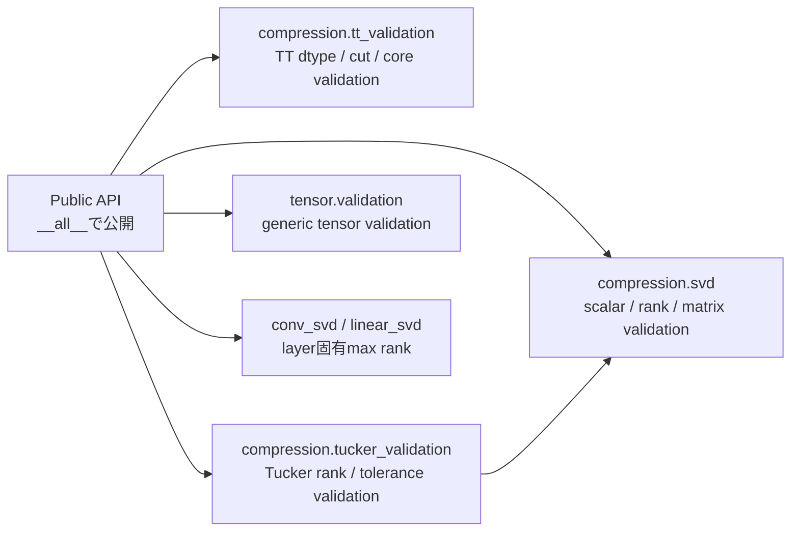

# Internal helper API境界

**Status:** Internal — Core API v1のPublic APIではない

## 目的

`src/nn_compression/`内で複数のPublic APIから利用する共通helperの責務と所有componentを示す。

これらのhelperはsubpackageの`__all__`へ含めない。したがって、Core API v1の安定したimport pathや後方互換性を保証する対象ではなく、新しいNotebookや外部コードから直接呼び出さない。

## Public APIとの境界

Public APIは必要なvalidationを内部helperへ委譲するが、利用者に内部helperの直接呼び出しを要求しない。入力不正はPublic API境界から同じ例外contractとして観測できるようにする。

## helper一覧

### `compression.svd`

| helper | 責務 |
|---|---|
| `coerce_integer_scalar` | boolを除外し、Python / NumPy整数scalarを整数へ正規化する。 |
| `coerce_rank` | rankを整数化し、`1 <= rank <= max_rank`を検証する。 |
| `matrix_max_rank` | 2次元行列の最大rankを求める。 |
| `as_matrix` | Linear weightまたは2次元TensorをSVD対象行列として解釈する。 |

### `compression.tt_validation`

| helper | 責務 |
|---|---|
| `validate_tt_dtype` | TT-SVDが扱える実数浮動小数点dtypeを検証する。 |
| `validate_tt_cut_index` | TT cut位置が有効範囲内か検証する。 |
| `validate_tt_cores` | TT core列の次元、境界rank、隣接bond rank、dtype、deviceを検証する。 |

### `compression.tucker_validation`

| helper | 責務 |
|---|---|
| `validate_real_dtype` | Tucker / HOOIが扱う実数浮動小数点dtypeを検証する。 |
| `mode_unfold_max_rank` | mode-n unfoldingで取り得る最大rankを求める。 |
| `validate_positive_shape` | Tucker対象shapeが2次元以上かつ各次元が正の整数か検証する。 |
| `validate_mode_index` | Tuckerのmode番号を型・範囲の両面から検証する。 |
| `validate_tucker_ranks` | modeごとのrank辞書を検証し、正規化したcopyを返す。 |
| `validate_non_negative_tolerance` | HOOIの収束toleranceが有限かつ非負か検証する。 |
| `validate_max_iter` | HOOIの最大反復回数を非負整数へ正規化する。 |

### `tensor.validation`

| helper | 責務 |
|---|---|
| `validate_tensor_ndim_at_least_2` | 公開tensor演算の入力が2次元以上か検証する。 |
| `validate_tensor_shape` | Tensorが2次元以上で、各dimensionが正か検証する。 |
| `validate_mode_index` | generic tensor演算のmode番号を型・範囲の両面から検証する。 |
| `validate_positive_shape` | `fold()`等へ渡すshapeが2次元以上かつ正の整数列か検証する。 |

### layer固有helper

| 定義component | helper | 責務 |
|---|---|---|
| `compression.conv_svd` | `conv2d_max_rank` | Conv2d weightを行列化したときの最大SVD rankを求める。 |
| `compression.linear_svd` | `linear_max_rank` | Linear weightの最大SVD rankを求める。 |

## validation ownership

- Tensor一般の次元・shape・modeは`tensor.validation`が担当する。
- SVD共通のscalar・rank・行列解釈は`compression.svd`が担当する。
- Tucker / HOOI固有のrank辞書・収束条件は`compression.tucker_validation`が担当する。
- TT固有のcut・core chain・dtypeは`compression.tt_validation`が担当する。
- Conv2d / Linear固有の最大rankは各factorization componentが担当する。

## 現在の重複と変更時の注意

`validate_mode_index`と`validate_positive_shape`は、`tensor.validation`と`compression.tucker_validation`の両方に同等の処理が存在する。現行Public APIの挙動を変えずに記録するため、この文書では現在の定義先をそのまま示している。

将来統合する場合は、genericなshape / mode contractを`tensor.validation`等の1か所へ集約し、Tucker側はそれを利用する構成を候補とする。その際は例外型・例外message・bool拒否・境界値をcontract testで比較し、Public APIから観測される挙動を維持する。

## 文書化ルール

- internal helperを`__all__`へ追加した場合は、この文書から対応する個別Public API仕様へ移す。
- internalのまま引数や例外contractを変更した場合は、利用するPublic API仕様とcontract testを同時に確認する。
- 単純な内部helperごとに個別mdを増やさず、責務・所有関係・Public APIへの影響をこの文書へ集約する。

## 関連API

[[07_src設計/05_Core_API_v1/README]]、[[07_src設計/05_Core_API_v1/compression/truncated_svd]]、[[07_src設計/05_Core_API_v1/compression/hosvd]]、[[07_src設計/05_Core_API_v1/compression/tt_svd]]、[[07_src設計/05_Core_API_v1/tensor/unfold]]
