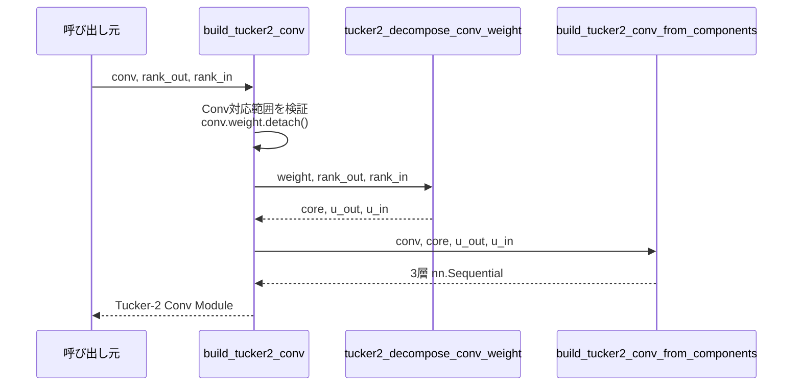

# `build_tucker2_conv`

**Stability:** A  
**定義:** `src/nn_compression/compression/conv_tucker.py`

## 責務

1つのConv2dをHOSVD Tucker-2分解し、分解結果をそのまま3層Conv `nn.Sequential`へ変換するconvenience API。

## Signature

```python
build_tucker2_conv(
    conv: nn.Conv2d,
    rank_out: int,
    rank_in: int,
) -> nn.Sequential
```

## 引数

- `conv`: Tucker-2へ置換したい元の`nn.Conv2d`。入出力channel数、kernel、stride/padding/dilation、bias、device/dtype、`requires_grad`の基準になる。現行対応は`groups=1`の通常Conv2d。
- `rank_out`: 出力channel mode（mode 0）に残すrank。元の`C_out`を中央の低rank channel数`R_out`へ圧縮する大きさを決める。
- `rank_in`: 入力channel mode（mode 1）に残すrank。元の`C_in`を中央の低rank channel数`R_in`へ圧縮する大きさを決める。

## 戻り値

元ConvをTucker-2表現へ置き換えるための、独立したParameterを持つ3層`nn.Sequential`。

```text
1x1 Conv(C_in → R_in, bias=False)
→ core Conv(R_in → R_out, original spatial config, bias=False)
→ 1x1 Conv(R_out → C_out, bias=original)
```

入力・最終出力channel数と空間semanticsは元Convに対応し、中央channelだけを`rank_in / rank_out`へ縮約する。

## 使用場面

HOSVDでConv layerを直接Tucker-2へ置換し、直後評価やFine-tuningを行いたいとき。

## 処理概要

1. **元Convが対応範囲か確認する。**  
   grouped / transposed Convを拒否する。
2. **学習済みweightを`detach()`する。**  
   このAPIは元Parameterから新しいModuleの初期値を作る境界なので、元Convまでgradientを戻す用途ではない。
3. **`tucker2_decompose_conv_weight()`でHOSVD分解する。**  
   `core`, `u_out`, `u_in`を得る。
4. **`build_tucker2_conv_from_components()`へcomponentを渡す。**  
   3層構造、bias、spatial config、device/dtype、requires_gradの扱いを共通builderへ委譲する。
5. **独立した3層Sequentialを返す。**

### シーケンス図



この図は、**このAPI自身はHOSVDの中身や3層へのParameter配置を重複実装せず、Tensor分解とModule構築をそれぞれ専用APIへ委譲する**責務境界を示す。

### autograd境界

```text
元conv.weight Parameter
→ detachして数値を分解
→ 新しい3層Parameterへcopy
→ 新ParameterはleafとしてFine-tuning
```

## 主なcontract / 注意事項

- Module構築は**autograd境界**。元weightのgraphは引き継がない。
- 新Parameterは元Convとstorageを共有しない。

## 関連API

`tucker2_decompose_conv_weight`, `build_tucker2_conv_from_components`, `tucker2_hooi`
