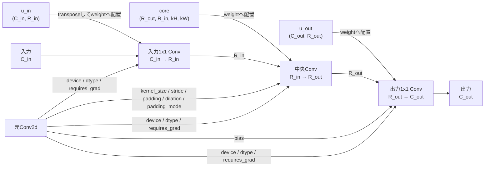

# `build_tucker2_conv_from_components`

**Stability:** A  
**定義:** `src/nn_compression/compression/conv_tucker.py`

## 責務

すでに計算済みのTucker-2 core / factorから、元Conv2dと等価な入出力shape・空間semanticsを持つ3層Conv Moduleを構築する。

## Signature

```python
build_tucker2_conv_from_components(
    conv: nn.Conv2d,
    core: torch.Tensor,
    u_out: torch.Tensor,
    u_in: torch.Tensor,
) -> nn.Sequential
```

## 引数

- `conv`: 構築後Moduleの外形と属性の基準になる元の`groups=1` Conv2d。`C_in / C_out`、kernel、stride/padding/dilation、bias、device/dtype、`requires_grad`を参照する。
- `core`: Tucker-2分解後の中央core Tensor。shapeは`(R_out, R_in, kH, kW)`で、生成する中央Convのweightになる。
- `u_out`: 出力channel方向のfactor matrix。shapeは`(C_out, R_out)`で、低rank出力`R_out`を元の出力channel`C_out`へ戻す最後の1x1 Convのweightになる。
- `u_in`: 入力channel方向のfactor matrix。shapeは`(C_in, R_in)`で、転置して元の入力channel`C_in`を低rank入力`R_in`へ射影する最初の1x1 Convのweightになる。

## 戻り値

指定componentを次の3層へ配置した`nn.Sequential`。入力channel数と最終出力channel数は元Convと同じで、中央だけが`R_in / R_out`の低rank channel空間になる。

```text
1x1 Conv(C_in → R_in, bias=False)
→ core Conv(R_in → R_out, original spatial config, bias=False)
→ 1x1 Conv(R_out → C_out, bias=original)
```

元ConvのParameter storageは共有せず、生成後の3層は独立したleaf ParameterとしてFine-tuningできる。

## 使用場面

HOSVD/HOOIなど分解方法を問わず、同じTucker-2 Module表現へ変換したいとき。

## 処理概要

1. **元ConvがTucker-2対応範囲か確認する。**  
   `groups=1`の通常Convだけを受理する。
2. **componentのndim・shapeを検証する。**  
   coreが4階、factorが2階であり、`u_out=(C_out,R_out)`, `u_in=(C_in,R_in)`, `core=(R_out,R_in,kH,kW)`で接続可能か確認する。
3. **componentのdtype/deviceが元Conv weightと一致するか確認する。**  
   暗黙のCPU/GPU転送やdtype変換を行わない。
4. **3つのConv2d Moduleを元device/dtypeで新規作成する。**
5. **入力projectionへ`U_in^T`を配置する。**  
   `u_in.T[:, :, None, None]`を1x1 Conv weightへcopyし、`C_in → R_in`へ射影する。
6. **中央Convへcoreを配置する。**  
   元Convの`kernel_size / stride / padding / dilation / padding_mode`をこの層へ継承する。
7. **出力projectionへ`U_out`を配置する。**  
   1x1 Convで`R_out → C_out`へ戻す。
8. **元biasを出力projectionだけへコピーする。**  
   入力projection・core Convにはbiasを置かない。
9. **`requires_grad`を元Convから継承する。**  
   新Parameterは独立したleaf ParameterとしてFine-tuning可能。
10. **3層を`nn.Sequential`として返す。**

一本道の組み立て順は上の`処理概要`で十分に追えるため、フローチャートは置かない。このAPIで図示する価値が高いのは、処理順ではなく**各component・元Conv属性の配置先**である。

### Component配置図



この図は3層の並びを再掲するためではなく、**各入力componentと元Convの属性が、構築後のどの層へ反映されるか**を示す。

## 主なcontract / 注意事項

- 新Parameterは元weightのstorageを共有しない。
- これは**componentsからModuleを組み立てるAPI**であり、HOSVD/HOOIのrank feasibilityを再計算する分解APIではない。

## 関連API

`build_tucker2_conv`, `tucker2_decompose_conv_weight`, `tucker2_hooi`, `tucker2_effective_weight`
