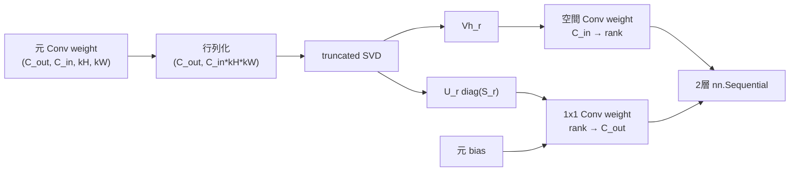

# `factorize_conv2d_layer`

**Stability:** A  
**定義:** `src/nn_compression/compression/conv_svd.py`

## 責務

1つの通常`nn.Conv2d`をSVDで低rankな2層Convへ分解する。

## Signature

```python
factorize_conv2d_layer(
    conv: nn.Conv2d,
    rank: int,
) -> nn.Sequential
```

## 引数

- `conv`: `groups=1` の通常Conv2d。
- `rank`: 2層間の中間channel数。

## 戻り値

```text
Conv2d(C_in → rank, 元kernel, bias=False)
→ Conv2d(rank → C_out, 1x1, bias=original)
```

## 使用場面

Conv2dのSVD低rank圧縮、圧縮後Fine-tuningの初期化。

## 処理概要

1. **対象Convが対応範囲か確認する。**  
   現在のflatteningと2層構造は`groups=1`の通常Convを前提とするため、grouped Convやtransposed Convを拒否する。
2. **rankを検証する。**  
   weightを`(C_out, C_in*kH*kW)`へ行列化したときの最大rank `min(C_out, C_in*kH*kW)`以内であることを要求する。
3. **元Convのdevice/dtypeとshape情報を取得する。**  
   新しいConvを元と同じ実行条件で作るため、channel数・kernel・device・dtypeを保持する。
4. **学習済みweightをdetachして2次元化する。**  
   `conv.weight.detach()`を`conv2d_weight_matrix()`で行列へ変換する。Module初期化のため元Parameterのgraphは引き継がない。
5. **truncated SVDを計算する。**  
   `W_mat ≈ U_r @ diag(S_r) @ Vh_r`を得る。
6. **入力側の空間Convを作る。**  
   `Vh_r`を `(rank, C_in, kH, kW)`へreshapeして配置する。この層が元の`kernel_size / stride / padding / dilation / padding_mode`を引き継ぐ。
7. **出力側の1x1 Convを作る。**  
   `U_r @ diag(S_r)`を `(C_out, rank, 1, 1)`へreshapeして配置する。stride=1、padding=0で空間サイズを追加変更しない。
8. **元biasを最終層へ移す。**  
   元Convにbiasがある場合だけ、出力側1x1 Convへcopyする。中間層にはbiasを置かない。
9. **`requires_grad`を継承する。**  
   元weight/biasのtrainabilityを新Parameterへ引き継ぐ。
10. **2層`nn.Sequential`を返す。**  
    元Conv自体は変更しない。

### 分解・配置図



これは制御フローを示すフローチャートではなく、**元weightをSVDした各成分が、構築後の2層Convのどこへ配置されるか**を示すデータフロー／構造図として扱う。

## 主なcontract / 注意事項

- `groups=1`、非transposed Convのみ。
- rank上限は `min(C_out, C_in*kH*kW)`。
- 元`stride/padding/dilation/padding_mode`は1層目へ継承。
- device/dtype/requires_gradを維持する。

## 関連API

`conv2d_weight_matrix`, `factorize_named_conv2d`, `compressed_conv2d_macs`
