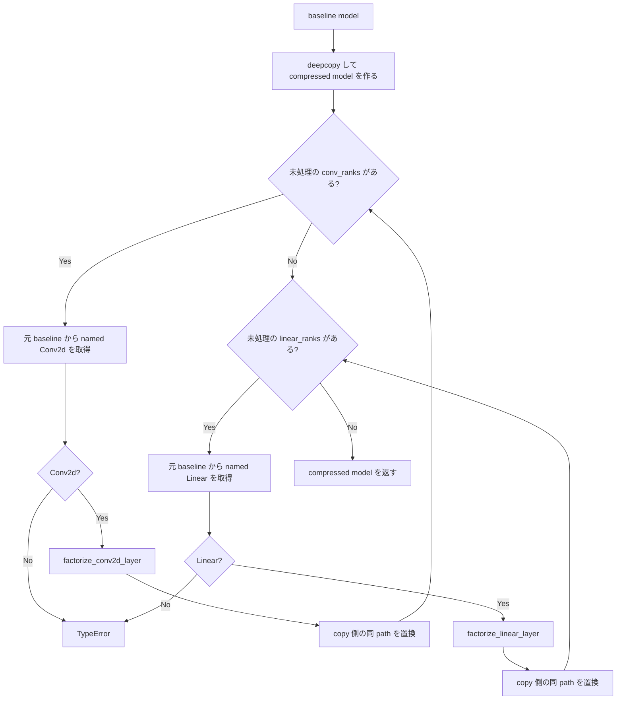
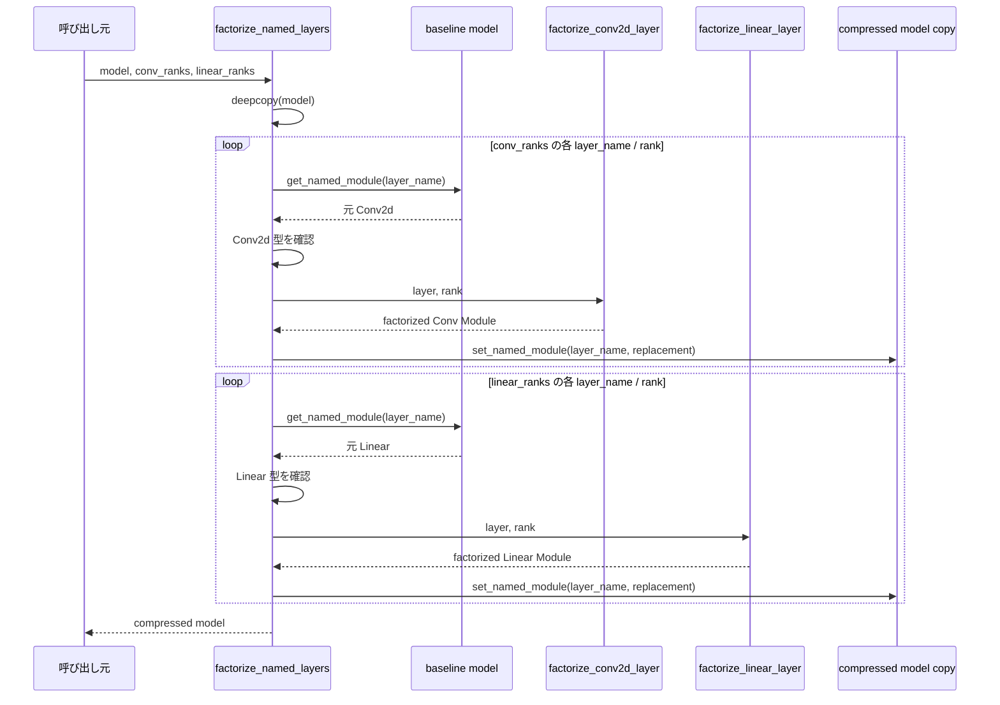
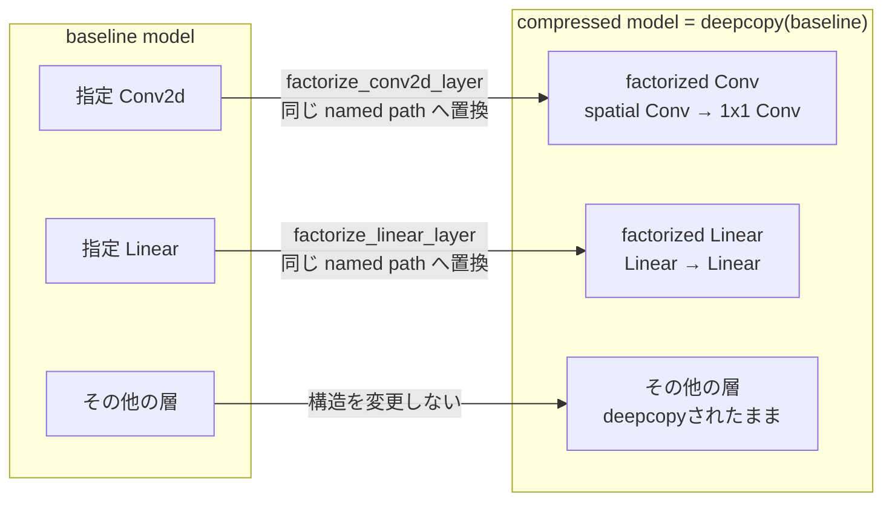

# `factorize_named_layers`

**Stability:** A  
**定義:** `src/nn_compression/compression/named_layers.py`

## 責務

model内の複数named Conv2d / Linearを、層種別ごとのrank指定に従って一度に低rank分解したmodel copyを作る。

## Signature

```python
factorize_named_layers(
    model: nn.Module,
    *,
    conv_ranks: dict[str, int] | None = None,
    linear_ranks: dict[str, int] | None = None,
) -> nn.Module
```

## 引数

- `model`: 圧縮元となるbaseline model。関数内ではこのmodel自体を変更せず、各指定層の未分解weightを分解元として使う。
- `conv_ranks`: Conv2dを圧縮する指定。`{layer_name: rank}`形式で、keyはnamed module path、valueはそのConv2dに残すSVD rank。`None`ならConv2dは置換しない。
- `linear_ranks`: Linearを圧縮する指定。`{layer_name: rank}`形式で、keyはnamed module path、valueはそのLinearに残すSVD rank。`None`ならLinearは置換しない。

## 戻り値

指定されたConv2d / Linearだけをfactorized Moduleへ置換した**baselineとは独立なmodel copy**。指定されていない層は`deepcopy`された構造をそのまま保持し、元modelのParameterとは共有しない。

## 使用場面

CIFAR-10などで複数Convを同時に圧縮するmodel-wide SVD、Conv+Linear同時圧縮。

## 処理概要

1. **baseline modelを`deepcopy`する。**  
   すべての置換はcopy側だけへ行う。
2. **Conv圧縮指定を順に処理する。**  
   各`layer_name`について、**元baseline model**からsubmoduleを取得する。
3. **対象がConv2dか確認する。**  
   正しい型なら`factorize_conv2d_layer()`で2層Convを作り、copy側の同pathを置換する。
4. **Linear圧縮指定を順に処理する。**  
   同様に元baseline modelから対象を取り、型を確認して`factorize_linear_layer()`で置換する。
5. **すべての置換が終わったmodel copyを返す。**

### なぜ「元baseline layer」から毎回分解するか

圧縮途中のcopyから次の分解元を取ると、先に置換した構造の影響やnested path変化が混ざる可能性がある。各指定層は未分解のbaseline layerを正本として独立に分解する。

### フローチャート



この図は、**Conv指定とLinear指定の反復、型判定、異常終了、Convを全件処理してからLinearへ進む制御フロー**を示す。分解APIと置換処理は別工程として残し、処理概要を単に箱へ並べ替えた図にはしない。

### シーケンス図



この図は、**分解元は常にbaseline model、置換先はcompressed model copyであり、層ごとの分解を専用APIへ委譲する**という責務分担を示す。

### コンポーネント図



この図は、**model全体をcopyしたうえで、指定されたConv/Linearだけがfactorized Moduleへ構造変換され、対象外の層はそのまま残る**ことを示す。

## 主なcontract / 注意事項

- baselineとParameterを共有しない。
- Conv/Linearの分解contractはそれぞれの層単位APIへ委譲する。

## 関連API

`factorize_conv2d_layer`, `factorize_linear_layer`, `get_named_module`, `set_named_module`
