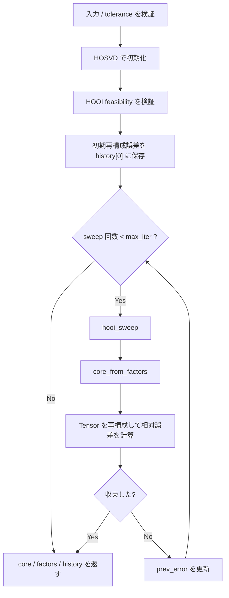

# `hooi`

**Stability:** A  
**定義:** `src/nn_compression/compression/hooi.py`

## 責務

HOSVDを初期値としてHOOI（高階直交反復法）を反復し、最終core・factor集合・相対Frobenius誤差履歴を返す。

## Signature

```python
hooi(
    X: torch.Tensor,
    ranks: dict[int, int],
    max_iter: int = 30,
    abs_tol: float = 1e-8,
    rel_tol: float = 1e-5,
) -> tuple[torch.Tensor, dict[int, torch.Tensor], list[float]]
```

## 引数

- `X`: 2階以上の実数浮動小数点Tensor。zero tensor不可。
- `ranks`: 空でない `{mode: rank}` Mapping。keyが更新・圧縮対象mode。
- `max_iter`: HOOI sweepの最大回数。0以上。
- `abs_tol`, `rel_tol`: 誤差変化に対する収束判定tolerance。

## 戻り値

- `core`: 最終factor集合に対応するTucker core。
- `factors`: 最終factor dict。
- `history`: 相対Frobenius誤差の`list[float]`。`history[0]`はHOSVD初期値。

## 使用場面

HOSVDのrankを固定したままfactorを反復最適化し、元Tensorへの再構成誤差を改善したいとき。

## 処理概要

1. **入力Tensorを検証する。**  
   `ndim >= 2`、実数浮動小数点dtype、`ranks`が空でないMappingであることを確認する。
2. **zero tensorを拒否する。**  
   収束履歴に使う相対Frobenius誤差は`||X||`を分母にするため、`X`がzero tensorでは定義できない。
3. **反復条件を検証する。**  
   `max_iter >= 0`、`abs_tol/rel_tol`が有限かつ0以上であることを確認する。
4. **HOSVDで初期core/factorsを作る。**  
   `hosvd(X, ranks)`を使い、反復前の初期近似を得る。
5. **初期factorのHOOI feasibilityを検証する。**  
   factor keys/shape/dtype/deviceと、各target mode更新時のprojected unfolding最大rankを確認する。この検証は`max_iter=0`でも必ず行う。
6. **HOSVD初期値を再構成する。**  
   `reconstruct_tucker(core_hosvd, factors_hosvd)`で`X_hat`を作る。
7. **初期相対Frobenius誤差を計算する。**  
   この値を`history[0]`として保存する。
8. **factorをcloneして反復用状態を作る。**
9. **1 sweep更新する。**  
   `hooi_sweep()`で各対象modeのfactorをGauss-Seidel型に更新する。
10. **更新factorからcoreを再計算する。**  
    `core_from_factors()`を使う。
11. **新しいcore/factorsでTensorを再構成する。**
12. **新しい相対誤差を計算しhistoryへ追加する。**
13. **収束判定する。**  
    `has_converged(current, previous, ...)`がTrueなら反復を終了する。
14. **未収束なら前回誤差を更新し、最大`max_iter`回まで9〜13を繰り返す。**
15. **最終core/factors/historyを返す。**

### `max_iter=0` の意味

反復sweepは1回も行わないが、HOSVD初期化・factor/rank feasibility検証・初期誤差計算までは行う。そのため不可能rankが`max_iter=0`だけ通ることはない。

### フローチャート



## 主なcontract / 注意事項

- `history[0]`はHOSVD初期誤差。
- `max_iter=0`でも初期値・feasibilityを検証して返す。
- zero tensorは相対誤差が定義できないため拒否。
- HOOIが直接最適化するのは元Tensorへの近似誤差であり、task accuracyではない。

## 関連API

`hosvd`, `hooi_sweep`, `core_from_factors`, `reconstruct_tucker`, `has_converged`, `relative_frobenius_error`
