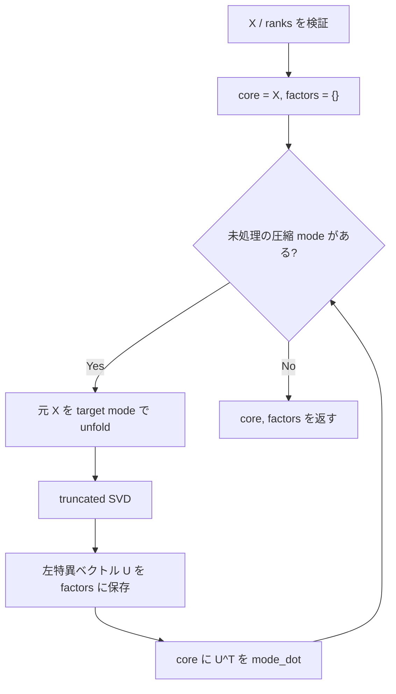

# `hosvd`

**Stability:** A  
**定義:** `src/nn_compression/compression/tucker.py`

## 責務

指定したmodeだけをtruncated HOSVD（高階特異値分解）で低rank化し、Tucker coreとfactor行列を返す。全modeを指定すれば通常のtruncated HOSVD、一部modeだけならpartial HOSVDとして動作する。

## Signature

```python
hosvd(
    X: torch.Tensor,
    ranks: dict[int, int],
) -> tuple[torch.Tensor, dict[int, torch.Tensor]]
```

## 引数

- `X`: 分解対象。2階以上の**実数浮動小数点Tensor**。
- `ranks`: `{mode: rank}` Mapping。keyが圧縮対象mode、valueが残すrank。未指定modeは圧縮しない。

## 戻り値

- `core`: 指定modeだけrank dimensionへ縮めたTucker core。
- `factors`: `{mode: U}`形式のfactor辞書。`U.shape == (X.shape[mode], rank)`。

## 使用場面

- generic Tucker分解。
- Conv weightのTucker-2 HOSVD。
- HOOIの初期factor生成。

## 処理概要

1. **入力Tensorの階数とdtypeを検証する。**  
   `X.ndim >= 2`を要求し、現行実装が`U.T`を使うため、complex・integer・boolではなく実数浮動小数点Tensorだけを正式対応とする。
2. **`ranks`を検証する。**  
   Mappingであること、modeが有効範囲内であること、rankがboolではない正整数であることを確認する。各rankはmode-n unfoldingの最大rank `min(I_n, Π_{m≠n} I_m)`以内でなければならない。
3. **factor格納用辞書と、coreの初期値`X`を用意する。**
4. **圧縮対象modeを1つずつ処理する。**  
   各modeについて、**必ず元の`X`**を`unfold(X, mode)`する。先に縮めたcoreを次modeのSVD入力へ使わない。
5. **mode-n unfoldingをtruncated SVDする。**  
   左特異ベクトル`U[:, :rank]`を、そのmodeのfactor `U_mode`として保存する。
6. **core側だけをfactor転置で射影する。**  
   `core = mode_dot(core, U_mode.T, mode)`として、対象modeのdimensionをrankへ縮める。
7. **全指定modeを処理したらcoreとfactorsを返す。**

### なぜfactorは「元X」から求めるか

HOSVDの各mode factorは、元Tensorの各mode-n unfoldingを独立にSVDして求める。先に縮めたcoreから次factorを計算すると、標準的な1-pass HOSVDとは別の逐次アルゴリズムになるため、この順序はCore API v1で固定する。

### フローチャート



図中のSVD入力は毎回**元`X`**であり、更新済み`core`ではない。

## 主なcontract / 注意事項

- factorは**逐次更新したcoreではなく元Xのunfolding**から独立に求める。
- `ranks={}` はidentityとして許可し、`core=X`, `factors={}`相当になる。
- rank上限はmode dimensionだけでなくmode-n unfoldingの数学的最大rank。
- complex/integer/bool Tensorは分解入口で拒否する。

## 関連API

`unfold`, `mode_dot`, `reconstruct_tucker`, `hooi`, `tucker2_decompose_conv_weight`
