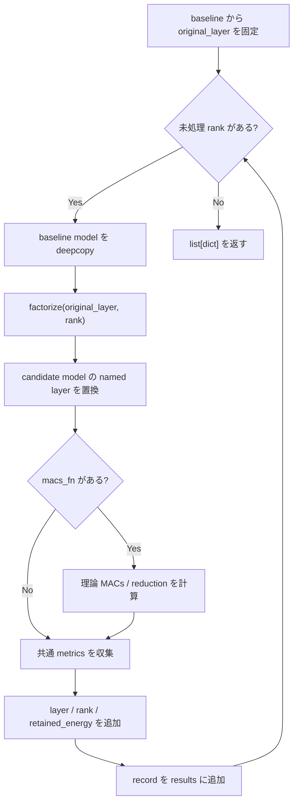
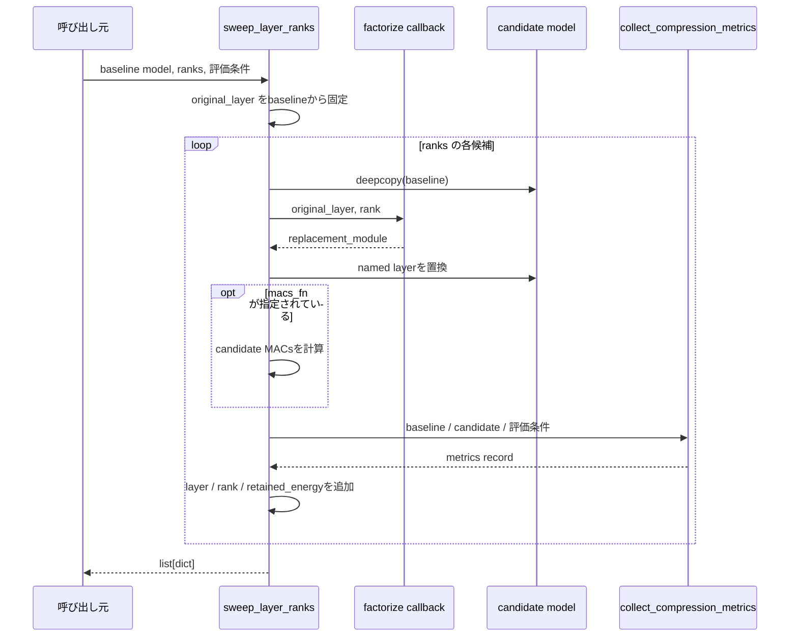

# `sweep_layer_ranks`

**Stability:** B  
**定義:** `src/nn_compression/compression/rank_sweep.py`

## 責務

任意のnamed layerについて複数rank候補を同じ評価条件で圧縮・測定し、候補ごとのmetrics recordを作るgeneric rank sweep。

## Signature

```python
sweep_layer_ranks(
    model,
    layer_name,
    ranks,
    loader,
    criterion,
    device,
    *,
    factorize,
    baseline_acc,
    baseline_time_s,
    macs_fn=None,
    warmup=5,
    repeats=200,
    verbose=True,
    input_batch=None,
) -> list[dict]
```

## 引数

- `model`: 各candidateの複製元になるbaseline model。関数内では変更せず、すべてのrank候補を同じbaselineから作る。
- `layer_name`: rank sweep対象submoduleのnamed path。例: `"conv2"`, `"fc1"`。
- `ranks`: 順番に評価するrank候補のiterable。各rankについて独立したcandidate modelを作る。
- `loader`: candidateのvalidation性能、agreement、logits RMSEなどを評価する再走査可能loader。
- `criterion`: candidateのvalidation loss計算に使うloss関数。
- `device`: candidate評価とlatency benchmarkを実行するdevice。
- `factorize`: `(original_layer, rank) -> replacement_module` のcallback。rankごとの分解方式をsweep本体から切り離すために使う。
- `baseline_acc`: 圧縮前modelのaccuracy。各candidateのaccuracy dropを計算する基準値。
- `baseline_time_s`: 圧縮前modelの推論時間。candidateのlatency比較の基準値。
- `macs_fn`: optionalな理論MACs計算callback。指定時だけcandidateのMACs関連項目をrecordへ追加する。
- `warmup`: latency計測前に実行するwarmup forward回数。
- `repeats`: latency平均を取る計測forward回数。
- `verbose`: 下位評価APIの表示を有効にするかを制御するフラグ。
- `input_batch`: 全candidateで共通利用するbenchmark入力。`None`なら下位metrics収集側でloaderから取得する。

## 戻り値

rank候補ごとの比較結果を順番に格納した`list[dict]`。各recordには共通compression metricsに加えて少なくとも`layer`、`rank`、`retained_energy`が入り、`macs_fn`指定時はMACs関連項目も加わる。candidate model本体は既定では保持しない。

## 使用場面

SVD以外を含め、層単位factorizationのrank候補を同じ枠組みで比較したいとき。

## 処理概要

1. **baseline modelから元layerを1回取得する。**  
   すべてのcandidateを同じ未圧縮layerから作るため、sweep開始前に正本を固定する。
2. **rank候補を1つずつ処理する。**
3. **candidateごとにbaseline modelを`deepcopy`する。**  
   前のcandidateの置換やFine-tuning状態が次候補へ混ざらないようにする。
4. **`factorize(original_layer, rank)`で置換Moduleを作る。**  
   分解方式そのものはcallbackへ委譲し、sweep処理はアルゴリズム非依存に保つ。
5. **candidate modelのnamed layerを置換する。**
6. **必要なら理論MACsを計算する。**  
   `macs_fn`が指定された場合だけcompressed MACsとreductionを取得する。
7. **`collect_compression_metrics()`で共通指標を集める。**  
   validation accuracy/loss、parameters、latency、agreement、logits RMSE等を同じ条件で評価する。
8. **実験固有情報をrecordへ追加する。**  
   `layer`, `rank`, `retained_energy`を追加する。
9. **結果listへ追加し、次のrankへ進む。**
10. **全candidateのrecordを返す。**  
    model本体は既定でrecordへ保持せず、必要な候補はrankから再構築する設計。

### フローチャート



この図は、**rankごとの反復とoptional MACsの条件分岐**を中心に、candidateが毎回baselineから作られる制御フローを示す。

### シーケンス図



この図は、**rank sweep本体・分解callback・candidate model・共通metrics収集の責務分担**を示す。ループや分岐そのものはフローチャート側で確認する。

## 主なcontract / 注意事項

- candidateは常に同じbaselineから作る。
- 全candidate modelを結果表へ保存しないため、メモリ使用量を抑える。
- benchmarkでは可能なら共通`input_batch`を渡す。

## 関連API

`collect_compression_metrics`, `retained_energy`, `sweep_conv2d_ranks`
