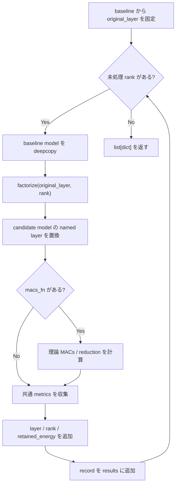

# `sweep_layer_ranks`

**Stability:** B  
**定義:** `src/nn_compression/compression/rank_sweep.py`

## 責務

任意のnamed layerについて複数rank候補を同じ評価条件で圧縮・測定し、候補ごとのmetrics recordを作るgeneric rank sweep。

## Signature

```python
sweep_layer_ranks(
    model,
    layer_name,
    ranks,
    loader,
    criterion,
    device,
    *,
    factorize,
    baseline_acc,
    baseline_time_s,
    macs_fn=None,
    warmup=5,
    repeats=200,
    verbose=True,
    input_batch=None,
) -> list[dict]
```

## 引数

- `model`: baseline model。
- `layer_name`: sweep対象のnamed layer。
- `ranks`: 評価するrank列。
- `loader`, `criterion`, `device`: candidate評価条件。
- `factorize`: `(original_layer, rank) -> replacement_module` callback。
- `baseline_acc`, `baseline_time_s`: 比較基準。
- `macs_fn`: optionalな理論MACs計算callback。
- `warmup`, `repeats`, `input_batch`: latency benchmark条件。

## 戻り値

rankごとのmetrics dictを並べた`list[dict]`。

## 使用場面

SVD以外を含め、層単位factorizationのrank候補を同じ枠組みで比較したいとき。

## 処理概要

1. **baseline modelから元layerを1回取得する。**  
   すべてのcandidateを同じ未圧縮layerから作るため、sweep開始前に正本を固定する。
2. **rank候補を1つずつ処理する。**
3. **candidateごとにbaseline modelを`deepcopy`する。**  
   前のcandidateの置換やFine-tuning状態が次候補へ混ざらないようにする。
4. **`factorize(original_layer, rank)`で置換Moduleを作る。**  
   分解方式そのものはcallbackへ委譲し、sweep処理はアルゴリズム非依存に保つ。
5. **candidate modelのnamed layerを置換する。**
6. **必要なら理論MACsを計算する。**  
   `macs_fn`が指定された場合だけcompressed MACsとreductionを取得する。
7. **`collect_compression_metrics()`で共通指標を集める。**  
   validation accuracy/loss、parameters、latency、agreement、logits RMSE等を同じ条件で評価する。
8. **実験固有情報をrecordへ追加する。**  
   `layer`, `rank`, `retained_energy`を追加する。
9. **結果listへ追加し、次のrankへ進む。**
10. **全candidateのrecordを返す。**  
    model本体は既定でrecordへ保持せず、必要な候補はrankから再構築する設計。

### フローチャート



## 主なcontract / 注意事項

- candidateは常に同じbaselineから作る。
- 全candidate modelを結果表へ保存しないため、メモリ使用量を抑える。
- benchmarkでは可能なら共通`input_batch`を渡す。

## 関連API

`collect_compression_metrics`, `retained_energy`, `sweep_conv2d_ranks`
