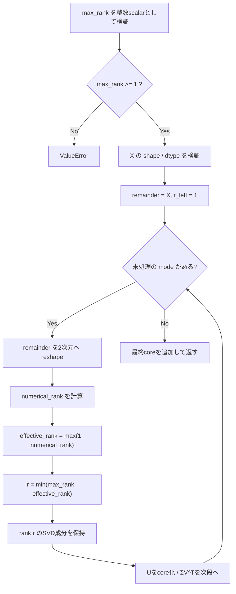

# `tt_svd`

**Stability:** A  
**定義:** `src/nn_compression/compression/tt.py`  
**参照Notebook:** `notebooks/30_tt_mps/00_fundamentals/02_truncation_error_tradeoff.ipynb`

## 責務

TT-SVDの各内部bond dimensionに共通の上限`max_rank`を設定し、各段階で

$$
r_k
=
\min\left(
\texttt{max\_rank},
\operatorname{rank}_{\mathrm{num}}(M_k)
\right)
$$

を用いてTensorを近似TT core列へ分解する。

`max_rank`を小さくするとTT storageを抑えられる一方、小さいが非ゼロの特異方向を捨てるため再構成誤差が生じ得る。

## Signature

```python
tt_svd(
    X: torch.Tensor,
    max_rank: int,
) -> list[torch.Tensor]
```

## 引数

- `X`: TT-SVD対象Tensor。`ndim >= 2`、各dimensionが正で、dtypeは`torch.float32`または`torch.float64`である必要がある。
- `max_rank`: **全内部bondへ共通して適用するrank上限**。`bool`やTensor scalarではない整数scalarで、1以上を要求する。`np.int64`など`operator.index`で整数として扱えるscalarは受理する。

## 戻り値

$d = X.ndim$ 個のTT coreを格納したlistを返す。

各coreは

$$
G^{(k)}
\in
\mathbb R^{r_{k-1}\times n_k\times r_k},
\qquad
r_0=r_d=1
$$

で、通常ケースでは各内部rankは

$$
r_k
\le
\texttt{max\_rank}
$$

を満たす。

`max_rank`が全段階のeffective rank以上なら、bond rank・再構成Tensor・再構成誤差は`tt_svd_exact`と整合する。

## 使用場面

- TT rankと再構成誤差のtrade-off実験。
- TT parameter ratio / compression ratioの評価。
- 後続のTT/MPS圧縮で、まず単一のrank上限を使って簡潔にrank sweepするとき。
- `tt_svd_exact`との比較による打ち切り影響の確認。

## 処理概要

1. `coerce_integer_scalar(max_rank, name="max_rank")`で整数scalarへ正規化する。
2. `max_rank < 1`なら`ValueError`とする。
3. `_tt_svd_sweep(X, max_rank=max_rank)`へ委譲する。
4. 内部sweepで`X`のshapeとdtypeを検証する。
5. 左から順にremainderを

   $$
   (r_{k-1}n_k)
   \times
   (n_{k+1}\cdots n_d)
   $$

   へ`reshape`する。
6. 各段階の`numerical_rank`を計算し、零rankだけはTT bondを正に保つため`effective_rank = 1`とする。
7. 保存rankを

   $$
   r_k
   =
   \min(\texttt{max\_rank},\texttt{effective\_rank})
   $$

   と決める。
8. `truncated_svd(mat, r_k)`を実行し、`U`をTT coreへreshapeする。
9. `diag(S) @ Vh`を次段のremainderとして渡す。
10. 最後のremainderを右bond 1の最終coreへreshapeして返す。

### フローチャート



## 主なcontract / 注意事項

- `max_rank`はrank列ではなく、**全内部bond共通の上限1個**である。
- `max_rank`が対象行列のrankより大きくてもエラーにはしない。各段階で`min(max_rank, effective_rank)`を取るため、必要rank以上はそのままexact側に一致する。
- `max_rank=0`や負数は、自動で1へ丸めず`ValueError`とする。
- `bool`、float、string、`None`、Tensor scalarはrankとして拒否する。
- 零Tensorではnumerical rankが0でもbond dimensionは最低1であり、`max_rank`を1より大きくしても内部bondは1のままになる。
- `max_rank`を小さくすると一般に情報を捨てるため、出力TTは元Tensorの近似になる。
- core要素の完全一致はSVDの符号非一意性のためcontractにしない。exact版との整合はbond rank・再構成Tensor・再構成誤差で評価する。
- 現行APIは各bondごとに異なるrank指定や誤差許容値ベースのrank選択を受けない。それらは将来拡張の別contractとする。

## 関連API

`tt_svd_exact`, `tt_reconstruct`, `tt_num_parameters`, `tt_unfold`, `truncated_svd`, `relative_frobenius_error`
