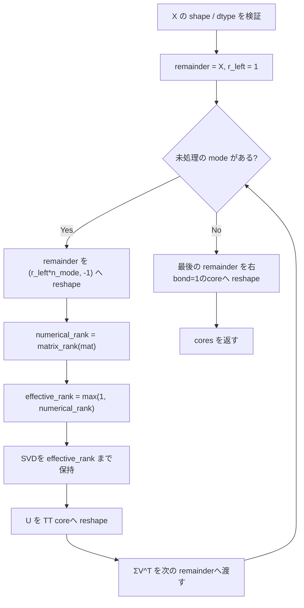

# `tt_svd_exact`

**Stability:** A  
**定義:** `src/nn_compression/compression/tt.py`  
**参照Notebook:** `notebooks/30_tt_mps/00_fundamentals/00_tt_svd_3way_basics.ipynb`, `notebooks/30_tt_mps/00_fundamentals/01_tt_rank_unfolding.ipynb`

## 責務

2階以上のTensorを、各段階の**numerical rankを意図的に打ち切らず**TT core列へ分解する。

ここでの`exact`はsymbolicな厳密rankではなく、`torch.linalg.matrix_rank`のdefault toleranceに基づくnumerical rankを各逐次SVD段階で全て保持する、という意味である。

## Signature

```python
tt_svd_exact(
    X: torch.Tensor,
) -> list[torch.Tensor]
```

## 引数

- `X`: TT-SVDの対象Tensor。`ndim >= 2`、各dimensionが正で、dtypeは`torch.float32`または`torch.float64`である必要がある。整数・bool・complex・`float16`・`bfloat16`は正式対応外として`TypeError`で拒否する。

## 戻り値

$d = X.ndim$ 個のTT coreを格納したlistを返す。

`X.shape == (n_1,\ldots,n_d)` のとき、各coreは

$$
G^{(k)}
\in
\mathbb R^{r_{k-1}\times n_k\times r_k},
\qquad
r_0=r_d=1
$$

のshapeを持つ。

数学的なexact TT-rankでは、理論上

$$
r_k
=
\operatorname{rank}
\left(X^{\langle k\rangle}\right)
$$

である。現行実装でも、rank判定がdefault toleranceから十分離れた通常の入力では、生成されたbond dimensionと`tt_unfold(X, k)`のnumerical rankが一致することを回帰テストで確認している。

ただしこれは**全ての浮動小数点入力に対する厳密なPublic API contractではない**。`torch.linalg.matrix_rank`のdefault toleranceは対象行列のshapeやスケールに依存するため、閾値近傍では、元Tensorのcut unfoldingと逐次remainder側でnumerical rank判定がずれる場合がある。

また零Tensorなどnumerical rankが0になる特殊ケースでは、TTのbond dimensionを正の整数として維持するため、bond dimensionは最低1とする。

## 使用場面

- TT/MPS基礎における打ち切りなしTT-SVD。
- `tt_svd`によるrank制限近似の基準となるexact側の分解。
- `tt_unfold`で求めたcut rankとTT coreのbond dimensionを、通常ケースで数値的に照合する。
- TT coreからの再構成・parameter count検証。

## 処理概要

Public API自身は`_tt_svd_sweep(X, max_rank=None)`へ委譲する。内部sweepでは次を行う。

1. `validate_tensor_shape(X)`でTensorの階数・shapeを検証する。
2. `validate_tt_dtype(X)`で`float32` / `float64`のみを受理する。
3. `remainder = X`, `r_left = 1`として左から逐次分解を開始する。
4. 各mode $k=1,\ldots,d-1$ について、現在のremainderを

   $$
   (r_{k-1}n_k)
   \times
   (n_{k+1}\cdots n_d)
   $$

   の行列へ`reshape`する。
5. `torch.linalg.matrix_rank(mat)`でその段階のnumerical rankを求める。
6. numerical rankが1以上ならその値をbond dimensionとして使う。0なら`effective_rank = 1`とする。
7. `truncated_svd(mat, effective_rank)`を使い、その段階で判定されたnumerical rankまでのSVD成分を取得する。
8. 左特異ベクトル`U`を

   $$
   (r_{k-1}, n_k, r_k)
   $$

   にreshapeして第 $k$ coreとして保存する。
9. `diag(S) @ Vh`を次のremainderへ渡し、

   $$
   (r_k,n_{k+1},\ldots,n_d)
   $$

   に戻す。
10. 最後にremainderを

    $$
    (r_{d-1},n_d,1)
    $$

    へreshapeして最終coreとする。

### フローチャート



この図の目的は、**逐次SVDでremainderを更新し続けること**と、numerical rank 0だけをrank 1へ持ち上げる分岐を示すことにある。Public APIからprivate helperへの単純な1回委譲は、別シーケンス図にしても情報が増えないため図示しない。

## 主なcontract / 注意事項

- `exact`は**各逐次SVD段階で判定されたnumerical rankを意図的に削らない**という意味であり、数値計算上のrank判定toleranceは存在する。
- 内部sweepでは元Tensorへ毎回`tt_unfold`をかけ直さず、前段の`remainder`を逐次`reshape`する。
- 数学的にはexact TT-rankと元Tensorのcut rankは一致するが、現行の数値実装では各`matrix_rank`呼び出しがdefault toleranceを使うため、閾値近傍まで含めたnumerical rank一致をPublic API contractにはしない。
- 回帰テストでは、通常のランダムfloat64 Tensorでcoreの内部bond rankと元Tensorの対応cut unfolding rankが一致することを確認する。
- 零Tensorではcut unfolding rankは0だが、bond dimensionは最低1とするため、この一致は成立しない。
- 零Tensorでも例外にせず、全内部bond rank 1のTTとして再構成可能にする。
- SVDの特異ベクトルには符号非一意性があるため、同じTensorを表すcore列でもcore要素の完全一致はPublic API contractにしない。
- 入力のdtype/deviceはSVDとcoreへ引き継がれる。

## 関連API

`tt_svd`, `tt_unfold`, `tt_reconstruct`, `tt_num_parameters`, `truncated_svd`
