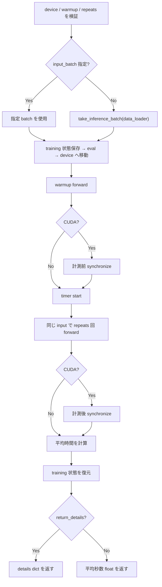

# `benchmark_inference`

**Stability:** A  
**定義:** `src/nn_compression/metrics/model_comparison.py`

## 責務

固定した1 batchに対するmodel forwardのwall-clock時間を、warmup後に複数回測定し、1 batch平均の推論時間を返す。

## Signature

```python
benchmark_inference(
    model,
    data_loader=None,
    device=None,
    warmup=10,
    repeats=5000,
    *,
    input_batch=None,
    return_details: bool = False,
)
```

## 引数

- `model`: 計測対象model。
- `data_loader`: `input_batch`未指定時のbatch取得元。
- `device`: 必須。計測対象device。
- `warmup`: 計測開始前のforward回数。0以上。
- `repeats`: 本計測のforward回数。1以上。
- `input_batch`: 事前に固定した入力。baseline/compressed比較では指定推奨。
- `return_details`: 時間以外の計測条件もdictで返すか。

## 戻り値

- 既定: 1 batch平均秒数`float`。
- `return_details=True`: `time_s`, `time_ms`, `batch_size`, `input_shape`, `warmup`, `repeats`を含むdict。

## 使用場面

理論MACsとは別に、実際のhardware/framework上でwall-clock latencyを比較するとき。

## 処理概要

1. **deviceが指定されているか確認する。**  
   benchmark対象の実行場所を曖昧にしない。
2. **`warmup`と`repeats`を整数として検証する。**  
   bool/Tensor scalarを拒否し、`warmup >= 0`, `repeats >= 1`を要求する。
3. **計測に使うinput batchを決める。**  
   `input_batch`があればその値を使う。なければ`data_loader`から`take_inference_batch()`で取得する。
4. **modelのroot・全submoduleのtraining状態を保存する。**
5. **modelをeval modeへし、inputをdeviceへ移す。**
6. **warmup forwardを行う。**  
   `torch.no_grad()`で指定回数forwardし、初回kernel起動等の影響を本計測から分離する。
7. **CUDAの場合は同期する。**  
   GPU kernelは非同期実行なので、計測開始前に現在deviceの処理完了を待つ。
8. **高分解能timerを開始する。**
9. **`repeats`回forwardする。**  
   同じinput Tensorを毎回使用する。
10. **CUDAの場合は再度同期する。**  
    最後のGPU処理が完了してから終了時刻を読む。
11. **経過時間を`repeats`で割る。**  
    1 batchあたり平均秒数を求める。
12. **modelのtraining状態を復元する。**
13. **要求形式で返す。**  
    通常はfloat、詳細指定時は計測条件を含むdict。

### フローチャート



## 主なcontract / 注意事項

- baseline/compressed比較では**同じ`input_batch`、warmup、repeats**を使う。
- `warmup/repeats`はbool/Tensor scalar不可。
- wall-clock時間はhardware・kernel・framework overheadに依存し、MACs削減を直接意味しない。

## 関連API

`take_inference_batch`, `benchmark_inference_print`, `collect_compression_metrics`
