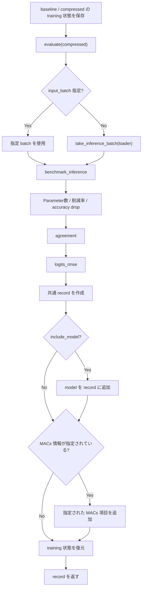

# `collect_compression_metrics`

**Stability:** A  
**定義:** `src/nn_compression/metrics/model_comparison.py`

## 責務

1つのcompressed candidateについて、validation性能・Parameter数・latency・baselineとの出力差・optional MACsを共通dictへ集約する。

## Signature

```python
collect_compression_metrics(
    baseline_model,
    compressed_model,
    loader,
    criterion,
    device,
    *,
    baseline_acc: float,
    baseline_time_s: float,
    warmup: int = 5,
    repeats: int = 200,
    compressed_macs: int | None = None,
    compute_reduction: float | None = None,
    baseline_macs: int | None = None,
    include_model: bool = False,
    input_batch=None,
) -> dict
```

## 引数

baseline/compressed model、評価loader、criterion/device、baseline指標、benchmark条件、optional MACs、model保持有無。

## 戻り値

parameters、validation loss/acc、accuracy drop、latency条件、agreement、logits RMSE、optional MACs/modelを含むdict。

## 使用場面

rank sweepや複数圧縮候補の比較表で、列の意味と評価方法を統一したrecordを作るとき。

## 処理概要

1. **baseline/compressed両modelのtraining状態を保存する。**
2. **compressed modelを`evaluate()`する。**  
   validation lossとaccuracyをloader全体から計算する。
3. **benchmark用input batchを確保する。**  
   呼び出し側から渡されていなければ`take_inference_batch(loader)`を使う。
4. **compressed modelのlatencyを計測する。**  
   `benchmark_inference(..., return_details=True)`を使い、時間だけでなくbatch sizeやinput shapeも記録する。
5. **Parameter数と削減率を計算する。**  
   `count_parameters()`と`parameters_reduction()`を使う。
6. **validation accuracyからaccuracy dropを計算する。**
7. **baselineとの予測一致率を計算する。**  
   `agreement()`がloaderを再走査する。
8. **baselineとのlogits RMSEを計算する。**  
   `logits_rmse()`がloaderをさらに再走査する。
9. **共通metricsをdictへまとめる。**
10. **必要ならmodel本体をrecordへ追加する。**  
    `include_model=False`が既定で、rank sweep全候補のmodel保持を避ける。
11. **optionalなMACs情報を指定されたものだけ追加する。**
12. **完成したrecordを返し、model状態を復元する。**

### DataLoaderを複数回走査する理由

validation、agreement、logits RMSEはそれぞれdataset全体を集計するため、同じloaderを独立に走査する。したがって通常のDataLoaderのような**再走査可能なiterable**を前提とする。

### フローチャート



## 主なcontract / 注意事項

- `include_model=False`が既定。
- 同じloaderを複数回走査するためone-shot iteratorは未対応。
- baseline/compressedのtraining状態を復元する。

## 関連API

`evaluate`, `benchmark_inference`, `agreement`, `logits_rmse`, `sweep_layer_ranks`
