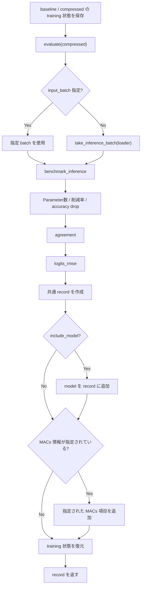
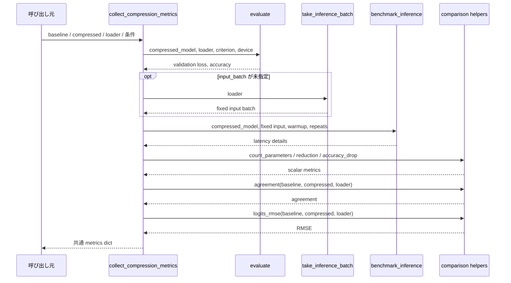

# `collect_compression_metrics`

**Stability:** A  
**定義:** `src/nn_compression/metrics/model_comparison.py`

## 責務

1つのcompressed candidateについて、validation性能・Parameter数・latency・baselineとの出力差・optional MACsを共通dictへ集約する。

## Signature

```python
collect_compression_metrics(
    baseline_model,
    compressed_model,
    loader,
    criterion,
    device,
    *,
    baseline_acc: float,
    baseline_time_s: float,
    warmup: int = 5,
    repeats: int = 200,
    compressed_macs: int | None = None,
    compute_reduction: float | None = None,
    baseline_macs: int | None = None,
    include_model: bool = False,
    input_batch=None,
) -> dict
```

## 引数

- `baseline_model`: 圧縮前の比較基準model。Parameter削減率・agreement・logits RMSEの基準として使い、状態は呼び出し前へ復元する。
- `compressed_model`: 1候補分の圧縮後model。validation性能・Parameter数・latencyを実測する対象。
- `loader`: validation、agreement、logits RMSEで再走査する評価loader。one-shot iteratorではなく再走査可能であることを前提とする。
- `criterion`: compressed modelのvalidation loss計算に使うloss関数。
- `device`: validationとlatency benchmarkを実行するdevice。
- `baseline_acc`: 圧縮前modelのaccuracy。`accuracy_drop`を計算する基準値。
- `baseline_time_s`: 圧縮前modelの推論時間。compressed latencyと比較する基準値。
- `warmup`: latency計測前のwarmup forward回数。
- `repeats`: latency平均を求める計測forward回数。
- `compressed_macs`: 既に計算済みのcompressed model MACs。`None`ならrecordへ追加しない。
- `compute_reduction`: 既に計算済みのMACs削減率。`None`ならrecordへ追加しない。
- `baseline_macs`: 比較用baseline MACs。`None`ならrecordへ追加しない。
- `include_model`: `True`なら`compressed_model`本体もrecordへ保持する。既定`False`はrank sweep時のメモリ消費を抑えるため。
- `input_batch`: latency benchmark専用の固定入力batch。`None`なら`take_inference_batch(loader)`で取得する。

## 戻り値

1候補分の比較結果をまとめた`dict`。主な意味は次のとおり。

- validation loss / accuracy: compressed modelの評価性能。
- parameters / parameter reduction: 圧縮後Parameter数とbaseline比の削減率。
- accuracy drop: `baseline_acc`からの精度低下量。
- latency関連: compressed推論時間に加え、benchmark batch size / input shapeなどの計測条件。
- agreement / logits RMSE: baselineとcompressed modelの出力差。
- optional MACs: 呼び出し側から指定された場合だけ追加される理論計算量情報。
- optional model: `include_model=True`の場合だけ保持するcompressed model本体。

## 使用場面

rank sweepや複数圧縮候補の比較表で、列の意味と評価方法を統一したrecordを作るとき。

## 処理概要

1. **baseline/compressed両modelのtraining状態を保存する。**
2. **compressed modelを`evaluate()`する。**  
   validation lossとaccuracyをloader全体から計算する。
3. **benchmark用input batchを確保する。**  
   呼び出し側から渡されていなければ`take_inference_batch(loader)`を使う。
4. **compressed modelのlatencyを計測する。**  
   `benchmark_inference(..., return_details=True)`を使い、時間だけでなくbatch sizeやinput shapeも記録する。
5. **Parameter数と削減率を計算する。**  
   `count_parameters()`と`parameters_reduction()`を使う。
6. **validation accuracyからaccuracy dropを計算する。**
7. **baselineとの予測一致率を計算する。**  
   `agreement()`がloaderを再走査する。
8. **baselineとのlogits RMSEを計算する。**  
   `logits_rmse()`がloaderをさらに再走査する。
9. **共通metricsをdictへまとめる。**
10. **必要ならmodel本体をrecordへ追加する。**  
    `include_model=False`が既定で、rank sweep全候補のmodel保持を避ける。
11. **optionalなMACs情報を指定されたものだけ追加する。**
12. **完成したrecordを返し、model状態を復元する。**

### DataLoaderを複数回走査する理由

validation、agreement、logits RMSEはそれぞれdataset全体を集計するため、同じloaderを独立に走査する。したがって通常のDataLoaderのような**再走査可能なiterable**を前提とする。

### フローチャート



この図は、**fixed inputの有無、model保持、MACs追加という条件分岐を含むmetrics収集の制御フロー**を示す。

### シーケンス図



この図は、**どの指標をどの下位APIへ委譲し、loaderがどの評価で再利用されるか**を示す。条件分岐はフローチャート側で確認する。

## 主なcontract / 注意事項

- `include_model=False`が既定。
- 同じloaderを複数回走査するためone-shot iteratorは未対応。
- baseline/compressedのtraining状態を復元する。

## 関連API

`evaluate`, `benchmark_inference`, `agreement`, `logits_rmse`, `sweep_layer_ranks`
