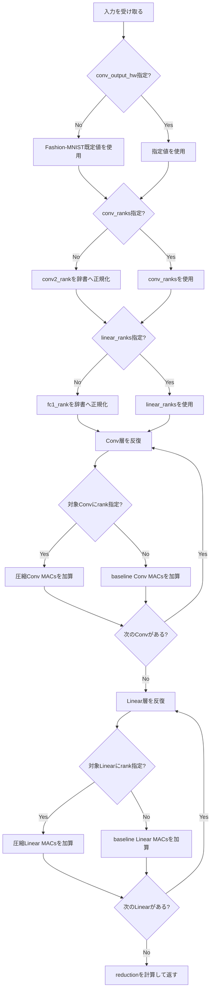

# `estimate_cnn_macs`

**Stability:** B  
**定義:** `src/nn_compression/metrics/cnn_macs.py`

## 責務

指定したConv/Linear群を合計し、CNN全体のbaseline/compressed理論MACsを比較する。

## Signature

```python
estimate_cnn_macs(
    model,
    conv2_rank: int | None = None,
    fc1_rank: int | None = None,
    verbose: bool = True,
    *,
    conv_ranks: dict[str, int] | None = None,
    linear_ranks: dict[str, int] | None = None,
    conv_output_hw: dict[str, tuple[int, int]] | None = None,
    linear_layer_names: tuple[str, ...] = ("fc1", "fc2"),
) -> tuple[int, int, float]
```

## 引数

- `model`: MACsを集計するCNN。指定されたnamed Conv/Linearをこのmodelから取得する。
- `conv2_rank`: historical Fashion-MNIST互換の`conv2`圧縮rank。`conv_ranks`未指定時に`{"conv2": conv2_rank}`へ正規化する。
- `fc1_rank`: historical互換の`fc1`圧縮rank。`linear_ranks`未指定時に`{"fc1": fc1_rank}`へ正規化する。
- `verbose`: `True`ならbaseline/compressed全体MACsと削減率を表示する。
- `conv_ranks`: `{conv_name: rank}`形式で圧縮するConv層を指定する。未指定Convはbaselineと同じMACsをcompressed側にも加える。
- `linear_ranks`: `{linear_name: rank}`形式で圧縮するLinear層を指定する。未指定Linearは未圧縮として集計する。
- `conv_output_hw`: `{conv_name: (H, W)}`形式の各Conv出力空間size。Conv MACsを正しく計算するために使う。
- `linear_layer_names`: model-level集計へ含めるLinearのnamed path一覧。既定は`("fc1", "fc2")`。

## 戻り値

`(baseline_macs, compressed_macs, reduction)`の3要素tuple。

- `baseline_macs`: 集計対象Conv/Linearをすべて未圧縮として計算した理論MAC総数。
- `compressed_macs`: `conv_ranks / linear_ranks`で指定した層だけ圧縮した場合の理論MAC総数。
- `reduction`: `1 - compressed_macs / baseline_macs`で求めるmodel-level計算量削減率。

## 使用場面

複数Conv/Linearを同時圧縮した場合のmodel-level理論計算量を比較するとき。

## 処理概要

1. **Conv出力空間指定を決める。**  
   未指定ならFashion-MNIST互換の`conv1:28x28`, `conv2:14x14`を使う。
2. **圧縮rank指定を正規化する。**  
   `conv_ranks`がなければlegacy `conv2_rank`から`{"conv2": rank}`を作る。Linearも同様に`fc1_rank`を`linear_ranks`へ変換する。
3. **Conv層を1つずつ集計する。**  
   named moduleを取得し、baseline MACsを常に加算する。圧縮rankが指定された層だけ`compressed_conv2d_macs()`、未指定層はbaseline値をcompressed側にも加える。
4. **Linear層を1つずつ集計する。**  
   baselineは`linear_macs()`、rank指定層だけ`compressed_linear_macs()`を使う。
5. **全対象層のbaseline/compressed MACsを合計する。**
6. **`1 - compressed/baseline`で削減率を求める。**
7. **必要なら表示し、3要素tupleを返す。**

### フローチャート



この図は、legacy引数の正規化と、各層を圧縮MACsまたはbaseline MACsのどちらで集計するかという分岐に絞って示す。各MACs式の詳細は関連API側で扱う。

## 主なcontract / 注意事項

default値はFashion-MNIST historical実験互換。CIFAR-10等では`conv_ranks`, `conv_output_hw`, `linear_ranks`を明示して使う。

## 関連API

`conv2d_macs`, `compressed_conv2d_macs`, `linear_macs`, `compressed_linear_macs`
