# `CIFAR10CNN`

**Stability:** B  
**定義:** `src/nn_compression/models/cifar10.py`

## 責務

CIFAR-10 SVD/Tucker実験用のConv×3 + Global Average Pooling + 2 Linear baseline architectureを提供する。

## Signature

```python
CIFAR10CNN(
    *,
    in_channels: int = 3,
    conv_channels: tuple[int, int, int] = (32, 64, 128),
    hidden_dim: int = 256,
    num_classes: int = 10,
    dropout: float = 0.5,
)
```

## 引数

- `in_channels`: 入力画像のchannel数。既定`3`はRGB CIFAR-10を表す。
- `conv_channels`: `conv1 / conv2 / conv3`それぞれの出力channel数を順番に指定する3要素tuple。
- `hidden_dim`: Global Average Pooling後のfeatureを受ける`fc1`の出力dimension。
- `num_classes`: 最終`fc2`が出力するclass logits数。既定`10`はCIFAR-10。
- `dropout`: `fc1`後に適用するDropout確率。train/evalでPyTorch標準の挙動が切り替わる。

## 戻り値

3段Conv + Global Average Pooling + 2段Linearで入力画像を`num_classes` logitsへ変換する`nn.Module` instance。主要named layer`conv1 / conv2 / conv3 / fc1 / fc2`をSVD/Tucker圧縮APIから安定して参照できる。

## 使用場面

CIFAR-10 baseline、複数Conv SVD、model-wide rank allocation、Conv2 Tucker-2/HOOI比較。

## 処理概要

### 初期化時

1. **`conv_channels`を3段分のchannel数へ展開する。**
2. **`conv1`, `conv2`, `conv3`を作る。**  
   すべて3×3、padding=1で、各Pool前は空間サイズを維持する。
3. **共通ReLUと2×2 MaxPoolを作る。**
4. **Global Average Poolingを作る。**  
   `AdaptiveAvgPool2d(1)`により最終feature mapの各channelを1×1へまとめる。
5. **`fc1`を作る。**  
   最終Conv channel数から`hidden_dim`へ変換する。
6. **Dropoutと最終分類層`fc2`を作る。**

### forward時

1. **`conv1 → ReLU → Pool`を通す。**
2. **`conv2 → ReLU → Pool`を通す。**
3. **`conv3 → ReLU → Pool`を通す。**
4. **Global Average Poolingで各channelを1値へまとめる。**
5. **batch dimensionを残してflattenする。**  
   `(N,C,1,1)` → `(N,C)`。
6. **`fc1 → ReLU`を通す。**
7. **Dropoutを適用する。**  
   train/eval modeによってPyTorch標準の挙動が切り替わる。
8. **`fc2`でclass logitsを作って返す。**

### 構造図

```mermaid
flowchart LR
    X["入力<br/>in_channels"] --> C1["conv1<br/>→ C1"]
    C1 --> P1["ReLU + MaxPool"]
    P1 --> C2["conv2<br/>C1 → C2"]
    C2 --> P2["ReLU + MaxPool"]
    P2 --> C3["conv3<br/>C2 → C3"]
    C3 --> P3["ReLU + MaxPool"]
    P3 --> GAP["AdaptiveAvgPool2d(1)<br/>C3×1×1"]
    GAP --> F["Flatten<br/>C3"]
    F --> FC1["fc1<br/>C3 → hidden_dim"]
    FC1 --> D["ReLU + Dropout"]
    D --> FC2["fc2<br/>hidden_dim → num_classes"]
    FC2 --> Y["class logits"]
```



`C1 / C2 / C3`は`conv_channels`の3要素。この図は**可変channel設定を保ったbaseline構造とnamed compression対象の位置**を示す。

## 主なcontract / 注意事項

既存checkpoint/resultsとnamed compressionが依存するdefault主要layer名を維持する。

```text
conv1, conv2, conv3, fc1, fc2
```

default architectureの意味を破壊的に変えず、新architectureが必要なら新classまたは明示optionを優先する。

## 関連API

`factorize_named_layers`, `build_tucker2_conv`, `estimate_cnn_macs`
