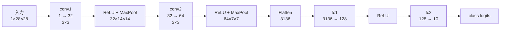

# `FashionMNISTCNN`

**Stability:** B  
**定義:** `src/nn_compression/models/cnn.py`

## 責務

Fashion-MNIST CNN SVD実験用のbaseline architectureを提供する。

## Signature

```python
FashionMNISTCNN()
```

## 引数

なし。1channel 28×28 Fashion-MNIST入力と10クラス分類を前提とした固定baseline architectureを作る。

## 戻り値

2段Conv + 2段LinearでFashion-MNIST画像を10クラスlogitsへ変換する`nn.Module` instance。主要named layer`conv1 / conv2 / fc1 / fc2`はConv/Linear SVDとMACs計算から参照される。

## 使用場面

Fashion-MNISTのConv SVD、Linear SVD、Conv+Linear同時圧縮、MACs・latency比較。

## 処理概要

### 初期化時

1. **1段目の畳み込み`conv1`を作る。**  
   グレースケール1channelを32channelへ変換する3×3 Convで、padding=1により28×28の空間サイズを維持する。
2. **`relu1`と`pool1`を作る。**  
   ReLU後、2×2 MaxPoolで28×28 → 14×14へ縮小する。
3. **2段目の畳み込み`conv2`を作る。**  
   32channel → 64channelの3×3 Conv。ここもpadding=1で空間サイズを維持する。
4. **`relu2`と`pool2`を作る。**  
   14×14 → 7×7へ縮小する。
5. **Flatten層を作る。**  
   最終Conv feature `(64,7,7)`を`64*7*7=3136`特徴へ展開する。
6. **`fc1`を作る。**  
   `Linear(3136,128)`で高次元featureを128次元へ変換する。
7. **`relu3`と分類層`fc2=Linear(128,10)`を作る。**

### forward時

1. **`conv1 → relu1 → pool1`を通す。**
2. **`conv2 → relu2 → pool2`を通す。**
3. **feature mapをflattenする。**
4. **`fc1 → relu3`を通す。**
5. **`fc2`で10クラスlogitsを作って返す。**

### 構造図



この図は、**Conv/Poolでchannelと空間sizeがどう変わり、どのnamed layerを圧縮対象として参照するか**を示す構造図。

## 主なcontract / 注意事項

主要layer名を固定する。

```text
conv1, conv2, fc1, fc2
```

圧縮実験では特に`conv2`と`fc1`をnamed APIから参照する。

## 関連API

`FashionMNISTCNN.inspect_shapes`, `estimate_cnn_macs`, `factorize_named_layers`
