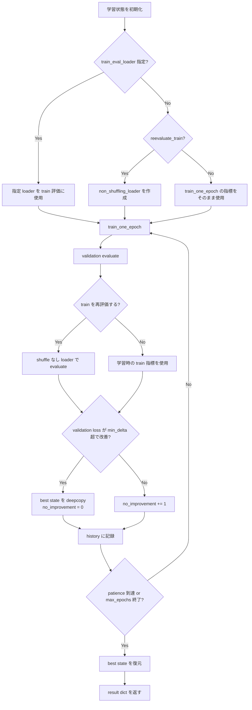

# `fit_with_early_stopping`

**Stability:** B  
**定義:** `src/nn_compression/training/fit.py`

## 責務

validation loss基準のEarly Stopping付き学習を行い、学習終了時に最良epochのstateへmodelを戻す。

## Signature

```python
fit_with_early_stopping(
    model,
    train_loader,
    val_loader,
    criterion,
    optimizer,
    device,
    max_epochs,
    patience,
    min_delta,
    *,
    reevaluate_train=True,
    log_every_epoch=False,
    train_eval_loader=None,
)
```

## 引数

- `model`: 学習対象model。
- `train_loader`: optimizer更新に使う学習loader。
- `val_loader`: Early Stopping判定用validation loader。
- `criterion`: loss関数。
- `optimizer`: optimizer。
- `device`: 学習・評価device。
- `max_epochs`: 最大epoch数。
- `patience`: validation lossの改善なしを許す連続epoch数。
- `min_delta`: 改善と判定するために必要な最小loss差。
- `reevaluate_train`: epoch終了後、shuffleなしloaderでtrain metricを測り直すか。
- `log_every_epoch`: 毎epochの指標を表示するか。
- `train_eval_loader`: train metric再評価に明示的に使うloader。

## 戻り値

次を含むdict。

```text
model                    # best stateへ復元済み
best_epoch
best_validation_loss
train_loss_history
validation_loss_history
history                  # epochごとのloss / accuracy
```

## 使用場面

baseline学習、圧縮後Fine-tuningを同じEarly Stopping条件で実行するとき。

## 処理概要

1. **最良validation lossと履歴を初期化する。**  
   最良値を`inf`、best stateを未設定として開始する。
2. **train metricを測り直すloaderを決める。**  
   `train_eval_loader`が指定されていればそれを使う。指定がなく`reevaluate_train=True`なら`non_shuffling_loader(train_loader)`を内部で作る。再評価しない場合は`train_one_epoch()`の戻り値をそのまま履歴に使う。
3. **1 epoch学習する。**  
   `train_one_epoch()`を呼び、順伝播・逆伝播・optimizer更新を行う。
4. **validation setを評価する。**  
   `evaluate()`でvalidation loss/accuracyを求める。このvalidation lossがEarly Stoppingの判定基準。
5. **必要ならtrain metricをshuffleなしで再評価する。**  
   学習用`shuffle=True` loaderを余分に走査してGenerator状態を進めないよう、専用の非shuffle loaderを使う。
6. **best stateを更新するか判定する。**  
   `best_validation_loss - min_delta > validation_loss` のときだけ改善とみなし、modelの`state_dict()`を`deepcopy`して保存し、改善なしcountを0へ戻す。
7. **改善しなかった場合はcountを増やす。**  
   validation lossが閾値を超えて改善しなければ`no_improvement_count`を1増やす。
8. **epoch結果をhistoryへ保存する。**  
   train/validationのlossとaccuracy、epoch番号を記録する。
9. **patienceに達したら学習を停止する。**  
   連続で改善しないepoch数が`patience`以上ならEarly Stoppingする。
10. **学習終了後、最良stateへ戻す。**  
    best stateが1度でも保存されていれば`load_state_dict()`でmodelへ復元する。
11. **modelと履歴をdictで返す。**  
    呼び出し側はbest epochやloss推移をそのまま実験記録へ使える。

### フローチャート



## 主なcontract / 注意事項

- shuffle付きtrain loaderをmetric再評価で余分に走査しない。
- `train_eval_loader`指定時は`reevaluate_train=True`が必要。
- best stateは参照ではなく`deepcopy`で保持する。
- scalar validationはHOOI/benchmarkほど全面統一されていない既知制約。
- modelと、Parameter / bufferを持つcriterionは[[07_src設計/05_Core_API_v1/README#共通device contract|共通device contract]]に従い、呼び出し前に指定deviceへ配置する。

## 関連API

`train_one_epoch`, `evaluate`, `non_shuffling_loader`
