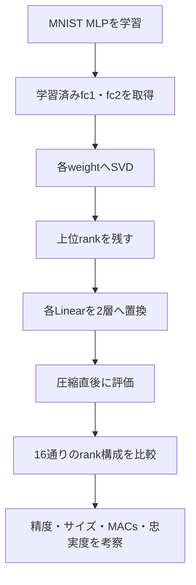
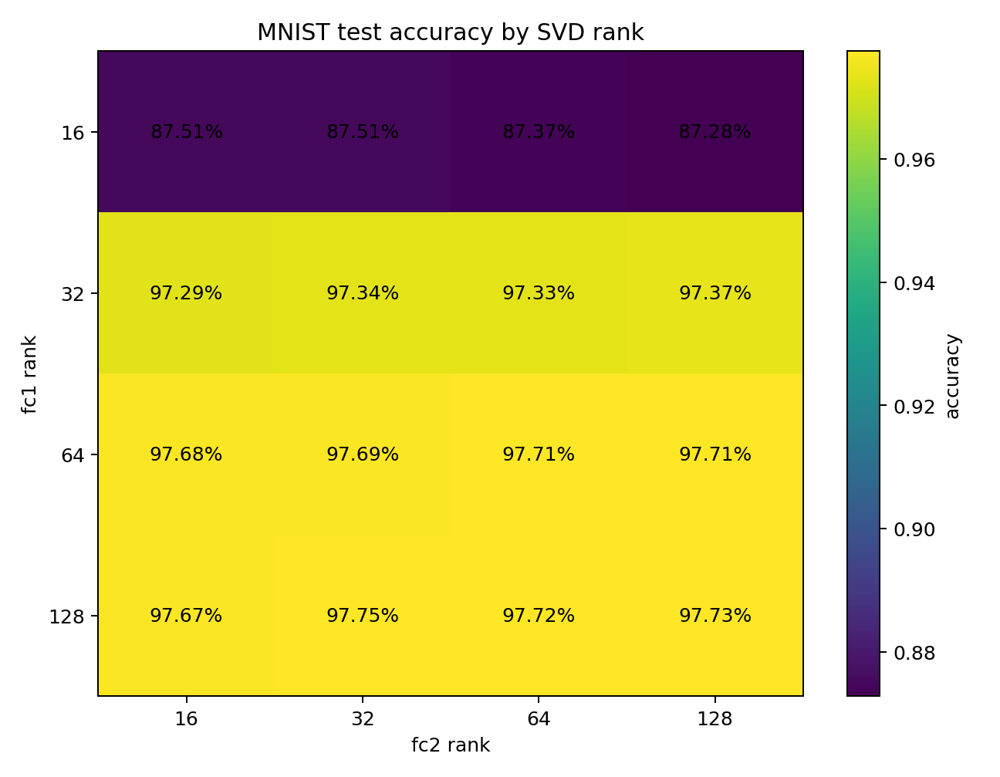
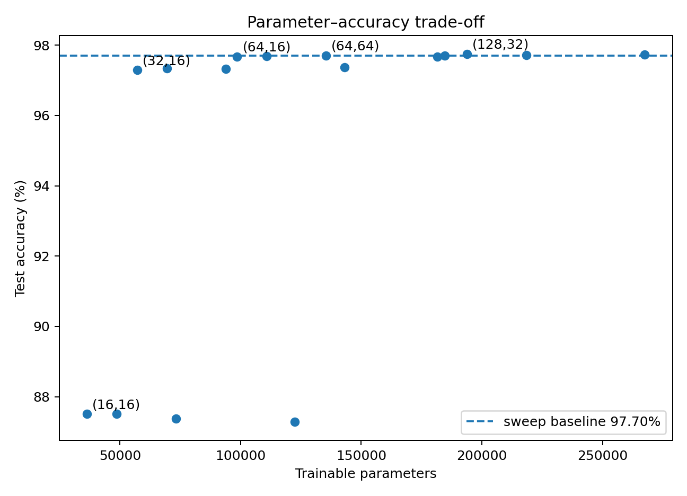
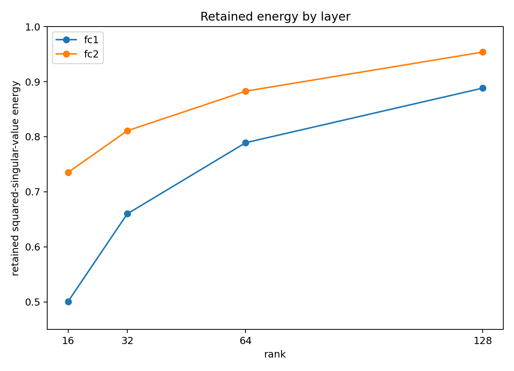

# MNISTでの実験結果

## サマリー

MNIST分類用の3層MLPを学習し、学習済みの `fc1` と `fc2` をSVDで低ランク化した。

```text
Baseline
784 → 512 → 256 → 10
```

```text
Flatten: 784
    ↓
Linear(784, r1, bias=False)
    ↓
Linear(r1, 512, bias=True)
    ↓ ReLU
Linear(512, r2, bias=False)
    ↓
Linear(r2, 256, bias=True)
    ↓ ReLU
Linear(256, 10)  ← fc3は非圧縮
```

最終確認では、

```text
fc1 rank = 64
fc2 rank = 64
```

とした。

主結果は次のとおりである。

| 項目 | Baseline | SVD rank 64 / 64 |
|---|---:|---:|
| Test loss | 0.0728 | 0.0762 |
| Test accuracy | 97.90% | 97.77% |
| 学習可能パラメータ数 | 535,818 | 135,434 |
| パラメータ削減率 | — | 74.72% |
| 圧縮倍率 | — | 3.96× |
| 理論MACs | 535,040 | 134,656 |
| MACs削減率 | — | 74.83% |
| 推論時間 | 0.122 ms/batch | 0.132 ms/batch |

accuracy低下は0.13ポイントに抑えられ、パラメータ数と理論MACsは約75%減少した。  
一方、この小規模MLPでは2つのLinear層へ分けたオーバーヘッドが効き、実測推論時間は短くならなかった。

rank sweepでは、`fc1 rank = 64` を保つと、`fc2 rank = 16` まで下げてもaccuracyは97.68%だった。したがって、層ごとに異なるrankを設定する非対称圧縮が有効である。

---

## 1. 対応する実コード

実際の `code.zip` でMNIST実験に使ったNotebookは次の3つである。

| Notebook | 役割 |
|---|---|
| `notebooks/10_mnist_mlp/00_baseline.ipynb` | Baseline MLPの学習・評価・checkpoint保存 |
| `notebooks/10_mnist_mlp/01_svd_compression.ipynb` | rank 64 / 64のdense再構成版・2層圧縮版を比較 |
| `notebooks/10_mnist_mlp/02_rank_accuracy_tradeoff.ipynb` | `r1,r2∈{16,32,64,128}` の16条件rank sweep |

コードはノートと別ディレクトリへ保存する。

```text
project/
├── NN_SVD_Notes/
│   └── 10_SVD実装/
└── code/
    ├── 04_mnist_mlp_baseline.ipynb
    ├── 05_mnist_mlp_svd_compression.ipynb
    └── 06_mnist_rank_accuracy_tradeoff.ipynb
```

---

## 2. 実験モデル

```python
class MNISTMLP(nn.Module):
    def __init__(self):
        super().__init__()
        self.fc1 = nn.Linear(784, 512)
        self.relu1 = nn.ReLU()
        self.fc2 = nn.Linear(512, 256)
        self.relu2 = nn.ReLU()
        self.fc3 = nn.Linear(256, 10)

    def forward(self, x):
        x = x.view(x.size(0), -1)
        x = self.relu1(self.fc1(x))
        x = self.relu2(self.fc2(x))
        return self.fc3(x)
```

重みshape：

| 層 | weight shape | 最大rank | 今回の扱い |
|---|---:|---:|---|
| `fc1` | 512×784 | 512 | 圧縮 |
| `fc2` | 256×512 | 256 | 圧縮 |
| `fc3` | 10×256 | 10 | 非圧縮 |

ReLUが `fc1` と `fc2` の間にあるため、3層を1つの行列へ合成してSVDすることはできない。  
各Linear層を独立に分解する。

---

## 3. 実験の流れ



SVDは学習時に自動で行われない。  
学習済み重みを明示的に分解し、モデル構造を置き換える後処理である。

今回、SVD後のfine-tuningは行っていない。

---

## 4. 最終確認実行

### Baseline

| 項目 | 値 |
|---|---:|
| Test loss | 0.0728 |
| Test accuracy | 97.90% |
| Parameters | 535,818 |
| MACs | 535,040 |

### rank 64 / 64

| 項目 | 値 |
|---|---:|
| `fc1` rank | 64 |
| `fc2` rank | 64 |
| Test loss | 0.0762 |
| Test accuracy | 97.77% |
| Accuracy低下 | 0.13ポイント |
| Parameters | 135,434 |
| Parameter reduction | 74.72% |
| Compression ratio | 3.96× |
| MACs | 134,656 |
| MAC reduction | 74.83% |

### パラメータ数の内訳

Baseline：

$$
(784\times512+512)
+
(512\times256+256)
+
(256\times10+10)
=
535,818
$$

rank 64 / 64：

$$
(784\times64)
+
(64\times512+512)
+
(512\times64)
+
(64\times256+256)
+
(256\times10+10)
=
135,434
$$

### MACsの内訳

Baseline：

$$
784\times512
+
512\times256
+
256\times10
=
535,040
$$

rank 64 / 64：

$$
64(784+512)
+
64(512+256)
+
256\times10
=
134,656
$$

> [!danger] Notebook表示値の訂正
> `05_mnist_mlp_svd_compression.ipynb` では圧縮後MACsを `134,756` と表示したセルがある。  
> `fc3` は非圧縮なので、正しくは `256×10=2,560` を加えた **134,656** である。  
> `06_mnist_rank_accuracy_tradeoff.ipynb` の計算はこの値へ修正されている。

---

## 5. 推論時間

### 最終比較

バッチサイズ1000、同じdevice、ウォームアップ後に5000回forwardした結果：

| モデル | 推論時間 | Baseline比 |
|---|---:|---:|
| Baseline | 0.122 ms/batch | 1.00× |
| SVD rank 64 / 64 | 0.132 ms/batch | 0.92×相当 |

理論MACsは減ったが、実測ではSVDモデルがわずかに遅かった。

### 3モデル比較

`05_mnist_mlp_svd_compression.ipynb` の別実行では、

| モデル | Test accuracy | 推論時間 |
|---|---:|---:|
| Baseline | 98.08% | 0.126 ms/batch |
| dense再構成SVD | 98.08% | 0.125 ms/batch |
| 2層SVD | 98.08% | 0.144 ms/batch |

となった。

dense再構成SVDは元とほぼ同じ時間であり、2層版だけが遅い。  
したがって、今回の遅延はSVD近似ではなく、

- 1つのLinearを2回のLinear呼出しへ変えた
- 小さい行列積ではGPU効率が下がる
- kernel起動やPython・Module呼出しの固定費が支配的
- モデル自体が小さく、削減した演算量がlatencyへ反映されにくい

ことによると考えられる。

---

## 6. Notebookごとの独立実行結果

Notebookはseedを固定せず、同じcheckpointも共有していない。  
そのため、NotebookをまたいでBaseline値を直接比較せず、それぞれの実行内で圧縮前後を比較する。

### `04_mnist_mlp_baseline.ipynb`

5 epoch後：

| 項目 | 値 |
|---|---:|
| Test loss | 0.0693 |
| Test accuracy | 98.15% |
| Parameters | 535,818 |

このNotebookは `mnist_mlp_baseline.pth` を保存する。

### `05_mnist_mlp_svd_compression.ipynb`

5 epoch後：

| モデル | Test loss | Test accuracy |
|---|---:|---:|
| Baseline | 0.0649 | 98.08% |
| dense再構成SVD | 0.0661 | 98.08% |
| 2層SVD | 0.0661 | 98.08% |

dense再構成版と2層版でloss・accuracyが一致したため、次の2方式が同じ低ランク変換を表していることを確認した。

```text
低ランク重みをdense行列へ再構成する方式
SVD因子を2つのLinearとして保持する方式
```

ただし、dense再構成版は同じ大きさの重み行列を保存するため、実際のパラメータ圧縮にはならない。

### `06_mnist_rank_accuracy_tradeoff.ipynb`

rank sweep実行時のBaseline：

| 項目 | 値 |
|---|---:|
| Test loss | 0.0715 |
| Test accuracy | 97.70% |
| Parameters | 535,818 |
| MACs | 535,040 |
| Baseline latency | 0.129499 ms/batch |

rank候補：

```python
r1_list = [16, 32, 64, 128]
r2_list = [16, 32, 64, 128]
```

`itertools.product` により、`fc1` と `fc2` の16通りの組合せを作成した。

```text
4種類のfc1 rank × 4種類のfc2 rank = 16条件
```

同じNotebook内では、学習済みの同一Baselineモデルから全rank構成を生成している。  
latencyはBaseline・圧縮モデルともに `warmup=5`、`repeats=200` で測定した。

---

## 7. rank sweepの結果

### 7.1 精度・サイズ・理論計算量・推論時間

| fc1 rank | fc2 rank | Test loss | Test accuracy | Accuracy drop | Parameters | Parameter reduction | MACs | MAC reduction | Latency |
|---:|---:|---:|---:|---:|---:|---:|---:|---:|---:|
| 16 | 16 | 0.5289 | 87.51% | +10.19 pt | 36,362 | 93.21% | 35,584 | 93.35% | 0.131 ms |
| 16 | 32 | 0.5106 | 87.51% | +10.19 pt | 48,650 | 90.92% | 47,872 | 91.05% | 0.122 ms |
| 16 | 64 | 0.5172 | 87.37% | +10.33 pt | 73,226 | 86.33% | 72,448 | 86.46% | 0.135 ms |
| 16 | 128 | 0.5209 | 87.28% | +10.42 pt | 122,378 | 77.16% | 121,600 | 77.27% | 0.118 ms |
| 32 | 16 | 0.1010 | 97.29% | +0.41 pt | 57,098 | 89.34% | 56,320 | 89.47% | 0.129 ms |
| 32 | 32 | 0.0965 | 97.34% | +0.36 pt | 69,386 | 87.05% | 68,608 | 87.18% | 0.163 ms |
| 32 | 64 | 0.0959 | 97.33% | +0.37 pt | 93,962 | 82.46% | 93,184 | 82.58% | 0.119 ms |
| 32 | 128 | 0.0955 | 97.37% | +0.33 pt | 143,114 | 73.29% | 142,336 | 73.40% | 0.140 ms |
| 64 | 16 | 0.0766 | 97.68% | +0.02 pt | 98,570 | 81.60% | 97,792 | 81.72% | 0.165 ms |
| 64 | 32 | 0.0726 | 97.69% | +0.01 pt | 110,858 | 79.31% | 110,080 | 79.43% | 0.162 ms |
| 64 | 64 | 0.0724 | 97.71% | -0.01 pt | 135,434 | 74.72% | 134,656 | 74.83% | 0.149 ms |
| 64 | 128 | 0.0724 | 97.71% | -0.01 pt | 184,586 | 65.55% | 183,808 | 65.65% | 0.143 ms |
| 128 | 16 | 0.0754 | 97.67% | +0.03 pt | 181,514 | 66.12% | 180,736 | 66.22% | 0.125 ms |
| 128 | 32 | 0.0714 | 97.75% | -0.05 pt | 193,802 | 63.83% | 193,024 | 63.92% | 0.159 ms |
| 128 | 64 | 0.0711 | 97.72% | -0.02 pt | 218,378 | 59.24% | 217,600 | 59.33% | 0.122 ms |
| 128 | 128 | 0.0713 | 97.73% | -0.03 pt | 267,530 | 50.07% | 266,752 | 50.14% | 0.131 ms |

> [!note] Accuracy drop
> `Accuracy drop = rank sweep時Baseline accuracy - 圧縮後accuracy` である。  
> 負の値は圧縮後accuracyがBaselineをわずかに上回ったことを表すが、1回のみの実行なので性能向上とは断定しない。





### 7.2 Baselineへの忠実度と特異値エネルギー

| fc1 rank | fc2 rank | Agreement | Logits RMSE | fc1 retained energy | fc2 retained energy |
|---:|---:|---:|---:|---:|---:|
| 16 | 16 | 87.94% | 3.2822 | 50.06% | 73.52% |
| 16 | 32 | 87.88% | 3.2316 | 50.06% | 81.09% |
| 16 | 64 | 87.73% | 3.2334 | 50.06% | 88.28% |
| 16 | 128 | 87.63% | 3.2270 | 50.06% | 95.37% |
| 32 | 16 | 98.38% | 1.3636 | 66.00% | 73.52% |
| 32 | 32 | 98.46% | 1.3335 | 66.00% | 81.09% |
| 32 | 64 | 98.43% | 1.3022 | 66.00% | 88.28% |
| 32 | 128 | 98.48% | 1.2995 | 66.00% | 95.37% |
| 64 | 16 | 99.35% | 0.7414 | 78.92% | 73.52% |
| 64 | 32 | 99.36% | 0.6235 | 78.92% | 81.09% |
| 64 | 64 | 99.40% | 0.5602 | 78.92% | 88.28% |
| 64 | 128 | 99.38% | 0.5403 | 78.92% | 95.37% |
| 128 | 16 | 99.62% | 0.5782 | 88.83% | 73.52% |
| 128 | 32 | 99.78% | 0.3435 | 88.83% | 81.09% |
| 128 | 64 | 99.80% | 0.2546 | 88.83% | 88.28% |
| 128 | 128 | 99.79% | 0.2181 | 88.83% | 95.37% |

`Agreement` はBaselineと圧縮モデルが同じクラスを予測した割合である。  
`Logits RMSE` は、Baselineと圧縮モデルの10クラス分のlogitsの差を表す。


---

## 8. 特異値エネルギー保持率

各層の特異値エネルギー保持率は、層ごとに独立して計算した。

$$
E(r)
=
\frac{
\sum_{i=1}^{r}\sigma_i^2
}{
\sum_i\sigma_i^2
}
$$

| rank | `fc1` retained energy | `fc2` retained energy |
|---:|---:|---:|
| 16 | 50.06% | 73.52% |
| 32 | 66.00% | 81.09% |
| 64 | 78.92% | 88.28% |
| 128 | 88.83% | 95.37% |



同じrankでも、`fc2` の方が高いエネルギー保持率を示した。  
したがって、`fc2` の特異値は `fc1` よりも上位成分へ集中している。

これは `fc2` を比較的低いrankへ圧縮しても精度が落ちにくかった結果と整合する。  
ただし、エネルギー保持率は重み行列の近似度を表す指標であり、accuracyを直接保証するものではない。

---

## 9. rank sweepから分かったこと

### `fc1 rank = 16` は不足

`fc2 rank` を16から128まで増やしても、accuracyは87.28〜87.51%に留まった。

```text
fc1 rank 16
├── fc2 rank 16  → 87.51%
├── fc2 rank 32  → 87.51%
├── fc2 rank 64  → 87.37%
└── fc2 rank 128 → 87.28%
```

最初の大きなLinear層で情報を失うと、後段の `fc2 rank` を高くしても回復できない。

### `fc1 rank = 32` で97%台へ回復

`fc1 rank = 32` ではaccuracyが97.29〜97.37%となった。  
`fc1 rank = 16` から32へ増やしたときの改善が特に大きい。

### `fc1 rank = 64` では `fc2` を低rankにできる

| rank構成 | Accuracy | Parameters | Parameter reduction | Agreement | Logits RMSE |
|---|---:|---:|---:|---:|---:|
| 64 / 16 | 97.68% | 98,570 | 81.60% | 99.35% | 0.7414 |
| 64 / 32 | 97.69% | 110,858 | 79.31% | 99.36% | 0.6235 |
| 64 / 64 | 97.71% | 135,434 | 74.72% | 99.40% | 0.5602 |
| 64 / 128 | 97.71% | 184,586 | 65.55% | 99.38% | 0.5403 |

`fc2 rank` を16から128へ増やしてもaccuracy差は0.03ポイントだった。  
したがって、この実行では `fc1` を64程度に保てば、`fc2` は16まで下げても分類精度をほぼ維持できた。

> [!important] Rankの非対称性
> 本モデルでは、`fc1` のrankが精度を強く左右し、`fc2` のrankの影響は比較的小さかった。  
> すべての層へ同じrankを設定するより、層ごとに必要なrankを選ぶ方が効率的である。

### 代表候補

| 目的 | rank構成 | 理由 |
|---|---:|---|
| サイズを重視 | 64 / 16 | accuracy 97.68%を保ち、パラメータを81.60%削減 |
| 対称で説明しやすい基準 | 64 / 64 | accuracy 97.71%、パラメータ74.72%削減 |
| sweep内の最大accuracy | 128 / 32 | accuracy 97.75% |

`128 / 32` はrank sweep時Baselineの97.70%を0.05ポイント上回った。  
しかしseed未固定・単一実行のため、SVDによる汎化性能向上とは結論づけず、評価揺らぎの範囲として扱う。

---

## 10. Agreementとlogits RMSEの解釈

accuracyだけでは、Baselineと圧縮モデルが同じサンプルへ同じ予測を出したか分からない。

### Agreement

固定した `fc2 rank = 64` で `fc1 rank` を変えると、次のようになった。

| fc1 rank | Agreement |
|---:|---:|
| 16 | 87.73% |
| 32 | 98.43% |
| 64 | 99.40% |
| 128 | 99.80% |

### Logits RMSE

同じ条件でlogits RMSEは次のように減少した。

| fc1 rank | Logits RMSE |
|---:|---:|
| 16 | 3.2334 |
| 32 | 1.3022 |
| 64 | 0.5602 |
| 128 | 0.2546 |

rankを増やすほど、

```text
Baselineと同じクラスを予測する割合が上がる
Baselineのlogitsへ近づく
```

ことを確認した。

---

## 11. 結論

今回のMNIST実験では、学習済みMLPの `fc1` と `fc2` をSVDで低ランク化し、各層を2つのLinearへ置き換えた。

### 達成したこと

- MNIST MLPを学習した
- 学習済みの `fc1`・`fc2` へSVDを適用した
- `Vh_r` と `U_rΣ_r` を2層Linearへ設定した
- dense再構成版と2層版が同じ低ランク変換になることを確認した
- rank 64 / 64でaccuracyをほぼ維持した
- 16通りのrank構成を比較した
- 層ごとの特異値エネルギー保持率を確認した
- Agreementとlogits RMSEを評価した
- `fc1` と `fc2` で必要なrankが異なることを確認した
- パラメータ数と理論MACsを大幅に削減した
- 小規模モデルでは理論MACs削減が実測高速化へ直結しないことを確認した

### 最終的な解釈

> SVD低ランク化により、MNIST MLPの分類精度をほぼ維持しながら、保存パラメータ数と理論演算量を大幅に削減できた。

また、

> `fc1` を十分なrankに保てば、`fc2` はより低いrankまで圧縮できるため、層ごとにrankを変える非対称な構成が有効である。

一方で、

> 小規模MLPでは、1つのLinearを2つへ分ける固定オーバーヘッドにより、理論MACsの削減は実測推論時間の短縮へ直結しなかった。

したがって、今回の結果は次のようにまとめられる。

```text
モデルサイズの圧縮：成功
理論計算量の削減：成功
分類精度の維持：成功
層ごとのrank特性の確認：成功
実測速度の向上：未達
```

---

## 12. 再現性と限界

### seedを固定していない

Notebook間でBaseline accuracyが異なる。  
異なるNotebookの値を一つの同一実験として混ぜず、それぞれの実行内で比較する必要がある。

### checkpointを共有していない

`04` はcheckpointを保存するが、`05` と `06` はそのcheckpointを読み込まず、それぞれでモデルを学習している。  
厳密な比較では同じcheckpointから全rankモデルを作る。

### test setでrankを比較した

今回のrank sweepは探索的実験である。  
厳密にはvalidation setでrankを選択し、test setは最終評価だけに使う。

### fine-tuningを実施していない

結果はすべてSVD置換直後である。  
fine-tuning後の精度回復は今回の結果として主張しない。

### latencyは参考値

Notebook 06ではBaselineと各圧縮モデルを、いずれも `warmup=5`、`repeats=200` で測定した。  
ただし、0.1 ms前後の小さな差を一度だけ測っているため、rank sweep表のlatencyは参考値として扱う。

最終的な速度比較には、同条件で5000回forwardしたrank 64 / 64の測定結果を用いる。

---

## 13. 次の学習への接続

今回のMNIST＋行列SVD実験は、Rank Sweepと考察まで完了とする。

学習スケジュール上は、次にKaggleへ進む。  
次の項目は、必要になった段階でSVD実験へ戻って追加する。

- seed固定とcheckpoint共有による再現性改善
- validation setを使ったrank選択
- SVD後fine-tuning
- CNNやCIFAR-10への適用
- Tensor Train・MPO
- DMRG-likeな局所更新とbond dimension制御

テンソルネットワークとの理論的な接続は [[50_DMRG/01_SVDからDMRGへのつながり]] を参照する。

---

## 関連ノート

- [[10_MNIST_MLP_SVD/01_MNIST実験]]
- [[README_実装編]]
- [[00_基礎理論/08_Linear層のSVD実装]]
- [[00_基礎理論/09_Linear層の2層置換_実装]]
- [[00_基礎理論/10_SVD圧縮モデルの評価設計]]
- [[00_基礎理論/11_理論計算量とベンチマーク]]
- [[50_DMRG/01_SVDからDMRGへのつながり]]
