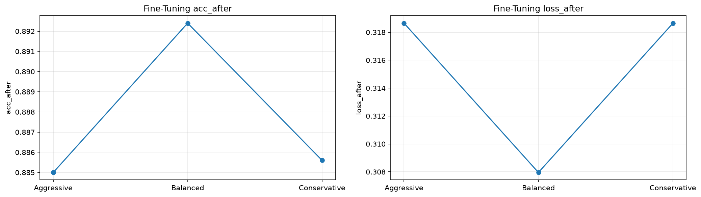
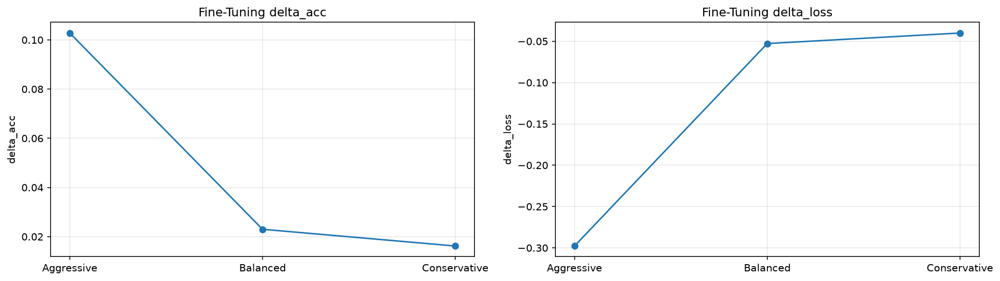

# Fashion-MNISTでの実験結果

## サマリー

Fashion-MNIST用MLP `784 → 512 → 256 → 10` の `fc1` / `fc2` をSVD低rank2層へ置換し、rank選択とFine-tuningを行った。

現在の正式結果は、

```text
notebooks/10_svd/20_fashion_mnist_mlp/03_mlp_svd_finetuning_using_src_corrected_rerun.ipynb
results/10_svd/20_fashion_mnist_mlp/03_mlp_svd_finetuning_using_src_corrected_rerun/
```

を基準とする。

run ID: `rerun_20260912T074153Z`（2026-09-12）。現在の数値は独立した新runを出典とし、旧runの欠落値の復元ではない。途中表は本文で丸めているが、元CSVの値は変更していない。

出典：[実行済みNotebook](../../notebooks/10_svd/20_fashion_mnist_mlp/03_mlp_svd_finetuning_using_src_corrected_rerun.ipynb)、[Test比較](../../results/10_svd/20_fashion_mnist_mlp/03_mlp_svd_finetuning_using_src_corrected_rerun/test_comparison.csv)、[学習・FTの要約](../../results/10_svd/20_fashion_mnist_mlp/03_mlp_svd_finetuning_using_src_corrected_rerun/fit_summary.csv)、[最終benchmark](../../results/10_svd/20_fashion_mnist_mlp/03_mlp_svd_finetuning_using_src_corrected_rerun/final_model_benchmark.csv)、[manifest](../../results/10_svd/20_fashion_mnist_mlp/03_mlp_svd_finetuning_using_src_corrected_rerun/run_manifest.json)。

旧Notebook / 旧docsはhistorical recordとして残す。

### 保存成果物の監査対応（2026-09-12）

複製元corrected Notebookの保存出力から、次の不足CSVを復元した。再学習・再評価の結果ではなく、表示で丸められた保存値である。

- `rank_sweep_saved_log.csv`：全30候補のログ。loss / accuracy / agreementは表示の4桁、parameter / MAC数は整数値。
- `pareto_frontier_saved_output.csv`：Pareto全8点の表示列のみ。
- `selected_rank_neighbors_saved_output.csv`：knee近傍3候補の保存表。
- `baseline_history_saved_output.csv`：baselineの12 epoch分の保存表。
- `fine_tuning_fit_summary_saved_output.csv`：3候補のbest epoch / best validation loss要約。
- `test_comparison_saved_output.csv`：test比較の保存表。

出典セル・表示精度・既存成果物のhashは [複製元runのartifact_provenance.json](../../results/10_svd/20_fashion_mnist_mlp/03_mlp_svd_finetuning_using_src_corrected/artifact_provenance.json) に記録した。未表示のrank指標・丸め前のloss・FTのepoch別履歴・同一runのbaseline重みは復元していない。historicalな別Notebookのbaselineをこのrunへ代用しない。

今後の実行で不足を再発させないため、corrected Notebookへbaseline checkpoint、丸め前の全rank/Pareto/test/学習履歴とbenchmark batch条件の保存処理を追加した。追加した学習・保存経路は初回監査時には未実行であり、既存結果を新しいRun Allの結果とは扱わない。

### 承認後の独立した再実行（2026-09-12）

MLPとCNNのLinear・Conv・同時圧縮を、それぞれ `_rerun` 付きの別名Notebookで全セル実行した。同一runのbaseline/最終重み・丸め前の全指標・baseline/全FT候補のepoch履歴・測定条件を新規ディレクトリへ保存し、保存重みからのtest再評価も一致した。従来runのNotebook・CSV・重みは保存したまま、本ページとCNNの正式結果を新runへ切り替えた。MLPの最終rank・Test値・候補FTの性能値は従来correctedと一致する。新しい記録は [完全保存runの一覧と検証](../../results/10_svd/rerun_20260912T074153Z/README.md) に分けた。CNN Linear単独では今回fc1=28が選ばれたが、同時圧縮は元の固定条件conv2=28・fc1=24を維持した。過去runの欠落値を埋めたものではない。

---

## corrected版で直した主な点

Fashion-MNIST MLPでは、train / validation / testの大枠は旧版から維持した。

主な修正は、**候補Fine-tuningの比較条件を揃えること**だった。

- candidateごとに異なるseedを使わず、同じ `SEED=0` へ戻す
- DataLoader Generatorも候補ごとに同じ初期状態へ戻す
- train metricsは `shuffle=False` の `train_eval_loader` で測る
- baseline / compressedは同じ `input_batch` でbenchmarkする
- warmup / repeatsを `20 / 2000` に統一する
- rank sweep結果にmodel本体を保持せず、Fine-tuning候補はrankから再構築する
- baselineとcompressedでParameterを共有しない

詳細は [[05_SVD基礎実装検証/03_SVD実験で修正した問題と設計原則]] を参照。

---

# 1. 最終rank

Fine-tuning候補は次の3構成。

| Candidate | fc1 | fc2 | Val acc before FT | Val acc after FT | Val loss after FT | Parameters |
|---|---:|---:|---:|---:|---:|---:|
| Aggressive | 16 | 16 | 0.7822 | 0.8850 | 0.318649 | 36,362 |
| Balanced | **32** | **16** | **0.8694** | **0.8924** | **0.307956** | **57,098** |
| Conservative | 32 | 32 | 0.8694 | 0.8856 | 0.318636 | 69,386 |

最終選択は、

```text
fc1 rank = 32
fc2 rank = 16
```

のBalanced。



掲載画像はdocs内表示用の複製で、[出典runの元画像](../../results/10_svd/20_fashion_mnist_mlp/03_mlp_svd_finetuning_using_src_corrected_rerun/) とバイト同一。旧runの画像は上書きしていない。

図：上記rerunのFT後のRank-Selection Validation accuracy（左）とloss（右）。候補は順に `(16,16)` / `(32,16)` / `(32,32)`。Balanced `(32,16)` のlossが最小で、最終採用した。[元データ](../../results/10_svd/20_fashion_mnist_mlp/03_mlp_svd_finetuning_using_src_corrected_rerun/fine_tuning_result.csv) は上表と同じであり、Test値ではない。

---

# 2. 圧縮率

Baseline：

```text
Parameters = 535,818
```

Final compressed：

```text
Parameters = 57,098
```

Parameter reduction：

$$
1 - \frac{57098}{535818}
\approx 0.8934
$$

**約89.34%削減**。

MLPでは大部分のparameterが `fc1` / `fc2` にあるため、Linear SVDによる削減効果が非常に大きい。

SVD直後のBalancedでは、

```text
MACs = 56,320
compute reduction ≈ 89.47%
```

となった。

---

# 3. SVD直後とFine-tuning後

候補ごとのValidation accuracyは次のように変化した。

```text
Aggressive   0.7822 → 0.8850
Balanced     0.8694 → 0.8924
Conservative 0.8694 → 0.8856
```

低rankほどSVD直後の性能低下が大きいが、Fine-tuningによりかなり回復した。

特にAggressiveはSVD直後の低下が大きい一方、追加学習で大幅に戻った。

これは、SVD因子がランダム初期値ではなく、学習済みweightの低rank近似として有効な初期値になっていることと整合する。

ただしFine-tuningが常に改善を保証するわけではない。



図：上記rerunの3候補について、FT後 − SVD直後のRank-Selection Validation accuracy（左）とloss（右）を表示する。[元データ](../../results/10_svd/20_fashion_mnist_mlp/03_mlp_svd_finetuning_using_src_corrected_rerun/fine_tuning_result.csv) の `delta_acc` は0〜1尺度の差であり、percentage pointへ換算する場合は100倍する。候補を結ぶ線はepoch別の学習履歴ではない。

---

# 4. corrected benchmark

Notebook側で修正したbenchmark条件も、正式結果として残す。

```text
input shape = (64, 1, 28, 28)
batch size  = 64
warmup      = 20
repeats     = 2000
```

baselineと各compressed candidateへ**同じ `input_batch`**を渡した。計測は `eval()` / `no_grad()`、CUDA同期あり、host→device転送を除外した。

最終rank `32 / 16` のFT後モデルと同一runのbaselineを3 trialで計測し、各trialの平均時間の中央値は、

```text
Baseline   ≈ 0.137408 ms/batch
Final FT   ≈ 0.197880 ms/batch
```

だった。FT前rank sweepの単回値は `0.141979 → 0.177278 ms/batch` であり、最終FT後の3 trial中央値とは区別する。

一方で理論MACsは大きく減っている。

```text
MACs reduction ≈ 89.47%
Latency        0.137408 → 0.197880 ms/batch（最終FT後・3 trial中央値）
```

したがってこの小型MLPでも、

```text
MACs reduction
≠
wall-clock speedup
```

だった。

低rank化により1つのLinearを2つへ分けるので、kernel起動や小さい行列積の実行効率なども影響し得る。ただし個々の要因を分離計測していないため、「Linear SVDは一般に遅い」とは結論しない。

---

# 5. 最終Test

最終選択後にTestを評価した。

| Model | Test loss | Test accuracy |
|---|---:|---:|
| Baseline | **0.329024** | 0.8819 |
| Balanced SVD + FT | 0.333776 | **0.8853** |

Accuracy差：

$$
0.8853 - 0.8819 = 0.0034
$$

**+0.34 percentage point**。

ただしsingle seedの小差なので、SVDによってaccuracyが改善したとは主張しない。

この結果の中心は、

> **Parametersを約89%削減しながらTest accuracyをほぼ維持した**

ことである。

Test lossは、

```text
0.329024 → 0.333776
Δ = +0.004752
```

と少し増えているため、accuracyだけで完全に同じ挙動とは言わない。

---

# 6. なぜ旧結果と最終rankが違うか

historicalな旧03では、別のcandidate選択・乱数条件により `16 / 16` が最終候補になっていた。

corrected版では候補間のseed・DataLoader Generator・train評価・benchmark条件を公平化し、最終的に `32 / 16` を選択した。

したがって、今後正式結果として引用するのは、

```text
fc1=32, fc2=16
Parameters=57,098
Test acc=0.8853
```

である。

旧 `16 / 16` の結果はhistorical recordとして扱う。

---

# 7. Rank選択の意味

Rank選択はaccuracyだけを最大化する問題ではない。

```text
小rank
→ 高圧縮
→ 近似誤差が大きい

大rank
→ 元モデルへ近い
→ 圧縮率が下がる
```

そのため、Validation loss・accuracy・parametersなどを合わせて折衷点を選ぶ。

今回の `32 / 16` も「全ての目的に対する唯一の最適解」ではなく、今回の候補集合と選択規則に対する最終採用点である。


図：上記rerunのFT前rank sweepから抽出したPareto frontier。左はモデル全体のparametersとRank-Selection Validation loss、右はfrontier内で両列をそれぞれ0〜1へ正規化した表示。[元データ](../../results/10_svd/20_fashion_mnist_mlp/03_mlp_svd_finetuning_using_src_corrected_rerun/pareto_frontier.csv) はFT前の候補絞り込み用であり、FT後の最終選択結果とは区別する。

---

# 8. Single seedの制約

corrected実験は `SEED=0` のsingle run。

複数seedの平均・標準偏差は取っていない。

したがって、

```text
+0.34 pt
```

という小さなTest accuracy差を統計的な性能改善とは扱わない。

複数seedで同じ傾向が再現されるまでは、**「精度維持」**と表現する。

---

# 9. MLP実験から得たこと

1. Linear SVDでparameter数を大幅に削減できる。
2. 極端な低rankではSVD直後のtask性能が大きく低下する。
3. Fine-tuningで低rank制約内の性能を大きく回復できる場合がある。
4. Candidate比較ではseedとDataLoader条件を揃える必要がある。
5. MACs削減と実測latencyは別に評価する必要がある。
6. 小さなaccuracy差はsingle seedでは過度に解釈しない。

MNISTでrank評価の基本を確認し、Fashion-MNIST MLPでFine-tuningまで拡張した。次はCNNへ進み、LinearとConvでparameter数・MACsへの効き方が異なることを確認する。

---

# 関連

- [[05_SVD基礎実装検証/03_SVD実験で修正した問題と設計原則]]
- [[00_基礎理論/04_実験設計/11_理論計算量とベンチマーク]]
- [[20_FashionMNIST/08_CNNのLinear SVD]]
- [[20_FashionMNIST/09_CNNのConv SVD]]
- [[20_FashionMNIST/10_CNNのConvとLinear同時圧縮]]
- [[20_FashionMNIST/11_CNNでの実験結果]]
