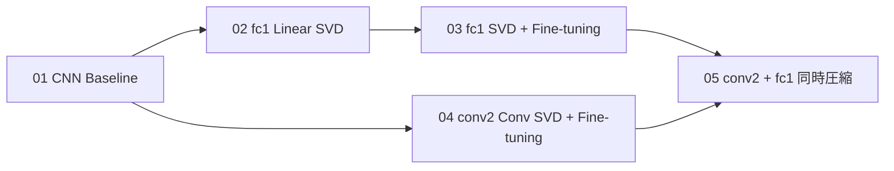

# Fashion-MNIST CNN実験

## 目的

MLPで確認した `Linear` のSVD圧縮をCNNへ拡張し、次の順に検証した。



- CNNの非圧縮Baselineを作る。
- `fc1` をSVDし、parameter削減の効果を確認する。
- `conv2` をSVDし、Convの計算量削減を確認する。
- `fc1` と `conv2` を同時に圧縮する。
- SVD直後とFine-tuning後を比較する。
- Parameters、MACs、分類性能、実測推論時間を分けて評価する。

Conv2dとConv SVDの一般理論は次を参照する。

- [[00_基礎理論/15_CNNとConv2dの基礎]]
- [[00_基礎理論/16_Conv2d重みの行列化とSVD]]
- [[00_基礎理論/17_Conv2dの低ランク2層置換]]
- [[00_基礎理論/11_理論計算量とベンチマーク]]

---

## CNN構造

```text
Input (N, 1, 28, 28)
  ↓ Conv2d(1, 32, 3x3, padding=1)
  ↓ ReLU
  ↓ MaxPool2d(2)
(N, 32, 14, 14)
  ↓ Conv2d(32, 64, 3x3, padding=1)
  ↓ ReLU
  ↓ MaxPool2d(2)
(N, 64, 7, 7)
  ↓ Flatten
(N, 3136)
  ↓ Linear(3136, 128)
  ↓ ReLU
  ↓ Linear(128, 10)
Output (N, 10)
```

### Parameter内訳

| Parameter | shape | 数 |
|---|---:|---:|
| `conv1.weight` | `(32, 1, 3, 3)` | 288 |
| `conv1.bias` | `(32,)` | 32 |
| `conv2.weight` | `(64, 32, 3, 3)` | 18,432 |
| `conv2.bias` | `(64,)` | 64 |
| `fc1.weight` | `(128, 3136)` | 401,408 |
| `fc1.bias` | `(128,)` | 128 |
| `fc2.weight` | `(10, 128)` | 1,280 |
| `fc2.bias` | `(10,)` | 10 |
| **合計** | — | **421,642** |

`fc1` はbias込みで401,536 parameters、全体の約95.23%を占める。一方、MACsでは `conv2` が大きい。この違いがLinear SVDとConv SVDの役割の違いにつながる。

---

## 01: CNN Baseline

01はCNN構造と学習が正常に動くことを確認する最初の実験。

### データ分割

```text
Train       55,000
Validation   5,000
Test        10,000
```

### 学習条件

| 項目 | 値 |
|---|---:|
| seed | 0 |
| batch size | 256 |
| optimizer | Adam |
| learning rate | `1e-3` |
| epoch | 10 |
| loss | CrossEntropyLoss |
| num_workers | 0 |

### 結果

```text
Best epoch           = 10
Best validation loss = 0.223252
Validation accuracy  = 91.94%
Test loss            = 0.2462
Test accuracy        = 90.90%
Parameters           = 421,642
```

![[20_FashionMNIST/assets/cnn_baseline_loss.png]]

![[20_FashionMNIST/assets/cnn_baseline_accuracy.png]]

![[20_FashionMNIST/assets/cnn_baseline_confusion_matrix.png]]

> [!important]
> 01と02〜05ではデータ分割と学習手順が異なる。圧縮前後の比較には02〜05で共通に再学習したBaselineを使い、01の90.90%とは直接比較しない。

---

## 02〜05の共通実験設計

### データ分割

```text
Train                         50,000
Validation for Early Stopping  5,000
Validation for rank/final      5,000
Test                          10,000
```

役割を分離する。

```text
Early-Stopping Validation
  → 学習停止とbest epochの決定

Rank/Final Validation
  → rank選択、圧縮前後比較、Fine-tuning後の最終候補選択

Test
  → 最終モデル決定後の評価
```

### Baseline学習条件

| 項目 | 値 |
|---|---:|
| seed | 0 |
| batch size | 256 |
| optimizer | Adam |
| learning rate | `1e-3` |
| max epoch | 30 |
| patience | 3 |
| min delta | `1e-4` |

結果は02〜05で共通。

```text
Early stopping          = epoch 18
Best epoch              = 15
Best ES validation loss = 0.211799

Rank/Final validation:
loss = 0.215624
acc  = 92.54%

Test:
loss = 0.234131
acc  = 91.75%
```

Fine-tuningは03〜05で `learning rate = 3e-4`, `max epoch = 30`, `patience = 3` を使用した。

---

## Notebookの役割

| Notebook | 内容 |
|---|---|
| `01_cnn_baseline.ipynb` | CNN構造、shape、parameter、Baseline |
| `02_cnn_linear_svd.ipynb` | `fc1` rank sweep、Pareto、knee |
| `03_cnn_linear_svd_finetuning.ipynb` | `fc1` knee±1 Fine-tuning、最終Test |
| `04_cnn_conv_svd.ipynb` | `conv2` rank sweep、Fine-tuning、最終Test |
| `05_cnn_conv_linear_svd.ipynb` | `conv2=28` + `fc1=24` 同時圧縮、Fine-tuning、最終Test |

## 関連

- [[20_FashionMNIST/08_CNNのLinear SVD]]
- [[20_FashionMNIST/09_CNNのConv SVD]]
- [[20_FashionMNIST/10_CNNのConvとLinear同時圧縮]]
- [[20_FashionMNIST/11_CNNでの実験結果]]
- [[20_FashionMNIST/12_CNN全RankSweepと学習履歴]]
