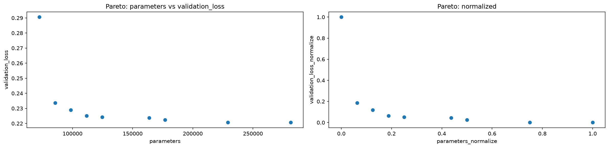
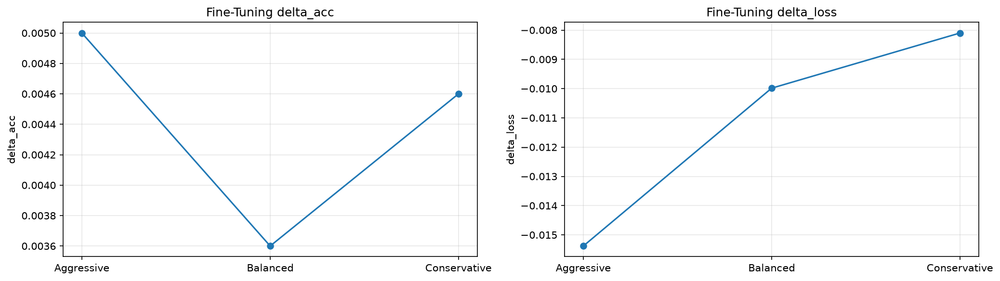
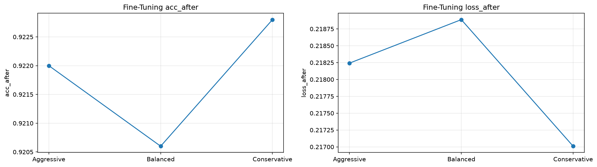

# CNNのLinear SVD

## サマリー

CNN後段の、

```text
fc1 = Linear(3136, 128)
```

へLinear SVDを適用し、

```text
Linear(3136 → r, bias=False)
Linear(r → 128, bias=True)
```

へ置換した。

現在の正式出典は `03_cnn_linear_svd_finetuning_rerun.ipynb`。この新run内でrank sweepとknee近傍のFine-tuningを行った。

run ID: `rerun_20260912T074153Z`（2026-09-12）。現在の数値は独立した新runを出典とし、旧runの欠落値の復元ではない。途中表は本文で丸めているが、元CSVの値は変更していない。

出典：[実行済みNotebook](../../notebooks/10_svd/30_fashion_mnist_cnn/03_cnn_linear_svd_finetuning_rerun.ipynb)、[Test比較](../../results/10_svd/30_fashion_mnist_cnn/03_cnn_linear_svd_finetuning_rerun/test_comparison.csv)、[学習・FTの要約](../../results/10_svd/30_fashion_mnist_cnn/03_cnn_linear_svd_finetuning_rerun/fit_summary.csv)、[最終benchmark](../../results/10_svd/30_fashion_mnist_cnn/03_cnn_linear_svd_finetuning_rerun/final_model_benchmark.csv)、[manifest](../../results/10_svd/30_fashion_mnist_cnn/03_cnn_linear_svd_finetuning_rerun/run_manifest.json)。

```text
fc1 rank = 28
```

を採用した。

旧02/03は独立した学習履歴として残す。今回のrerunは現行srcで実行し、最終値は以下の新runに統一する。

```text
Parameters 421,642 → 111,626  (-73.53%)
Test acc   0.9128  → 0.9149
```

小差なのでaccuracy改善とは扱わず、**大幅なparameter削減後も精度を維持した**と解釈する。

> [!important]
> Linear-only / Conv-only / Combinedはそれぞれbaselineを学習・保存した独立run。新runのbaseline値が一致しても、checkpointを別runから代用しない。
> 旧Linear runの `0.9175 → 0.9187`、最終fc1=24はhistoricalとして残し、現在の正式結果と混ぜない。

---

# 1. なぜfc1を圧縮するか

`fc1.weight` は、

```text
(128, 3136)
```

の2次元行列なので、MLPで使ったLinear SVDをそのまま適用できる。

また、

```text
fc1 parameters = 401,536
CNN total       = 421,642
```

で、fc1が全parameterの約95%を占める。

したがって、model sizeを減らしたい場合はfc1が非常に効率のよい圧縮対象。

---

# 2. rankとparameter数

元fc1：

$$
3136\times128+128
$$

低rank2層：

$$
3136r+128r+128
$$

fc1単体のparameter数が元より減る条件は、

$$
r<\frac{3136\times128}{3136+128}
\approx122.98
$$

となる。

数学的な最大rankは128だが、

```text
数学的に有効なrank
≠
圧縮になるrank
```

である。

rank 128ならweight写像はfull-rankで再構成できる一方、2層化のparameter overheadでBaselineより大きくなる。

---

# 3. rank sweep

候補：

```text
16, 20, 24, 28, 32, 36, 42, 44, 48, 64, 80, 96, 112, 128
```

`parameters` と `validation_loss` のPareto frontierを作り、frontier上のkneeを求めた。

```text
knee = rank 24
neighbors = 20 / 24 / 28
```

代表値：

| Candidate | rank | Parameters | Val loss | Val acc | Retained energy |
|---|---:|---:|---:|---:|---:|
| Aggressive | 20 | 85,514 | 0.233623 | 0.9170 | 0.839512 |
| Balanced（direct knee） | **24** | **98,570** | **0.228873** | **0.9170** | **0.864688** |
| Conservative | 28 | 111,626 | 0.225110 | 0.9182 | 0.883241 |

retained energyはrankとともに増えるが、Validation accuracyは必ずしも単調ではない。

```text
retained energy
→ weight approximation

accuracy / loss
→ task performance
```

を区別する。



掲載画像はdocs内表示用の複製で、[出典runの元画像](../../results/10_svd/30_fashion_mnist_cnn/03_cnn_linear_svd_finetuning_rerun/) とバイト同一。旧runの画像は上書きしていない。

図：上記rerunのFT前Pareto frontier。左はCNN全体のparametersとRank-Selection Validation loss、右はfrontier内の0〜1正規化。[元データ](../../results/10_svd/30_fashion_mnist_cnn/03_cnn_linear_svd_finetuning_rerun/pareto_frontier.csv) に基づくdirect kneeはrank24であり、FT後に最終採用したrank28とは別段階の判断である。

---

# 4. MACsの読み方

このNotebookで表示する `compressed_macs` はCNN全体ではなく、Linear部分の比較値。

最終採用rank 28では、

```text
factorized fc1 = 3136*28 + 28*128 = 91,392 MACs
fc2            = 128*10           = 1,280 MACs
Linear total                           92,672 MACs
```

一方、Convも含めたCNN全体では、

```text
Baseline total MACs = 4,241,152
fc1 rank28 total    = 3,931,136
reduction           ≈ 7.31%
```

となる。

parameter削減は約73.53%だが、CNN全体MACsの削減は約7.31%に留まる。Linear部分だけのMAC削減率76.99%をCNN全体の率へ転用しない。

ここから、

```text
parameterを最も持つ層
≠
MACsを最も使う層
```

が分かる。

---

# 5. Fine-tuning

候補：

```text
rank 20 / 24 / 28
```

Fine-tuning条件：

```text
optimizer = Adam
learning rate = 3e-4
max epoch = 30
patience = 3
seed = 0
```

この03 runでは候補ごとに同じseed / shuffle条件へ戻して比較した。

Fine-tuning後：

| Candidate | rank | Acc before | Acc after | Loss before | Loss after |
|---|---:|---:|---:|---:|---:|
| Aggressive | 20 | 0.9170 | 0.9220 | 0.233623 | 0.218242 |
| Balanced | 24 | 0.9170 | 0.9206 | 0.228873 | 0.218888 |
| Conservative | **28** | 0.9182 | **0.9228** | 0.225110 | **0.217010** |

direct sweepのkneeはrank 24のままだが、FT後のrank-selection validation lossが最小のrank 28を最終候補にした。kneeと最終採用rankは別段階の選択である。



図：上記rerunのrank20 / 24 / 28について、FT後 − SVD直後のRank-Selection Validation accuracy（左）とloss（右）。[元データ](../../results/10_svd/30_fashion_mnist_cnn/03_cnn_linear_svd_finetuning_rerun/fine_tuning_result.csv) のaccuracy差は0〜1尺度で、percentage pointではない。横軸は3候補であり、epoch履歴ではない。



図：同じ3候補のFT後のRank-Selection Validation accuracy（左）とloss（右）。Conservative rank28のloss `0.217010` が最小で、最終採用した。旧runのrank24選択を示す図や最終Test値ではない。

baselineは15 epoch実行・best epoch=12。FTは各候補4 epoch実行・best epoch=1だった。Early Stopping用validationでbest checkpointを選び、別のrank-selection validationで上表の候補を比較するため、`fit_summary.csv` のbest validation lossと上表のlossは別指標である。全epochは [baseline_history.csv](../../results/10_svd/30_fashion_mnist_cnn/03_cnn_linear_svd_finetuning_rerun/baseline_history.csv) と [all_fine_tuning_history.csv](../../results/10_svd/30_fashion_mnist_cnn/03_cnn_linear_svd_finetuning_rerun/all_fine_tuning_history.csv) を参照。

---

# 6. 最終Test

| Model | fc1 rank | Parameters | Test loss | Test acc |
|---|---:|---:|---:|---:|
| Baseline | — | 421,642 | 0.238263 | 0.9128 |
| fc1 SVD + FT | **28** | **111,626** | 0.234693 | **0.9149** |

```text
Parameter reduction = 73.53%
Accuracy delta      = +0.21pt
Test loss change    = -0.003570
```

accuracy差は小さく、lossは少し減っている。single seedの結果であり、統計的な性能改善とは判断しない。

したがって中心結論は、

> **parameterを約74%削減してもTest accuracyをほぼ維持した**

とする。

---

## 最終FT後の推論時間

同じ入力 `(256, 1, 28, 28)`、warmup=20、repeats=2000で3 trial測定し、平均時間の中央値は `0.346254 → 0.338586 ms/batch` だった。計測は `eval()` / `no_grad()`、CUDA同期あり、host→device転送を除外。今回は約2.21%短縮したが、測定run内の小差であり一般的なspeedupを保証しない。FT前rank sweepの単回時間とは混ぜない。

## 旧runと値が変わった理由

旧03は共有 `fit_with_early_stopping` の当時の実装で学習された。旧run保存後の2026-08-18（共有srcの変更commit `0212cbf`）に、train指標評価でshuffle付きtrain_loaderを再走査しない実装へ変更されている。旧/newの初回epochのvalidation loss・accuracyは一致し、2回目以降のvalidation lossが分岐すること、および評価用再走査によるshuffle Generator進行の差を確認した。この共有処理の変更が主因と考えられるが、旧手順の再学習による因果確認までは行っていない。旧記録は当時の処理による結果として保持する。詳細は [[05_SVD基礎実装検証/03_SVD実験で修正した問題と設計原則]] のtrain評価を参照。

---

# 7. Conv SVDとの違い

fc1 SVDでは、

```text
大きなparameter削減
小さめのCNN全体MACs削減
```

となった。

一方、conv2 SVDでは、

```text
小さなparameter削減
大きなMACs削減
```

となる。

この違いを確認したことが、Conv + Linear同時圧縮へ進む理由。

---

# 結論

- CNNでもMLPと同じLinear SVDを適用できる。
- FT後の最終fc1 rank 28でparameter数を73.53%削減した。
- CNN全体MACsの削減は約7.31%で、parameter削減ほど大きくない。
- Fine-tuningでSVD直後の性能を回復した。
- Test accuracyはほぼ維持した。
- 正式値は新しいLinear-only rerun内で比較し、旧02/03や別runのBaseline値とは混ぜない。

---

# 関連

- [[20_FashionMNIST/README]]
- [[20_FashionMNIST/07_CNN実験]]
- [[20_FashionMNIST/09_CNNのConv SVD]]
- [[20_FashionMNIST/10_CNNのConvとLinear同時圧縮]]
- [[20_FashionMNIST/11_CNNでの実験結果]]
