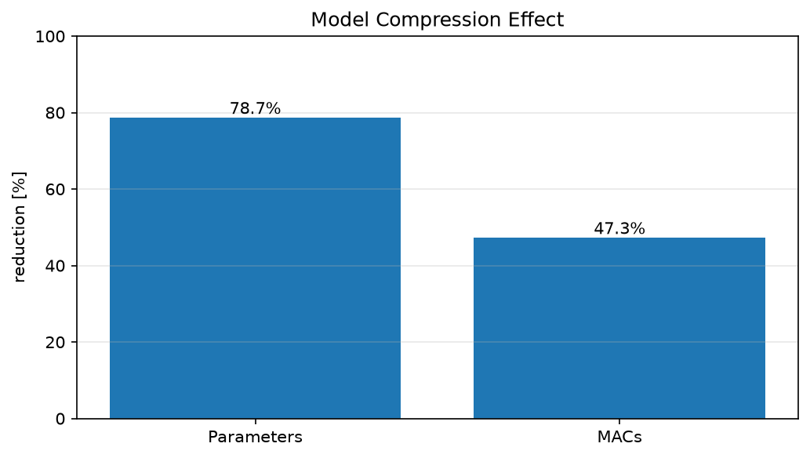
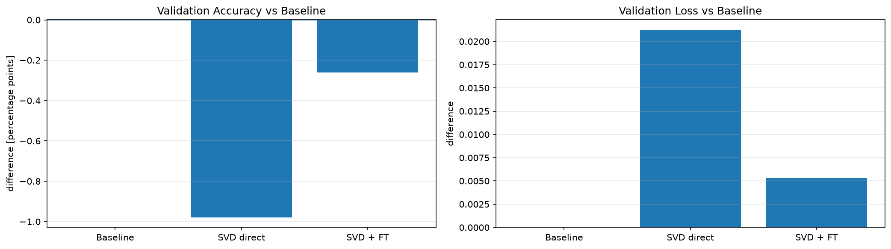

# CNNのConvとLinear同時圧縮

## サマリー

Fashion-MNIST CNNでは、従来の単独実験で採用した固定条件、

```text
conv2 rank = 28
fc1 rank   = 24
```

を同時に適用した。

正式結果は、

```text
notebooks/10_svd/30_fashion_mnist_cnn/05_cnn_conv_linear_svd_corrected_rerun.ipynb
results/10_svd/30_fashion_mnist_cnn/05_cnn_conv_linear_svd_corrected_rerun/
```

を基準とする。

run ID: `rerun_20260912T074153Z`（2026-09-12）。現在の数値は独立した新runを出典とし、旧runの欠落値の復元ではない。途中表は本文で丸めているが、元CSVの値は変更していない。

出典：[実行済みNotebook](../../notebooks/10_svd/30_fashion_mnist_cnn/05_cnn_conv_linear_svd_corrected_rerun.ipynb)、[Test比較](../../results/10_svd/30_fashion_mnist_cnn/05_cnn_conv_linear_svd_corrected_rerun/test_comparison.csv)、[学習・FTの要約](../../results/10_svd/30_fashion_mnist_cnn/05_cnn_conv_linear_svd_corrected_rerun/fit_summary.csv)、[最終benchmark](../../results/10_svd/30_fashion_mnist_cnn/05_cnn_conv_linear_svd_corrected_rerun/final_model_benchmark.csv)、[manifest](../../results/10_svd/30_fashion_mnist_cnn/05_cnn_conv_linear_svd_corrected_rerun/run_manifest.json)。

```text
conv2:
Conv2d(32 → 64, 3x3)
→ Conv2d(32 → 28, 3x3)
→ Conv2d(28 → 64, 1x1)

fc1:
Linear(3136 → 128)
→ Linear(3136 → 24)
→ Linear(24 → 128)
```

最終結果は、

```text
Parameters: 421,642 → 89,994      (-78.66%)
MACs:       4,241,152 → 2,237,184 (-47.25%)
Test acc:   91.28% → 91.33%        (+0.05 percentage point)
```

大幅圧縮後もTest accuracyはほぼ同水準だった。

ただし、この `(28, 24)` は同時圧縮として全rank組合せを探索して得た最適解ではない。

---

# 1. なぜConvとLinearを同時に圧縮するか

単独実験で、圧縮対象層によって効く指標が違うことが分かった。

```text
fc1 SVD
→ parameter削減に大きく効く

conv2 SVD
→ MACs削減に大きく効く
```

したがって両方を組み合わせ、

```text
モデルサイズ
+
理論演算量
```

を同時に減らす。

---

# 2. 圧縮量

| 項目 | Baseline | conv2 r28 + fc1 r24 |
|---|---:|---:|
| Parameters | 421,642 | **89,994** |
| Parameter reduction | — | **78.66%** |
| MACs | 4,241,152 | **2,237,184** |
| MAC reduction | — | **47.25%** |



掲載画像はdocs内表示用の複製で、[出典runの元画像](../../results/10_svd/30_fashion_mnist_cnn/05_cnn_conv_linear_svd_corrected_rerun/) とバイト同一。旧runの画像は上書きしていない。

図：上記rerunの固定構成 `conv2=28, fc1=24` によるCNN全体の削減率。[元データ](../../results/10_svd/30_fashion_mnist_cnn/05_cnn_conv_linear_svd_corrected_rerun/compression_summary.csv) はparameters `78.66%`、理論MACs `47.25%` で、図中は小数1桁表示。FTで構造・個数は変わらず、実測latencyの削減率を示すものではない。

### MACs内訳

Baseline：

```text
conv1 =   225,792
conv2 = 3,612,672
fc1   =   401,408
fc2   =     1,280
-----------------
Total = 4,241,152
```

同時圧縮後：

```text
conv1              =   225,792
factorized conv2   = 1,931,776
factorized fc1     =    78,336
fc2                =     1,280
-----------------------------
Total              = 2,237,184
```

この構造では、fc1がparameter削減、conv2がMACs削減の主役になっている。

---

# 3. SVD直後

同じFinal Validationで比較すると、

| Stage | Val loss | Val acc | Parameters | MACs |
|---|---:|---:|---:|---:|
| Baseline | **0.220664** | **0.9214** | 421,642 | 4,241,152 |
| SVD direct | 0.241923 | 0.9116 | **89,994** | **2,237,184** |

SVD直後は、

```text
Validation accuracy
0.9214 → 0.9116
-0.98 percentage point
```

となった。

複数層を同時に近似すると、単独圧縮より誤差が重なる可能性がある。

```text
conv2の近似
→ 後段へ渡る特徴量が変化

さらにfc1も近似
→ 変化した特徴量を別の低rank写像へ通す
```

ただし、層ごとの誤差寄与を個別に分離測定したわけではないため、これはモデル構造と結果からの解釈である。

---

# 4. Fine-tuning

Fine-tuning条件は、

```text
optimizer     = Adam
learning rate = 3e-4
best epoch    = 1
```

だった。

SVDで作った因子を初期値にし、低rank構造を保ったままtask lossで再最適化する。

Fine-tuning後：

| Stage | Val loss | Val acc | Δacc vs Baseline |
|---|---:|---:|---:|
| Baseline | 0.220664 | 0.9214 | — |
| SVD direct | 0.241923 | 0.9116 | -0.98pt |
| SVD + FT | **0.225938** | **0.9188** | **-0.26pt** |

Fine-tuningにより、SVD直後のaccuracy低下を大きく回復した。

```text
0.9116
↓ Fine-tuning
0.9188
```

ただしbaseline validationを完全には上回っていない。



図：上記rerunの同じRank-Selection Validationで、Baseline / SVD direct / SVD + FTを比較した。[元データ](../../results/10_svd/30_fashion_mnist_cnn/05_cnn_conv_linear_svd_corrected_rerun/validation_comparison.csv) のaccuracy差（左）はbaseline比 `-0.98 → -0.26 percentage point`、loss差（右）は各stage − baseline。Test値ではない。


図：同じrunのFT全4 epochのtrainとEarly-Stopping Validationのloss（左）・accuracy（右）。[元データ](../../results/10_svd/30_fashion_mnist_cnn/05_cnn_conv_linear_svd_corrected_rerun/fine_tuning_history.csv) から、Early-Stopping Validation loss最小のepoch1のcheckpointを採用した。学習曲線のvalidationは上表のRank-Selection Validationとは別集合であり、最終epoch4の値を最終評価値として使わない。

---

# 5. 最終Test

| Model | Parameters | MACs | Test loss | Test acc | ΔTest acc |
|---|---:|---:|---:|---:|---:|
| Baseline | 421,642 | 4,241,152 | **0.238263** | 0.9128 | — |
| conv2 r28 + fc1 r24 + FT | **89,994** | **2,237,184** | 0.241242 | **0.9133** | **+0.05pt** |

```text
Parameter reduction = 78.66%
MAC reduction       = 47.25%
Test loss change    = +0.002979
```

Test accuracy差は0.05 percentage pointと非常に小さい。

single seedなので、

> accuracyが改善した

とは解釈せず、

> **約79%のparameter削減と約47%のMACs削減後もaccuracyを維持した**

と扱う。

---

# 6. rank `(28, 24)` は同時圧縮の最適解ではない

05では、

```text
conv2=28
fc1=24
```

を従来の単独実験から持ってきて固定した。今回のLinear-only rerunで採用されたfc1=28へ置き換えず、同時圧縮は元の実験条件fc1=24を維持して再実行した。

```text
conv2 rank × fc1 rank
```

の2次元rank sweepを行い、同時圧縮としてPareto / kneeを求めたわけではない。

したがって、示せたのは、

> **個別に選んだrankを組み合わせても、大幅なparameter / MACs削減と精度維持を両立できた**

ことまで。

```text
(28, 24)
=
全組合せ中のglobal optimum
```

とは言わない。

この限界が、次のCIFAR-10で複数Convのrank allocationを扱う動機になる。

---

# 7. corrected latency benchmark

旧05では、

```text
Baseline
warmup=20 / repeats=2000

Compressed
warmup=5 / repeats=200
```

と条件が揃っていなかった。

そのため旧latency値はhistorical recordであり、正式な速度比較には使わない。

corrected版では、

```text
batch size = 256
same input_batch
warmup = 20
repeats = 2000
3 trials（最終FT後モデルと同一run baselineの平均時間の中央値）
```

へ統一した。

結果：

```text
Baseline   ≈ 0.346444 ms/batch
Final FT   ≈ 0.383861 ms/batch
```

今回は最終FT後の中央値が約10.80%増えた。計測は `eval()` / `no_grad()`、CUDA同期あり、host→device転送を除外。FT前の `compression_summary.csv` 単回時間を最終FT後へ転用しない。

一方、理論MACsは約47.25%減っている。

```text
MACs
4,241,152 → 2,237,184

latency
0.346444 → 0.383861 ms/batch（最終FT後・3 trial中央値）
```

したがって、今回の実装・GPU・batchでは、

```text
MACs reduction
≠
wall-clock speedup
```

だった。

低rank化では1層を2層に分けるため、

- kernel launch
- 中間Tensor
- memory access
- backendの得意なshape

なども影響し得る。

ただし、今回それぞれの要因を個別に計測していないので、一般的な速度低下とは結論しない。

---

# 8. なぜ同じinput batchで測るか

benchmarkではbaselineとcompressedへ同じTensorを渡す。

別々にDataLoaderからbatchを取ると、

```text
モデル構造差
+
入力batch差
```

が混ざる。

corrected版では、比較用batchを一度固定し、両modelで共有する。

```text
input_batch
  ├─ baseline
  └─ compressed
```

さらにwarmup / repeatsも揃える。

この実験で得た教訓は、[[00_基礎理論/04_実験設計/11_理論計算量とベンチマーク]] と [[05_SVD基礎実装検証/03_SVD実験で修正した問題と設計原則]] へ一般化する。

---

# 9. historical 05との違い

SVD数式や採用rank `(28, 24)` を変更したわけではない。

主なcorrected点は、

```text
benchmark条件の統一
same input_batch
train評価でshuffle Generatorを消費しない
現在のsrc APIを使用
corrected専用resultsへ保存
```

である。

旧Notebookはhistorical recordとして残す。

---

# 10. 結論

- `conv2=28`, `fc1=24` を同時適用した。
- Parametersを **78.66%** 削減した。
- MACsを **47.25%** 削減した。
- SVD直後のValidation accuracy低下はFine-tuningで大きく回復した。
- Test accuracyは `91.28% → 91.33%` で、ほぼ維持した。
- `(28, 24)` は全rank空間の最適解ではない。
- 公平化したbenchmarkではMACs削減がlatency短縮に直結しなかった。

この「個別rankを組み合わせた複合圧縮」から、次のCIFAR-10では複数Convの**model-wide rank allocation**へ進む。

---

# 関連

- [[00_基礎理論/04_実験設計/11_理論計算量とベンチマーク]]
- [[00_基礎理論/04_実験設計/19_再現性と乱数管理]]
- [[20_FashionMNIST/08_CNNのLinear SVD]]
- [[20_FashionMNIST/09_CNNのConv SVD]]
- [[20_FashionMNIST/11_CNNでの実験結果]]
- [[30_CIFAR10_CNN/01_CIFAR10_SVD実験]]
