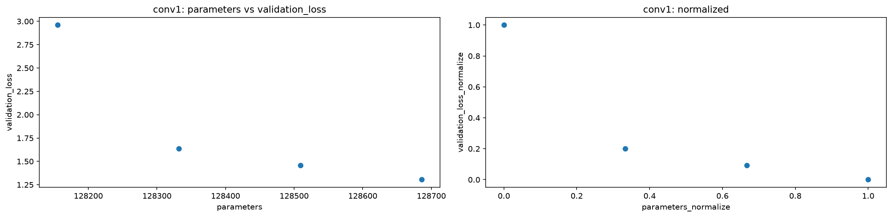
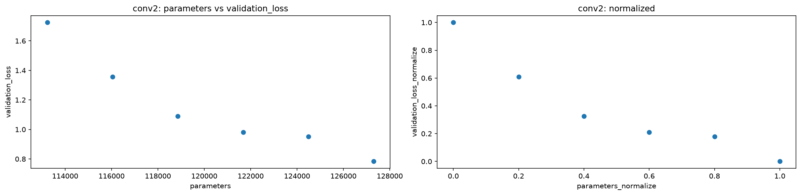
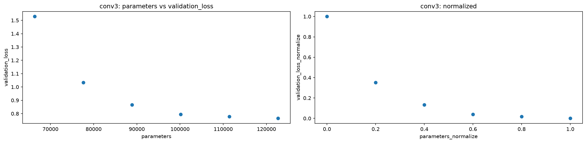
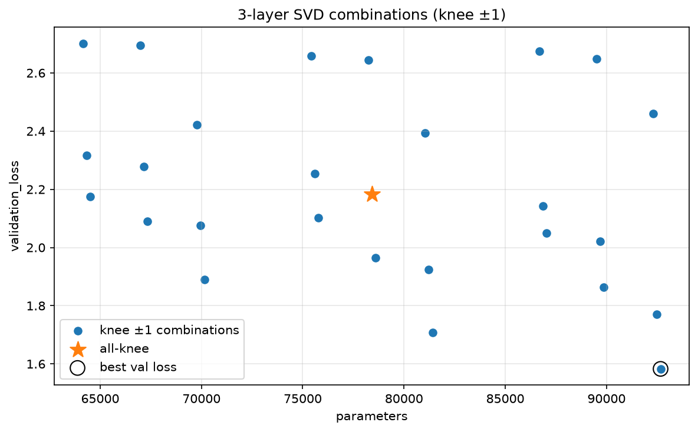
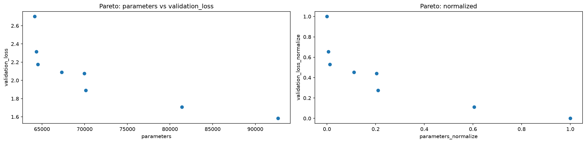
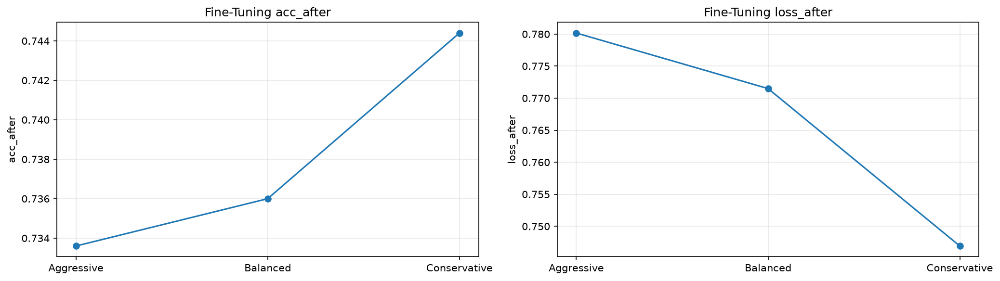
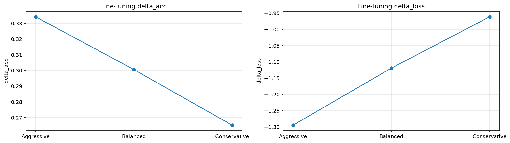

# CIFAR-10 CNNのSVD圧縮実験

## サマリー

CIFAR-10用CNNの `conv1` / `conv2` / `conv3` を対象に、SVDによる低rank化を行った。

この実験は、Fashion-MNISTで確認した、

```text
Linear SVD
Conv SVD
Conv + Linear同時圧縮
```

の次の段階として、**複数Conv層へrankをどう配分するか**を扱う。

探索は全rank組合せの総当たりではない。

```text
各Convを単独rank sweep
        ↓
各層のPareto frontier / knee
        ↓
knee近傍を候補化
        ↓
候補組合せだけmodel-wide評価
        ↓
Fine-tuning
        ↓
最終model選択
```

したがって、本実験は、

> **knee近傍に探索空間を制約したmodel-wide rank allocation**

として扱う。

正式結果は、

```text
notebooks/10_svd/40_cifar10_cnn/02_svd_global_compression_using_src_corrected.ipynb
results/10_svd/40_cifar10_cnn/02_svd_global_compression_using_src_corrected/
```

を基準とする。

---

# 1. なぜCIFAR-10へ進んだか

CIFAR-10は、32×32 pixel・RGB 3チャネルの10クラス画像分類データセットである。

```text
1画像: (3, 32, 32)
公式train: 50,000
公式test : 10,000
```

Fashion-MNISTは28×28のグレースケール商品画像で、SVD圧縮パイプラインの原理確認に適していた。

一方CIFAR-10では、

- RGB入力
- 背景の変化
- 物体位置・向きの変化
- より難しい自然画像分類

を扱える。

そのため、

```text
Fashion-MNIST
→ SVD圧縮の基本を確認

CIFAR-10
→ より難しい入力で複数Conv層のrank allocationを検証
```

という順序にした。

データセット・前処理・データ取得時のメモは [[30_CIFAR10_CNN/00_CIFAR10基礎/18_CIFAR10の前処理とDataLoader]] を参照。

---

# 2. 前処理と評価入力

学習用transform：

```text
RandomCrop(32, padding=4)
RandomHorizontalFlip()
ToTensor()
Normalize(mean=(0.5, 0.5, 0.5), std=(0.5, 0.5, 0.5))
```

Early-Stopping Validation / Rank-Selection Validation / test：

```text
ToTensor()
Normalize(mean=(0.5, 0.5, 0.5), std=(0.5, 0.5, 0.5))
```

`RandomCrop` / `RandomHorizontalFlip` は学習時のon-the-fly augmentationであり、Datasetの登録枚数を増やすわけではない。

評価時はランダムaugmentationを外し、baseline / compressedへ同じ評価入力条件を与える。

また、学習時と評価時で `Normalize` は同じ設定を使う。

```text
学習入力の数値分布
≠
評価入力の数値分布
```

にならないようにするためである。

---

# 3. train / validation / testと乱数管理

canonical corrected Notebookでは、公式train 50,000枚を次の3つへ分ける。

```text
Train                       40,000
Early-Stopping Validation    5,000
Rank-Selection Validation    5,000
Test（公式test）            10,000
```

Notebook上の実験条件は、

```python
TRAIN_SIZE = 40_000
VALIDATION_SIZE = 5_000
```

で、

```python
train_indices, validation_indices_early_stop, validation_indices_rank = (
    shuffled_index_splits(
        len(full_train_augmented),
        (TRAIN_SIZE, VALIDATION_SIZE, VALIDATION_SIZE),
        seed=SEED,
    )
)
```

として分割する。

役割は明確に分ける。

```text
Train
→ weight更新

Early-Stopping Validation
→ epoch停止 / best state決定

Rank-Selection Validation
→ 単層rank sweep
→ Pareto / knee
→ model-wide candidate比較
→ Fine-tuning後の最終候補選択

Test
→ 最終model決定後の最終確認だけ
```

CIFAR-10公式trainは、train用transformとevaluation用transformで2通り読む。

```text
full_train_augmented
→ train_indices
→ Train

full_train_evaluation
→ validation_indices_early_stop
→ Early-Stopping Validation

full_train_evaluation
→ validation_indices_rank
→ Rank-Selection Validation
```

したがって、**どの画像を使うかはindices、どう前処理するかは参照元Datasetのtransform**で決まる。

データ分割には専用Generatorを使い、weight初期化・Dropout・DataLoader shuffleなどの乱数利用から分離する。

rank候補のFine-tuningでもseed条件とDataLoader Generator条件を揃える。

また、train accuracyを再評価するときに `shuffle=True` の学習用loaderを再走査しない。
評価処理によってGeneratorを進めると、その後のmini-batch順が変わり、候補比較の公平性を壊すためである。

詳細は [[00_基礎理論/04_実験設計/19_再現性と乱数管理]] を参照。

---

# 4. モデル

CIFAR-10用CNNは、3つのConv層、GAP、2つのLinear層からなる。

```text
Input (N, 3, 32, 32)
  ↓
conv1: 3 → 32, 3×3, padding=1
ReLU + MaxPool
  ↓
(N, 32, 16, 16)
  ↓
conv2: 32 → 64, 3×3, padding=1
ReLU + MaxPool
  ↓
(N, 64, 8, 8)
  ↓
conv3: 64 → 128, 3×3, padding=1
ReLU + MaxPool
  ↓
(N, 128, 4, 4)
  ↓
Global Average Pooling
  ↓
(N, 128)
  ↓
fc1: 128 → 256
ReLU
Dropout(0.5)
  ↓
fc2: 256 → 10
  ↓
logits (N, 10)
```

Baseline parameter数は `128,842`。

biasを除く主なweight数は、

```text
conv1 =    864
conv2 = 18,432
conv3 = 73,728
fc1   = 32,768
fc2   =  2,560
```

で、特に `conv3` が大きい。

## なぜGAPを使ったか

GAPを使うと、最後の特徴マップ `(N, 128, 4, 4)` を `(N, 128)` まで要約できる。

巨大なFlatten→Linearを置くとclassifierのparameterが支配的になり、Fashion-MNIST CNNと同様にLinear圧縮の効果が中心になりやすい。

CIFAR-10ではConvのrank allocationを主題にしたかったため、GAPでclassifierの肥大化を抑えた。

詳細は [[00_基礎理論/02_ニューラルネットワーク基礎/20_Global Average PoolingとCIFAR10モデル設計]] を参照。

---

# 5. 最終結果

## Baseline

| 項目 | 値 |
|---|---:|
| Validation accuracy | 0.7344 |
| Validation loss | 0.7602 |
| Test accuracy | **0.7327** |
| Test loss | 0.755618 |
| Parameters | **128,842** |
| MACs | **10,357,248** |
| Latency（保存checkpoint再計測、2026-09-12） | **約0.575 ms/batch** |

## Final compressed + Fine-tuning

| 項目 | 値 |
|---|---:|
| conv1 rank | **9** |
| conv2 rank | **32** |
| conv3 rank | **48** |
| Validation accuracy | **0.7444** |
| Validation loss | **0.746920** |
| Test accuracy | **0.7343** |
| Test loss | **0.750995** |
| Parameters | **81,405** |
| Parameter reduction | **36.82%** |
| MACs | **5,625,344** |
| MAC reduction | **45.69%** |
| Latency（保存checkpoint再計測、2026-09-12） | **約0.551 ms/batch** |

Test accuracy差は、

$$
0.7343 - 0.7327 = 0.0016
$$

で、**+0.16 percentage point**。

ただしsingle seedの小差なので、accuracy改善とは断定せず、

> **約37%のparameter削減・約46%のMACs削減後も精度をほぼ維持した**

と解釈する。

---

# 6. Conv SVD

Conv2d重み、

$$
W \in \mathbb{R}^{C_{out}\times C_{in}\times k_H\times k_W}
$$

を、

$$
W_{mat} \in \mathbb{R}^{C_{out}\times(C_{in}k_Hk_W)}
$$

へ行列化し、truncated SVDを適用する。

```text
Conv2d(C_in → C_out, k×k)
        ↓
Conv2d(C_in → r, k×k, bias=False)
        ↓
Conv2d(r → C_out, 1×1, bias=元bias)
```

この方式では、元Convのstride / padding / dilation / padding_modeを前段へ引き継ぎ、biasは最終出力側へ置く。

現在の実装は `groups=1` のConv2dを対象とする。

---

# 7. 単一層rank sweep

最初に、`conv1` / `conv2` / `conv3` を1層ずつ圧縮し、Rank-Selection Validation上の性能を評価した。

目的は、全組合せをいきなり総当たりすることではなく、各層の圧縮感度を調べること。

各層について、

```text
rank
parameters
validation loss / accuracy
retained energy
agreement
logits RMSE
MACs
latency
```

などを記録し、`parameters` と `validation_loss` のPareto frontierからkneeを求めた。

ここでも、

```text
retained energyが高い
≠
classification accuracyが必ず高い
```

ので、重み近似指標とtask性能を分けて見る。

以下は正式出典のcorrected Notebookで保存されたFT前の図であり、2026-09-12の新学習runやlatency再計測の図ではない。いずれも他層をbaselineのまま保ち、左にモデル全体のparametersとRank-Selection Validation loss、右に各frontier内の0〜1正規化を表示する。



掲載画像はdocs内表示用の複製で、[出典runの元画像](../../results/10_svd/40_cifar10_cnn/02_svd_global_compression_using_src_corrected/) とバイト同一。旧runの画像は上書きしていない。

図：conv1単独圧縮のFT前Pareto frontier。[元データ](../../results/10_svd/40_cifar10_cnn/02_svd_global_compression_using_src_corrected/pareto_frontier_conv1.csv)。



図：conv2単独圧縮のFT前Pareto frontier。[元データ](../../results/10_svd/40_cifar10_cnn/02_svd_global_compression_using_src_corrected/pareto_frontier_conv2.csv)。



図：conv3単独圧縮のFT前Pareto frontier。[元データ](../../results/10_svd/40_cifar10_cnn/02_svd_global_compression_using_src_corrected/pareto_frontier_conv3.csv)。各層の図は軸の範囲が異なるため、正規化後の座標だけを層間の性能差として比較しない。

---

# 8. knee近傍だけをmodel-wide探索

各層の単独sweepから得たknee周辺rankを使って、3層の組合せを評価した。

```text
全rank候補
  ↓
各層単独sweepで絞る
  ↓
knee近傍だけ残す
  ↓
その直積をmodel-wide評価
```

この探索は全rank空間のglobal optimum探索ではない。

したがって、採用された `9 / 32 / 48` は、

> 今回の候補集合と評価規則の中で選ばれたrank配分

であり、考えられる全rank組合せの大域最適解とは言わない。

この用語上の区別は、corrected実験で明確化した重要点である。



図：既存corrected runのFT前model-wide候補。[元データ](../../results/10_svd/40_cifar10_cnn/02_svd_global_compression_using_src_corrected/knee_combination_results.csv) の全27構成を表示し、星は3層とも単独sweepのkneeを使った構成、黒丸はこの候補集合でdirect validation lossが最小の構成を示す。黒丸をFT後の最終rank `9 / 32 / 48` と同一視しない。



図：同じFT前model-wide候補から抽出したPareto frontier。左はparametersとRank-Selection Validation loss、右はfrontier内の0〜1正規化。[元データ](../../results/10_svd/40_cifar10_cnn/02_svd_global_compression_using_src_corrected/pareto_frontier_combination.csv) はFT候補を絞る段階であり、全rank空間の大域最適解を示さない。

---

# 9. Fine-tuning前後

Fine-tuning候補として、代表的な3構成を比較した。

| Candidate | conv1 | conv2 | conv3 | Val acc before FT | Val acc after FT | Val loss after FT | Parameters |
|---|---:|---:|---:|---:|---:|---:|---:|
| Aggressive | 6 | 32 | 32 | 0.3994 | 0.7336 | 0.780163 | 69,964 |
| Balanced | 9 | 32 | 32 | 0.4354 | 0.7360 | 0.771491 | 70,141 |
| Conservative | **9** | **32** | **48** | **0.4792** | **0.7444** | **0.746920** | **81,405** |

最終選択は `9 / 32 / 48`。



図：既存corrected runのFT後のRank-Selection Validation accuracy（左）とloss（右）。候補は順に `6 / 32 / 32`、`9 / 32 / 32`、`9 / 32 / 48`。[元データ](../../results/10_svd/40_cifar10_cnn/02_svd_global_compression_using_src_corrected/fine_tuning_result.csv) は上表と同じで、Conservativeのloss `0.746920` が最小。accuracy `0.7444` は最終Test accuracy `0.7343` とは別指標である。

ConservativeはFine-tuning前には、

```text
Val acc  = 0.4792
Val loss = 1.7082
```

まで性能が低下した。

Fine-tuning後は、

```text
Val acc  = 0.7444
Val loss = 0.7469
```

まで回復した。

truncated SVDは重み近似を最適化するが、classification task lossを直接最適化するわけではない。

Fine-tuningは、SVDで作った低rank因子を初期値として、低rank構造の中でtask lossへ再適応させる処理と解釈する。



図：同じ3候補について、FT後 − SVD直後のRank-Selection Validation accuracy（左）とloss（右）。[元データ](../../results/10_svd/40_cifar10_cnn/02_svd_global_compression_using_src_corrected/fine_tuning_result.csv) のaccuracy差は0〜1尺度であり、percentage pointへは100倍する。候補を結ぶ線はepoch別の学習履歴ではなく、推論時間の変化も示さない。

---

# 10. Test結果

TestはrankやFine-tuning候補の選択には使わず、最終model決定後に確認した。

| Model | Test loss | Test accuracy |
|---|---:|---:|
| Baseline | 0.755618 | 0.7327 |
| Final compressed + FT | **0.750995** | **0.7343** |

差は小さい。

```text
accuracy: +0.16 pt
loss    : -0.00462
```

single seedの1回の結果なので、「SVD圧縮で精度が上がった」とは結論しない。

ここで重要なのは、

```text
Parameters -36.82%
MACs       -45.69%
Test acc   ほぼ同水準
```

を同時に達成したこと。

---

# 11. MACsとlatency

理論MACsは、

```text
Baseline   10,357,248
Compressed  5,625,344
Reduction      45.69%
```

まで減った。

2026-09-12に、correctedの保存済みbaseline / 最終FT後checkpointを読み直して再計測した。両checkpointのtest accuracyは既存記録の `0.7327 / 0.7343` と一致した。再学習・rank再選択は行っていない。

```text
batch size = 256
same input_batch
warmup = 20
repeats = 2000

GPU = NVIDIA GeForce RTX 5070 Ti
PyTorch = 2.11.0+cu128
3 trials（各trialの平均推論時間を測り、その中央値を報告）

Baseline   ≈ 0.574813 ms/batch
Final FT   ≈ 0.551291 ms/batch
```

今回の測定では約4.09%短縮したが、理論MACsの45.69%削減と同じ割合の短縮ではなかった。計測は `eval()` / `no_grad()`、CUDA同期あり、同じrank-selection validationの先頭256枚を共有し、host→device転送を時間に含めない。測定順はtrialごとに入れ替えた。

生データは [final_model_benchmark_20260912.csv](../../results/10_svd/40_cifar10_cnn/02_svd_global_compression_using_src_corrected/final_model_benchmark_20260912.csv)、環境・入力/重みのSHA-256・test再確認値は [同名JSON](../../results/10_svd/40_cifar10_cnn/02_svd_global_compression_using_src_corrected/final_model_benchmark_20260912.json) に保存した。この再計測は元の学習runとは別の計測runである。

従来の `約0.531 → 0.537 ms/batch` は指定された最終FT後成果物から出典を追跡できなかったため、最終計測結果としての採用を撤回した。rank sweep CSVの `compressed_time_ms` はFT前の測定であり、今回のFT後の値へ転用しない。

これは、

```text
MACs reduction
≠
wall-clock speedup
```

を示す重要な実験結果。

低rank化すると1つのConvが複数演算へ分かれるため、実速度には、

- kernel launch
- 中間Tensor
- memory access
- 演算shape
- backend最適化

なども影響し得る。

ただし、今回それぞれの要因を分離して測定したわけではないため、

> SVD Convは一般に遅くなる

とは結論しない。

---

# 12. benchmarkで同じinput batchを使う理由

baselineとcompressedを別々にDataLoaderから取り出したbatchで測ると、

```text
モデル構造差
+
入力条件差
```

が混ざる。

corrected版では比較用batchを一度固定し、

```text
input_batch
  ├─ baseline
  └─ compressed
```

のように共有する。

さらにwarmup / repeatsも同じ値にする。

これは、理論MACsと実測latencyを公平に比較するための実験設計上の不変条件としてsrcにも残している。

---

# 13. Fashion-MNISTからCIFAR-10へ進んだ意味

Fashion-MNISTでは、

```text
単一Linear rank選択
単一Conv rank選択
個別に選んだConv + Linearの同時圧縮
```

まで確認した。

CIFAR-10ではさらに、

```text
1層のrankを選ぶ
        ↓
複数層へrankをどう配るか
```

へ進んだ。

つまり、SVDの数式そのものではなく、**モデル全体の圧縮設計**が次の学習テーマになった。

---

# 14. 実験上の制約

## Single seed

corrected実験は `SEED=0` のsingle run。

複数seedによる平均・標準偏差は取っていないため、0.16ptのTest accuracy差を統計的改善とは解釈しない。

## 探索空間

knee近傍に制約した探索であり、全rank空間のglobal optimumではない。

## Latency

同条件比較には修正したが、主に平均値を記録しており、分散・信頼区間までは評価していない。

速度差が極小の場合は強い結論を出さない。

## 再現性

seedを固定しても、PyTorch / CUDA / cuDNN / GPUなど環境差まで含めたビット単位の完全再現を保証するものではない。

実験ログには環境・seed・DataLoader・transform・model・optimizer・rank条件を残す。

---

# 15. corrected / historicalの位置付け

正式結果：

```text
*_corrected.ipynb
corrected results/
```

historical：

```text
original
using_src
before_src
```

historical Notebookは、実験の発展や修正前の問題を学ぶために残す。

一方、rank・accuracy・latencyなど最終数値を引用するときはcorrectedを優先する。

何を修正したかは、[[05_SVD基礎実装検証/03_SVD実験で修正した問題と設計原則]] を参照。

---

# 16. 結論

- CIFAR-10のRGB自然画像へ実験を拡張した。
- canonicalでは `40,000 / 5,000 / 5,000` に分け、Early Stoppingとrank選択のValidationを分離した。
- 学習用augmentationと固定evaluation transformを分離した。
- GAPを使い巨大classifierを避け、Conv圧縮を主題にした。
- 3つのConv層を対象にmodel-wide rank allocationを行った。
- 最終rankは `conv1=9, conv2=32, conv3=48`。
- Parametersを **36.82%** 削減した。
- 理論MACsを **45.69%** 削減した。
- Test accuracyは `73.27% → 73.43%` で、ほぼ維持された。
- 強い圧縮直後の性能低下をFine-tuningで大きく回復できた。
- 保存checkpoint再計測ではlatencyは約4.09%短縮したが、MACsの45.69%削減に比例した短縮ではなかった。環境依存の単一計測runであり、一般的なspeedupを保証しない。
- 探索は全rank空間のglobal optimumではなく、knee近傍に制約したmodel-wide探索である。

この結果を、**行列化したConv SVDの到達点**とし、次はテンソルの多モード構造をより直接扱うTucker decompositionへ進む。

---

# 関連

- [[30_CIFAR10_CNN/00_CIFAR10基礎/18_CIFAR10の前処理とDataLoader]]
- [[00_基礎理論/04_実験設計/19_再現性と乱数管理]]
- [[00_基礎理論/02_ニューラルネットワーク基礎/20_Global Average PoolingとCIFAR10モデル設計]]
- [[00_基礎理論/03_モデル圧縮理論/16_Conv2d重みの行列化とSVD]]
- [[00_基礎理論/03_モデル圧縮理論/17_Conv2dの低ランク2層置換]]
- [[00_基礎理論/04_実験設計/11_理論計算量とベンチマーク]]
- [[05_SVD基礎実装検証/03_SVD実験で修正した問題と設計原則]]
- [[20_FashionMNIST/09_CNNのConv SVD]]
- [[20_FashionMNIST/10_CNNのConvとLinear同時圧縮]]
- [[20_FashionMNIST/11_CNNでの実験結果]]
