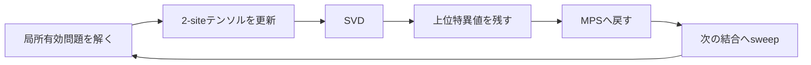
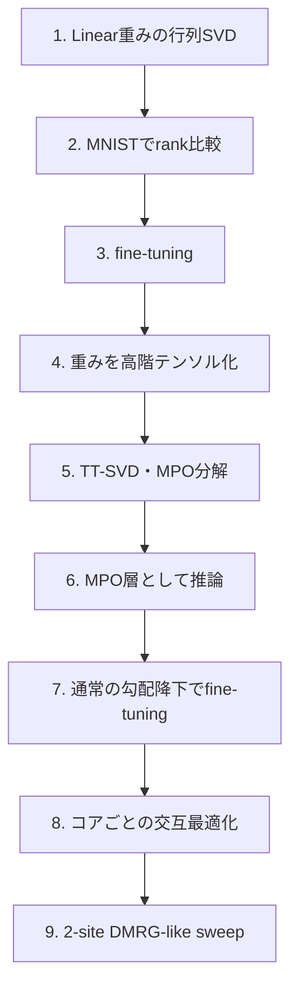

# DMRGとのつながり

## サマリー

SVDによるニューラルネットワーク圧縮とDMRGには、次の共通点がある。

> 大きな対象を特異値分解し、重要度の高い成分だけを残して、より小さい表現へ置き換える。

ただし、両者は同じ処理ではない。

ニューラルネットワークの単純なSVD圧縮では、学習済み重み行列

$$
W
\in
\mathbb{R}^{
D_{\mathrm{out}}
\times
D_{\mathrm{in}}
}
$$

を、

$$
W
=
U\Sigma V^{\mathsf{T}}
$$

と分解し、上位rankだけを残す。

$$
W_r
=
U_r
\Sigma_r
V_r^{\mathsf{T}}
$$

一方、DMRGでは、量子多体系の状態をMatrix Product State、MPSとして表し、局所的な最適化とSVDによる基底切り捨てを繰り返す。

現代的な2-site DMRGでは、2サイト分のテンソルを最適化した後、SVDで再び2つのテンソルへ分割する。



SVD圧縮とDMRGの共通部分は、

- SVD
- rankまたはbond dimension
- 切り捨て
- 捨てた特異値による誤差評価
- 小さい因子へ分解する構造

である。

一方で、重要な違いは次のとおりである。

- NN圧縮では主に重み行列を近似する
- DMRGでは量子状態を変分的に最適化する
- DMRGではHamiltonianとエネルギー最小化が中心になる
- DMRGの特異値は部分系間のSchmidt係数として解釈できる
- NN重みの特異値は、通常は量子エンタングルメントを意味しない

この章では、両者の共通点と違いを混同しないように整理し、将来のMPS・MPO・Tensor Train型NN圧縮へつなげる。

---

## 1. DMRGとは何か

DMRGはDensity Matrix Renormalization Groupの略である。

主に1次元量子多体系の低エネルギー状態、特に基底状態を高精度に求めるための変分法として使われる。

基本的には、量子状態をMPSとして表し、Hamiltonianに対する期待値

$$
E
=
\frac{
\langle
\psi
|
H
|
\psi
\rangle
}{
\langle
\psi
|
\psi
\rangle
}
$$

を小さくするように、MPSテンソルを局所的に更新する。

基底状態では、

$$
E_0
=
\min_{
|\psi\rangle
}
\frac{
\langle
\psi
|
H
|
\psi
\rangle
}{
\langle
\psi
|
\psi
\rangle
}
$$

を求める。

DMRGは単に行列をSVDして終わる方法ではない。

中心となる処理は、

1. MPSで状態を表現する
2. 一部のテンソルだけを変数として局所有効問題を作る
3. 局所有効Hamiltonianの低エネルギー状態を求める
4. SVDでテンソルを分割・切り捨てする
5. 左右へsweepする
6. 収束するまで繰り返す

である。

---

## 2. MPSとは何か

$L$ サイトからなる量子状態を考える。

各サイトの局所次元を $d$ とする。

一般の状態は、

$$
|\psi\rangle
=
\sum_{
s_1,
s_2,
\ldots,
s_L
}
C_{
s_1
s_2
\cdots
s_L
}
|
s_1
s_2
\cdots
s_L
\rangle
$$

と書ける。

係数テンソル

$$
C_{
s_1
s_2
\cdots
s_L
}
$$

は、$d^L$ 個の要素を持つ。

サイト数 $L$ に対して指数関数的に増えるため、そのまま保存するのは難しい。

MPSでは、この高階テンソルを小さいテンソルの積へ分解する。

$$
C_{
s_1
s_2
\cdots
s_L
}
=
A^{[1]s_1}
A^{[2]s_2}
\cdots
A^{[L]s_L}
$$

成分を明示すると、

$$
C_{
s_1
s_2
\cdots
s_L
}
=
\sum_{
\alpha_1,
\ldots,
\alpha_{L-1}
}
A^{[1]s_1}_{
\alpha_1
}
A^{[2]s_2}_{
\alpha_1\alpha_2
}
\cdots
A^{[L]s_L}_{
\alpha_{L-1}
}
$$

となる。

内部添字 $\alpha_i$ の最大次元をbond dimensionと呼ぶ。

一般に、

$$
\chi
$$

または、

$$
D
$$

で表す。

このノートでは、NNのrankと区別しやすいように、

$$
\chi
$$

を使う。

---

## 3. MPSの図

```text
s₁     s₂     s₃                 sL
│      │      │                  │
A[1]──A[2]──A[3]── ... ────────A[L]
   α₁     α₂                     αL-1
```

縦の脚：

- 物理添字
- 各サイトの状態 $s_i$

横の脚：

- bond添字
- サイト間の相関を運ぶ内部自由度

### Mermaid図


Mermaidではテンソル脚を厳密に表現しにくいため、概念図として見る。

---

## 4. bond dimensionの意味

bond dimension $\chi$ は、MPSが部分系間の相関をどれだけ保持できるかを制限する。

ある結合で系を左部分と右部分へ分ける。

```text
左部分               右部分
1 ─ 2 ─ ... ─ l  |  l+1 ─ ... ─ L
                  ↑
                結合
```

この分割に対してSchmidt分解を行う。

$$
|\psi\rangle
=
\sum_{
\alpha=1
}^{\chi_{\mathrm{Schmidt}}}
\lambda_\alpha
|
\alpha_L
\rangle
|
\alpha_R
\rangle
$$

ここで、

- $\lambda_\alpha$：Schmidt係数
- $|\alpha_L\rangle$：左部分系の直交基底
- $|\alpha_R\rangle$：右部分系の直交基底
- $\chi_{\mathrm{Schmidt}}$：Schmidt rank

である。

MPSのbond dimensionは、保持できるSchmidt rankの上限に対応する。

$$
\chi
\geq
\chi_{\mathrm{Schmidt}}
$$

なら、その結合で状態を厳密に表現できる。

$\chi$ を小さく制限すると、状態を近似的に表現する。

---

## 5. Schmidt分解とSVD

Schmidt分解は、係数テンソルを左右の添字でまとめ、行列としてSVDすることで得られる。

左側の物理添字をまとめて、

$$
i
=
(s_1,\ldots,s_l)
$$

右側をまとめて、

$$
j
=
(s_{l+1},\ldots,s_L)
$$

とする。

係数テンソルを行列

$$
C_{ij}
$$

として見れば、

$$
C
=
U\Sigma V^{\dagger}
$$

とSVDできる。

このとき、

$$
|\psi\rangle
=
\sum_\alpha
\sigma_\alpha
|
u_\alpha
\rangle
|
v_\alpha
\rangle
$$

となる。

これはSchmidt分解そのものである。

実数の場合は、

$$
V^{\dagger}
=
V^{\mathsf{T}}
$$

である。

複素数の場合は共役転置になる。

---

## 6. NNのSVDとの数式上の共通点

NN重みのSVD：

$$
W
=
U\Sigma V^{\mathsf{T}}
$$

Schmidt分解に使うSVD：

$$
C
=
U\Sigma V^{\dagger}
$$

どちらも、

- 左特異ベクトル
- 特異値
- 右特異ベクトル
- 上位rank成分
- 切り捨て誤差

を持つ。

切り詰めは、

$$
A_r
=
U_r
\Sigma_r
V_r^{\dagger}
$$

で表せる。

フロベニウスノルムの誤差も、

$$
\lVert
A-A_r
\rVert_F^2
=
\sum_{
i>r
}
\sigma_i^2
$$

である。

数学操作としては同じSVDを使っている。

---

## 7. ただし特異値の意味は異なる

### NN重み行列

$$
W
\in
\mathbb{R}^{
D_{\mathrm{out}}
\times
D_{\mathrm{in}}
}
$$

の特異値は、Linear層の変換方向ごとの強さを表す。

$$
Wv_i
=
\sigma_i
u_i
$$

### 量子状態

波動関数係数行列 $C$ の特異値は、左右部分系間のSchmidt係数である。

正規化された状態では、

$$
\sum_i
\lambda_i^2
=
1
$$

となる。

$\lambda_i^2$ は、縮約密度行列の固有値に対応する。

### 重要

NN重みの特異値に対して、

- Schmidt係数
- エンタングルメントスペクトル
- 密度行列固有値
- 量子状態の確率

という解釈を、そのまま与えてはいけない。

重み行列は通常、正規化された波動関数係数ではないためである。

---

## 8. 密度行列との関係

正規化されたSchmidt分解を、

$$
|\psi\rangle
=
\sum_\alpha
\lambda_\alpha
|
\alpha_L
\rangle
|
\alpha_R
\rangle
$$

とする。

右部分系を縮約した左部分系の密度行列は、

$$
\rho_L
=
\operatorname{Tr}_R
\left(
|\psi\rangle
\langle\psi|
\right)
$$

である。

Schmidt基底では、

$$
\rho_L
=
\sum_\alpha
\lambda_\alpha^2
|
\alpha_L\rangle
\langle\alpha_L|
$$

となる。

したがって、

- 密度行列の固有ベクトル：Schmidt基底
- 密度行列の固有値：$\lambda_\alpha^2$

である。

DMRGという名前の「Density Matrix」は、この縮約密度行列による基底選択と関係する。

現代的なMPS表現では、この処理をSVDとして実装できる。

---

## 9. DMRGで小さいSchmidt係数を捨てる意味

Schmidt係数を大きい順に並べる。

$$
\lambda_1
\geq
\lambda_2
\geq
\cdots
\geq0
$$

bond dimensionを $\chi$ に制限するとき、上位 $\chi$ 個だけを残す。

$$
|\psi_\chi\rangle
=
\sum_{
\alpha=1
}^{\chi}
\lambda_\alpha
|
\alpha_L
\rangle
|
\alpha_R
\rangle
$$

捨てた重みは、

$$
\epsilon_{\mathrm{discard}}
=
\sum_{
\alpha>\chi
}
\lambda_\alpha^2
$$

である。

正規化状態なら、

$$
\sum_\alpha
\lambda_\alpha^2
=
1
$$

なので、これは捨てた確率重みに相当する。

この量はtruncation error、discarded weightなどと呼ばれる。

---

## 10. NNのエネルギー保持率との対応

NN重みSVDでは、上位rankの特異値二乗和の比を、

$$
E(r)
=
\frac{
\sum_{
i=1
}^{r}
\sigma_i^2
}{
\sum_i
\sigma_i^2
}
$$

と定義した。

捨てた比率は、

$$
1-E(r)
=
\frac{
\sum_{
i>r
}
\sigma_i^2
}{
\sum_i
\sigma_i^2
}
$$

である。

DMRGで状態が正規化されている場合、

$$
\sum_i
\lambda_i^2
=
1
$$

なので、

$$
\epsilon_{\mathrm{discard}}
=
1-
\sum_{
i=1
}^{\chi}
\lambda_i^2
$$

となる。

数式の形はよく似ている。

### 共通点

- 二乗特異値を重要度として使う
- 上位成分を残す
- 捨てた二乗和を誤差指標にする

### 違い

- NNでは重み行列ノルムに対する割合
- DMRGでは正規化された量子状態のSchmidt重み

である。

---

## 11. rankとbond dimension

NNの低ランクLinearでは、中間次元をrank $r$ とした。

```text
D_in → r → D_out
```

MPSでは、隣接テンソル間の内部次元をbond dimension $\chi$ とする。

```text
A[1] ─χ─ A[2] ─χ─ A[3]
```

両者は、

> 2つの部分を接続する内部次元

という意味で似ている。

### 対応イメージ

| NN低ランク分解 | MPS・DMRG |
|---|---|
| rank $r$ | bond dimension $\chi$ |
| $W\approx BA$ | テンソル列による状態表現 |
| 特異値切り捨て | Schmidt係数切り捨て |
| 重み近似誤差 | 状態切り捨て誤差 |
| 2つのLinear | 2つのMPSテンソル |

ただし、NNのrankとMPSのbond dimensionが完全に同じ物理量という意味ではない。

---

## 12. Linear層の2因子分解をテンソルネットワークとして見る

低ランクLinearでは、

$$
W_{oi}
\approx
\sum_{
\alpha=1
}^{r}
B_{
o\alpha
}
A_{
\alpha i
}
$$

と書ける。

ここで、

- $i$：入力添字
- $o$：出力添字
- $\alpha$：内部bond添字

である。

図にすると、

```text
入力 i ── A ──α── B ── 出力 o
```

これは、2つのテンソルをbond dimension $r$ で接続した最小のテンソルネットワークと見なせる。

### Mermaid図


SVDによるLinear層の2層化は、テンソルネットワークへの最初の入口になる。

---

## 13. 単純SVDは2サイトの分解に近い

重み行列 $W_{oi}$ は、添字を2つだけ持つ2階テンソルである。

これをSVDして、

$$
W_{oi}
\approx
\sum_\alpha
B_{o\alpha}
A_{\alpha i}
$$

とする処理は、2つのテンソルを1本のbondでつないだ分解である。

一方、MPSやTensor Trainでは、1つの大きなテンソルを3個以上の小テンソルへ分解する。

```text
単純SVD

入力 ─ A ─ B ─ 出力
```

```text
MPS・TT・MPO

入力側の複数添字
   │   │   │
   A ─ A ─ A ─ ... ─ B ─ B ─ B
                         │   │   │
                    出力側の複数添字
```

単純SVDは、多段テンソルネットワーク分解の最小ケースとして理解できる。

---

## 14. 重み行列を高階テンソルへ変形する

MPOやTensor TrainでLinear層を圧縮するには、入力次元と出力次元を複数の小さい次元へ分解する。

たとえば、

$$
D_{\mathrm{in}}
=
n_1
n_2
\cdots
n_L
$$

$$
D_{\mathrm{out}}
=
m_1
m_2
\cdots
m_L
$$

と因数分解する。

重み行列

$$
W_{
o i
}
$$

を、

$$
W_{
m_1
m_2
\cdots
m_L,
n_1
n_2
\cdots
n_L
}
$$

という $2L$ 階テンソルへreshapeする。

その後、MPO形式へ分解する。

$$
W_{
m_1\cdots m_L,
n_1\cdots n_L
}
\approx
\sum_{
\alpha_1,
\ldots,
\alpha_{L-1}
}
G^{[1]}_{
m_1 n_1 \alpha_1
}
G^{[2]}_{
\alpha_1 m_2 n_2 \alpha_2
}
\cdots
G^{[L]}_{
\alpha_{L-1}m_L n_L
}
$$

---

## 15. MPOとは何か

MPOはMatrix Product Operatorの略である。

MPSが状態ベクトルを表すのに対し、MPOは演算子や行列をテンソル列で表す。

Linear層の重み行列は演算子として見られるため、MPO型圧縮の対象になる。

### 概念図

```text
出力添字 m₁  m₂  m₃              mL
            │   │   │               │
          G[1]─G[2]─G[3]─ ... ─── G[L]
            │   │   │               │
入力添字 n₁  n₂  n₃              nL
```

各コアは、

- 入力物理添字
- 出力物理添字
- 左bond
- 右bond

を持つ。

---

## 16. Tensor Trainとの関係

Tensor Train、TTは高階テンソルを行列積型のコア列で表す形式である。

MPSとTensor Trainは、分野によって呼び方や記法が異なるが、基本構造は非常に近い。

### 主な呼び方

| 量子物理 | 数値解析・機械学習 |
|---|---|
| MPS | Tensor Train |
| bond dimension | TT-rank |
| physical dimension | mode size |
| canonical form | orthogonalized TT cores |
| Schmidt係数 | unfoldingの特異値 |

Linear層の重みを高階テンソルへreshapeし、TTまたはMPOへ分解することで、単純な行列SVDより細かい構造化圧縮が可能になる。

---

## 17. 行列SVDとMPO分解の違い

### 行列SVD

重みを、

$$
D_{\mathrm{out}}
\times
D_{\mathrm{in}}
$$

の2階テンソルとして分解する。

内部rankは1個だけである。

$$
W
\approx
BA
$$

### MPO

入出力次元を複数の因子へ分け、高階テンソルとして分解する。

内部bond dimensionが複数存在する。

$$
W
\approx
G^{[1]}
G^{[2]}
\cdots
G^{[L]}
$$

### 比較

| 項目 | 行列SVD | MPO・TT |
|---|---|---|
| 分解前 | 2階テンソル | 高階テンソルへreshape |
| 因子数 | 2 | 3以上も可能 |
| rank | 1つ | 各bondにrank |
| 実装 | 単純 | 複雑 |
| shape設計 | 不要 | 因数分解が必要 |
| 基準実験 | 適する | 発展手法 |

---

## 18. DMRGのsweep

DMRGでは、MPSの局所テンソルを左から右、右から左へ順に更新する。

これをsweepと呼ぶ。

```text
左から右

[A1 A2] A3 A4 ...
   ↓
A1 [A2 A3] A4 ...
      ↓
A1 A2 [A3 A4] ...
```

```text
右から左

... A3 [A4 A5]
       ↓
... [A3 A4] A5
```

各位置で、

1. 局所有効Hamiltonianを作る
2. 局所テンソルを最適化する
3. SVDで分割する
4. bond dimensionを制限する
5. 次の位置へ移る

という処理を行う。

---

## 19. 2-site DMRGの局所テンソル

隣接する2つのMPSテンソルを結合する。

$$
\Theta_{
\alpha_{l-1},
s_l,
s_{l+1},
\alpha_{l+1}
}
$$

局所有効問題を解いて $\Theta$ を更新した後、左側添字と右側添字へまとめる。

左複合添字：

$$
i
=
(
\alpha_{l-1},
s_l
)
$$

右複合添字：

$$
j
=
(
s_{l+1},
\alpha_{l+1}
)
$$

これを行列

$$
\Theta_{ij}
$$

としてSVDする。

$$
\Theta
=
U\Sigma V^{\dagger}
$$

上位 $\chi$ 個を残し、再び2つのMPSテンソルへ分ける。

---

## 20. 2-site DMRGでの分割

SVD後に、

$$
U_\chi
\in
\mathbb{C}^{
(d\chi_L)
\times
\chi
}
$$

$$
\Sigma_\chi
\in
\mathbb{R}^{
\chi\times\chi
}
$$

$$
V_\chi^{\dagger}
\in
\mathbb{C}^{
\chi
\times
(d\chi_R)
}
$$

を得る。

特異値を左右のどちらへ吸収するかは、sweep方向やcanonical formによって変わる。

これは [[00_基礎理論/03_モデル圧縮理論/04_Linear層を2層へ置き換える]] で扱った、

- $\Sigma$ を前段へ吸収
- $\Sigma$ を後段へ吸収
- $\Sigma^{1/2}$ を両方へ分ける

という考え方と数式上は似ている。

---

## 21. canonical form

MPSには、左canonical、右canonical、mixed canonicalなどの形がある。

左canonicalテンソルでは、概念的に、

$$
\sum_s
\left(
A^{[l]s}
\right)^\dagger
A^{[l]s}
=
I
$$

を満たす。

右canonicalテンソルでは、

$$
\sum_s
A^{[l]s}
\left(
A^{[l]s}
\right)^\dagger
=
I
$$

を満たす。

mixed canonical formでは、ある中心位置を境に、

- 左側：左直交化
- 右側：右直交化
- 中心：自由テンソルまたはSchmidt係数

となる。

canonical formにより、

- ノルム計算
- 局所最適化
- Schmidt係数の取得
- 数値安定性

が扱いやすくなる。

---

## 22. NN低ランク因子の非一意性との関係

NNで、

$$
W_r=BA
$$

と分解したとする。

任意の可逆行列 $Q$ に対して、

$$
W_r
=
BQQ^{-1}A
$$

なので、

$$
B'
=
BQ
$$

$$
A'
=
Q^{-1}A
$$

としても同じ $W_r$ を表す。

MPSにも同様のgauge freedomがある。

隣接bondに対して、

$$
A^{[l]}
\rightarrow
A^{[l]}Q
$$

$$
A^{[l+1]}
\rightarrow
Q^{-1}A^{[l+1]}
$$

と変換しても、全体の状態は変わらない。

canonical formは、この自由度を整理する方法と考えられる。

---

## 23. DMRGは「SVD圧縮の繰り返し」だけではない

DMRGを、

> SVDで小さい特異値を捨てるアルゴリズム

だけと説明すると不十分である。

DMRGには、次の2つの処理がある。

### 1. 変分最適化

局所有効Hamiltonianに対して、エネルギーを下げる局所テンソルを求める。

### 2. 圧縮・再分割

更新されたテンソルをSVDし、bond dimensionを制限する。

SVDは重要だが、Hamiltonianに対する局所最適化がなければDMRGではない。

---

## 24. NNのSVD圧縮も最適化を含まない

学習済み重みを切り詰めSVDするだけなら、

$$
W
\rightarrow
W_r
$$

という1回の行列近似である。

分類lossを直接最小化していない。

その後のfine-tuningで初めて、タスクlossに対して再最適化する。

### 対応イメージ

| NN圧縮 | DMRG |
|---|---|
| 学習済み重み | 現在のMPS |
| SVD切り詰め | bond切り捨て |
| fine-tuning | 変分更新 |
| rank | bond dimension |
| epoch | sweepとは異なるが反復最適化 |

この対応は概念的な比較であり、アルゴリズムが同一という意味ではない。

---

## 25. DMRG-likeなNN最適化とは何か

NN重みをMPOやTensor Trainとして表す場合、全コアを同時に更新する代わりに、1個または2個のコアだけを局所更新する方法を考えられる。

```text
固定   更新対象   固定
G1 ─ G2 ─ [G3 G4] ─ G5 ─ G6
```

局所コアを更新した後、

1. 2コアを結合
2. 損失を下げるように最適化
3. SVDで分割
4. bond dimensionを切り詰め
5. 次の位置へ移動

と進めれば、DMRG-likeなsweep最適化になる。

ただし、通常のニューラルネットワークlossは量子Hamiltonianの期待値とは異なるため、局所有効問題の形も異なる。

---

## 26. NNで局所最適化する難しさ

DMRGでは、他のMPSテンソルを固定すると、局所有効問題が線形固有値問題として表される場合が多い。

一方、一般のニューラルネットワークでは、

- 活性化関数
- 複数層
- データバッチ
- 非線形loss
- optimizer
- 他層との依存

がある。

そのため、1つのMPOコアだけを変数としても、単純な固有値問題にならない場合が多い。

実装では、局所コアに対して勾配降下を行う方法が考えられる。

---

## 27. DMRGとALS

Tensor Trainや行列因子分解では、1つのコアを更新し、他を固定する交互最適化をALS、Alternating Least Squaresと呼ぶことがある。

DMRGのsweepとALSには、

- 局所変数だけ更新
- 左右へ移動
- 反復して収束
- 局所環境を利用

という共通点がある。

NNにテンソルネットワーク層を導入する場合、

- 通常の全パラメータ勾配降下
- コアごとの交互最適化
- 2コア更新とSVD再分割

を比較できる。

---

## 28. bond dimensionを動的に変える

2-site DMRGでは、2サイトテンソルを最適化した後にSVDするため、新しいSchmidt spectrumを見てbond dimensionを調整できる。

たとえば、

- 最大bond dimension
- discarded weight閾値
- 最小特異値閾値

を使って、保持数を決める。

NNのMPO圧縮でも、

- 固定bond dimension
- エネルギー保持率
- validation accuracy
- パラメータ予算

に基づいてbond dimensionを調整する方法が考えられる。

---

## 29. 固定rankと誤差閾値

NNの行列SVDでは、

$$
r
\in
\{
8,
16,
32,
64,
128
\}
$$

のような固定rankを試した。

DMRGでは、固定 $\chi$ だけでなく、

$$
\epsilon_{\mathrm{discard}}
<
\epsilon_{\mathrm{target}}
$$

を満たすように保持数を選ぶことがある。

NN側でも、

$$
1-E(r)
<
\epsilon
$$

を基準にrankを選べる。

ただし、NNでは最終的にvalidation accuracyで確認する必要がある。

---

## 30. エンタングルメントエントロピー

Schmidt係数 $\lambda_\alpha$ から、部分系のvon Neumann entropyを計算できる。

$$
S
=
-
\sum_\alpha
\lambda_\alpha^2
\log
\lambda_\alpha^2
$$

これは部分系間のエンタングルメント量を表す。

MPSで必要なbond dimensionは、エンタングルメント構造と関係する。

### 重要

NN重み行列の特異値を正規化して同じ式へ入れても、それを物理的なエンタングルメントエントロピーと呼ぶことは通常できない。

単なる特異値分布の集中度指標として使うことはできるが、物理解釈は別である。

---

## 31. 有効rank

特異値分布の集中度を見るため、正規化二乗特異値を、

$$
p_i
=
\frac{
\sigma_i^2
}{
\sum_j
\sigma_j^2
}
$$

とする。

エントロピーを、

$$
H
=
-
\sum_i
p_i
\log p_i
$$

と定義する。

有効rankの一例は、

$$
r_{\mathrm{eff}}
=
\exp(H)
$$

である。

これは、

- 特異値が1個に集中：小さい
- 多数へ均等に分散：大きい

という性質を持つ。

NN重みの特異値分布を要約する補助指標として使える。

ただし、DMRGの物理的エンタングルメントエントロピーとは区別する。

---

## 32. 面積則とDMRGの成功

1次元のgappedな局所Hamiltonianの基底状態では、エンタングルメントが比較的小さく、MPSで効率よく近似できる場合が多い。

これがDMRGが1次元系で高精度を出しやすい背景の1つである。

一方、臨界系や高次元系では、必要なbond dimensionが大きくなりやすい。

### NN圧縮との比較

NN重みが効率よく低ランク・低bond dimensionで表せるかは、

- データ
- 層
- 学習方法
- reshape方法
- モデル構造

に依存する。

量子系の面積則を、そのままNN重みへ適用することはできない。

---

## 33. reshape方法が重要

MPO圧縮では、

$$
D_{\mathrm{in}}
=
n_1n_2\cdots n_L
$$

$$
D_{\mathrm{out}}
=
m_1m_2\cdots m_L
$$

という分解を選ぶ必要がある。

同じ重み行列でも、添字の分け方や並べ方によって、各bondの特異値分布が変わる。

### 例

$$
784
=
7\times7\times4\times4
$$

$$
512
=
8\times8\times8
$$

ただし、入力側と出力側のサイト数を合わせるには、1を含む因子を加えるなどの設計が必要になる。

たとえば、

$$
784
=
7\times7\times4\times4
$$

$$
512
=
8\times8\times8\times1
$$

のように4サイトへ合わせられる。

### 注意

どの因数分解が最良かは自動的には決まらない。

---

## 34. MNIST画像構造を利用する可能性

MNIST入力は28×28画像である。

Flattenすると784次元になるが、元は2次元空間構造を持つ。

MPOやTensor Trainへ変形するとき、

- 単純な連番Flatten
- 行方向と列方向を分ける
- 2×2ブロック
- bit分解
- space-filling curve

など、添字順序を工夫できる。

構造に合ったtensorizationは、必要bond dimensionへ影響する可能性がある。

ただし、最初のSVD実験では通常のFlattenを使い、複雑化しない。

---

## 35. TT-SVD

高階テンソルをTensor Trainへ分解する基本方法として、TT-SVDがある。

概念的には、添字を左から順に分割し、SVDを繰り返す。

```text
元テンソル
   │
   ▼
第1分割でSVD
   │
   ├─ 第1コア
   ▼
残りテンソル
   │
   ▼
第2分割でSVD
   │
   ├─ 第2コア
   ▼
...
```

各段階でrankを切り詰めることで、TT-rankを制御する。

単純な行列SVDを多段化したものとして理解しやすい。

---

## 36. TT-SVDとDMRGの違い

### TT-SVD

- 既存テンソルを順方向に分解
- SVDを繰り返す
- 一度の分解で初期TTを作れる
- 元テンソル近似が中心

### DMRG・TT-rounding・sweep最適化

- 局所テンソルを反復更新
- 左右へsweep
- 目的関数に合わせて再最適化
- 局所環境を利用

NN圧縮で考えると、

- TT-SVD：学習済み重みを初期MPOへ変換
- fine-tuning：タスクlossへ再適応
- DMRG-like sweep：局所コア単位で再最適化

という段階に分けられる。

---

## 37. 行列SVDをbaselineにする理由

MPOやDMRG-like手法へ進む前に、単純な行列SVDを完了させるべき理由は次のとおりである。

### 1. 数学が明確

切り詰めSVDは、rank制約の下で最良の行列近似になる。

### 2. 実装が単純

2つのLinear層へ置き換えればよい。

### 3. 誤差が明確

$$
\lVert
W-W_r
\rVert_F^2
=
\sum_{
i>r
}
\sigma_i^2
$$

である。

### 4. 比較基準になる

複雑なMPOやDMRG-like手法が、本当に単純SVDより有効か評価できる。

### 5. バグを分離できる

行列SVDで正しく動かなければ、高階テンソル化へ進む前に修正できる。

---

## 38. 将来の研究ロードマップ



現在のノート群は、1から3までを対象にしている。

---

## 39. 段階1：行列SVD

対象：

$$
W
\in
\mathbb{R}^{
D_{\mathrm{out}}
\times
D_{\mathrm{in}}
}
$$

処理：

$$
W
\approx
U_r
\Sigma_r
V_r^{\mathsf{T}}
$$

実装：

```text
Linear(D_in, r)
Linear(r, D_out)
```

評価：

- 圧縮率
- 重み誤差
- 出力誤差
- accuracy
- fine-tuning

---

## 40. 段階2：Tensor Train・MPO

対象重みを高階テンソルへreshapeする。

$$
W
\rightarrow
\mathcal{W}_{
m_1n_1
m_2n_2
\cdots
m_Ln_L
}
$$

複数コアへ分解する。

$$
\mathcal{W}
\approx
G^{[1]}
G^{[2]}
\cdots
G^{[L]}
$$

評価：

- 総パラメータ数
- bond dimension
- reshape方式
- 重み誤差
- 推論時間
- accuracy

---

## 41. 段階3：通常fine-tuning

MPOコアを通常の `nn.Parameter` として登録し、全コアを同時に勾配降下する。

これはDMRGではない。

ただし、低bond dimension制約の中でタスクへ再適応できる。

比較対象：

- 圧縮直後
- 全コアfine-tuning後

---

## 42. 段階4：交互最適化

一部コアだけ `requires_grad=True` とし、他を固定する。

```text
固定   更新   固定
G1 ─ G2 ─ G3 ─ G4
```

一定step後に更新対象を移動する。

```text
G1 → G2 → G3 → G4 → G3 → G2 → G1
```

これはsweep型の交互最適化である。

---

## 43. 段階5：2-site更新

隣接2コアを結合する。

$$
\Theta
=
G^{[l]}
G^{[l+1]}
$$

$\Theta$ をlossに対して更新した後、SVDする。

$$
\Theta
=
U\Sigma V^{\mathsf{T}}
$$

bond dimensionを制限して分割する。

$$
G^{[l]}
\leftarrow
U_\chi
$$

$$
G^{[l+1]}
\leftarrow
\Sigma_\chi
V_\chi^{\mathsf{T}}
$$

これがNNにおけるDMRG-likeな2-site更新の基本イメージになる。

---

## 44. 2-site更新の利点

- bond basisを更新できる
- bond dimensionを増減しやすい
- 1-site更新より局所最適解から抜けやすい可能性
- SVDで数値安定性を保ちやすい
- truncation errorを測定できる

### 課題

- 2コア結合テンソルが大きくなる
- optimizer stateの扱いが複雑
- PyTorchの自動微分と再分割の管理
- ミニバッチごとのSVDコスト
- sweep順序と学習率
- 他のNN層との同時学習

---

## 45. Hamiltonianとlossの違い

DMRGでは、目的関数は通常、

$$
E
=
\langle
\psi
|
H
|
\psi
\rangle
$$

のような二次形式である。

NNでは、たとえばMNIST分類なら、

$$
\mathcal{L}
=
\operatorname{CrossEntropy}
\left(
f_\theta(x),
y
\right)
$$

である。

局所コアに対する問題は一般に非線形で、データ全体に依存する。

そのため、

> DMRGの局所有効HamiltonianをそのままNNへ置き換える

ことはできない。

DMRGの、

- 局所更新
- sweep
- SVD再分割
- bond制御

というアルゴリズム構造を参考にする。

---

## 46. DMRG-likeという表現

研究や説明では、次を区別する。

### DMRG

量子多体系のMPS変分最適化としてのDMRG。

### DMRG-like

- MPS・MPO型パラメータ
- 局所コア更新
- 左右sweep
- 2-site結合
- SVD切り捨て

など、DMRGの構造を参考にした最適化。

NNへ適用する場合、物理的DMRGそのものではないことが多い。

「DMRGをNNへ適用した」と言い切る前に、どの要素を使っているか明記する。

---

## 47. 一般的なNN学習との比較

| 項目 | 通常の勾配降下 | DMRG-like sweep |
|---|---|---|
| 更新対象 | 全パラメータ | 1または2コア |
| 更新順 | 同時 | 左右へ移動 |
| 表現 | 任意 | MPS・MPOが前提 |
| rank制御 | 構造で固定 | SVDで動的変更可能 |
| optimizer | Adam・SGDなど | 局所solverまたは局所勾配 |
| 実装 | 比較的単純 | 複雑 |
| 並列性 | 高い | 逐次性が強い |

DMRG-like手法は、通常学習より常に優れているわけではない。

---

## 48. パラメータ数の比較

### 行列SVD

$$
P_{\mathrm{SVD}}
=
r
\left(
D_{\mathrm{in}}
+
D_{\mathrm{out}}
\right)
$$

### MPO

サイト $l$ のコア形状を、

$$
\chi_{l-1}
\times
m_l
\times
n_l
\times
\chi_l
$$

とする。

総パラメータ数は、

$$
P_{\mathrm{MPO}}
=
\sum_{
l=1
}^{L}
\chi_{l-1}
m_l
n_l
\chi_l
$$

である。

境界では、

$$
\chi_0
=
\chi_L
=
1
$$

とする。

同じパラメータ数で精度を比較する必要がある。

---

## 49. bond dimensionだけでは圧縮量が決まらない

MPOのパラメータ数は、

- サイト数 $L$
- 入力因子 $n_l$
- 出力因子 $m_l$
- 各bond dimension $\chi_l$

に依存する。

したがって、

> bond dimension 8

だけでは圧縮率を判断できない。

行列SVDでrankと入出力形状を併記したのと同様に、MPOでは全コア形状と総パラメータ数を報告する。

---

## 50. 計算量

MPO層の計算量は、縮約順序によって変わる。

単純な密行列積

$$
y=Wx
$$

を明示的に作らず、MPOコアとtensorized inputを順に縮約する。

理論パラメータ数が少なくても、

- reshape
- transpose
- 多数の小tensor演算
- 中間テンソル
- GPUカーネル起動

によって、実測速度が改善しない可能性がある。

SVD低ランク層と同様、実測が必要である。

---

## 51. 初期化方法

MPO型NN層を作る方法には、少なくとも次がある。

### 1. 学習済み重みから分解

- denseモデルを学習
- TT-SVD・MPO分解
- 必要に応じてfine-tuning

### 2. 最初からMPOで学習

- ランダムなMPOコア
- 低bond dimension構造のまま学習

### 3. dense重みを一時的に作って圧縮

- 初期dense重みを生成
- MPOへ分解
- MPOとして学習

現在のSVDロードマップは、1の学習後圧縮から始める。

---

## 52. SVD baselineとの公平な比較

MPOやDMRG-like手法を評価するときは、次のどちらかで比較する。

### 同じパラメータ数

$$
P_{\mathrm{SVD}}
\approx
P_{\mathrm{MPO}}
$$

でaccuracyを比較する。

### 同じaccuracy

同程度のaccuracyを維持するために必要なパラメータ数を比較する。

### 併記する条件

- 圧縮直後かfine-tuning後か
- fine-tuning epoch数
- 学習時間
- 推論時間
- tensorization
- bond dimensions
- seed

---

## 53. DMRGでの収束

DMRGでは、sweepごとに、

- エネルギー
- エネルギー変化
- 波動関数変化
- truncation error
- variance
- 最大bond dimension

などを監視する。

NNのDMRG-like最適化では、対応する監視項目として、

- train loss
- validation loss
- validation accuracy
- sweepごとのloss変化
- bond dimension
- discarded singular weight
- gradient norm
- 局所更新時間

を記録できる。

---

## 54. NNでのtruncation error

MPOの2コアを結合してSVDしたとき、特異値を、

$$
\sigma_1
\geq
\sigma_2
\geq
\cdots
$$

とする。

上位 $\chi$ 個を残す。

正規化していないテンソルなら、相対的なdiscarded weightを、

$$
\epsilon_{\mathrm{relative}}
=
\frac{
\sum_{
i>\chi
}
\sigma_i^2
}{
\sum_i
\sigma_i^2
}
$$

と定義できる。

これはNN重みのエネルギー損失率と同じ形である。

ただし、量子状態の確率重みとは限らない。

---

## 55. 物理的な用語の使い分け

### NN重みで使ってよい表現

- 特異値
- 特異値スペクトル
- 累積二乗特異値
- 低ランク近似
- discarded singular-value weight
- bond dimension
- Tensor Train rank
- MPO rank

### 注意が必要な表現

- Schmidt係数
- エンタングルメント
- 密度行列
- 量子状態
- エネルギー準位
- 基底状態

NN重みを量子状態として明確に定義した場合を除き、物理的意味を暗黙に付与しない。

---

## 56. 特異値はエネルギーではない

Hamiltonian $H$ の固有値問題は、

$$
H|\psi_n\rangle
=
E_n|\psi_n\rangle
$$

である。

ここで $E_n$ がエネルギー固有値である。

一方、重み行列のSVDは、

$$
Wv_i
=
\sigma_i
u_i
$$

である。

$\sigma_i$ は特異値であり、エネルギー固有値ではない。

また、特異ベクトル $u_i$ と $v_i$ はHamiltonian固有状態ではない。

---

## 57. NN重みをHamiltonianと見なせるか

一般のNN重み行列 $W$ は、

- Hermitianとは限らない
- 正方行列とは限らない
- 物理Hamiltonianとして定義されていない
- エネルギー期待値を与えない

ため、そのままHamiltonianとは見なせない。

特定の研究設定でNNと量子系の対応を構築することはあり得るが、追加の定義と根拠が必要である。

---

## 58. DMRGで求めるものとNN圧縮で求めるもの

### DMRG

求めるもの：

$$
|\psi_0\rangle
$$

目的：

$$
\min
\langle
\psi
|
H
|
\psi
\rangle
$$

制約：

MPSのbond dimension。

### NN圧縮

求めるもの：

低パラメータモデル

$$
f_{\theta_{\mathrm{compressed}}}
$$

目的：

- 元モデルに近い
- タスクaccuracyを保つ
- パラメータ数を減らす
- 必要なら推論を高速化する

制約：

rank、bond dimension、モデルサイズなど。

---

## 59. SVDによるNN圧縮の位置付け

SVD圧縮は、

> 重み行列を2つのテンソルへ分解する最小のテンソルネットワーク圧縮

として理解できる。

この段階で身に付ける内容：

- 特異値
- rank
- 切り捨て
- 誤差
- 因子分解
- biasの扱い
- fine-tuning
- パラメータ数比較

これらはMPO・TT・DMRG-like手法でも必要になる。

---

## 60. 以前のFortran DMRGコードとの関係

過去のDMRGコードが量子多体系の基底状態計算を目的としていた場合、NN圧縮コードへ直接書き換えるのは単純ではない。

再利用できる可能性がある考え方：

- SVD
- block分割
- 基底切り捨て
- sweep
- bond dimension
- truncation error
- 収束判定

そのまま再利用しにくい部分：

- Hamiltonian構築
- 量子数
- 有効Hamiltonian
- Lanczos・Davidsonなどの局所固有値solver
- 物理観測量
- 境界条件

NN側では、目的関数とデータ処理が大きく異なる。

そのため、現在はPyTorchで新規実装し、概念だけ段階的に接続する方が理解しやすい。

---

## 61. 過去コードを読まなくても進められる順序

```text
1. PyTorchで行列SVD
2. Linear層を2層化
3. MNISTで圧縮実験
4. Tensor Trainの小さい例
5. TT-SVD
6. MPO Linear層
7. MPO fine-tuning
8. sweep型局所更新
9. 必要になった時点で過去DMRGコードと比較
```

過去コードの完全解析を前提にすると、NN圧縮の学習が止まりやすい。

まず現代的な小さいPython実装で概念を再構築する。

---

## 62. 最初に実装すべきMPS・TT例

MNISTのMPO圧縮へ進む前に、小さいテンソルでTT-SVDを実装する。

例：

$$
X
\in
\mathbb{R}^{
2\times3\times4
}
$$

を3コアへ分解する。

確認項目：

- 各unfoldingの形状
- SVD
- TT-rank
- 再構成
- フロベニウス誤差
- rank最大時の一致
- rank切り捨て時の誤差

この小実験が、行列SVDからMPOへの橋渡しになる。

---

## 63. 次に実装すべきMPO例

小さい行列を、

$$
W
\in
\mathbb{R}^{16\times16}
$$

とする。

$$
16
=
2\times2\times2\times2
$$

なので、

$$
W
\rightarrow
\mathcal{W}
\in
\mathbb{R}^{
2\times2\times
2\times2\times
2\times2\times
2\times2
}
$$

へreshapeできる。

これを4コアMPOへ分解し、

- 元行列
- MPO再構成行列
- 行列SVD
- パラメータ数
- 近似誤差

を比較する。

---

## 64. その後MNISTへ進む

MNISTの `fc1` は、

$$
W
\in
\mathbb{R}^{512\times784}
$$

である。

tensorization例：

$$
512
=
8\times8\times8\times1
$$

$$
784
=
7\times7\times4\times4
$$

4サイトMPOとして、

$$
(m_l,n_l)
=
(8,7),
(8,7),
(8,4),
(1,4)
$$

などを考えられる。

ただし、これは候補の1つにすぎない。

複数のfactorizationと添字順序を比較する必要がある。

---

## 65. MPO Linear層のforward

入力ベクトルを、

$$
x_i
$$

から、

$$
x_{
n_1
n_2
\cdots
n_L
}
$$

へreshapeする。

MPOコアと順に縮約し、

$$
y_{
m_1
m_2
\cdots
m_L
}
$$

を得る。

最後に、

$$
y
\in
\mathbb{R}^{D_{\mathrm{out}}}
$$

へreshapeする。

実装では `torch.einsum`、`tensordot`、逐次matmulなどを使える。

最初は正しさを優先し、速度最適化は後に行う。

---

## 66. MPOのbias

Linear層のbiasは、

$$
b
\in
\mathbb{R}^{D_{\mathrm{out}}}
$$

である。

重みをMPO化しても、biasは通常そのままベクトルとして保持する。

$$
y
=
\operatorname{MPO}(x)
+
b
$$

bias自体をMPOへ分解する必要はない。

これは行列SVD圧縮と同じである。

---

## 67. MPO fine-tuning

MPOコアを、

```python
nn.ParameterList
```

または個別の `nn.Parameter` として登録する。

forwardで縮約し、通常のlossから誤差逆伝播する。

最初はすべてのコアを同時に学習する。

その後、DMRG-likeな局所更新と比較する。

---

## 68. 研究で比較すべき4方式

### 1. Dense baseline

元のLinear層。

### 2. 行列SVD

2つのLinear層。

### 3. MPO・TT

複数コアによる圧縮。

### 4. MPO・TT + DMRG-like更新

局所sweepとSVD再分割。

比較する項目：

- パラメータ数
- accuracy
- 圧縮直後の誤差
- fine-tuning後の精度
- 学習時間
- 推論時間
- 実装複雑度

---

## 69. 研究仮説の例

### 仮説1

同じパラメータ数なら、MPOは行列SVDより高いaccuracyを維持できる場合がある。

理由候補：

- 多段の内部構造を使える
- tensorizationが入力構造と合う可能性
- 複数bondへ情報を分散できる

### 仮説2

MPOの性能はtensorizationへ強く依存する。

### 仮説3

DMRG-like sweepは、通常の全コアfine-tuningより少ない局所メモリで学習できる可能性がある。

### 仮説4

逐次的なsweepはGPU並列性が低く、学習時間では不利になる可能性がある。

実験前に仮説として明記し、結果で検証する。

---

## 70. 「精度を落とさない」の定義

完全に同じaccuracyを要求するのか、許容範囲を設けるのかを明確にする。

たとえば、

$$
\Delta
\operatorname{Accuracy}
\leq
0.1
\text{ percentage point}
$$

または、

$$
\Delta
\operatorname{Accuracy}
\leq
0.5
\text{ percentage point}
$$

と定義する。

複数seedを使う場合は、baselineのばらつきも考慮する。

---

## 71. 単純SVDで十分な可能性

複雑なMPO・DMRG-like手法が必ず必要とは限らない。

行列SVDで、

- 高い圧縮率
- 小さい精度低下
- 簡単な実装
- 高速なfine-tuning

を達成できるなら、それが実用上最良の場合もある。

研究では、

> 複雑な手法が単純baselineを上回るか

を確認することが重要である。

---

## 72. DMRG-like手法の価値が出る条件

次のような結果が得られれば、追加手法の価値を示しやすい。

- 同じパラメータ数でSVDより高精度
- 同じ精度でSVDより小さい
- fine-tuning時間が短い
- 少ないメモリで学習できる
- bond dimensionを動的に最適化できる
- tensorizationによる構造解釈が可能
- 大きな層で実測速度が改善する

---

## 73. よくある誤解

### DMRGはSVDの別名である

誤りである。

DMRGはMPSの変分最適化とsweepを含む。

### NN重みの特異値はSchmidt係数である

通常は違う。

波動関数係数として定義された場合に限り、Schmidt係数として解釈できる。

### 小さい特異値は量子的に不要な状態である

NN重みでは、そのような物理解釈はない。

### bond dimensionと行列rankは完全に同じである

似た役割を持つが、MPS・MPOでは複数bondがあり、tensorizationにも依存する。

### DMRGを使えば必ずSVDより圧縮できる

保証されない。

### MPOへ変換すれば必ず高速化する

多数の小演算や縮約オーバーヘッドにより、遅くなる場合がある。

### エンタングルメントエントロピーをNN重みへそのまま使える

数学的な集中度指標として類似式を使えても、物理的エンタングルメントとは限らない。

### 過去のFortran DMRGコードをPythonへ翻訳すればNN圧縮になる

目的関数とデータ構造が異なるため、単純翻訳ではない。

### DMRG-likeとDMRGは同じと呼んでよい

どの要素を使っているか明記する必要がある。

---

## 74. この章での用語対応

| SVD・NN圧縮 | DMRG・MPS | 注意 |
|---|---|---|
| rank $r$ | bond dimension $\chi$ | 類似するが同一物理量ではない |
| 特異値 | Schmidt係数 | 状態係数を分割した場合のみ |
| 二乗特異値保持率 | Schmidt weight | 正規化条件が異なる |
| 低ランク因子 | MPS・MPOコア | 因子数が異なる |
| fine-tuning | 変分再最適化 | 手法は異なる |
| rank sweep | DMRG sweep | 通常のepochとは異なる |
| 重み誤差 | 状態誤差 | 評価対象が異なる |
| loss | energy | 一般には異なる目的関数 |

---

## 75. 最初に覚えるべき共通点

- SVDで対象を左右の因子へ分ける。
- 特異値を重要度の目安にする。
- 上位成分だけを残す。
- 内部次元が表現力と計算量を制御する。
- 捨てた特異値の二乗和を誤差指標にできる。
- 分解後に再最適化できる。
- 小さい表現と精度のトレードオフを評価する。

---

## 76. 最初に覚えるべき違い

- NNの重みは量子状態ではない。
- NN重みの特異値はエネルギーではない。
- DMRGはHamiltonianの基底状態を変分的に求める。
- DMRGは局所更新とsweepを含む。
- DMRGのSchmidt係数は部分系間相関と関係する。
- NN圧縮のrankは主に重み行列の表現能力を制御する。
- NNでDMRG-like手法を使うには、MPS・MPO型パラメータ化が必要になる。
- 複雑な手法は単純SVD baselineと比較する必要がある。

---

## 77. 研究・面接で説明するなら

### 30秒程度の説明

> SVD圧縮とDMRGは、特異値の大きい成分を残して小さい表現を作る点で共通しています。NNでは学習済み重み行列を低ランク化し、2つのLinear層へ分解します。DMRGでは量子状態をMPSで表し、2サイトテンソルを局所最適化した後、SVDで分割してbond dimensionを制限します。ただし、NN重みの特異値はSchmidt係数やエネルギーではなく、DMRGはHamiltonianに対する変分最適化を含むため、単純なSVD圧縮と同一ではありません。

### 研究での位置付け

現在の行列SVD実験は、将来のTensor Train・MPO圧縮へ進むためのbaselineである。

次の段階では、

1. 重みを高階テンソルへreshape
2. TT-SVDでMPO化
3. 通常のfine-tuning
4. コアごとの交互最適化
5. 2-site DMRG-like sweep

の順で進める。

### 論文で説明するなら

単純SVD、MPO、DMRG-like最適化を区別し、

- 表現形式
- 初期分解
- 最適化方法
- rank・bond dimension
- パラメータ数
- fine-tuning条件

を明記する。

---

## 78. 現在の研究ロードマップ

### 完了対象

- [[00_基礎理論/01_数学基礎/01_線形代数/01_SVDとは]]
- [[00_基礎理論/02_ニューラルネットワーク基礎/02_nn.Linearとは]]
- [[00_基礎理論/01_数学基礎/01_線形代数/03_SVDによる低ランク近似]]
- [[00_基礎理論/03_モデル圧縮理論/04_Linear層を2層へ置き換える]]
- [[00_基礎理論/01_数学基礎/01_線形代数/05_圧縮率とRank]]
- [[00_基礎理論/01_数学基礎/01_線形代数/06_誤差評価]]
- [[05_SVD基礎実装検証/07_PyTorch実装]]
- [[10_MNIST_MLP_SVD/01_MNIST実験]]

### 次の候補

```text
10_Tensor Trainとは
11_TT-SVD
12_MPOでLinear層を表す
13_MPO LinearのPyTorch実装
14_MNISTでSVDとMPOを比較
15_DMRG-like sweep最適化
```

現在は、まず [[10_MNIST_MLP_SVD/01_MNIST実験]] を実際に動かし、単純SVD baselineを完成させる。

---

## 79. このノートで押さえるポイント

- DMRGは、MPSを使った量子状態の変分最適化手法である。
- DMRGはSVDだけではなく、局所最適化とsweepを含む。
- MPSのbond dimensionは、部分系間で保持できるSchmidt rankを制限する。
- Schmidt分解は、波動関数係数を左右へreshapeした行列のSVDで得られる。
- 正規化状態では、Schmidt係数の二乗和は1になる。
- DMRGのdiscarded weightは、捨てたSchmidt係数の二乗和である。
- NNの特異値エネルギー損失率と、数式の形は似ている。
- NN重みの特異値をSchmidt係数やエネルギーと呼んではいけない。
- NNのrankとMPSのbond dimensionは、内部次元という点で似ている。
- Linear層のSVD分解は、2テンソルからなる最小のテンソルネットワークと見なせる。
- MPOは行列を複数コアの積で表す。
- Tensor TrainとMPSは基本構造が近い。
- 行列SVDは2因子、MPOは複数因子を持つ。
- MPO圧縮では入力・出力次元のtensorizationが必要である。
- tensorizationの方法によって必要bond dimensionが変わる。
- TT-SVDはSVDを繰り返してTensor Trainを作る。
- DMRG-like最適化では、1または2コアを局所更新してsweepする。
- 2-site更新では、結合テンソルをSVDで再分割し、bond dimensionを制御できる。
- NNのlossは一般にHamiltonian期待値とは異なる。
- NNへ適用する場合は、DMRGそのものではなくDMRG-likeと呼ぶ方が正確な場合がある。
- 過去のFortran DMRGコードを単純翻訳してもNN圧縮にはならない。
- まず単純SVDをbaselineとして完成させる。
- 次にTT-SVD、MPO、通常fine-tuning、DMRG-like sweepへ進む。
- 複雑な手法は、同じパラメータ数または同じaccuracyで単純SVDと比較する。

---

## 80. 次に読むノート

この章で、最初のSVD圧縮ノート群は一区切りとなる。

実験を先に進める場合：

- [[10_MNIST_MLP_SVD/01_MNIST実験]]
- [[05_SVD基礎実装検証/07_PyTorch実装]]
- [[00_基礎理論/01_数学基礎/01_線形代数/06_誤差評価]]

テンソルネットワークへ進む場合の次章候補：

- [[10_Tensor Trainとは]]
- [[11_TT-SVD]]
- [[12_MPOでLinear層を表す]]
