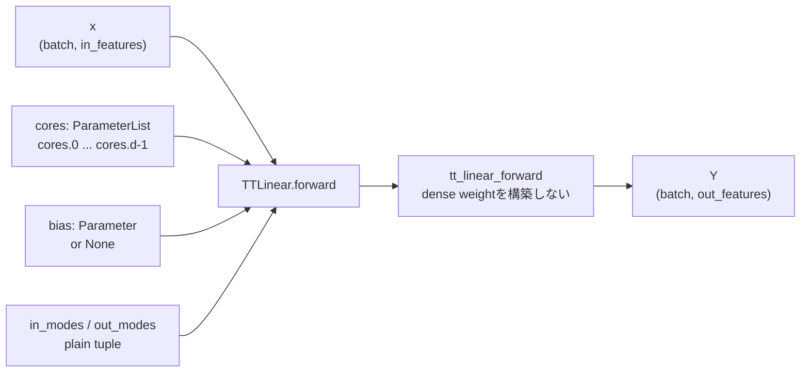

# `TTLinear`

**Stability:** A

**定義:** `src/nn_compression/compression/tt_linear.py`

**参照Notebook:** `notebooks/30_tt_mps/10_fashion_mnist_mlp/00_mlp_ttlinear_logits_equivalence.ipynb`

## 責務

TT-matrix coreを学習可能な`nn.Parameter`として所有し、dense weightを復元せずに

$$
Y = X W^{\mathsf T} + b
$$

を計算する`nn.Module`を提供する。TT-matrixの縮約アルゴリズムは`tt_linear_forward`へ委譲し、このclassはParameter登録、Module状態、特徴数・mode情報、`state_dict`境界を担当する。

## Signature

```python
TTLinear(
    cores: Sequence[torch.Tensor],
    out_modes: Sequence[int],
    in_modes: Sequence[int],
    bias: torch.Tensor | None = None,
)
```

## 引数

- `cores`: site $k$の要素がshape $(r_{k-1},m_k,n_k,r_k)$であるTT-matrix core列。左・右境界rankは1、隣接bond rankは一致させる。各TensorはModule所有の独立したleaf `nn.Parameter`へコピーされる。
- `out_modes`: 出力featureを分解するmode列 $(m_1,\ldots,m_d)$。`out_features`は$\prod_k m_k$として公開する。
- `in_modes`: 入力featureを分解するmode列 $(n_1,\ldots,n_d)$。`in_features`は$\prod_k n_k$として公開する。`out_modes`とsite数を一致させる。
- `bias`: `None`またはshape `(out_features,)`のTensor。指定時はcoreとdtype・deviceを一致させ、独立したleaf `nn.Parameter`として登録する。

## 戻り値

TT-matrix core列と任意のbiasを学習Parameterとして保持する`TTLinear` instance。`self.cores`は`nn.ParameterList`、`self.bias`は`nn.Parameter`または`None`となる。

`state_dict()`ではcoreを`cores.0`, `cores.1`, ...として保存し、biasがある場合は`bias`も保存する。

## 使用場面

- dense `nn.Linear`をTT-matrix表現へ変換した後、coreをFine-tuningするとき。
- TT rankやtensorizationごとの精度・parameter数・学習回復を比較するとき。
- `nn.Sequential`等のmodel内で、通常のPyTorch Moduleとして保存、device移動、optimizer登録を行うとき。

## 処理概要

### 初期化時

1. `out_modes`と`in_modes`を検証し、正の整数tupleへ正規化する。
2. `cores`の4階shape、境界rank、隣接bond、物理次元、dtype、deviceを検証する。
3. `bias`のshape、dtype、deviceを検証する。
4. 各coreを`detach().clone()`し、`nn.ParameterList`へ登録する。
5. biasがあれば同様に独立copyを`nn.Parameter`として登録し、なければ`None`のParameterを登録する。

### forward時

1. Moduleが所有するcore列、mode列、biasと入力`x`を`tt_linear_forward`へ渡す。
2. `tt_linear_forward`がsiteごとの直接縮約を行う。
3. shape `(batch, out_features)`の出力を返す。

### Parameter構造図



この図は演算の詳細ではなく、学習状態がModule内のどこへ登録され、functional primitiveへ何が渡されるかを示す。

## 主なcontract / 注意事項

- constructorは渡されたcoreとbiasを`detach().clone()`するため、元Tensorとstorageおよびautograd graphを共有しない。
- constructorで作るcoreとbiasは既定で`requires_grad=True`となる。dense層の凍結状態を引き継ぐ責務は`build_tt_linear`が持つ。
- 対応dtypeは`torch.float32`と`torch.float64`。`.to(torch.float16)`自体はPyTorch標準動作として可能だが、その後のforwardはTT-matrix dtype contractにより拒否される。
- `.to(device)`、`train()`、`eval()`、`parameters()`、`state_dict()`は通常の`nn.Module`として動作する。
- `load_state_dict()`は既存Moduleと同じcore数・core shapeを前提とし、bond rankが異なるstateは読み込めない。
- 現行forwardはshape `(batch, in_features)`の2階入力だけを正式対応とする。
- dropoutやbatch normalizationを内部に持たないため、`train` / `eval`による数値演算の分岐はない。ただしModuleの`training`状態は通常どおり保持する。
- dense weightの再構成、tensorization候補の選択、rank sweepは責務外である。

## 関連API

[[90_src設計/05_Core_API_v1/compression/tt_linear_forward]]、[[90_src設計/05_Core_API_v1/compression/build_tt_linear]]、[[90_src設計/05_Core_API_v1/compression/factorize_named_tt_linear]]、[[90_src設計/05_Core_API_v1/compression/tt_matrix_num_parameters]]、[[90_src設計/05_Core_API_v1/Internal_API]]
