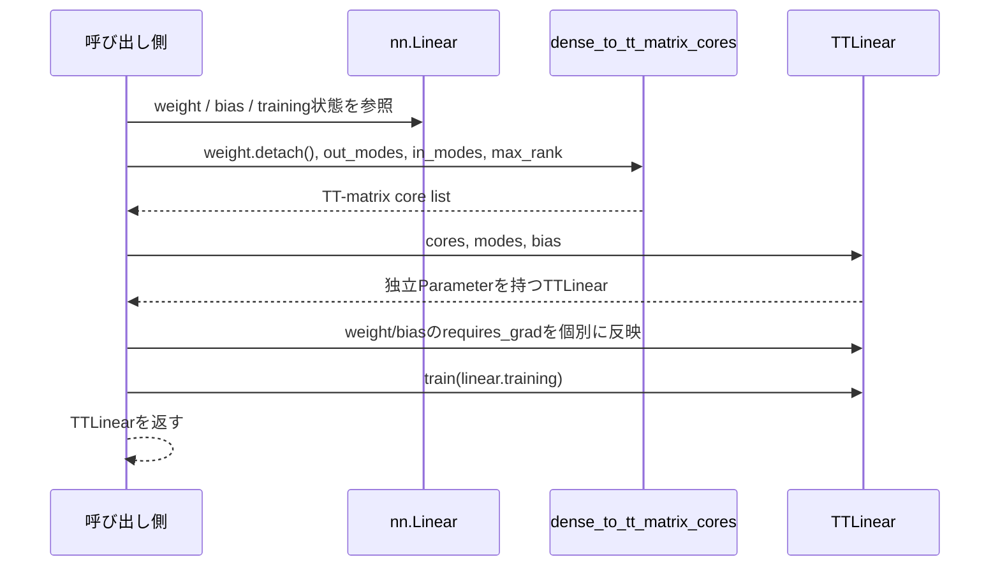

# `build_tt_linear`

**Stability:** A

**定義:** `src/nn_compression/compression/tt_linear.py`

**参照Notebook:** `notebooks/30_tt_mps/10_fashion_mnist_mlp/00_mlp_ttlinear_logits_equivalence.ipynb`

## 責務

単一のdense `nn.Linear`からTT-matrix coreを生成し、値・配置・学習可否に関する元層の状態を引き継いだ独立な`TTLinear`を構築する。

## Signature

```python
build_tt_linear(
    linear: nn.Linear,
    out_modes: Sequence[int],
    in_modes: Sequence[int],
    *,
    max_rank: int | None = None,
) -> TTLinear
```

## 引数

- `linear`: 変換元のdense `nn.Linear`。weightのshape、dtype、device、`requires_grad`と、biasの有無・状態を変換元contractとして使う。元層は変更しない。
- `out_modes`: `linear.out_features`を分解する出力mode列 $(m_1,\ldots,m_d)$。積を`linear.out_features`と一致させる。
- `in_modes`: `linear.in_features`を分解する入力mode列 $(n_1,\ldots,n_d)$。積を`linear.in_features`と一致させ、`out_modes`とsite数をそろえる。
- `max_rank`: `None`なら打ち切りなしのTT-SVD、1以上の整数なら全内部bondに共通するrank上限。1-siteでは内部bondがないため結果rankを変えないが、型と下限は同じ規則で検証する。

## 戻り値

元の`linear`とはParameter storageを共有しない`TTLinear`を返す。

- coreのdtype・deviceは`linear.weight`を維持する。
- coreの`requires_grad`は`linear.weight.requires_grad`を引き継ぐ。
- biasの有無、値、dtype、device、`requires_grad`は元biasを引き継ぐ。
- `training`は`linear.training`に合わせる。

## 使用場面

- 学習済みLinear層をTT-SVDで初期化し、TT coreだけをFine-tuningするとき。
- exact変換とrank制限付き変換を同じModule builderで比較するとき。
- model全体を置換する前に、単一層の値・勾配・parameter数を検証するとき。

## 処理概要



変換処理とModule所有権を分けるため、TT-SVDは`dense_to_tt_matrix_cores`、Parameter登録は`TTLinear`へ委譲する。

## 主なcontract / 注意事項

- `linear`が`nn.Linear`でなければ`TypeError`とする。
- 元weightのdtypeは`torch.float32`または`torch.float64`とする。
- TT-SVDのautograd graphは元weightへ接続しない。これは元のdense ParameterをTT core経由で更新するAPIではなく、独立した圧縮層を構築するAPIである。
- `max_rank=None`はdense weightをTTとして表現可能なrankまで保持するが、浮動小数点SVDの丸め誤差まで数学的に零にする保証ではない。
- `max_rank`を指定した場合、出力は元dense層ではなく、打ち切り後のTT近似weightに対応する。
- constructorの既定`requires_grad=True`をそのまま採用せず、weightとbiasをそれぞれ元層の状態へ戻す。
- 元の`linear`をin-place変更せず、元層と返却層のParameter storageを共有しない。
- mode候補の探索や自動選択は行わない。

## 関連API

[[90_src設計/05_Core_API_v1/compression/TTLinear]]、[[90_src設計/05_Core_API_v1/compression/dense_to_tt_matrix_cores]]、[[90_src設計/05_Core_API_v1/compression/factorize_named_tt_linear]]、[[90_src設計/05_Core_API_v1/compression/ordered_factorizations]]
