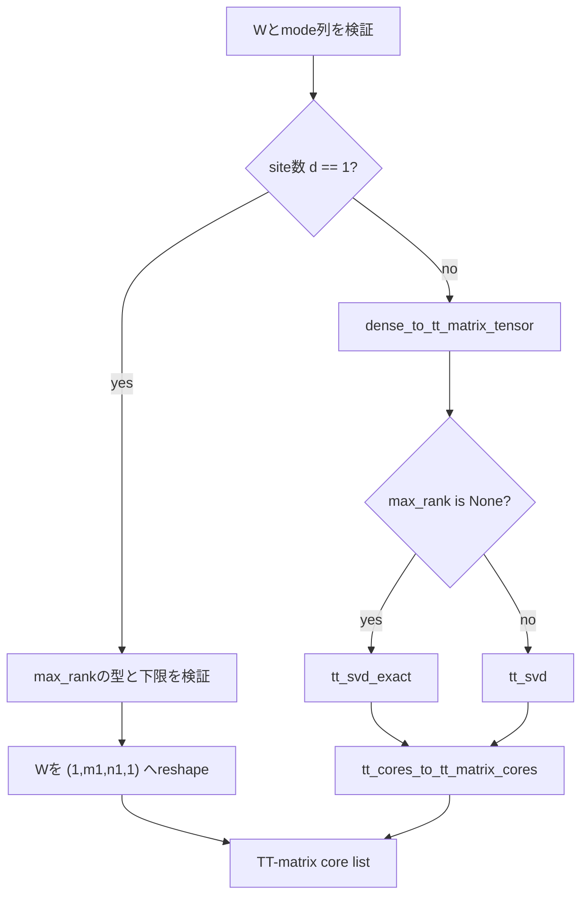

# `dense_to_tt_matrix_cores`

**Stability:** A  
**定義:** `src/nn_compression/compression/tt_matrix.py`  
**参照Notebook:** `notebooks/30_tt_mps/00_fundamentals/15_ttlinear_dense_forward_equivalence_learning.ipynb`

## 責務

dense weightのtensorization、TT-SVD、4階TT-matrix coreへの変換を一括して行う。1-site TT-matrixでは内部bondが存在しないため、TT-SVDを使わず唯一のcoreを構築する。

## Signature

```python
dense_to_tt_matrix_cores(
    W: torch.Tensor,
    out_modes: Sequence[int],
    in_modes: Sequence[int],
    *,
    max_rank: int | None = None,
) -> list[torch.Tensor]
```

## 引数

- `W`: shape `(product(out_modes), product(in_modes))`のdense weight。`float32`または`float64`とし、deviceは制限しない。
- `out_modes`: 出力featureのtensorization$(m_1,\ldots,m_d)$。積を`W.shape[0]`と一致させる。
- `in_modes`: 入力featureのtensorization$(n_1,\ldots,n_d)$。積を`W.shape[1]`と一致させる。
- `max_rank`: `None`なら$d\geq2$で`tt_svd_exact`を使う。1以上の整数なら`tt_svd`の共通rank上限として使う。bool、非整数、0以下は拒否する。

## 戻り値

各要素がshape `(r_{k-1}, m_k, n_k, r_k)`のTT-matrix core listを返す。`max_rank`を指定した$d\geq2$では各内部rankはその上限以下となる。

$d=1$では内部bondがないため、次の1 coreだけを返す。

$$
G^{(1)}=\operatorname{reshape}(W,(1,m_1,n_1,1))
$$

## 使用場面

- 学習済み`nn.Linear.weight`をTT-matrix coreへ初期化するとき。
- exact TT-matrixとrank制限付きTT-matrixを同じ入口から構築するとき。
- TT-Linear forward用のcoreをdense baselineから生成するとき。

## 処理概要



## 主なcontract / 注意事項

- `d=1`ではcombined tensorが1階になるため、2階以上を要求する`tt_svd_exact` / `tt_svd`を呼ばない。
- `d=1`でも`max_rank`の型・値contractは`tt_svd`とそろえる。ただし内部bondがないため、1以上の値は結果を変えない。
- `tt_svd_exact`自体を1階Tensor対応へ拡張しない。
- `reshape`、TT-SVD、core reshapeを通してdtype、device、autograd graphを維持する。入力`W`をin-place変更しない。
- `max_rank`は全bond共通の上限であり、bondごとのrank列は受け取らない。

## 関連API

[[90_src設計/05_Core_API_v1/compression/dense_to_tt_matrix_tensor]]、[[90_src設計/05_Core_API_v1/compression/tt_cores_to_tt_matrix_cores]]、[[90_src設計/05_Core_API_v1/compression/tt_matrix_to_dense]]、[[90_src設計/05_Core_API_v1/compression/tt_svd_exact]]、[[90_src設計/05_Core_API_v1/compression/tt_svd]]
