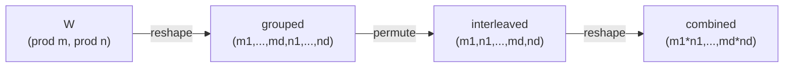

# `dense_to_tt_matrix_tensor`

**Stability:** A  
**定義:** `src/nn_compression/compression/tt_matrix.py`  
**参照Notebook:** `notebooks/30_tt_mps/00_fundamentals/14_tt_matrix_dense_reconstruction_and_tt_linear_forward.ipynb`、`notebooks/30_tt_mps/00_fundamentals/15_ttlinear_dense_forward_equivalence_learning.ipynb`

## 責務

PyTorch Linear形式のdense weightを、TT-SVDへ渡せるsite単位のcombined tensorへ並べ替える。TT-SVDやrank truncation自体は行わない。

## Signature

```python
dense_to_tt_matrix_tensor(
    W: torch.Tensor,
    out_modes: Sequence[int],
    in_modes: Sequence[int],
) -> torch.Tensor
```

## 引数

- `W`: shape `(product(out_modes), product(in_modes))`のdense weight。行axisが出力feature、列axisが入力featureに対応する。`float32`または`float64`を受理する。
- `out_modes`: 出力featureを分解する正の整数列$(m_1,\ldots,m_d)$。その積は`W.shape[0]`と一致させる。
- `in_modes`: 入力featureを分解する正の整数列$(n_1,\ldots,n_d)$。`out_modes`と同じ長さで、その積は`W.shape[1]`と一致させる。

## 戻り値

shape

$$
(q_1,\ldots,q_d),\qquad q_k=m_kn_k
$$

のTensorを返す。要素対応は、siteごとの複合添字$a_k=i_kn_k+j_k$を使って

$$
A_{a_1,\ldots,a_d}=W_{i,j}
$$

となる。dtype、device、autograd graphを維持する。

## 使用場面

- dense weightを既存の`tt_svd_exact`または`tt_svd`へ渡す前処理。
- grouped orderとinterleaved orderの要素対応を検証するとき。
- TT-matrix初期化処理をtensorizationと分解へ分離したいとき。

## 処理概要



## 主なcontract / 注意事項

- `out_modes`と`in_modes`は同じ非零長とし、各要素はboolではない正の整数とする。
- `W`は2階、`float32`または`float64`とする。CPUへ固定せず、入力deviceを維持する。
- `reshape`と`permute`だけを使い、入力`W`をin-place変更しない。
- `d=1`では戻り値はshape `(m_1*n_1,)`の1階Tensorになる。これは正常なtensorization結果だが、2階以上を要求する通常のTT-SVDへ直接渡さない。

## 関連API

[[90_src設計/05_Core_API_v1/compression/dense_to_tt_matrix_cores]]、[[90_src設計/05_Core_API_v1/compression/tt_cores_to_tt_matrix_cores]]、[[90_src設計/05_Core_API_v1/compression/tt_svd_exact]]、[[90_src設計/05_Core_API_v1/compression/tt_svd]]
