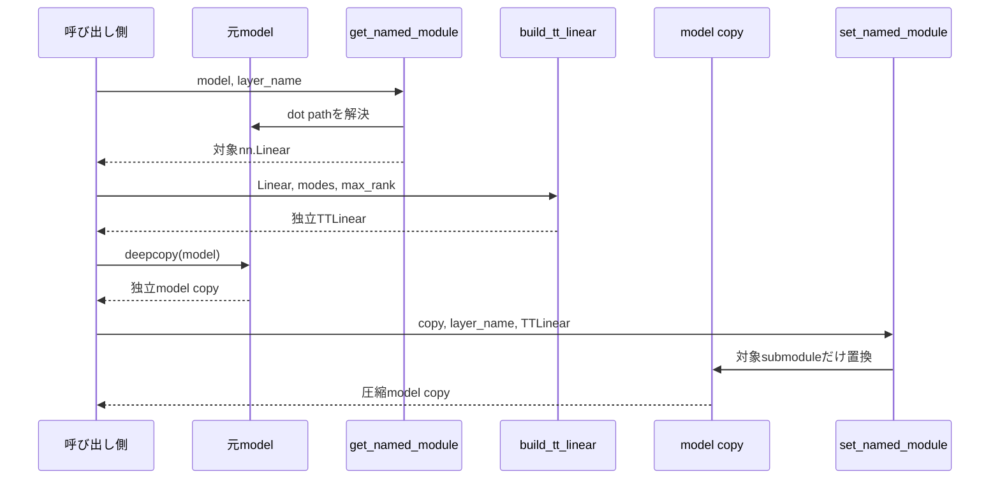

# `factorize_named_tt_linear`

**Stability:** A

**定義:** `src/nn_compression/compression/tt_linear.py`

**参照Notebook:** `notebooks/30_tt_mps/10_fashion_mnist_mlp/00_mlp_ttlinear_logits_equivalence.ipynb`

## 責務

model内の指定named `nn.Linear`だけを`TTLinear`へ変換し、元modelとは独立した圧縮model copyを返す。named pathの解決・置換には既存utilityを使い、複数層の探索方針やrank sweepは持たない。

## Signature

```python
factorize_named_tt_linear(
    model: nn.Module,
    layer_name: str,
    out_modes: Sequence[int],
    in_modes: Sequence[int],
    *,
    max_rank: int | None = None,
) -> nn.Module
```

## 引数

- `model`: 変換元model。対象層だけでなく、全submodule・Parameter・bufferを含む独立copyの作成元となる。元modelは変更しない。
- `layer_name`: 置換対象を示す`"fc1"`、`"encoder.0"`等のdot path。空文字は許可せず、既存の`nn.Linear`を指す必要がある。
- `out_modes`: 対象Linearの`out_features`を分解する出力mode列。積を対象層の出力特徴数と一致させる。
- `in_modes`: 対象Linearの`in_features`を分解する入力mode列。積を対象層の入力特徴数と一致させ、`out_modes`とsite数をそろえる。
- `max_rank`: `None`なら打ち切りなし、1以上の整数ならTT-SVDの共通bond-rank上限として`build_tt_linear`へ渡す。

## 戻り値

`model`を`deepcopy`し、そのcopy内の`layer_name`だけを`TTLinear`へ置換した`nn.Module`を返す。

対象外の層も`deepcopy`された独立Parameterを持つため、返却modelをFine-tuningしても元modelのParameterやbufferは変化しない。

## 使用場面

- baseline MLPの`fc1`等、特定のLinear層だけをTT化して比較するとき。
- 同一baselineからtensorization・rank条件ごとの独立candidate modelを作るとき。
- 圧縮直後の精度評価後、そのcandidateだけをFine-tuningするとき。

## 処理概要



入力不正は`deepcopy`前の対象解決・TT変換で検出する。正常時だけmodel全体をcopyし、同じpathへ変換済み層を挿入する。

## 主なcontract / 注意事項

- `layer_name`が`str`でなければ`TypeError`、空文字なら`ValueError`とする。
- pathが存在しなければ`AttributeError`、対象が`nn.Linear`でなければ`TypeError`とする。既に`TTLinear`へ置換済みの層も再変換しない。
- dot pathの解釈は`get_named_module` / `set_named_module`へ委譲し、nested Moduleや`nn.Sequential`の数値要素を扱う。
- 元modelをin-place変更しない。対象外Parameterもcopy側とstorageを共有しない。
- model全体のdtype、device、各submoduleの`training`状態は`deepcopy`で維持する。新しい`TTLinear`の`training`状態は変換元Linearに合わせる。
- 対象Linearのweight・biasの`requires_grad`は`build_tt_linear`の規則で個別に引き継ぐ。
- 複数層の一括置換、modeの自動選択、rank sweep、評価、optimizer作成は責務外である。

## 関連API

[[90_src設計/05_Core_API_v1/compression/TTLinear]]、[[90_src設計/05_Core_API_v1/compression/build_tt_linear]]、[[90_src設計/05_Core_API_v1/compression/ordered_factorizations]]、[[90_src設計/05_Core_API_v1/utils/get_named_module]]、[[90_src設計/05_Core_API_v1/utils/set_named_module]]、[[90_src設計/05_Core_API_v1/compression/factorize_named_linear]]
