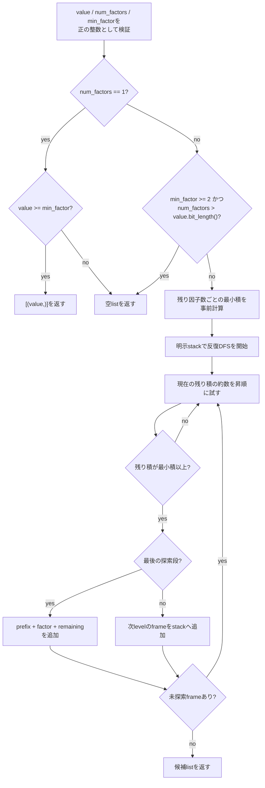

# `ordered_factorizations`

**Stability:** A

**定義:** `src/nn_compression/compression/tt_modes.py`

**参照Notebook:** `notebooks/30_tt_mps/10_fashion_mnist_mlp/00_mlp_ttlinear_logits_equivalence.ipynb`

## 責務

正の整数`value`を指定個数の正の整数因子へ分解し、各因子が下限以上である順序付き候補を決定的な順序で全列挙する。TT-matrixのtensorization候補を生成するが、候補の評価・並べ替え・自動選択は行わない。

## Signature

```python
ordered_factorizations(
    value: int,
    num_factors: int,
    min_factor: int = 2,
) -> list[tuple[int, ...]]
```

## 引数

- `value`: 分解対象の正の整数。TT-matrixでは`in_features`または`out_features`に対応する。
- `num_factors`: 生成するtupleの要素数。TT-matrixではsite数$d$に対応し、1以上とする。
- `min_factor`: 各因子の下限。既定値2は次元1の退化modeを除外し、1を指定するとunit factorも候補へ含める。

## 戻り値

次をすべて満たす`tuple[int, ...]`の`list`を返す。

$$
\prod_{k=1}^{d} q_k = \texttt{value},
\qquad
q_k \geq \texttt{min\_factor},
\qquad
d = \texttt{num\_factors}
$$

順序違いは別候補として保持する。例えば`ordered_factorizations(12, 2)`は`(2, 6)`と`(6, 2)`の両方を含む。候補は先頭因子から見た辞書式昇順で、同一入力に対して決定的である。候補が存在しない場合は例外ではなく空listを返す。

## 使用場面

- `nn.Linear`の入力・出力特徴数に対するTT-matrix mode候補を作るとき。
- site数と因子下限を固定し、順序違いを含むtensorization sweepをNotebookまたは実験コードで構成するとき。
- 候補評価ロジックと整数分解ロジックを分離するとき。

## 処理概要



再帰ではなく明示stackを使うため、`num_factors`がPythonの再帰上限を超える有効入力も、出力自体を保持できる範囲で処理できる。

## 主なcontract / 注意事項

- `value`、`num_factors`、`min_factor`はboolを除く整数scalarとし、1未満は`ValueError`、非整数は`TypeError`とする。NumPy整数scalarは受け付ける。
- `min_factor >= 2`かつ`num_factors > value.bit_length()`なら、積の下限が`value`を超えるため探索前に空listを返す。これは入力上限ではなく、解が存在しないことの数学的判定である。
- 各levelでは残り積の約数を昇順に試し、再帰版と同じ候補順を維持する。
- unit factorを許す例として、`ordered_factorizations(1, 1000, min_factor=1)`は1を1000個持つ候補1件を返し、Pythonの再帰上限へ依存しない。
- 候補数は入力によって急増する。APIは全候補をlistとして具体化するため、計算時間と出力memoryは候補数に依存する。
- shape balance、精度、parameter budget等による候補の順位付けや推奨modeの決定は責務外であり、実験側で行う。

## 関連API

[[90_src設計/05_Core_API_v1/compression/build_tt_linear]]、[[90_src設計/05_Core_API_v1/compression/dense_to_tt_matrix_cores]]、[[90_src設計/05_Core_API_v1/compression/tt_matrix_num_parameters]]、[[90_src設計/05_Core_API_v1/Internal_API]]
