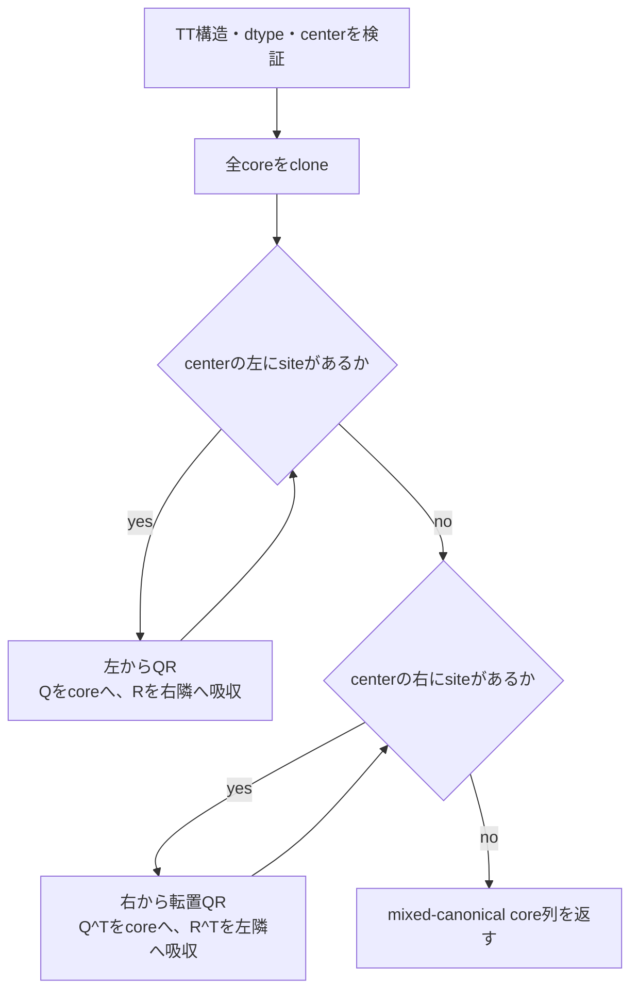

# `tt_canonicalize`

**Stability:** A  
**定義:** `src/nn_compression/compression/tt_canonical.py`  
**参照Notebook:** `notebooks/30_tt_mps/00_fundamentals/04_gauge_freedom_qr_L2.ipynb`〜`08_svd_center_move_and_schmidt_form.ipynb`

## 責務

任意のTT core列を、指定siteをorthogonality centerとするmixed-canonical formへ変換する。

## Signature

```python
tt_canonicalize(
    cores: list[torch.Tensor],
    center: int,
) -> list[torch.Tensor]
```

## 引数

- `cores`: shape $(r_{k-1},n_k,r_k)$ のTT core列。入力listと各Tensorは変更しない。
- `center`: orthogonality centerとする0始まりのsite index。bool以外の整数で、$0\leq\mathrm{center}<d$を満たす必要がある。

## 戻り値

新しいTT core列を返す。`center`より左は左直交、右は右直交になり、center coreには直交条件を課さない。

$$
\operatorname{reshape}(G^{(k)},r_{k-1}n_k,r_k)^T
\operatorname{reshape}(G^{(k)},r_{k-1}n_k,r_k)=I
\quad (k<\mathrm{center})
$$

右側では行直交になる。

## 使用場面

- orthogonality centerを準備するとき。
- 単一bond truncationの左右environmentを等長写像にするとき。
- TT-roundingのright-canonicalization段階。
- gauge変換後もdense表現が保存されることを検証するとき。

## 処理概要



左sweepでは`_qr_step_left_to_right`、右sweepでは`_qr_step_right_to_left`を使い、QRの余りを隣接coreへ吸収して表現を保存する。

## 主なcontract / 注意事項

- `float32`と`float64`のみ正式対応する。
- 入力を変更せず、全coreをcloneした新しいlistを返す。
- $d=1$ではcloneだけを返す。
- QRは情報を捨てないgauge変換であり、通常の数値範囲ではdense再構成値を保存する。
- core間のscaleが極端に不均衡なgaugeでは、QRや余りの吸収が入力dtype上でoverflow / underflowし得る。任意dynamic rangeに対するscale-invariant性は保証しない。

## 関連API

[[90_src設計/05_Core_API_v1/compression/tt_move_center]]、[[90_src設計/05_Core_API_v1/compression/tt_truncate_bond]]、[[90_src設計/05_Core_API_v1/compression/tt_round]]、[[90_src設計/05_Core_API_v1/Internal_API]]
