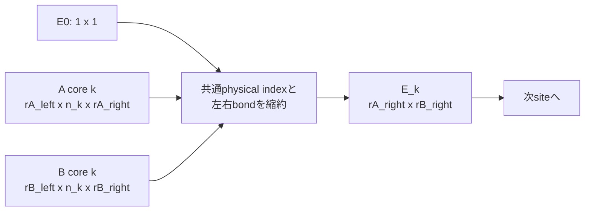

# `tt_inner`

**Stability:** A  
**定義:** `src/nn_compression/compression/tt_contraction.py`  
**参照Notebook:** `notebooks/30_tt_mps/00_fundamentals/13_tt_inner_frobenius_norm_and_distance.ipynb`

## 責務

2つの実数値TTの内積を、dense Tensorへ再構成せずleft environmentの逐次縮約で計算する。

## Signature

```python
tt_inner(
    cores_a: list[torch.Tensor],
    cores_b: list[torch.Tensor],
) -> torch.Tensor
```

## 引数

- `cores_a`: TT $\mathcal A$のcore列。実数`float32`または`float64`とする。
- `cores_b`: TT $\mathcal B$のcore列。`cores_a`とorder、各siteの物理次元、dtype、deviceを一致させる。bond rankは一致しなくてよい。

## 戻り値

shape `()` のTensorとして

$$
\langle \mathcal A,\mathcal B\rangle
=
\sum_{i_1,\ldots,i_d}
\mathcal A_{i_1,\ldots,i_d}\mathcal B_{i_1,\ldots,i_d}
$$

を返す。入力coreが`requires_grad=True`ならautograd graphを維持する。

## 使用場面

- TT contractionとdense側の内積の一致確認。
- `tt_fro_norm`の自己内積計算。
- 後続のenvironment計算や局所最適化の基礎演算。

## 処理概要

1. A/BそれぞれのTT構造と対応dtypeを検証する。
2. `validate_tt_pair`で2項演算の互換性を検証する。
3. $E_0=[1]$から開始し、各siteで`einsum("ab,aic,bid->cd", ...)`によりleft environmentを更新する。
4. 最終的なshape `(1, 1)` のenvironmentをshape `()`へ変形して返す。

### environment縮約構造



## 主なcontract / 注意事項

- A/Bのorderまたは物理次元が異なる場合は`ValueError`とする。
- dtype不一致は`TypeError`、device不一致は`ValueError`とする。
- `.item()`や`.detach()`を使わず、勾配経路を保つ。
- orderについて$O(d)$、一様な物理次元$n$とrank$r$ではsiteあたり概ね$O(nr^3)$。明示的な$O(nr^4)$中間Tensorは構築しない。
- core scaleが極端な場合は中間積がoverflow / underflowし、`inf`や`0`を返し得る。自動スケール補正は行わない。
- 内積値を使った偏極恒等式による距離計算は、近接した大規模TTで桁落ちするため、このAPIの責務外とする。

## 関連API

[[90_src設計/05_Core_API_v1/compression/tt_fro_norm]]、[[90_src設計/05_Core_API_v1/compression/tt_canonicalize]]、[[90_src設計/05_Core_API_v1/Internal_API]]、[[90_src設計/07_既知の制約と拡張方針]]
