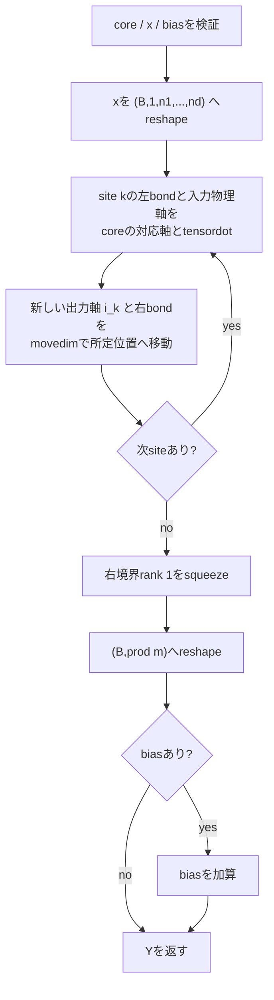

# `tt_linear_forward`

**Stability:** A  
**定義:** `src/nn_compression/compression/tt_matrix.py`  
**参照Notebook:** `notebooks/30_tt_mps/00_fundamentals/14_tt_matrix_dense_reconstruction_and_tt_linear_forward.ipynb`、`notebooks/30_tt_mps/00_fundamentals/15_ttlinear_dense_forward_equivalence_learning.ipynb`

## 責務

TT-matrix coreと入力batchを直接縮約し、dense weightを構築せずに`nn.Linear`と同じ

$$
Y=XW^{\mathsf T}+b
$$

を計算する。

## Signature

```python
tt_linear_forward(
    x: torch.Tensor,
    cores: Sequence[torch.Tensor],
    out_modes: Sequence[int],
    in_modes: Sequence[int],
    bias: torch.Tensor | None = None,
) -> torch.Tensor
```

## 引数

- `x`: shape `(batch, product(in_modes))`の2階入力Tensor。現行Core API v1では2階入力だけを正式対応とする。
- `cores`: 各要素がshape `(r_{k-1}, m_k, n_k, r_k)`のTT-matrix core列。`x`とdtype・deviceを一致させる。
- `out_modes`: 出力featureを構成するsite次元$(m_1,\ldots,m_d)$。各coreの出力側物理軸と一致させる。
- `in_modes`: 入力featureを構成するsite次元$(n_1,\ldots,n_d)$。積を`x.shape[-1]`と一致させる。
- `bias`: `None`またはshape `(product(out_modes),)`の1階Tensor。指定時はcoreとdtype・deviceを一致させる。

## 戻り値

shape `(batch, product(out_modes))`のTensorを返す。`x`、各core、biasに対するautograd graphを維持する。

## 使用場面

- TT-matrix化したLinear weightのdense化しないforward。
- `F.linear`との値・勾配の一致検証。
- 後続の学習可能な`TTLinear` Moduleを設計するためのfunctional primitive。

## 処理概要

初期状態を

$$
(B,1,n_1,\ldots,n_d)
$$

とし、site $k$で左bond $\alpha_{k-1}$と入力物理添字$j_k$をcoreと縮約する。既に確定した出力添字$i_1,\ldots,i_{k-1}$は保持する。



site $k$の前後でstate shapeは概念的に次のように変わる。

$$
(B,i_1,\ldots,i_{k-1},\alpha_{k-1},j_k,\ldots,j_d)
\longrightarrow
(B,i_1,\ldots,i_k,\alpha_k,j_{k+1},\ldots,j_d)
$$

## 主なcontract / 注意事項

- `tt_matrix_to_dense`を呼ばず、shape `(out_features, in_features)`のdense weightを途中生成しない。
- `tensordot`と`movedim`によるsite逐次縮約を使い、固定した`einsum`文字列の添字数へ依存しない。
- `.item()`、`.detach()`、暗黙のCPU転送、in-place更新を行わず、`x`、core、biasへの勾配経路を保つ。
- `bias=None`を許可し、`None`に対してshapeを参照しない。
- `d=1`も同じ縮約で処理する。
- 現時点では任意個のleading batch axisや`torch.nn.Module`としてのParameter登録、`state_dict`、初期化方針は責務外である。

## 関連API

[[90_src設計/05_Core_API_v1/compression/tt_matrix_to_dense]]、[[90_src設計/05_Core_API_v1/compression/dense_to_tt_matrix_cores]]、[[90_src設計/05_Core_API_v1/compression/tt_matrix_num_parameters]]、[[90_src設計/05_Core_API_v1/Internal_API]]
