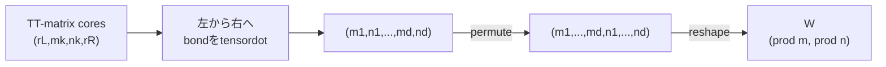

# `tt_matrix_to_dense`

**Stability:** A  
**定義:** `src/nn_compression/compression/tt_matrix.py`  
**参照Notebook:** `notebooks/30_tt_mps/00_fundamentals/14_tt_matrix_dense_reconstruction_and_tt_linear_forward.ipynb`、`notebooks/30_tt_mps/00_fundamentals/15_ttlinear_dense_forward_equivalence_learning.ipynb`

## 責務

TT-matrix core列を左からbond縮約し、PyTorch Linear形式のdense weightへ復元する。参照値作成・正しさ検証用のAPIであり、`tt_linear_forward`の内部処理には使わない。

## Signature

```python
tt_matrix_to_dense(
    cores: Sequence[torch.Tensor],
    out_modes: Sequence[int],
    in_modes: Sequence[int],
) -> torch.Tensor
```

## 引数

- `cores`: 各要素がshape `(r_{k-1}, m_k, n_k, r_k)`のTT-matrix core列。
- `out_modes`: 出力側の物理次元$(m_1,\ldots,m_d)$。各coreの第1物理軸と一致させる。
- `in_modes`: 入力側の物理次元$(n_1,\ldots,n_d)$。各coreの第2物理軸と一致させる。

## 戻り値

shape

$$
\left(\prod_{k=1}^{d}m_k,\prod_{k=1}^{d}n_k\right)
$$

のdense weight `W`を返す。行axisが出力feature、列axisが入力featureに対応する。coreのdtype、device、autograd graphを維持する。

## 使用場面

- TT-matrix reconstruction errorの測定。
- `torch.nn.functional.linear`とのforward・gradient比較。
- 小規模テストで添字順とcore contractionを検証するとき。

## 処理概要



## 主なcontract / 注意事項

- core列、mode列、physical dimension、bond、dtype、deviceを検証する。
- 入力coreをcloneせず、非破壊的なTensor演算だけを使う。
- dense weight全体を生成するため、大規模モデルの通常forwardには使用しない。
- `d=1`でも同じcontractで動作し、唯一のcoreからshape `(m_1,n_1)`のweightを復元する。
- grouped/interleavedのaxis順を変えると別の行列になるため、`dense_to_tt_matrix_tensor`の順序と対に保つ。

## 関連API

[[90_src設計/05_Core_API_v1/compression/dense_to_tt_matrix_cores]]、[[90_src設計/05_Core_API_v1/compression/dense_to_tt_matrix_tensor]]、[[90_src設計/05_Core_API_v1/compression/tt_linear_forward]]、[[90_src設計/05_Core_API_v1/compression/tt_reconstruct]]
