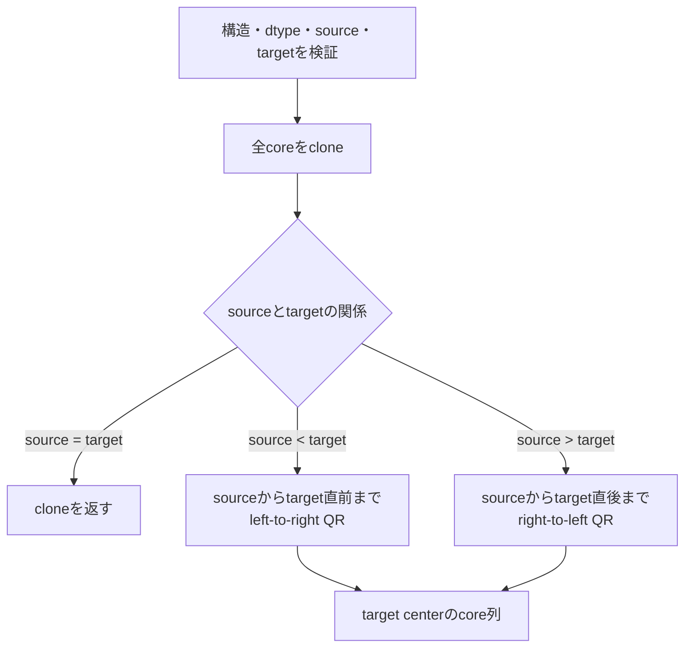

# `tt_move_center`

**Stability:** A  
**定義:** `src/nn_compression/compression/tt_canonical.py`  
**参照Notebook:** `notebooks/30_tt_mps/00_fundamentals/07_orthogonality_center_qr_move.ipynb`, `notebooks/30_tt_mps/00_fundamentals/08_svd_center_move_and_schmidt_form.ipynb`

## 責務

すでにmixed-canonical formにあるTTのorthogonality centerを、QR stepで1 siteずつ移動する。

## Signature

```python
tt_move_center(
    cores: list[torch.Tensor],
    source: int,
    target: int,
) -> list[torch.Tensor]
```

## 引数

- `cores`: `source`をcenterとするmixed-canonical TT core列。構造は検証するが、直交性そのものは検査しない。
- `source`: 現在のcenter site。bool以外の整数で$0\leq\mathrm{source}<d$。
- `target`: 移動先のcenter site。bool以外の整数で$0\leq\mathrm{target}<d$。

## 戻り値

centerを`target`へ移した新しいTT core列を返す。入力TTが前提を満たすとき、`target`より左が左直交、右が右直交になる。

## 使用場面

- sweep処理で局所更新位置を隣のsiteへ進めるとき。
- Schmidt係数やbond局所量をsiteごとに調べるとき。
- DMRG-like sweepの前段となるcenter移動を再利用するとき。

## 処理概要



## 主なcontract / 注意事項

- 呼び出し側は`cores`がcenter=`source`のmixed-canonical formであることを保証する。
- 直交性検査は行わない。前提違反でもdense表現は保存されるが、出力のcanonical条件は保証しない。
- 入力を変更せず、`source == target`でもcloneを返す。
- QRに関する極端なscaleの制約は`tt_canonicalize`と同じ。

## 関連API

[[90_src設計/05_Core_API_v1/compression/tt_canonicalize]]、[[90_src設計/05_Core_API_v1/compression/tt_truncate_bond]]、[[90_src設計/07_既知の制約と拡張方針]]
