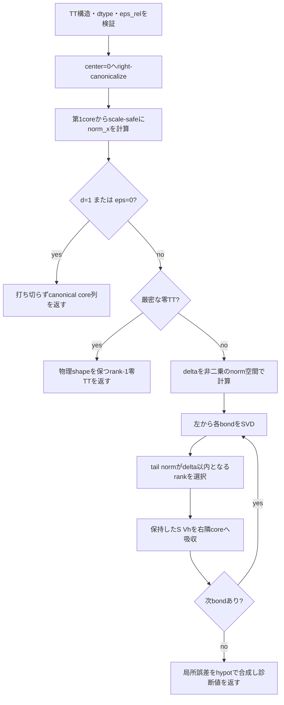

# `tt_round`

**Stability:** A  
**定義:** `src/nn_compression/compression/tt_rounding.py`  
**参照Notebook:** `notebooks/30_tt_mps/00_fundamentals/12_tt_rounding_right_canonicalization_and_truncated_svd.ipynb`

## 責務

既存TTをdense化せず、指定した全体相対誤差予算内を目標に全bondを再圧縮する。

## Signature

```python
tt_round(
    cores: list[torch.Tensor],
    eps_rel: float,
) -> tuple[list[torch.Tensor], dict[str, object]]
```

## 引数

- `cores`: 再圧縮対象のTT core列。入力listと各Tensorは変更しない。
- `eps_rel`: 全体相対誤差予算$\varepsilon$。有限かつ0以上の実数。Python scalarまたは1要素Tensorを受理するが、Python boolとbool Tensorは拒否する。

## 戻り値

`(rounded_cores, diagnostics)`を返す。

- `rounded_cores`: 物理shapeを維持し、bond rankを削減した新しいTT core列。
- `diagnostics`: `input_ranks`、`output_ranks`、`norm_x`、`eps_requested`、`delta`、`local_errors`、`local_tail_sq`、`global_error_estimate`、`relative_error_estimate`を含む。

局所予算は

$$
\delta
=
\frac{\varepsilon\|X\|_F}{\sqrt{d-1}}
$$

とする。

## 使用場面

- 演算後に増えたTT-rankを誤差制御付きで削減するとき。
- rank・圧縮率・近似誤差のtrade-offを評価するとき。
- TT-matrixやTT-NN導入前の基本rounding primitiveとして使うとき。

## 処理概要



## 主なcontract / 注意事項

- right-canonical化後の第1coreから`norm_x`を求め、dense reconstructionは使わない。
- 零判定は計算ノルムではなく要素の厳密な0比較で行い、微小な非零値を零扱いしない。
- rank選択は`delta**2`を作らず、norm空間で行う。極大・極小予算の二乗overflow / underflowを避けるためである。
- `eps_rel == 0`は意図的な打ち切りを行わないが、reduced QRによって冗長bondが縮む場合はある。
- `local_tail_sq`は報告用の二乗値で、極端な値ではunderflow / overflowし得る。`local_errors`と`global_error_estimate`を主要な誤差診断とする。
- 極端に不均衡なgauge scaleでは、最初のcanonicalizationで情報を失う可能性がある。

## 関連API

[[90_src設計/05_Core_API_v1/compression/tt_truncate_bond]]、[[90_src設計/05_Core_API_v1/compression/tt_canonicalize]]、[[90_src設計/05_Core_API_v1/compression/tt_ranks]]、[[90_src設計/05_Core_API_v1/compression/tt_fro_norm]]、[[90_src設計/07_既知の制約と拡張方針]]
