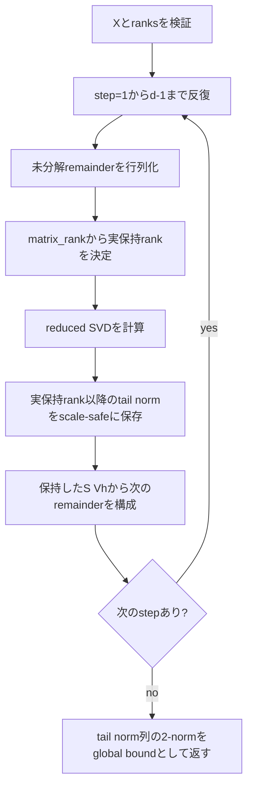

# `tt_svd_error_bound`

**Stability:** A  
**定義:** `src/nn_compression/compression/tt.py`  
**参照Notebook:** `notebooks/30_tt_mps/00_fundamentals/11_tt_svd_quasi_optimality_and_error_bound.ipynb`

## 責務

`tt_svd_ranks`と同じ逐次SVDと数値rank判定を再現し、実際の近似結果に対する絶対Frobenius誤差上限を、TT core列やdense近似Tensorを構築せずに求める。

## Signature

```python
tt_svd_error_bound(
    X: torch.Tensor,
    ranks: Sequence[int],
) -> tuple[torch.Tensor, list[torch.Tensor]]
```

## 引数

- `X`: 誤差上限を評価する2階以上の実数浮動小数点Tensor。各cutで行列へreshapeするが、内容は変更しない。
- `ranks`: 長さ`X.ndim - 1`のbond rank上限列。`ranks[k - 1]`はcut`k`で残す特異値数を表す。各要素はbool以外の1以上の整数とする。

## 戻り値

`(global_bound, local_tail_norms)`を返す。

- `global_bound`: 逐次SVDの局所tail normを二乗和平方根で合成したスカラーTensor。`tt_svd_ranks(X, ranks)`の実測絶対Frobenius誤差を上から抑える。
- `local_tail_norms`: SVD step順に並ぶスカラーTensorのlist。第$k$要素は、その時点の未分解remainder行列で実際の保持rankより後ろにある特異値の2-normである。

各stepの実保持rankを$\rho_k$、そのstepの特異値を$\sigma_j^{(k)}$とすると、局所tail normと全体上限は次式で定義する。

$$
\delta_k
=
\left(
\sum_{j > \rho_k}
\left(\sigma_j^{(k)}\right)^2
\right)^{1/2},
\qquad
B
=
\left(
\sum_{k=1}^{d-1}
\delta_k^2
\right)^{1/2}
$$

## 使用場面

- bond別rankを決める前に、現行`tt_svd_ranks`実装の誤差上限を見積もるとき。
- `tt_svd_ranks`で得た実測誤差が理論上限以内か検証するとき。
- rank配分候補を、TT core列の生成とは独立に比較するとき。

## 処理概要



## 主なcontract / 注意事項

- `ranks`は厳密rankではなく上限である。実保持rankは、指定値と`torch.linalg.matrix_rank`による数値rankの小さい方になる。零行列ではbond rankを正の整数に保つため最低1とする。
- 数値rankが指定rankより小さい場合、その差によって破棄される特異値も`local_tail_norms`へ含める。したがって指定rankだけを使う元Tensorのcut unfolding tailとは意味が異なる。
- 戻り値はPython floatへ変換せず、`X`と同じdtype/deviceを維持するTensorとする。
- tail normと全体合成は最大絶対値で正規化してから行い、表現可能な微小値の二乗underflowを避ける。
- `torch.linalg.svd`のautograd graphを維持する。ただしrank選択は離散判定であり、特異値が重複する点ではSVD固有の微分上の非一意性がある。
- `tt_svd_ranks`と同等の逐次SVDを別に実行する解析APIであり、分解と上限計算を別々に呼ぶとSVD計算も重複する。
- 相対誤差上限が必要な場合は、呼び出し側で`global_bound / ||X||_F`を計算する。

## 関連API

[[90_src設計/05_Core_API_v1/compression/tt_svd_ranks]]、[[90_src設計/05_Core_API_v1/compression/tt_reconstruct]]、[[90_src設計/05_Core_API_v1/compression/tt_unfold]]
