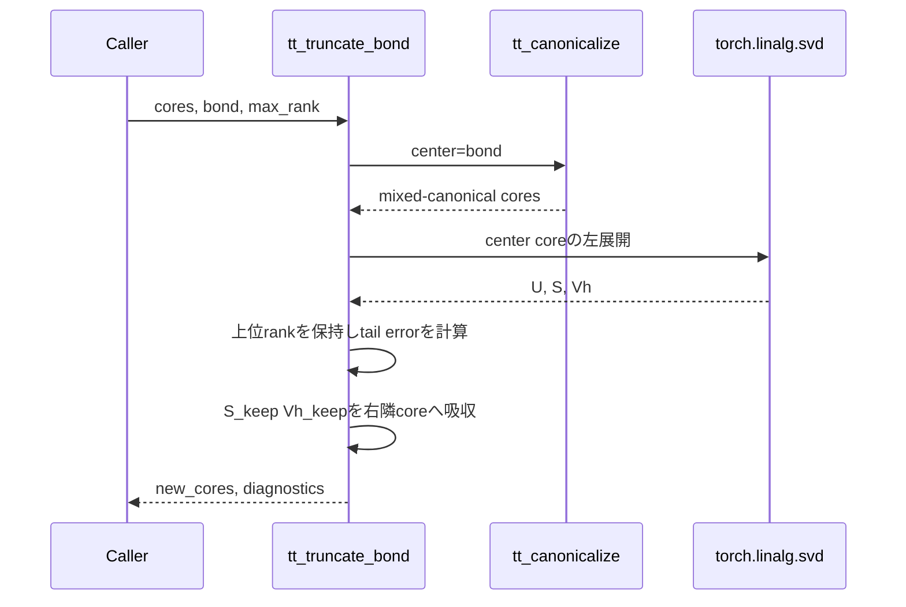

# `tt_truncate_bond`

**Stability:** A  
**定義:** `src/nn_compression/compression/tt_rounding.py`  
**参照Notebook:** `notebooks/30_tt_mps/00_fundamentals/09_truncated_svd_and_bond_rank_truncation.ipynb`, `notebooks/30_tt_mps/00_fundamentals/10_eckart_young_mirsky_and_single_bond_optimality.ipynb`

## 責務

指定bondの周囲をmixed-canonical formに整え、そのbondをSVDで`max_rank`以下へ打ち切る。

## Signature

```python
tt_truncate_bond(
    cores: list[torch.Tensor],
    bond: int,
    max_rank: int,
) -> tuple[list[torch.Tensor], dict[str, object]]
```

## 引数

- `cores`: 打ち切り対象のTT core列。入力listとTensorは変更しない。
- `bond`: `cores[bond]`と`cores[bond + 1]`の間を表す0始まりのindex。$0\leq\mathrm{bond}<d-1$。
- `max_rank`: 打ち切り後のbond rank上限。bool以外の1以上の整数。

## 戻り値

`(new_cores, diagnostics)`を返す。

- `new_cores`: 対象bondを`min(max_rank, S.numel())`へ縮約した新しいcore列。
- `diagnostics`: `bond`、`rank_before`、`rank_after`、`singular_values`、`discarded_tail_sq`、`local_error`を含む。

mixed-canonical環境では

$$
e_{\mathrm{local}}
=
\sqrt{\sum_{j>r}\sigma_j^2}
$$

が全体のFrobenius誤差に一致する。

## 使用場面

- 1本のbondだけを制御して打ち切り誤差を観察するとき。
- Eckart–Young–Mirskyの単一bond最適性を検証するとき。
- 全bondをsweepする`tt_round`より局所的なrank操作が必要なとき。

## 処理概要



## 主なcontract / 注意事項

- $d=1$には内部bondがないため、有効な`bond`は存在しない。
- `singular_values`はTensorのまま返し、dtype/deviceを維持する。
- `local_error`は`math.hypot`でscale-safeに求める。
- `discarded_tail_sq`は最後にPython floatで二乗する診断値であり、極端な値では0または`inf`になり得る。その場合もrank判定ではなく`local_error`を信頼する。
- canonicalizationの極端なgauge scale制約を継承する。

## 関連API

[[90_src設計/05_Core_API_v1/compression/tt_canonicalize]]、[[90_src設計/05_Core_API_v1/compression/tt_round]]、[[90_src設計/05_Core_API_v1/compression/tt_ranks]]、[[90_src設計/07_既知の制約と拡張方針]]
