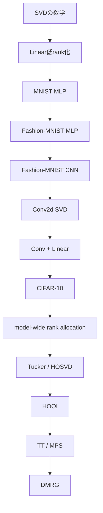

# NN圧縮ノート 目次

## サマリー

このノート群では、ニューラルネットワークの学習済みweightを低rank化する方法を、

```text
SVD
↓
Tucker decomposition
↓
Tensor Train / MPS
↓
DMRG
```

の順に学ぶ。

現在、**SVD編のcorrected実験と、Tucker/HOSVD/HOOI編まで完了**している。

SVD編では、

```text
MNIST MLP
→ Linear SVDの基本

Fashion-MNIST MLP
→ rank選択 / Pareto / knee / Fine-tuning

Fashion-MNIST CNN
→ Linear SVD / Conv SVD / Conv + Linear

CIFAR-10 CNN
→ 複数Convのmodel-wide rank allocation
```

まで進んだ。

Tucker編では、

```text
Tensor mode演算
→ Tucker / HOSVD
→ Conv2d Tucker-2
→ rank sweep
→ Fine-tuning
→ HOOI
→ TensorLy照合
→ HOSVD/HOOI同条件Fine-tuning
→ src共通化・回帰テスト
```

まで確認した。

SVD/Tuckerの式だけでなく、

- train / validation / testの役割
- candidate比較の再現性
- DataLoader Generator
- parameter / MACs / latencyの違い
- Fine-tuning
- Pareto / knee
- weight再構成誤差とtask accuracyの違い
- single seedの解釈

も実験を通して整理している。

SVDの全体結果は [[SVD実験まとめ]]、Tucker/HOOIは [[06_Tucker基礎実装検証/README]] を参照。

---

# 1. canonical / historical

現在の正式な実験結果を引用するときは、SVDでは原則として、

```text
*_corrected.ipynb
+
対応するcorrected results/
```

を使用する。

Tucker/HOOIでは、

```text
notebooks/20_tucker/
+
results/20_tucker/
```

の現行Notebook・CSVをcanonicalとする。

Notebookの位置付けは次のとおり。

```text
corrected
→ 現在のcanonicalなSVD実験結果

using_src
→ src共通化時点のsnapshot

original
→ 初期実験・学習履歴

before_src
→ src共通化以前のhistorical snapshot
```

historical Notebookは削除しない。

何が問題で、なぜcorrected版・src版を作ったかを学習履歴として残す。

- [[05_SVD基礎実装検証/03_SVD実験で修正した問題と設計原則]]
- [[06_Tucker基礎実装検証/05_Tucker実験で得た設計原則と考察]]

---

# 2. SVDからTensor Networkまでの全体像



---

# 3. 基礎理論

基礎理論は `00_基礎理論` にまとめる。

## SVD / Linear

1. [[00_基礎理論/01_数学基礎/01_線形代数/01_SVDとは]]
2. [[00_基礎理論/02_ニューラルネットワーク基礎/02_nn.Linearとは]]
3. [[00_基礎理論/01_数学基礎/01_線形代数/03_SVDによる低ランク近似]]
4. [[00_基礎理論/03_モデル圧縮理論/04_Linear層を2層へ置き換える]]
5. [[00_基礎理論/01_数学基礎/01_線形代数/05_圧縮率とRank]]
6. [[00_基礎理論/01_数学基礎/01_線形代数/06_誤差評価]]
7. [[00_基礎理論/05_PyTorch実装/07_PyTorch実装]]
8. [[00_基礎理論/05_PyTorch実装/08_Linear層のSVD実装]]
9. [[00_基礎理論/05_PyTorch実装/09_Linear層の2層置換_実装]]

## 評価・実験設計

10. [[00_基礎理論/04_実験設計/10_SVD圧縮モデルの評価設計]]
11. [[00_基礎理論/04_実験設計/11_理論計算量とベンチマーク]]
12. [[00_基礎理論/02_ニューラルネットワーク基礎/12_PyTorch学習と評価の基礎]]
13. [[00_基礎理論/05_PyTorch実装/13_PandasとPython実装メモ]]

## CNN / Conv2d

15. [[00_基礎理論/02_ニューラルネットワーク基礎/15_CNNとConv2dの基礎]]
16. [[00_基礎理論/03_モデル圧縮理論/16_Conv2d重みの行列化とSVD]]
17. [[00_基礎理論/03_モデル圧縮理論/17_Conv2dの低ランク2層置換]]

## CIFAR-10実験で追加した共通知識

18. [[30_CIFAR10_CNN/00_CIFAR10基礎/18_CIFAR10の前処理とDataLoader]]
19. [[00_基礎理論/04_実験設計/19_再現性と乱数管理]]
20. [[00_基礎理論/02_ニューラルネットワーク基礎/20_Global Average PoolingとCIFAR10モデル設計]]

## Tucker / HOSVD / HOOI

21. [[00_基礎理論/01_数学基礎/02_テンソル代数/21_テンソルとmode演算]]
22. [[00_基礎理論/01_数学基礎/02_テンソル代数/22_Tucker分解とHOSVD]]
23. [[00_基礎理論/01_数学基礎/02_テンソル代数/23_HOOI]]
24. [[00_基礎理論/03_モデル圧縮理論/24_Conv2dのTucker2圧縮]]
25. [[00_基礎理論/04_実験設計/25_Tucker_HOOI圧縮の評価設計]]
26. [[00_基礎理論/05_PyTorch実装/26_Tucker_HOOIのPyTorch実装]]

## Tensor Networkへの橋渡し

14. [[00_基礎理論/06_手法間のつながり/14_低ランク学習からテンソルネットワークへの発展]]

基礎理論だけの索引は、[[00_基礎理論/README]] を参照。

---

# 4. MNIST MLP

MNISTでは、SVDによるLinear圧縮とrank sweepの基本を確認した。

```text
784 → 512 → 256 → 10
```

corrected版では、旧rank sweepのtest leakageを修正し、

```text
train
↓
validationでrank選択
↓
testは最終選択後のみ
```

へ分離した。

正式結果：

```text
fc1 rank = 128
fc2 rank = 128
Parameters ≈ -50%
Test acc 98.17% → 98.08%
```

- [[10_MNIST_MLP_SVD/README]]
- [[10_MNIST_MLP_SVD/04_MNISTでの実験結果]]

---

# 5. Fashion-MNIST MLP

MNISTから、

```text
Pareto frontier
knee
Fine-tuning
candidate比較の再現性
```

へ実験を拡張した。

正式結果：

```text
fc1 rank = 32
fc2 rank = 16
Parameters 535,818 → 57,098
Reduction 89.34%
Test acc 88.19% → 88.53%
```

single seedの小差なので、精度改善ではなく**大幅圧縮後も精度維持**と解釈する。

- [[20_FashionMNIST/04_Fashion-MNISTでの実験結果]]

---

# 6. Fashion-MNIST CNN

Fashion-MNIST CNNでは、parameter数とMACsを支配する層が異なることを利用して、

```text
Linear-only
Conv-only
Conv + Linear
```

を比較した。

## Linear-only

```text
fc1 rank = 24
Parameters 421,642 → 98,570
Test acc 91.75% → 91.87%
```

このLinear-onlyはcorrected 04/05とは別runなので、absolute baseline値を混ぜずrun内差として読む。

- [[20_FashionMNIST/08_CNNのLinear SVD]]

## Conv-only corrected

```text
conv2 rank = 28
Parameters 421,642 → 413,066
Test acc 91.28% → 91.75%
Latency 約0.367 → 0.370 ms/batch
```

- [[20_FashionMNIST/09_CNNのConv SVD]]

## Conv + Linear corrected

```text
conv2 rank = 28
fc1 rank = 24
Parameters 421,642 → 89,994   (-78.66%)
MACs 4,241,152 → 2,237,184    (-47.25%)
Test acc 91.28% → 91.33%
Latency 約0.378 → 0.399 ms/batch
```

`(28, 24)` は各層を単独で選んだrankの組合せであり、2次元rank空間のglobal optimumではない。

- [[20_FashionMNIST/10_CNNのConvとLinear同時圧縮]]
- [[20_FashionMNIST/11_CNNでの実験結果]]

---

# 7. CIFAR-10 CNN / SVD

CIFAR-10では、より自然画像に近いRGB入力へ進んだ。

入力：

```text
(C, H, W) = (3, 32, 32)
```

学習時だけ、

```text
RandomCrop(32, padding=4)
RandomHorizontalFlip()
```

を使い、validation / testではランダムaugmentationを外す。

GAPを使って巨大なFC層を避け、

```text
conv1
conv2
conv3
```

のrank allocationを主題にした。

正式結果：

```text
conv1 = 9
conv2 = 32
conv3 = 48

Parameters 128,842 → 81,405   (-36.82%)
MACs 10,357,248 → 5,625,344   (-45.69%)
Test acc 73.27% → 73.43%
Latency 約0.531 → 0.537 ms/batch
```

探索は、各層の単独rank sweepからPareto / knee近傍を作り、その候補集合を組み合わせた**制約付きmodel-wide rank allocation**。

全rank空間のglobal optimumとは呼ばない。

- [[30_CIFAR10_CNN/README]]
- [[30_CIFAR10_CNN/01_CIFAR10_SVD実験]]

---

# 8. corrected実験で重要になった設計

SVDの数式そのものではなく、実験設計と実装契約を修正した。

主な項目：

```text
test leakage
candidate間のseed条件
DataLoader Generator消費
baseline / compressedのParameter共有
rank validation
device / dtype / requires_grad
Conv2dのsemantic contract
benchmark条件
same input batch
rank sweepでmodelを保持しすぎない
CIFAR探索の「global」表現
```

詳しくは、

- [[05_SVD基礎実装検証/03_SVD実験で修正した問題と設計原則]]

を参照。

---

# 9. SVD編で得た共通知識

## retained energy

$$
E(r)
=
\frac{\sum_{i=1}^{r}\sigma_i^2}{\sum_i\sigma_i^2}
$$

はweight近似の指標。

```text
retained energyが高い
≠
accuracyが必ず高い
```

## Fine-tuning

```text
truncated SVD
→ weight近似として良い低rank初期値

Fine-tuning
→ task lossに対して低rank構造を再最適化
```

## MACsとlatency

```text
MACs reduction
≠
wall-clock speedup
```

Fashion-MNIST CNNとCIFAR-10のcorrected benchmarkでは、理論MACsを大幅に減らしてもGPU latencyは短くならなかった。

## single seed

corrected実験は基本的にsingle seed。

小さなaccuracy差は「改善」と強く主張せず、**精度維持**と表現する。

---

# 10. 実装

再利用可能な処理は `src/nn_compression/` へ分離している。

```text
src/nn_compression/
├─ tensor/
│  └─ operations.py
├─ compression/
│  ├─ svd.py
│  ├─ linear_svd.py
│  ├─ conv_svd.py
│  ├─ tucker.py
│  ├─ hooi.py
│  ├─ conv_tucker.py
│  ├─ mlp_svd.py
│  ├─ named_layers.py
│  └─ rank_sweep.py
├─ models/
│  ├─ mlp.py
│  ├─ cnn.py
│  └─ cifar10.py
├─ training/
├─ metrics/
├─ selection/
├─ datasets/
└─ utils/
```

共通して、

- baselineとParameterを共有しない
- rank / mode / shapeをvalidationする
- device / dtype / requires_gradを維持する
- 学習Notebookは自作実装を学習履歴として残す
- reusable処理はsrcへ分離する

という方針を取る。

Tucker/HOOIの実装詳細は [[00_基礎理論/05_PyTorch実装/26_Tucker_HOOIのPyTorch実装]]、実装寄りの既存索引は [[README_実装編]] を参照。

---

# 11. Tucker / HOSVD / HOOI

CIFAR-10の学習済み `conv2.weight=(64,32,3,3)` を主対象に、channel mode 0 / 1だけをTucker-2分解した。

元Convを

```text
C_in
→ 1x1 / U_in.T
→ R_in
→ 3x3 / core
→ R_out
→ 1x1 / U_out
→ C_out
```

へ置換し、rank pair `(R_out,R_in)` をsweepした。

balanced rank `(32,16)` では、

```text
Parameters        128,842 → 117,578
Conv2 MAC reduction          61.11%
Model MAC reduction          27.84%
HOSVD pre val acc            0.6280
```

となった。

HOOIでは同rankのままweight relative errorを

```text
HOSVD 0.449042
→ HOOI 0.442504
```

へ低減し、自作HOOIはTensorLy `partial_tucker` と最終再構成誤差・圧縮直後accuracyで一致した。

一方、圧縮直後validation accuracyは

```text
HOSVD 0.6280
HOOI  0.6202
```

で、**weight Frobenius誤差の改善がtask accuracy改善を保証しない**ことを確認した。

同条件Fine-tuning（seed 0）では、

```text
post val
HOSVD = 0.7528
HOOI  = 0.7528

post test
HOSVD = 0.7508
HOOI  = 0.7555
```

となったが、single seedの0.0047差なのでHOOIの統計的優位性とは主張しない。

さらにFine-tuning後は元weightへのrelative errorが増えながらaccuracyが上がり、

```text
元weightへの近さ
≠
taskにとって最適なlow-rank weight
```

も実測で確認した。

- [[06_Tucker基礎実装検証/README]]
- [[06_Tucker基礎実装検証/02_Tucker2_Convとrank_sweepの確認結果]]
- [[06_Tucker基礎実装検証/03_HOOIとTensorLy照合]]
- [[06_Tucker基礎実装検証/04_HOSVD_HOOI_FineTuning比較]]
- [[06_Tucker基礎実装検証/05_Tucker実験で得た設計原則と考察]]

---

# 12. 最短で読むなら

## SVD編

1. [[00_基礎理論/01_数学基礎/01_線形代数/01_SVDとは]]
2. [[00_基礎理論/01_数学基礎/01_線形代数/03_SVDによる低ランク近似]]
3. [[00_基礎理論/03_モデル圧縮理論/04_Linear層を2層へ置き換える]]
4. [[00_基礎理論/03_モデル圧縮理論/16_Conv2d重みの行列化とSVD]]
5. [[00_基礎理論/03_モデル圧縮理論/17_Conv2dの低ランク2層置換]]
6. [[00_基礎理論/04_実験設計/10_SVD圧縮モデルの評価設計]]
7. [[05_SVD基礎実装検証/03_SVD実験で修正した問題と設計原則]]
8. [[SVD実験まとめ]]
9. [[30_CIFAR10_CNN/01_CIFAR10_SVD実験]]

## Tucker / HOOI編

1. [[00_基礎理論/01_数学基礎/02_テンソル代数/21_テンソルとmode演算]]
2. [[00_基礎理論/01_数学基礎/02_テンソル代数/22_Tucker分解とHOSVD]]
3. [[00_基礎理論/03_モデル圧縮理論/24_Conv2dのTucker2圧縮]]
4. [[00_基礎理論/01_数学基礎/02_テンソル代数/23_HOOI]]
5. [[00_基礎理論/04_実験設計/25_Tucker_HOOI圧縮の評価設計]]
6. [[00_基礎理論/05_PyTorch実装/26_Tucker_HOOIのPyTorch実装]]
7. [[06_Tucker基礎実装検証/README]]

CIFAR-10のコードを理解しながらSVD編を読む場合は、途中に、

- [[30_CIFAR10_CNN/00_CIFAR10基礎/18_CIFAR10の前処理とDataLoader]]
- [[00_基礎理論/04_実験設計/19_再現性と乱数管理]]
- [[00_基礎理論/02_ニューラルネットワーク基礎/20_Global Average PoolingとCIFAR10モデル設計]]

を入れる。
